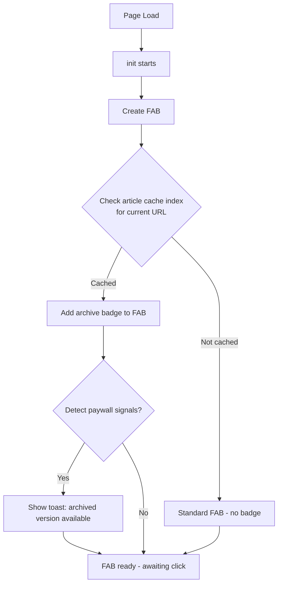
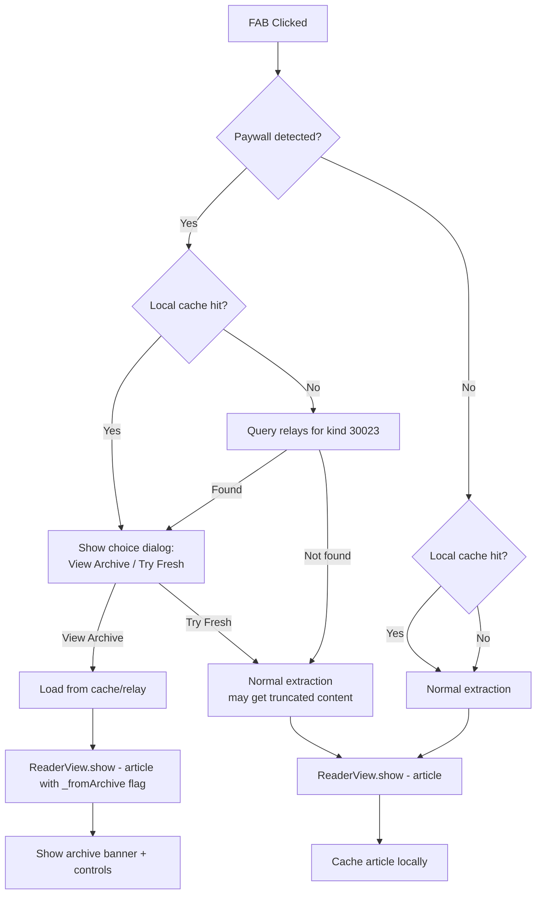
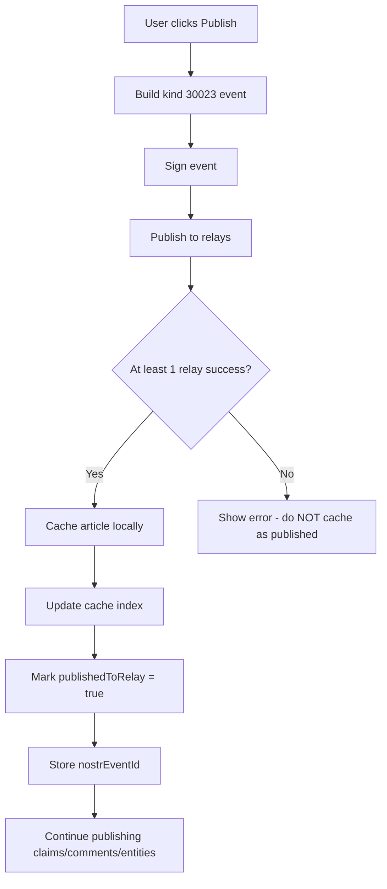
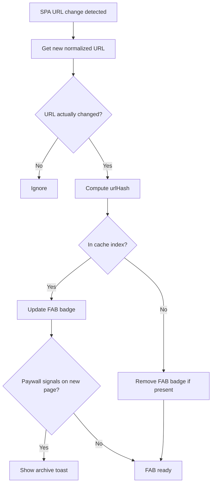

# Archive Reader Design — NOSTR Article Capture

## Overview

The Archive Reader allows users to view previously-captured article content when they encounter a paywall at a URL they have already captured. Today, article content is extracted from the DOM, displayed in the reader view, published to NOSTR relays as kind 30023 events, and then discarded from local storage. This feature introduces a local cache layer and relay retrieval mechanism so that captured content survives across sessions and can be surfaced when the live page is paywalled or unavailable.

---

## Current State Analysis

### What Gets Lost

After a successful capture and publish cycle, the full article object — including HTML content, markdown, textContent, metadata, and platform-specific data — exists only on NOSTR relays. The local storage retains claims, comments, entities, and platform accounts, but **not** the article itself.

### Relevant Existing Infrastructure

| Module | Key Capabilities |
|--------|-----------------|
| [`Storage`](../src/storage.js) | GM_setValue/localStorage with fallback, compression helpers, per-collection accessor pattern |
| [`ContentExtractor`](../src/content-extractor.js) | `normalizeUrl()`, `getCanonicalUrl()`, paywall detection via JSON-LD and DOM selectors |
| [`RelayClient`](../src/relay-client.js) | `subscribe(filter, relayUrls, options)` with REQ/EOSE, CSP detection, progress callbacks |
| [`EventBuilder`](../src/event-builder.js) | `buildArticleEvent()` produces kind 30023; `generateDTag(url)` produces 16-char URL hash |
| [`ReaderView`](../src/reader-view.js) | Full-page takeover, accepts article object, handles paywall badge display |
| [`init.js`](../src/init.js) | FAB click handler: detect → extract → ReaderView.show; SPA navigation observer |
| [`CONFIG`](../src/config.js) | 10 default relays, extraction thresholds |

### Storage Constraints

- **GM_setValue**: Tampermonkey allocates ~10 MB per script. Current usage is dominated by `entity_registry` and `article_claims`.
- **localStorage**: ~5-10 MB per origin, shared with the host site.
- **Per-article size**: A typical article object serializes to 10-80 KB. Long-form investigative pieces or transcripts can reach 200+ KB.

---

## 1. Local Article Cache

### 1.1 What to Store

Cache a **lean article object** — enough to fully render in ReaderView and reconstruct for re-publish, but stripped of derivable fields.

```
CachedArticle {
  // Identity
  url: string              // normalized canonical URL
  urlHash: string          // 16-char hex, same as d-tag
  
  // Core content
  content: string          // HTML content as displayed in reader view
  textContent: string      // plain text, for word count / search
  markdown: string         // markdown as published to relay
  
  // Metadata
  title: string
  byline: string
  siteName: string
  domain: string
  publishedAt: number      // unix timestamp
  dateModified: string     // ISO string or null
  featuredImage: string    // URL
  publicationIcon: string  // URL
  excerpt: string          // first ~500 chars
  
  // Classification
  isPaywalled: boolean
  contentType: string      // article, video, social_post, tweet
  platform: string         // youtube, twitter, substack, etc.
  language: string
  section: string
  keywords: string[]
  wordCount: number
  readingTimeMinutes: number
  
  // Platform-specific
  engagement: object       // likes, shares, comments counts
  platformAccount: object  // author platform identity
  tweetMeta: object        // tweet-specific metadata
  videoMeta: object        // video-specific metadata
  substackMeta: object     // substack-specific metadata
  transcript: string       // video transcript clean text
  transcriptTimestamped: string
  description: string      // video description
  
  // Cache metadata
  cachedAt: number         // unix timestamp when cached
  publishedToRelay: boolean // whether this was successfully published
  nostrEventId: string     // event ID if published
  captureCount: number     // incremented on re-capture of same URL
}
```

**Fields explicitly excluded** from cache: `structuredData` (large, only needed at extraction time), `transcriptSegments` (derivable from timestamped transcript), `contentConfidence` (transient).

### 1.2 Storage Key Strategy

Use **per-article keys** rather than a single collection, to avoid loading all cached articles into memory for every operation.

```
Key pattern: article_cache_<urlHash>

Where urlHash = EventBuilder.generateDTag(normalizedUrl)
               = Crypto.sha256(url).substring(0, 16)
```

Additionally, maintain a lightweight **index** for fast lookups without loading full article content:

```
Key: article_cache_index

Value: {
  "<urlHash>": {
    url: string,
    title: string,
    domain: string,
    cachedAt: number,
    sizeBytes: number,
    isPaywalled: boolean,
    contentType: string
  },
  ...
}
```

This mirrors the pattern used by [`Storage.claims`](../src/storage.js:288) and [`Storage.comments`](../src/storage.js:341) but separates the heavy content into individual keys.

### 1.3 When to Cache

Cache at **two points** for maximum coverage:

1. **On successful relay publish** — Primary trigger. After [`ReaderView.publishArticle()`](../src/reader-view.js:1367) gets at least one successful relay response, cache the article. This ensures only published content is cached.

2. **On reader view display** — Secondary trigger. When [`ReaderView.show(article)`](../src/reader-view.js:33) is called with a freshly-extracted article, cache it as a draft. Mark `publishedToRelay: false`. This covers cases where the user views content but does not publish immediately. If the user later publishes, the cache entry is updated.

**Not** on page load — caching should not happen passively in the background, only when the user actively engages with the capture workflow.

### 1.4 Storage Size Management

#### Budget

Reserve **3 MB** for the article cache out of the ~10 MB GM_setValue quota. The remaining ~7 MB covers identity, entities, claims, evidence links, comments, platform accounts, relay config, and pending captures.

#### Eviction Policy: LRU with Size Cap

```
MAX_CACHE_SIZE_BYTES = 3 * 1024 * 1024  // 3 MB
EVICTION_TARGET = 0.75                    // evict down to 75% when limit hit
```

When a new article would exceed the budget:
1. Sort index entries by `cachedAt` ascending (oldest first)
2. Evict oldest entries until total size drops below `MAX_CACHE_SIZE_BYTES * EVICTION_TARGET`
3. Delete both the individual `article_cache_<urlHash>` key and the index entry
4. Prefer evicting entries where `publishedToRelay === true` (relay serves as backup)
5. Never evict the entry for the current page URL

#### Compression

For articles exceeding 100 KB:
- Strip `textContent` (derivable from content by stripping HTML tags)
- Truncate `transcript` to first 50,000 characters
- Omit `transcriptTimestamped` (keep only `transcript`)

### 1.5 Integration with Storage Class

Add a new `Storage.articleCache` namespace following the existing pattern:

```javascript
Storage.articleCache = {
  getIndex: async () => { ... },
  has: async (urlHash) => { ... },
  get: async (urlHash) => { ... },
  save: async (article) => { ... },   // handles serialization + index update + eviction
  delete: async (urlHash) => { ... },
  getForUrl: async (url) => { ... },   // normalize URL → hash → get
  getTotalSize: async () => { ... },
  getCount: async () => { ... },
  evictIfNeeded: async (reserveBytes) => { ... },
  clear: async () => { ... }
}
```

---

## 2. Relay Retrieval

### 2.1 Query Strategy

To fetch a previously-captured article from relays, query for kind 30023 events authored by the current user that reference the target URL.

```javascript
const filter = {
  kinds: [30023],
  authors: [userPubkey],
  "#r": [normalizedUrl]
};
```

**Why filter by `#r` tag instead of `#d` tag**: The `r` tag contains the human-readable URL, which is deterministic from the current page. The `d` tag is a hash and requires computing `EventBuilder.generateDTag(url)` first. Both work, but `#r` is more transparent. Use `#d` as a fallback:

```javascript
const fallbackFilter = {
  kinds: [30023],
  authors: [userPubkey],
  "#d": [await EventBuilder.generateDTag(normalizedUrl)]
};
```

Query relays marked with `read: true` in the relay config.

### 2.2 Article Reconstruction from Kind 30023

A kind 30023 event contains markdown in the `content` field and metadata in tags. Reconstruct the article object:

```javascript
function reconstructArticleFromEvent(event) {
  const getTag = (name) => event.tags.find(t => t[0] === name)?.[1];
  const getTags = (name) => event.tags.filter(t => t[0] === name).map(t => t[1]);
  
  // Parse markdown content — strip the metadata header block
  let markdown = event.content;
  const headerMatch = markdown.match(/^---\n[\s\S]*?\n---\n\n/);
  if (headerMatch) {
    markdown = markdown.substring(headerMatch[0].length);
  }
  
  // Convert markdown back to HTML for reader view display
  const content = ContentExtractor.markdownToHtml(markdown);
  
  return {
    url: getTag('r'),
    title: getTag('title') || 'Untitled',
    byline: getTag('author') || '',
    siteName: getTag('site_name') || '',
    domain: getTag('r') ? ContentExtractor.getDomain(getTag('r')) : '',
    publishedAt: parseInt(getTag('published_at')) || null,
    featuredImage: getTag('image') || null,
    publicationIcon: getTag('icon') || null,
    isPaywalled: getTag('paywalled') === 'true',
    contentType: getTag('content_format') || 'article',
    platform: getTag('platform') || null,
    language: getTag('lang') || null,
    section: getTag('section') || null,
    keywords: getTags('t').filter(t => t !== 'article' && !t.includes('-')),
    wordCount: parseInt(getTag('word_count')) || null,
    readingTimeMinutes: null, // derive from wordCount
    content,
    markdown,
    textContent: content.replace(/<[^>]+>/g, ''),
    
    // Video-specific
    transcript: getTag('transcript') === 'true' ? extractTranscriptSection(markdown) : null,
    videoMeta: getTag('video_id') ? {
      videoId: getTag('video_id'),
      duration: getTag('duration')
    } : null,
    
    // Tweet-specific
    tweetMeta: getTag('tweet_id') ? {
      tweetId: getTag('tweet_id'),
      authorHandle: getTag('author_handle')?.replace('@', ''),
      isThread: getTag('thread') === 'true',
      threadLength: parseInt(getTag('thread_length')) || 1
    } : null,
    
    // Engagement
    engagement: {
      likes: parseInt(getTag('engagement_likes')) || null,
      shares: parseInt(getTag('engagement_shares')) || null,
      comments: parseInt(getTag('engagement_comments')) || null
    },
    
    // Archive metadata
    _fromArchive: true,
    _archiveSource: 'relay',
    _nostrEventId: event.id,
    _nostrCreatedAt: event.created_at,
    _nostrPubkey: event.pubkey
  };
}
```

**Derive `readingTimeMinutes`** from `wordCount`:
```javascript
article.readingTimeMinutes = article.wordCount 
  ? Math.ceil(article.wordCount / 225) 
  : Math.ceil((article.textContent || '').split(/\s+/).length / 225);
```

### 2.3 Retrieving Associated Data

After fetching the kind 30023 article, also query for associated events:

```javascript
// Claims for this URL
const claimsFilter = {
  kinds: [30040],
  authors: [userPubkey],
  "#r": [normalizedUrl]
};

// Comments for this URL
const commentsFilter = {
  kinds: [30041],
  authors: [userPubkey],
  "#r": [normalizedUrl]
};

// Entity relationships for this URL
const entitiesFilter = {
  kinds: [32125],
  authors: [userPubkey],
  "#r": [normalizedUrl]
};
```

These queries can run in parallel with the article query using `Promise.allSettled()`.

### 2.4 Handling Multiple Results

The same URL may have been captured multiple times (content updated, re-captured with edits). Kind 30023 with a `d` tag is a **parameterized replaceable event** — relays should only return the latest version per `d` tag. However:

- If the user changed the URL (edited in reader view) and re-published, two events with different `d` tags may exist for the "same" article.
- If querying by `#r` tag, relays return all matching events.

**Resolution strategy**:
1. Sort results by `created_at` descending
2. Default to the most recent capture
3. If multiple versions exist, show a version picker in the archive reader UI

### 2.5 Timeout and Fallback Behavior

```
RELAY_QUERY_TIMEOUT = 10000  // 10 seconds total
RELAY_IDLE_TIMEOUT  = 5000   // 5 seconds idle per relay
```

**Fallback chain**:
1. Local cache (instant) → found? Display immediately.
2. Relay query (up to 10s) → found? Display + cache locally.
3. Both miss → show "No archive available" state.

If the local cache has an entry but relay query returns a newer version (higher `created_at`), prefer the relay version and update the local cache.

---

## 3. Paywall Detection & Archive Trigger

### 3.1 Enhanced Paywall Detection

Extend the current detection in [`ContentExtractor.extractArticle()`](../src/content-extractor.js:200) with additional signals:

```javascript
// Current detection (keep)
article.isPaywalled = article.structuredData.isAccessibleForFree === false ||
  !!document.querySelector('[class*="paywall"], [class*="subscriber"], [data-paywall]');

// Enhanced detection (add)
const paywallSignals = {
  // DOM-based
  hasPaywallOverlay: !!document.querySelector(
    '.paywall-overlay, .subscriber-wall, .piano-offer, ' +
    '.tp-modal, .tp-backdrop, ' +                         // Piano/Tinypass
    '[class*="gate"], [class*="regwall"], ' +              // Registration walls
    '[data-testid*="paywall"], [data-testid*="gate"]'
  ),
  
  // Content truncation signals
  hasTruncationIndicator: !!document.querySelector(
    '.article-truncated, .content-truncated, ' +
    '[class*="truncat"], [class*="fade-out"], ' +
    '.gradient-overlay, .content-fade'
  ),
  
  // Substack-specific
  isSubstackPaid: !!document.querySelector('.paywall-title, .paywall'),
  
  // Medium metered
  isMediumMetered: document.querySelector('meta[name="robots"]')
    ?.content?.includes('noindex') && 
    window.location.hostname.includes('medium.com'),
  
  // Content suspiciously short relative to expected length
  contentTruncated: false  // set after extraction, see below
};
```

**Post-extraction truncation detection**: After extracting content, compare against signals that suggest truncation:

```javascript
// If structured data says article is 2000 words but we only extracted 200
if (article.structuredData.wordCount && article.wordCount) {
  const ratio = article.wordCount / article.structuredData.wordCount;
  if (ratio < 0.3) {
    paywallSignals.contentTruncated = true;
  }
}

// If content ends abruptly (no closing paragraph structure)
if (article.textContent && article.textContent.length < 500 && 
    !article.textContent.match(/[.!?]\s*$/)) {
  paywallSignals.contentTruncated = true;
}
```

### 3.2 Auto-Detection on Page Load

Add a lightweight check during [`init()`](../src/init.js:471) that runs after the FAB is created. This does **not** extract any content — it only checks if the current URL has been previously cached.

```
init() flow (additions marked with ★):

  1. Storage.checkGMAvailability()
  2. EntityMigration
  3. API interception
  4. Add styles
  5. Wait for body
  6. Create FAB
  7. Check pending captures badge
  ★ 8. Check article cache for current URL
  ★ 9. If cached → add archive indicator to FAB
  ★ 10. If paywall detected → auto-show archive prompt
```

**Step 8**: Check local cache index only (fast, no relay query):

```javascript
const normalizedUrl = ContentExtractor.normalizeUrl(
  ContentExtractor.getCanonicalUrl()
);
const urlHash = await EventBuilder.generateDTag(normalizedUrl);
const hasCached = await Storage.articleCache.has(urlHash);
```

**Step 9**: If cached, modify the FAB to show an indicator:

```javascript
if (hasCached) {
  addFABArchiveIndicator();  // small "📦" badge or ring color change
}
```

**Step 10**: If paywall signals are detected AND cache exists, show a toast:

```javascript
if (hasCached && detectPaywallSignals()) {
  Utils.showToast('📦 Archived version available — click capture button to view', 'info');
}
```

### 3.3 FAB Click Behavior Changes

Modify the FAB click handler in [`init.js`](../src/init.js:323) to add an archive-aware decision branch:

```
FAB Click Flow (new):

  1. Check if paywall is detected on current page
  2. Check if article is in local cache
  3. If YES paywall + YES cache:
     → Show choice dialog: "View Archive" / "Try Fresh Extraction"
  4. If YES paywall + NO cache:
     → Check relay for archived version (show spinner)
     → If relay has it: Show choice dialog
     → If relay misses: Proceed with normal extraction (may get truncated)
  5. If NO paywall + YES cache:
     → Normal extraction flow
     → After extraction, offer "Compare with archived version" option
  6. If NO paywall + NO cache:
     → Normal extraction flow (current behavior, unchanged)
```

### 3.4 FAB Visual Indicators

| State | FAB Appearance | Tooltip |
|-------|---------------|---------|
| No cache, no paywall | Default (📰/platform icon) | "Capture Article" |
| Cached, no paywall | Default + small 📦 badge | "Capture Article (archived version available)" |
| Paywall detected, cached | Pulsing amber ring + 📦 badge | "View Archived Article" |
| Paywall detected, no cache | Red tint | "Paywall detected — try capture" |
| Pending captures | Red number badge (existing) | Unchanged |

When both pending captures and archive indicator apply, show both badges.

---

## 4. Archive Reader UI

### 4.1 Integration with Existing ReaderView

The archive reader is **not** a separate view — it reuses [`ReaderView.show(article)`](../src/reader-view.js:33) with the article object populated from cache or relay. The `_fromArchive` flag on the article object triggers archive-specific UI enhancements.

### 4.2 Archive Mode Banner

When `article._fromArchive === true`, inject a banner at the top of the reader content area, below the toolbar:

```
┌─────────────────────────────────────────────────┐
│ 📦 ARCHIVED VERSION                              │
│ Captured on Apr 15, 2026 • Source: Local Cache   │
│ The live page may have a paywall or updated      │
│ content.                                         │
│                                                  │
│ [🔄 Re-extract from page]  [📋 Compare versions] │
└─────────────────────────────────────────────────┘
```

**Banner fields**:
- Capture date: from `cachedAt` (local) or `_nostrCreatedAt` (relay)
- Source indicator: "Local Cache" or "NOSTR Relay"
- Re-extract button: Attempts fresh content extraction from the live DOM
- Compare button: Shows side-by-side diff (see 4.4)

### 4.3 Archive-Specific Toolbar Changes

When displaying archived content:

| Button | Behavior Change |
|--------|----------------|
| **Edit** | Available — user can edit the archived content |
| **Publish** | Shows as "Re-publish" — overwrites the existing kind 30023 event (same `d` tag) |
| **Preview** | Unchanged — shows markdown preview |
| **Back** | Unchanged — returns to page |

Add a new toolbar button visible only in archive mode:

- **📦 Versions** — Opens version picker if multiple captures exist

### 4.4 Version Comparison

When the user clicks "Compare versions", show a split or inline diff view:

```
┌─────────────────────┬─────────────────────────┐
│ ARCHIVED (Apr 15)   │ LIVE PAGE (truncated)    │
│                     │                          │
│ Full article text   │ First 3 paragraphs...    │
│ continues here...   │                          │
│                     │ [Paywall]                │
│                     │ Subscribe to read more   │
└─────────────────────┴─────────────────────────┘
```

Implementation approach:
- Extract live content using `ContentExtractor.extractArticle()` 
- Display both in a two-column layout within the reader content area
- Highlight word count difference: "Archived: 2,847 words • Live: 412 words (86% more in archive)"

### 4.5 Version Picker

When multiple captures exist for the same URL:

```
┌────────────────────────────────────────────────┐
│ 📦 Archived Versions                            │
│                                                 │
│ ● Apr 15, 2026 2:30 PM  (2,847 words) [current]│
│ ○ Mar 2, 2026 9:15 AM   (2,501 words)          │
│ ○ Jan 18, 2026 4:45 PM  (1,923 words)          │
│                                                 │
│ Source: ○ Local Cache  ○ NOSTR Relay            │
└────────────────────────────────────────────────┘
```

Since kind 30023 is replaceable per `d` tag, relays typically hold only the latest version. Multiple versions would only exist if:
- The URL normalization changed between captures (different `d` tags)
- The user has local cache entries from before a re-publish

For the initial implementation, support at most **local cache version vs relay version**, not arbitrary historical versions.

### 4.6 Associated Data Display

When loading from archive, also load associated claims, comments, and entities:

1. **Claims**: Load from local `Storage.claims.getForUrl(url)` first, then merge with relay results (kind 30040)
2. **Comments**: Load from local `Storage.comments.getForUrl(url)` first, then merge with relay results (kind 30041)  
3. **Entities**: Reconstruct from kind 32125 entity relationship events if not in local entity registry

This is consistent with the existing reader view behavior — it already loads local claims and comments for the current URL.

---

## 5. Data Flow

### 5.1 Page Load Flow



### 5.2 FAB Click Flow — Archive-Aware



### 5.3 Publish Flow — Cache Integration



### 5.4 SPA Navigation Handling

For SPA sites (YouTube, some Substack), URL changes without full page reload:



---

## 6. Storage Schema

### 6.1 Article Cache Index

```
Key: "article_cache_index"

Value: {
  "a1b2c3d4e5f67890": {
    "url": "https://example.com/article-slug",
    "title": "The Article Title",
    "domain": "example.com",
    "cachedAt": 1713200000,
    "sizeBytes": 45230,
    "isPaywalled": true,
    "contentType": "article",
    "publishedToRelay": true
  },
  "f0e1d2c3b4a59876": {
    "url": "https://substack.example.com/p/premium-post",
    "title": "Premium Substack Post",
    "domain": "substack.example.com",
    "cachedAt": 1713100000,
    "sizeBytes": 23100,
    "isPaywalled": true,
    "contentType": "article",
    "publishedToRelay": true
  }
}
```

### 6.2 Individual Article Cache Entry

```
Key: "article_cache_a1b2c3d4e5f67890"

Value: {
  "url": "https://example.com/article-slug",
  "urlHash": "a1b2c3d4e5f67890",
  "content": "<p>Full HTML content...</p>",
  "textContent": "Full plain text content...",
  "markdown": "# Article Title\n\nFull markdown...",
  "title": "The Article Title",
  "byline": "Jane Smith",
  "siteName": "Example News",
  "domain": "example.com",
  "publishedAt": 1713000000,
  "dateModified": "2026-04-14T10:00:00Z",
  "featuredImage": "https://example.com/image.jpg",
  "publicationIcon": "https://example.com/favicon.png",
  "excerpt": "First 500 characters of the article...",
  "isPaywalled": true,
  "contentType": "article",
  "platform": null,
  "language": "en",
  "section": "Technology",
  "keywords": ["AI", "regulation"],
  "wordCount": 2847,
  "readingTimeMinutes": 13,
  "engagement": { "likes": null, "shares": null, "comments": null },
  "platformAccount": null,
  "tweetMeta": null,
  "videoMeta": null,
  "substackMeta": null,
  "transcript": null,
  "transcriptTimestamped": null,
  "description": null,
  "cachedAt": 1713200000,
  "publishedToRelay": true,
  "nostrEventId": "abc123...",
  "captureCount": 1
}
```

### 6.3 Key Naming Convention

| Key | Purpose | Size Estimate |
|-----|---------|--------------|
| `article_cache_index` | Lightweight index of all cached articles | ~100 bytes per entry |
| `article_cache_<urlHash>` | Full article content + metadata | 10-200 KB per article |

With 3 MB budget and average 40 KB per article, the cache holds approximately **75 articles**.

### 6.4 Migration Strategy

Existing users have no article cache. No migration is needed — the cache starts empty and populates naturally as users capture articles after the feature is deployed.

**Bootstrapping from relays**: Add a "Sync Article Cache" option in Settings that queries relays for all kind 30023 events by the user, reconstructs article objects, and populates the local cache. This is a manual action, not automatic, to avoid excessive relay queries.

```
Settings Panel Addition:

📦 Article Cache
  Cached articles: 12 (487 KB)
  [Sync from Relays]  [Clear Cache]
```

### 6.5 Storage Usage Display Update

Extend [`Storage.getUsageEstimate()`](../src/storage.js:425) to include article cache:

```javascript
// Add to getUsageEstimate
const cacheIndex = await Storage.get('article_cache_index', {});
let cacheSize = JSON.stringify(cacheIndex).length;
for (const urlHash of Object.keys(cacheIndex)) {
  cacheSize += cacheIndex[urlHash].sizeBytes || 0;
}

return {
  totalBytes: totalBytes + cacheSize,
  breakdown: {
    ...existing,
    articleCache: cacheSize
  }
};
```

---

## 7. Edge Cases

### 7.1 URL Visited but Never Captured

- Local cache miss + relay query returns nothing
- FAB shows no archive indicator
- Normal extraction flow proceeds
- If paywall truncates content, user sees truncated article with no archive alternative

**UX**: No special handling needed. This is the current behavior.

### 7.2 Content Captured by Another User

- Relay has kind 30023 events for this URL, but from a different pubkey
- Current design filters by `authors: [userPubkey]` — these are invisible
- **Future enhancement**: Optionally query without author filter to find any captures of this URL, with appropriate trust/attribution display

### 7.3 Relay is Unreachable

- Local cache serves as the primary source — no relay needed
- If local cache also misses, show "No archive available" with explanation
- CSP-blocked sites (Facebook, Instagram) will never reach relays from the page context — local cache is the only option on these sites
- **Mitigation**: Local cache is populated during the original capture, which happens on a non-CSP-blocked page or uses the capture panel workaround

### 7.4 Content Captured Before Feature Existed

- Local cache is empty (feature did not exist)
- Relay has the kind 30023 event from original publish
- Relay retrieval reconstructs the article and populates the local cache
- Subsequent visits use the local cache

**First-visit recovery flow**:
1. Paywall detected + no local cache
2. FAB click triggers relay query
3. Relay returns kind 30023 event
4. Reconstruct article → display in archive reader → cache locally

### 7.5 Multiple Captures of Same URL at Different Times

- Kind 30023 with same `d` tag is replaceable — relay keeps latest only
- Local cache stores one entry per URL hash
- On re-capture, the new version overwrites the cache entry
- `captureCount` is incremented for informational display
- If user wants to preserve history, they should use different URLs (unlikely to be needed)

**Alternative**: Store a version history array in the cache entry with timestamps and content hashes. Out of scope for initial implementation.

### 7.6 SPA Navigation

- YouTube, some Substack, modern news sites use SPA navigation
- The MutationObserver in [`init.js`](../src/init.js:544) already detects URL changes
- On SPA navigation: recheck cache index for new URL, update FAB badge
- Must normalize the new URL before checking (SPA URLs may have different query params)

**Implementation note**: The SPA observer callback should debounce cache checks by 500ms to avoid rapid-fire lookups during navigation animations.

### 7.7 Platform-Specific Considerations

#### Substack Paid Posts
- `article.isPaywalled` is set by the Substack platform handler
- Substack shows a preview (first few paragraphs) before the paywall
- Archive reader shows the full captured content
- The paywall DOM selector `.paywall, .paywall-title` triggers enhanced detection

#### Medium Metered Paywall
- Medium shows full content for a limited number of articles per month
- After the meter is exhausted, content is hidden behind a registration wall
- The `meta[name="robots"]` tag contains `noindex` when metered
- Archive reader provides value here since the content was accessible when first captured

#### YouTube (Video Content)
- YouTube does not have paywalls in the traditional sense (member-only content is rare)
- The archive reader is less relevant for video content but still useful for preserving transcripts, descriptions, and metadata
- Cached `transcript` and `description` fields are the primary value

#### Twitter/X
- Tweets can be deleted or accounts suspended
- Archive reader preserves the original tweet content and metadata
- Detection: if the live page shows "This Tweet was deleted" or "Account suspended", offer archived version

---

## 8. Implementation Plan

### Phase 1: Local Article Cache
- Add `Storage.articleCache` namespace to [`storage.js`](../src/storage.js)
- Add cache write hook in [`ReaderView.show()`](../src/reader-view.js:33) and [`ReaderView.publishArticle()`](../src/reader-view.js:1367)
- Add cache index and per-article storage with eviction
- Add article cache to storage usage display and cleanup options
- Add config constants to [`config.js`](../src/config.js)

### Phase 2: Relay Retrieval
- Add `reconstructArticleFromEvent()` function
- Add relay query logic for kind 30023 by URL
- Add parallel queries for associated claims, comments, entities
- Handle multiple results and version selection

### Phase 3: Paywall Detection & FAB Integration
- Enhance paywall detection in [`content-extractor.js`](../src/content-extractor.js)
- Add cache check on init in [`init.js`](../src/init.js)
- Add FAB archive indicator and badge
- Modify FAB click handler for archive-aware decision flow
- Add SPA navigation cache check

### Phase 4: Archive Reader UI
- Add archive mode banner to [`reader-view.js`](../src/reader-view.js)
- Add version comparison split view
- Add re-extract and compare buttons
- Add version picker for multiple captures
- Add archive-specific toolbar changes
- Add styles to [`styles.js`](../src/styles.js)

### Phase 5: Settings & Sync
- Add article cache section to settings panel
- Add "Sync from Relays" bulk import
- Add "Clear Cache" option
- Integrate with storage cleanup

---

## Appendix: File Change Summary

| File | Changes |
|------|---------|
| [`src/storage.js`](../src/storage.js) | Add `Storage.articleCache` namespace; update `getUsageEstimate()` |
| [`src/config.js`](../src/config.js) | Add `CONFIG.cache` settings (max size, eviction target, timeouts) |
| [`src/content-extractor.js`](../src/content-extractor.js) | Enhanced paywall detection; export `detectPaywallSignals()` |
| [`src/init.js`](../src/init.js) | Cache check on init; FAB badge; archive-aware click handler; SPA cache recheck |
| [`src/reader-view.js`](../src/reader-view.js) | Archive banner; cache-on-show; cache-on-publish; version picker; compare view |
| [`src/relay-client.js`](../src/relay-client.js) | No changes needed — existing `subscribe()` is sufficient |
| [`src/event-builder.js`](../src/event-builder.js) | Add `reconstructArticleFromEvent()` static method |
| [`src/styles.js`](../src/styles.js) | Archive banner styles, compare view styles, FAB badge styles |
