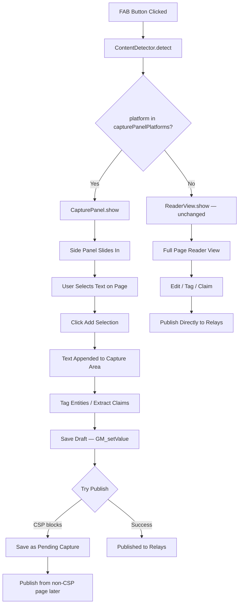
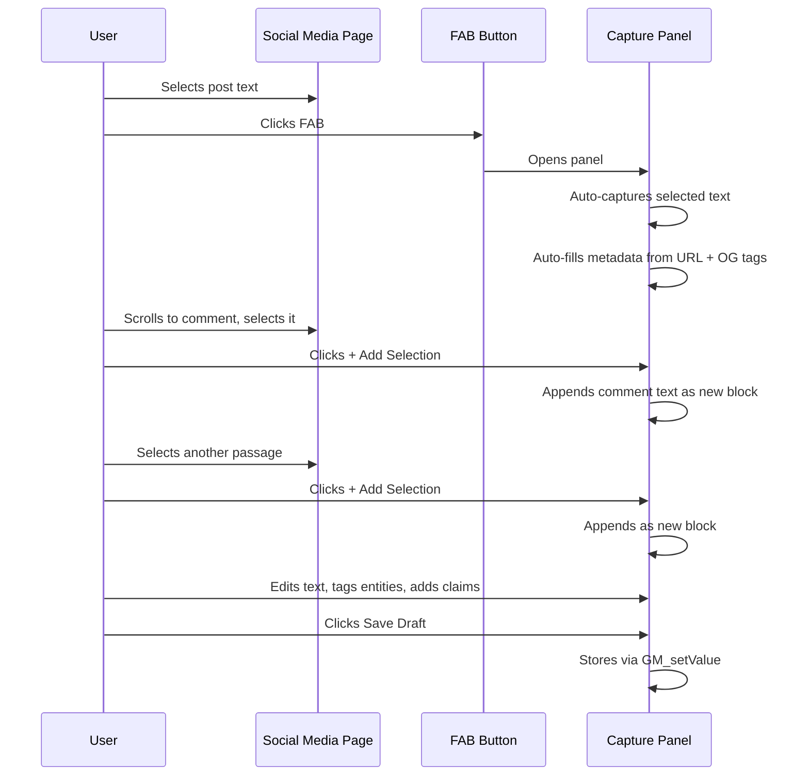
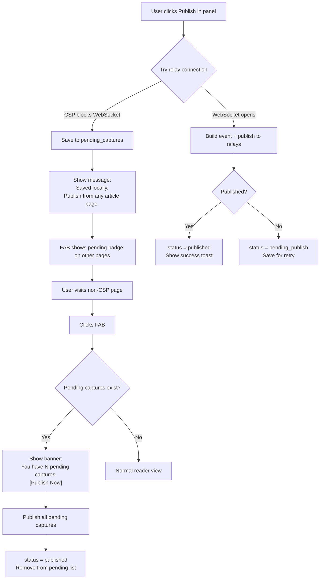

# Non-Invasive Social Media Capture Panel — Design Document

## 1. Two-Mode Architecture: Reader vs Capture Panel

The script currently uses a single mode: a full-page reader view that hides the original page content and renders the article in a clean reading environment. This works well for articles but breaks the experience on social media platforms where:

- **CSP blocks relay connections** — Facebook, Instagram, TikTok enforce strict `connect-src` policies that prevent WebSocket connections to NOSTR relays
- **Page takeover is hostile** — Users need to see the original post, scroll through comments, copy text from dynamic content
- **Content is obfuscated** — Platforms use randomized class names, shadow DOM, and dynamic rendering that frustrate automated extraction

### Mode Selection Logic

The mode is determined in [`init.js`](src/init.js) at FAB click time, based on the [`ContentDetector.detect()`](src/content-detector.js:6) result:

```
FAB clicked
  → ContentDetector.detect() returns { type, platform, confidence }
  → if platform in CAPTURE_PANEL_PLATFORMS → open CapturePanel
  → else → open ReaderView (existing behavior, unchanged)
```

**Capture Panel platforms** (CSP-restricted social media):
- `facebook`
- `instagram`
- `tiktok`

**Reader Mode platforms** (full-page takeover, relay access works):
- `youtube` — already has half-page video layout, relay access works
- `twitter` — CSP is permissive, auto-extraction works well
- `substack` — article site, perfect for reader view
- `null` (generic articles) — default reader view

The platform list is configurable in [`config.js`](src/config.js) as `CONFIG.capturePanelPlatforms`.

### Architecture Diagram



---

## 2. Panel Layout and Components

### Recommended: Option A — Right-Side Panel

A fixed right-side panel (350px wide) that overlays the right edge of the page. The original page remains fully visible and interactive underneath.

### Panel Structure

```
┌──────────────────────────────────────────┬──────────────────────┐
│                                          │ ← Collapse Toggle    │
│          Original Social Media Page      │ ┌──────────────────┐ │
│          (fully visible, interactive)    │ │ 📷 Instagram     │ │
│                                          │ │ Capture Panel    │ │
│                                          │ ├──────────────────┤ │
│  User selects text here ████████████     │ │ TOOLBAR:         │ │
│                                          │ │ [Edit] [Publish] │ │
│                                          │ │ [Settings] [✕]   │ │
│                                          │ ├──────────────────┤ │
│                                          │ │ METADATA:        │ │
│                                          │ │ URL: fb.com/...  │ │
│                                          │ │ Platform: FB     │ │
│                                          │ │ Author: ______   │ │
│                                          │ │ Date: auto-filled│ │
│                                          │ ├──────────────────┤ │
│                                          │ │ CAPTURED TEXT:    │ │
│                                          │ │ ┌──────────────┐ │ │
│                                          │ │ │ Selected text │ │ │
│                                          │ │ │ appears here │ │ │
│                                          │ │ │ (editable)   │ │ │
│                                          │ │ └──────────────┘ │ │
│                                          │ │ [+ Add Selection]│ │
│                                          │ │ ─────────────── │ │
│                                          │ │ ENTITIES:        │ │
│                                          │ │ [chip] [chip]    │ │
│                                          │ │ [+ Tag Entity]   │ │
│                                          │ │ ─────────────── │ │
│                                          │ │ CLAIMS:          │ │
│                                          │ │ [claim chip]     │ │
│                                          │ │ [+ Add Claim]    │ │
│                                          │ │ ─────────────── │ │
│                                          │ │ [💾 Save Draft]  │ │
│                                          │ │ [📡 Publish]     │ │
│                                          │ └──────────────────┘ │
└──────────────────────────────────────────┴──────────────────────┘
```

### Component Hierarchy

```
CapturePanel (root)
├── PanelHeader
│   ├── Platform icon + "Capture Panel" title
│   ├── Collapse/Expand toggle (◀/▶)
│   └── Close button (✕)
├── PanelToolbar
│   ├── Edit toggle
│   ├── Publish button
│   └── Settings button
├── MetadataSection
│   ├── URL (auto-filled from window.location, editable)
│   ├── Platform badge (auto-detected)
│   ├── Author/Channel field (editable, manual entry)
│   └── Timestamp (auto-filled, editable)
├── CapturedContentArea
│   ├── ContentBlock[] (one per text selection added)
│   │   ├── Selection text (editable contenteditable div)
│   │   ├── Section label (e.g. "Post text", "Comment", "Description")
│   │   └── Remove button (✕)
│   └── AddSelectionButton ("+ Add Selected Text")
├── EntityBar (miniaturized)
│   ├── Entity chips (same as reader view, compact)
│   └── "+ Tag Entity" button
├── ClaimsBar (miniaturized)
│   ├── Claim chips (compact, no confidence slider inline)
│   └── "+ Add Claim" button
└── ActionBar (sticky bottom)
    ├── "Save Draft" button
    ├── "Publish" button
    └── Status message area
```

### DOM Strategy: Shadow DOM

Like the existing FAB in [`init.js`](src/init.js:220), the capture panel will be hosted inside a Shadow DOM container to isolate it from page CSS. This is critical on social media platforms where aggressive CSS resets and `!important` rules could break the panel layout.

```javascript
// Panel host element
const panelHost = document.createElement('div');
panelHost.id = 'nac-panel-host';
panelHost.style.cssText = 'position:fixed!important;top:0!important;right:0!important;bottom:0!important;width:350px!important;z-index:2147483646!important;pointer-events:auto!important;';
document.body.appendChild(panelHost);

const shadow = panelHost.attachShadow({ mode: 'closed' });
// Inject panel styles and HTML into shadow
```

---

## 3. Text Selection Flow

### Current Behavior (Reader View)

In the current [`init.js`](src/init.js:18), [`getTextSelection()`](src/init.js:18) checks for selected text at FAB click time. If text is selected, it passes it to the platform handler's `extract()` method. The selection is consumed once and cleared.

### New Behavior (Capture Panel)

The capture panel supports **incremental, multi-selection capture**. The user can select text multiple times and append each selection to the capture.

### Flow Diagram



### Implementation Details

1. **Initial open**: When FAB is clicked and text is selected, the panel opens and the selected text is placed in the first content block. If no text is selected, the panel opens empty with a prompt: "Select text on the page, then click + Add Selection."

2. **Add Selection button**: Reads `window.getSelection().toString()`. Since the panel is in a Shadow DOM, it does NOT interfere with page selections. The button:
   - Grabs `window.getSelection().toString().trim()`
   - If empty, shows a toast: "Select text on the page first"
   - Otherwise, appends a new `ContentBlock` to the captured content area
   - Optionally labels the block based on context heuristics (e.g., if the selection comes from a comment container)

3. **Content blocks are editable**: Each block is a `contenteditable="true"` div. Users can fix OCR artifacts, remove unwanted text, add context.

4. **Section labels**: Users can click a label to set the block type:
   - Post text (default)
   - Comment
   - Description
   - Transcript
   - Other

---

## 4. CSP-Aware Publishing: Local Save + Deferred Publish

### The CSP Problem

Social media platforms enforce Content Security Policy headers that block WebSocket connections to external domains. The existing [`RelayClient`](src/relay-client.js:37) already detects this via `RelayClient._cspBlocked` and `RelayClient.isCSPBlocked()`.

Currently, the error message says "Copy the article URL and publish from a different page." This is a poor UX. The capture panel design replaces this with **automatic local save and deferred publishing**.

### Storage Schema

New storage key: `pending_captures` (stored via [`Storage.set()`](src/storage.js:53))

```javascript
// Storage key: 'pending_captures'
// Value: Array of PendingCapture objects
[
  {
    id: 'capture_<timestamp>_<random>',
    created_at: 1712356800,        // Unix timestamp
    updated_at: 1712356900,
    platform: 'facebook',
    url: 'https://facebook.com/...',
    metadata: {
      author: 'John Doe',
      siteName: 'Facebook',
      domain: 'facebook.com',
      publishedAt: 1712356800,
      featuredImage: '...',
      publicationIcon: '...'
    },
    contentBlocks: [
      { type: 'post_text', text: 'The actual post content...', added_at: 1712356800 },
      { type: 'comment', text: 'A captured comment...', added_at: 1712356850 },
      { type: 'description', text: 'Video description...', added_at: 1712356860 }
    ],
    entities: [
      { entity_id: 'entity_abc123', context: 'author' },
      { entity_id: 'entity_def456', context: 'mentioned' }
    ],
    claims: [
      { id: 'claim_...', text: '...', type: 'factual', ... }
    ],
    status: 'draft',               // draft | pending_publish | published | failed
    publish_attempts: 0,
    last_error: null
  }
]
```

### Publish Flow



### Deferred Publish Integration

In [`init.js`](src/init.js:302), after the FAB click handler opens the reader view, add a check:

```javascript
// After ReaderView.show(article), check for pending captures
const pending = await Storage.get('pending_captures', []);
const unpublished = pending.filter(c => c.status === 'pending_publish');
if (unpublished.length > 0 && !RelayClient.isCSPBlocked()) {
  // Show banner at top of reader view
  ReaderView.showPendingCapturesBanner(unpublished);
}
```

### Pre-flight CSP Check

Before attempting to publish from the capture panel, do a quick CSP probe:

```javascript
async function canReachRelays() {
  if (RelayClient._cspBlocked) return false;
  try {
    // Try opening a WebSocket to the first enabled relay
    const relayConfig = await Storage.relays.get();
    const firstRelay = relayConfig.relays.find(r => r.enabled);
    if (!firstRelay) return false;
    const ws = new WebSocket(firstRelay.url);
    return new Promise(resolve => {
      ws.onopen = () => { ws.close(); resolve(true); };
      ws.onerror = () => resolve(false);
      setTimeout(() => { ws.close(); resolve(false); }, 2000);
    });
  } catch {
    return false;
  }
}
```

If `canReachRelays()` returns false, skip the publish attempt entirely and go straight to local save.

---

## 5. Entity Tagging and Claim Extraction in the Panel

### Entity Tagging (Miniaturized)

The capture panel includes a compact entity bar identical in function to the reader view's [`EntityTagger`](src/entity-tagger.js), but with a smaller footprint:

- **Chips**: Same `nac-entity-chip` styling, but with `font-size: 12px` and smaller padding
- **Tag Entity button**: Opens a compact popover positioned relative to the panel (not the page), anchored within the Shadow DOM
- **Text selection tagging**: When the user selects text inside the captured content area and clicks "+ Tag Entity", the entity popover appears. This uses the same [`EntityTagger.show()`](src/entity-tagger.js) logic but targets the panel's content blocks instead of `#nac-content`
- **Auto-tagging**: The author field auto-creates/links a Person entity, same as [`ReaderView._tagAuthorEntity()`](src/reader-view.js:799)

### Claim Extraction (Miniaturized)

Claims work similarly to the reader view's [`ClaimExtractor`](src/claim-extractor.js), but with a more compact UI:

- **Claim chips**: Show claim text (truncated), type badge, and remove button
- **Add Claim flow**: User selects text in the captured content area → clicks "+ Add Claim" → compact claim form appears in the panel
- **No inline confidence slider**: Confidence is set in the claim form, not displayed inline (space constraint)
- **Crux toggle**: Available via click on the claim chip

### Popover Positioning

Since the panel is in a Shadow DOM, popovers must be positioned within the shadow root, not the page. The entity popover and claim form are injected into the panel's shadow root and positioned absolutely relative to the triggering button.

---

## 6. Mobile Responsive Considerations

### Breakpoint Strategy

| Viewport Width | Panel Behavior |
|---|---|
| > 768px | Right-side panel, 350px wide |
| 480px - 768px | Bottom panel, full width, 50vh tall |
| < 480px | Bottom panel, full width, 60vh tall, larger touch targets |

### Mobile Layout: Bottom Panel

On mobile, the panel switches from right-side to bottom:

```
┌──────────────────────────────────┐
│                                  │
│   Original Social Media Page     │
│   (visible in top 40-50%)        │
│                                  │
├──────────────────────────────────┤ ← Drag handle
│ 📷 Instagram Capture             │
│ [Edit] [Publish] [Settings] [✕] │
│ ────────────────────────────────│
│ URL: instagram.com/p/...        │
│ Author: ________                │
│ ────────────────────────────────│
│ Captured text area (scrollable) │
│                                  │
│ [+ Add Selection]               │
│ ────────────────────────────────│
│ Entities: [chip] [+ Tag]       │
│ Claims: [chip] [+ Add]         │
│ ────────────────────────────────│
│ [💾 Save Draft] [📡 Publish]    │
└──────────────────────────────────┘
```

### Mobile-Specific Adjustments

1. **FAB repositioning**: The existing FAB already moves to `bottom: 80px` on mobile via the Shadow DOM styles in [`init.js`](src/init.js:268). When the bottom panel is open, the FAB hides.

2. **Touch-friendly targets**: All buttons minimum 44x44px tap area. Chips have larger padding.

3. **Drag handle**: A 4px-tall grabber bar at the top of the bottom panel. Users can drag to resize between 30vh and 80vh.

4. **Scroll containment**: The panel's content area uses `overflow-y: auto` with `-webkit-overflow-scrolling: touch` to prevent scroll bleed to the page behind.

5. **Add Selection on mobile**: Since text selection on mobile is harder, the "Add Selection" button shows a more prominent tooltip: "Long-press text on the page to select it, then tap here."

### CSS Media Queries

```css
/* Desktop: right-side panel */
@media (min-width: 769px) {
  .nac-capture-panel {
    position: fixed;
    top: 0;
    right: 0;
    bottom: 0;
    width: 350px;
    border-left: 1px solid var(--nac-border);
  }
}

/* Tablet: bottom panel */
@media (max-width: 768px) and (min-width: 481px) {
  .nac-capture-panel {
    position: fixed;
    left: 0;
    right: 0;
    bottom: 0;
    height: 50vh;
    border-top: 2px solid var(--nac-primary);
    border-radius: 12px 12px 0 0;
  }
}

/* Phone: taller bottom panel */
@media (max-width: 480px) {
  .nac-capture-panel {
    position: fixed;
    left: 0;
    right: 0;
    bottom: 0;
    height: 60vh;
    border-top: 2px solid var(--nac-primary);
    border-radius: 12px 12px 0 0;
  }
  .nac-capture-panel .nac-btn,
  .nac-capture-panel button {
    min-height: 44px;
    font-size: 15px;
  }
}
```

---

## 7. Implementation Plan

### New Files

| File | Purpose |
|---|---|
| `src/capture-panel.js` | Main CapturePanel module — show, hide, DOM construction, event handlers |
| `src/capture-panel-styles.js` | CSS for the capture panel (injected into Shadow DOM) |
| `src/pending-captures.js` | PendingCapture storage manager — save, load, publish, cleanup |

### Modified Files

| File | Changes |
|---|---|
| [`src/init.js`](src/init.js) | FAB click handler branches between ReaderView and CapturePanel based on platform |
| [`src/config.js`](src/config.js) | Add `capturePanelPlatforms` array |
| [`src/storage.js`](src/storage.js) | Add `Storage.pendingCaptures` namespace with get/save/delete/getAll helpers |
| [`src/styles.js`](src/styles.js) | Add pending-capture badge CSS for FAB |
| [`src/reader-view.js`](src/reader-view.js) | Add pending captures banner when opening on non-CSP page |
| [`src/entity-tagger.js`](src/entity-tagger.js) | Allow anchoring popover inside a Shadow DOM root (pass container reference) |
| [`src/claim-extractor.js`](src/claim-extractor.js) | Allow claim form to render inside a Shadow DOM container |

### Unchanged Files

- All platform handlers (`src/platforms/*.js`) — they still do extraction, the panel just uses the text differently
- [`src/relay-client.js`](src/relay-client.js) — CSP detection already works, no changes needed
- [`src/crypto.js`](src/crypto.js), [`src/event-builder.js`](src/event-builder.js), [`src/entity-browser.js`](src/entity-browser.js) — unchanged

### Implementation Steps

1. **Add `capturePanelPlatforms` config** — Update [`config.js`](src/config.js) with the platform list
2. **Create `PendingCaptures` storage module** — CRUD operations for `pending_captures` storage key
3. **Create `CapturePanel` module** — Panel DOM construction, Shadow DOM host, event wiring
4. **Create capture panel styles** — All CSS for the panel, responsive breakpoints
5. **Wire FAB click branching in `init.js`** — Route to CapturePanel or ReaderView based on detection
6. **Implement text selection capture** — "Add Selection" button reads page selection, appends content block
7. **Implement metadata auto-fill** — URL, platform, OG tags, timestamp
8. **Integrate entity tagging into panel** — Miniaturized entity bar, popover anchored in shadow root
9. **Integrate claim extraction into panel** — Compact claim form inside the panel
10. **Implement CSP-aware publish flow** — Pre-flight check, local save fallback, deferred publish
11. **Add pending captures banner to ReaderView** — Show on non-CSP pages when pending captures exist
12. **Add pending badge to FAB** — Small dot/number badge when captures are waiting
13. **Mobile responsive layout** — Bottom panel on small screens, drag handle, touch targets
14. **Testing on each platform** — Facebook, Instagram, TikTok with real pages

### Data Flow: Capture Panel to NOSTR Event

When a pending capture is eventually published (either directly or deferred), it follows the same event-building pipeline as the reader view:

```
PendingCapture
  → Build article object from capture data
    {
      title: first content block text (truncated),
      content: all content blocks joined as HTML,
      textContent: all content blocks joined as plain text,
      url, domain, siteName, byline, publishedAt, platform, contentType,
      platformAccount, engagement, wordCount, ...
    }
  → EventBuilder.buildArticleEvent(article, entities, pubkey, claims)
  → Sign event (NIP-07 or local key)
  → RelayClient.publish(signedEvent, relayUrls)
```

The article object shape matches the existing [`FacebookHandler.extract()`](src/platforms/facebook.js:192) return value, so no changes are needed to the event builder.

---

## 8. Key Design Decisions and Rationale

### Why Shadow DOM for the Panel?

Social media platforms aggressively style all DOM elements. Facebook in particular uses CSS resets that would break our panel layout. The FAB already uses Shadow DOM successfully (see [`init.js`](src/init.js:225)). The panel follows the same pattern.

### Why Not Extend ReaderView?

The [`ReaderView`](src/reader-view.js:17) is deeply coupled to a full-page takeover model — it hides all body children, creates a fixed full-screen container, and assumes it owns the entire viewport. Retrofitting it for a side panel would require changing nearly every method. A separate `CapturePanel` module is cleaner and leaves ReaderView untouched for article use.

### Why Manual Text Selection Instead of Automatic Extraction?

Platform handlers like [`FacebookHandler.extract()`](src/platforms/facebook.js:105) attempt automatic extraction but are fragile against obfuscation. The capture panel puts the user in control: they select exactly the text they want. This is the most obfuscation-proof approach possible — no class name parsing, no DOM walking, no API interception needed. The user IS the parser.

### Why Store Locally Instead of Using a Background Page?

Tampermonkey userscripts don't have persistent background pages. `GM_setValue` is the only reliable cross-page storage mechanism. It persists across page loads, tab closures, and browser restarts. The pending captures storage leverages this existing infrastructure via [`Storage.set()`](src/storage.js:53).

### Why Not Use GM_xmlhttpRequest to Bypass CSP?

`GM_xmlhttpRequest` can bypass CSP for HTTP requests, but NOSTR relays use WebSockets (`wss://`), not HTTP. There is no `GM_webSocket` API in Tampermonkey. Therefore, the only option on CSP-restricted pages is to save locally and publish from a page where WebSocket connections are allowed.
