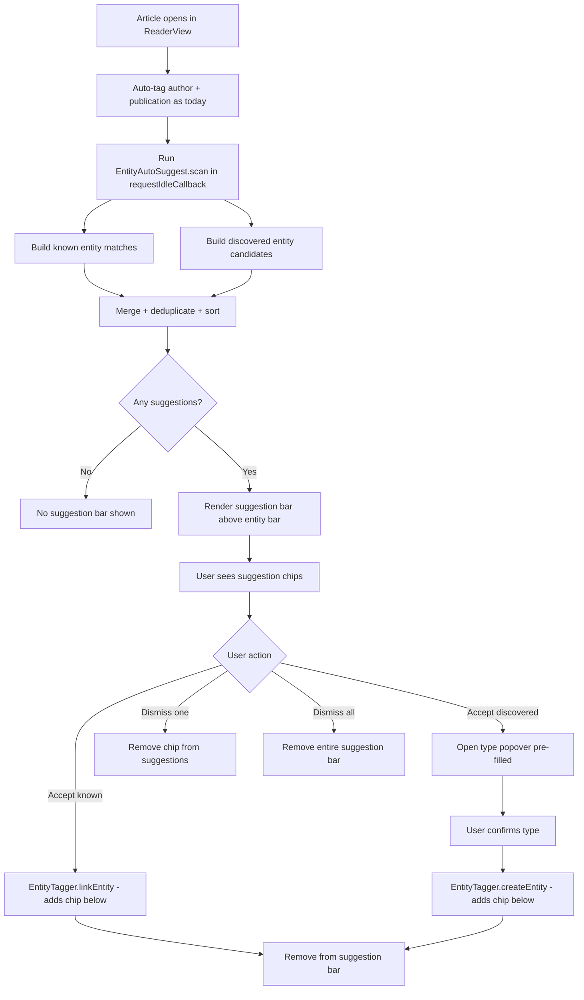

# Entity Auto-Suggestion / Auto-Tagging Design

## 1. Overview

This document describes the design for automatic entity detection in the NAC reader view. The feature has two complementary subsystems:

1. **Known Entity Matching** — scans article text against all entities in the user's registry (by name and aliases)
2. **New Entity Discovery** — uses text-analysis heuristics to surface potential new entities (proper nouns, quoted names, etc.)

Both produce *suggestions* the user can accept or dismiss. No entity is created or linked without explicit user action (except the existing author/publication auto-tagging, which is unchanged).

---

## 2. Existing System Summary

### 2.1 Entity Registry

[`Storage.entities.getAll()`](nostr-article-capture.user.js:725) returns an object keyed by entity ID. Each entity:

```js
{
  id: 'entity_<sha256>',
  type: 'person' | 'organization' | 'place' | 'thing',
  name: 'Federal Reserve',
  aliases: ['The Fed', 'Fed'],
  keypair: { pubkey, privkey, npub, nsec },
  created_by: '<pubkey>',
  created_at: <unix_ts>,
  articles: [{ url, title, context, tagged_at }],
  metadata: {}
}
```

[`Storage.entities.search(query, type)`](nostr-article-capture.user.js:761) does substring matching on name and aliases — useful for the existing popover workflow but too loose for auto-suggestion (we need whole-word matching).

### 2.2 Entity Creation & Linking

- [`EntityTagger.createEntity(type)`](nostr-article-capture.user.js:1529) — generates a keypair, builds an entity ID from `sha256(type + name)`, saves to registry, adds chip
- [`EntityTagger.linkEntity(entityId)`](nostr-article-capture.user.js:1581) — adds the article to the entity's articles list, pushes to `ReaderView.entities`, adds chip
- [`EntityTagger.addChip(entity)`](nostr-article-capture.user.js:1621) — renders a chip in `#nac-entity-chips`

### 2.3 Article Content Available

In [`ReaderView.show(article)`](nostr-article-capture.user.js:2140), the `article` object provides:

| Property | Type | Description |
|----------|------|-------------|
| `article.content` | HTML string | Full article body HTML |
| `article.textContent` | string | Plain text (HTML tags stripped) |
| `article.title` | string | Article headline |
| `article.byline` | string | Author name |
| `article.siteName` | string | Publication name |
| `article.domain` | string | Source domain |
| `article.url` | string | Canonical URL |

### 2.4 Existing Auto-Detection

Lines [2260–2380](nostr-article-capture.user.js:2260) in `ReaderView.show()` already auto-detect:
- **Author** from `article.byline` → searches registry for matching `person`, creates if not found
- **Publication** from `article.siteName` / `article.domain` → searches registry for matching `organization`, creates if not found

These are *auto-tagged* (no user confirmation). The new suggestion system is different: it presents suggestions that the user accepts or dismisses.

### 2.5 Entity Bar UI

The [`.nac-entity-bar`](nostr-article-capture.user.js:3952) sits below the article body inside `.nac-reader-content`. It contains:
- A title: "Tagged Entities"
- A flex-wrap chip container: `#nac-entity-chips`
- A dashed "+" button: `#nac-add-entity-btn`

### 2.6 Tagging Config

From [`CONFIG.tagging`](nostr-article-capture.user.js:57):
```js
tagging: {
  selection_debounce_ms: 300,
  min_selection_length: 2,
  max_selection_length: 100
}
```

---

## 3. Algorithm: Known Entity Matching

### 3.1 Goal

For every entity in the registry, check if its name or any alias appears in the article text. Use whole-word, case-insensitive matching. Exclude entities already tagged on this article.

### 3.2 Algorithm

```
function findKnownEntityMatches(articleText, registry, alreadyTaggedIds):
  results = []
  normalizedText = articleText.toLowerCase()

  for each entity in registry:
    if entity.id in alreadyTaggedIds: skip

    searchTerms = [entity.name, ...entity.aliases]
    
    for each term in searchTerms:
      if term.length < CONFIG.tagging.min_selection_length: skip
      
      regex = new RegExp('\\b' + escapeRegex(term) + '\\b', 'i')
      
      if regex.test(articleText):
        results.push({
          entityId: entity.id,
          entity: entity,
          matchedTerm: term,
          matchType: 'known',
          // Find first match position for sorting
          position: articleText.search(regex)
        })
        break  // one match per entity is enough
  
  return results sorted by position (first appearance in text)
```

### 3.3 Word Boundary Handling

JavaScript `\b` works well for Latin text but has edge cases:
- Handles "Google" not matching "Googled" ✓
- Handles "U.S." — the dots break `\b`, so we need a fallback: if the term contains non-word characters like dots, use a lookahead/lookbehind approach:

```js
function buildWordBoundaryRegex(term) {
  const escaped = term.replace(/[.*+?^${}()|[\]\\]/g, '\\$&');
  // If term contains non-word chars (dots, hyphens), use lookaround
  if (/[^\w\s]/.test(term)) {
    return new RegExp('(?<=^|[\\s,;:!?\\.])' + escaped + '(?=$|[\\s,;:!?\\.])', 'i');
  }
  return new RegExp('\\b' + escaped + '\\b', 'i');
}
```

### 3.4 Search Space

Scan against `article.textContent` + `article.title` (concatenated, with a separator to prevent cross-boundary matches). Do **not** scan the HTML `article.content` because tag attributes would produce false positives.

```js
const searchText = article.title + ' \n ' + article.textContent;
```

### 3.5 Performance Budget

- Build all regex patterns once, iterate the entity list
- For a registry of ~500 entities × ~3 terms each = ~1,500 regex tests against the article text
- Target: < 50ms for a 5,000-word article on modern hardware
- If registry exceeds 1,000 entities, consider building a single combined regex or using `indexOf` pre-filter before regex confirmation

---

## 4. Algorithm: New Entity Discovery

### 4.1 Goal

Identify capitalized multi-word phrases and quoted names/titles that might represent entities not yet in the registry.

### 4.2 Capitalized Phrase Detection

```
function discoverCapitalizedPhrases(text):
  // Match sequences of 2-5 capitalized words
  regex = /(?<![.!?]\s)(?:(?:[A-Z][a-z]+(?:\s+(?:of|the|and|for|in|on|at|de|la|van|von|bin|al)\s+)?){2,5}[A-Z][a-z]*|[A-Z][a-z]+(?:\s+[A-Z][a-z]+)+)/g

  candidates = []
  for each match in text.matchAll(regex):
    phrase = match[0].trim()
    candidates.push({
      name: phrase,
      position: match.index,
      source: 'capitalized_phrase'
    })

  return candidates
```

#### Simplified Regex Breakdown

The practical implementation will use a two-pass approach:

**Pass 1 — Extract capitalized sequences:**
```js
// Match 2+ consecutive capitalized words, allowing small connector words
const CAPS_PHRASE = /\b([A-Z][a-z]+(?:\s+(?:of|the|and|for|in|on|at|de|la|van|von)\s+)?(?:[A-Z][a-z]+\s*){1,4})\b/g;
```

**Pass 2 — Filter out sentence-start false positives:**
- For each match, check if the preceding character is `.`, `!`, `?`, or start-of-text
- If so, and the match is only 2 words, discard it (likely a sentence start)
- If the match is 3+ words, keep it even at sentence start (unlikely to be a coincidence)

### 4.3 Quoted Name/Title Detection

```js
// Detect quoted strings that look like entity names (not full sentences)
const QUOTED = /[""\u201C]([A-Z][^"""\u201D]{2,60})[""\u201D]/g;
```

Filter: keep only quoted strings that:
- Start with a capital letter
- Are < 60 characters
- Contain < 8 words (to exclude quoted sentences)
- Are not already captured by the capitalized phrase pass

### 4.4 False Positive Filtering

Apply a **stop-phrase list** to filter out common false positives:

```js
const STOP_PHRASES = new Set([
  'the', 'this', 'that', 'these', 'those', 'there', 'their', 'here',
  'what', 'when', 'where', 'which', 'while', 'whose', 'whom',
  'have', 'been', 'will', 'would', 'could', 'should', 'might',
  'also', 'just', 'even', 'only', 'still', 'already', 'however',
  'according', 'based', 'during', 'between', 'through', 'about',
  'after', 'before', 'since', 'until', 'within', 'without',
  'said', 'says', 'told', 'asked', 'added', 'noted',
  'new', 'first', 'last', 'next', 'more', 'most', 'many',
  'some', 'other', 'each', 'every', 'both', 'all',
  'monday', 'tuesday', 'wednesday', 'thursday', 'friday',
  'saturday', 'sunday',
  'january', 'february', 'march', 'april', 'may', 'june',
  'july', 'august', 'september', 'october', 'november', 'december'
]);
```

Discard a candidate if:
- Its first word (lowercased) is in `STOP_PHRASES`
- The full phrase (lowercased) is in `STOP_PHRASES`
- It's a single word (require at least 2 words for discovered entities)
- It matches an already-known entity name or alias
- It's a duplicate of another candidate (keep first occurrence only)

### 4.5 Type Guessing Heuristic

Assign a guessed type based on simple pattern matching:

| Pattern | Guessed Type |
|---------|-------------|
| Contains "University", "Institute", "Agency", "Department", "Corporation", "Inc", "LLC", "Ltd", "Bank", "Foundation", "Association", "Committee", "Bureau", "Commission", "Ministry" | `organization` |
| Contains "City", "County", "State", "River", "Mountain", "Island", "Street", "Avenue", "Park", "Bridge", "Lake" | `place` |
| 2 words, both capitalized, no org/place indicators | `person` (most likely a name) |
| 3+ words with articles/prepositions | `organization` or `thing` |
| Everything else | `unknown` — displayed with a `❓` icon |

### 4.6 Deduplication With Known Entities

Before presenting discovered candidates, check each against the registry:
- If a candidate exactly matches a known entity name/alias (case-insensitive), skip it — it would already be in the known-entity matches
- If a candidate is a substring of a known entity name, skip it

---

## 5. UI Design

### 5.1 Placement: Suggestion Bar Above Entity Bar

Add a new **"Suggested Entities"** section that appears directly above the existing entity bar, inside `.nac-reader-content`. This keeps related UI grouped together without modal interruption.

```
┌─────────────────────────────────────────────┐
│                Article Body                  │
│                  ...                         │
├─────────────────────────────────────────────┤
│ ✨ Suggested Entities (5)        [Dismiss All]│
│ ┌──────────┐ ┌──────────┐ ┌──────────┐     │
│ │ 👤 Fed... │ │ 🏢 Unit..│ │ ❓ Goo.. │ ... │
│ │  ✓   ✗   │ │  ✓   ✗   │ │  ✓   ✗   │     │
│ └──────────┘ └──────────┘ └──────────┘     │
│                                    [Show More]│
├─────────────────────────────────────────────┤
│ Tagged Entities                              │
│ [👤 Author Name ×] [🏢 Publication ×]       │
│ [+ Tag Entity]                               │
└─────────────────────────────────────────────┘
```

### 5.2 Suggestion Chip Design

Each suggestion is rendered as a card/chip slightly larger than entity chips, with action buttons:

```html
<div class="nac-suggestion-chip nac-suggestion-known" data-entity-id="entity_abc123">
  <span class="nac-suggestion-icon">👤</span>
  <span class="nac-suggestion-name">Federal Reserve</span>
  <span class="nac-suggestion-badge">known</span>
  <div class="nac-suggestion-actions">
    <button class="nac-suggestion-accept" aria-label="Accept suggestion">✓</button>
    <button class="nac-suggestion-dismiss" aria-label="Dismiss suggestion">✗</button>
  </div>
</div>
```

#### Visual Differentiation

| Type | Badge | Behavior on Accept |
|------|-------|--------------------|
| Known entity match | `known` badge (blue) | Calls `EntityTagger.linkEntity(entityId)` directly |
| Discovered entity | `new` badge (green) | Opens type-selection popover (reuses `EntityTagger.show()`) |
| Discovered w/ guessed type | `new · person` badge | Pre-selects the guessed type but allows change |

### 5.3 Handling Many Suggestions (10+)

- Show the first **6 suggestions** by default (prioritized: known entities first, then discovered)
- Show a **"Show N more"** button to expand the full list
- A **"Dismiss All"** button clears all suggestions at once
- Accepted suggestions animate out and appear as chips in the entity bar below
- Dismissed suggestions fade out

### 5.4 CSS Classes

```
.nac-suggestion-bar          — container, same max-width as entity bar
.nac-suggestion-bar-header   — flex row: title + dismiss-all button
.nac-suggestion-chips        — flex wrap container
.nac-suggestion-chip         — individual suggestion card
.nac-suggestion-known        — variant: blue-tinted left border
.nac-suggestion-discovered   — variant: green-tinted left border
.nac-suggestion-icon         — emoji
.nac-suggestion-name         — entity name text
.nac-suggestion-badge        — small label: 'known' or 'new'
.nac-suggestion-actions      — accept/dismiss buttons
.nac-suggestion-accept       — green check
.nac-suggestion-dismiss      — red x
.nac-suggestion-show-more    — expand button
```

### 5.5 Interaction Flow



---

## 6. Data Flow

### 6.1 When Does Scanning Happen?

Scanning runs **after** the reader view is fully rendered and the author/publication auto-tagging completes. Use `requestIdleCallback` (with a `setTimeout` fallback) to avoid blocking the UI:

```js
// In ReaderView.show(), after existing auto-tag code (line ~2380):
if (typeof requestIdleCallback === 'function') {
  requestIdleCallback(() => EntityAutoSuggest.scan(article), { timeout: 2000 });
} else {
  setTimeout(() => EntityAutoSuggest.scan(article), 500);
}
```

### 6.2 Scan Function

```js
EntityAutoSuggest.scan = async (article) => {
  const registry = await Storage.entities.getAll();
  const alreadyTaggedIds = new Set(ReaderView.entities.map(e => e.entity_id));
  const searchText = article.title + ' \n ' + article.textContent;

  // Phase 1: Known entity matching
  const knownMatches = EntityAutoSuggest.findKnownMatches(searchText, registry, alreadyTaggedIds);

  // Phase 2: New entity discovery
  const discovered = EntityAutoSuggest.discoverEntities(searchText, registry);

  // Phase 3: Merge, deduplicate, limit
  const suggestions = [...knownMatches, ...discovered];
  
  // Store suggestions for UI
  EntityAutoSuggest.suggestions = suggestions;

  // Render UI
  if (suggestions.length > 0) {
    EntityAutoSuggest.renderSuggestionBar(suggestions);
  }
};
```

### 6.3 State Management

The `EntityAutoSuggest` module holds ephemeral state (not persisted):

```js
const EntityAutoSuggest = {
  suggestions: [],       // current suggestions array
  dismissedIds: new Set(), // dismissed entity IDs or candidate hashes (session only)
  maxVisible: 6,         // initial visible count
  expanded: false        // whether "Show more" is active
};
```

Dismissed suggestions are **not persisted** — every article load produces fresh suggestions. This avoids storage overhead and keeps the feature lightweight.

### 6.4 Interaction with Existing Entity Tagging

When a known entity suggestion is accepted:
1. Call `EntityTagger.linkEntity(entityId)` — reuses existing code
2. This adds the chip to the entity bar, updates `ReaderView.entities`, updates the entity's articles list
3. Remove the suggestion chip from the suggestion bar

When a discovered entity suggestion is accepted:
1. Set `EntityTagger.selectedText = suggestion.name`
2. Show the type-selection popover pre-positioned near the suggestion chip
3. If a guessed type exists, pre-select that type button (add `active` class)
4. The normal `EntityTagger.selectType()` → `EntityTagger.createEntity()` flow handles the rest
5. Remove the suggestion chip from the suggestion bar

---

## 7. Integration Points

### 7.1 New Module: `EntityAutoSuggest`

Add a new module (Section 6B) between [`EntityTagger`](nostr-article-capture.user.js:1430) and [`ReaderView`](nostr-article-capture.user.js:2129). Estimated ~200-250 lines.

```js
// ============================================
// SECTION 6B: ENTITY AUTO-SUGGESTION
// ============================================

const EntityAutoSuggest = {
  suggestions: [],
  dismissedIds: new Set(),
  maxVisible: 6,
  expanded: false,

  scan: async (article) => { /* ... */ },
  findKnownMatches: (text, registry, taggedIds) => { /* ... */ },
  discoverEntities: (text, registry) => { /* ... */ },
  guessType: (phrase) => { /* ... */ },
  buildWordBoundaryRegex: (term) => { /* ... */ },
  renderSuggestionBar: (suggestions) => { /* ... */ },
  acceptSuggestion: async (index) => { /* ... */ },
  dismissSuggestion: (index) => { /* ... */ },
  dismissAll: () => { /* ... */ },
  toggleShowMore: () => { /* ... */ },
  removeSuggestionChip: (index) => { /* ... */ },
  destroy: () => { /* ... */ }
};
```

### 7.2 Modifications to Existing Code

| Location | Change | Purpose |
|----------|--------|---------|
| [`ReaderView.show()`](nostr-article-capture.user.js:2140) ~line 2380 | Add `requestIdleCallback` call to `EntityAutoSuggest.scan()` | Trigger scanning after auto-tag |
| [`ReaderView.show()`](nostr-article-capture.user.js:2200) HTML template | Add `<div id="nac-suggestion-bar"></div>` placeholder above `.nac-entity-bar` | Insertion point for suggestions |
| [`ReaderView.hide()`](nostr-article-capture.user.js:2476) | Add `EntityAutoSuggest.destroy()` call | Clean up suggestion state on close |
| [`EntityTagger.linkEntity()`](nostr-article-capture.user.js:1581) | After successful link, call `EntityAutoSuggest.removeSuggestionByEntityId(entityId)` | Remove accepted suggestion if manually tagged |
| CSS section (~line 3952) | Add `.nac-suggestion-*` styles | Style the suggestion bar |

### 7.3 HTML Insertion Point

In the [`ReaderView.show()` template](nostr-article-capture.user.js:2162), insert the suggestion bar placeholder between the article body and entity bar:

```html
</div> <!-- .nac-reader-article -->

<!-- Suggestion bar will be injected here by EntityAutoSuggest.renderSuggestionBar() -->
<div id="nac-suggestion-bar" class="nac-suggestion-bar" style="display: none;"></div>

<div class="nac-entity-bar">
  ...
</div>
```

---

## 8. Performance Considerations

### 8.1 Timing

| Phase | Expected Duration | Notes |
|-------|-------------------|-------|
| Registry fetch | < 5ms | Single `GM_getValue` call |
| Known entity matching (500 entities) | < 30ms | Pre-compiled regexes |
| New entity discovery | < 20ms | Two regex passes over text |
| Deduplication + sorting | < 5ms | Array operations |
| **Total** | **< 60ms** | Well within 100ms budget |

### 8.2 Optimization Strategies

1. **Pre-filter with `indexOf`**: Before running a regex for each entity name, do a fast case-insensitive `indexOf` check. Only run the regex (for word-boundary confirmation) if `indexOf` finds a hit.

```js
const lowerText = searchText.toLowerCase();
for (const entity of entities) {
  const lowerName = entity.name.toLowerCase();
  if (lowerText.indexOf(lowerName) === -1) continue; // fast reject
  // Now confirm with word-boundary regex
  if (buildWordBoundaryRegex(entity.name).test(searchText)) {
    // match confirmed
  }
}
```

2. **Use `requestIdleCallback`**: Scan runs during idle time, never blocking the initial render.

3. **Limit discovered candidates**: Cap discovered entities at 20 candidates. If more than 20 capitalized phrases are found, keep only those that appear 2+ times in the text (higher signal).

4. **Batch registry access**: Fetch the full registry once with `Storage.entities.getAll()`, don't make per-entity calls.

5. **Avoid re-scanning**: If the user edits the article content and switches back, don't re-scan unless they explicitly request it (future enhancement: add a "Re-scan" button).

### 8.3 Memory

- Suggestions array holds at most ~50 items (capped)
- No DOM nodes created for suggestions beyond `maxVisible` until "Show More" is clicked
- Suggestion bar is removed entirely on `ReaderView.hide()`

---

## 9. Edge Cases

| Scenario | Handling |
|----------|----------|
| Empty article text | Skip scanning, no suggestion bar |
| No registry entities | Skip known-matching phase; only run discovery |
| Entity name is a common word (e.g., "Apple") | `\b` word boundary prevents matching inside other words, but will match standalone "Apple". This is correct behavior — the user can dismiss if it's a false positive. |
| Entity name contains special regex chars (e.g., "C++") | `escapeRegex()` handles this |
| Very long article (50k+ words) | `indexOf` pre-filter keeps regex calls minimal; discovery regex has bounded lookahead |
| Huge registry (1000+ entities) | `indexOf` pre-filter is O(n×m) where n=entities, m=text length. For 1000 entities × 50k chars this is still < 100ms. If needed, build a single combined regex: `\b(?:term1|term2|...)\b` |
| Duplicate suggestions between known and discovered | Deduplication step removes discovered candidates that match known entity names |
| Entity already tagged on this article | Excluded by checking `alreadyTaggedIds` set |
| Author/publication already auto-tagged | Their entity IDs will be in `ReaderView.entities` by the time scanning runs, so they're excluded |

---

## 10. Future Enhancements (Out of Scope)

- **Persistent dismissals**: Remember dismissed suggestions per article URL across sessions
- **Learning from user actions**: Track accept/dismiss rates to improve type guessing
- **Configurable sensitivity**: Settings panel toggle for auto-suggestion, minimum match confidence
- **Re-scan button**: After editing article content, allow re-scanning
- **Batch accept**: "Accept All Known" button to tag all known entity matches at once
- **Entity frequency count**: Show how many times each entity appears in the text

---

## 11. Implementation Checklist

- [ ] Create `EntityAutoSuggest` module with `scan()`, `findKnownMatches()`, `discoverEntities()`
- [ ] Implement `buildWordBoundaryRegex()` with special-character handling
- [ ] Implement capitalized phrase detection regex with sentence-start filtering
- [ ] Implement quoted name detection
- [ ] Implement `guessType()` heuristic
- [ ] Implement false-positive filtering with stop-phrase list
- [ ] Implement deduplication between known matches and discovered candidates
- [ ] Add suggestion bar HTML placeholder to `ReaderView.show()` template
- [ ] Implement `renderSuggestionBar()` with chip rendering
- [ ] Implement `acceptSuggestion()` — known (link) vs discovered (create with type popover)
- [ ] Implement `dismissSuggestion()` and `dismissAll()`
- [ ] Implement "Show More" / collapse for 6+ suggestions
- [ ] Add CSS styles for `.nac-suggestion-*` classes
- [ ] Hook `EntityAutoSuggest.scan()` into `ReaderView.show()` via `requestIdleCallback`
- [ ] Hook `EntityAutoSuggest.destroy()` into `ReaderView.hide()`
- [ ] Hook `EntityAutoSuggest.removeSuggestionByEntityId()` into `EntityTagger.linkEntity()`
- [ ] Test with empty registry, large registry, short articles, long articles
