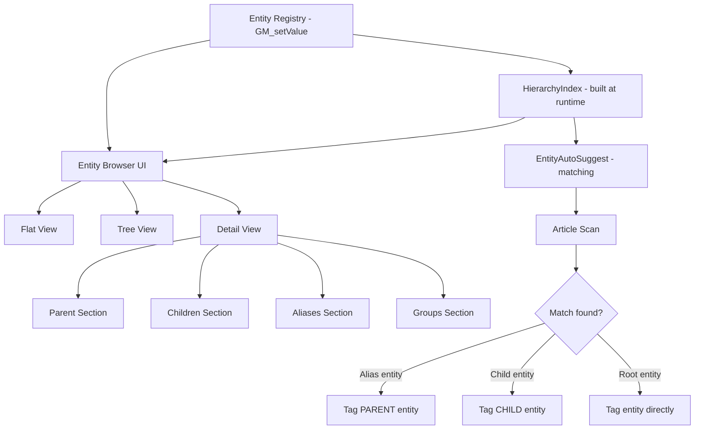
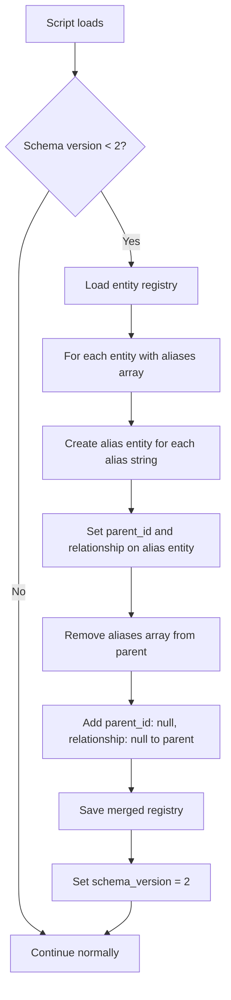
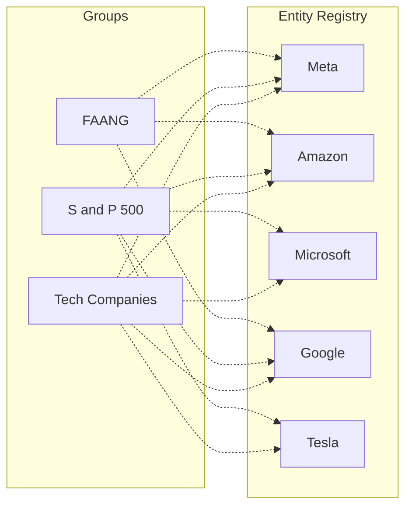

# Entity Hierarchy and Taxonomy System — Design Document

## Overview

This document specifies the design for replacing the flat `aliases[]` array on entities with a proper parent-child hierarchy system, plus a cross-cutting group/taxonomy system for user-defined classifications. The design must work within the constraints of a Tampermonkey userscript using `GM_setValue` JSON blobs, handle 500+ entities performantly, and migrate existing data seamlessly.

---

## 1. Data Model

### 1.1 Entity Structure Changes

**Current entity structure** (from [`Storage.entities.save()`](nostr-article-capture.user.js:734)):

```javascript
{
  id: "entity_<hash>",
  type: "person" | "organization" | "place" | "thing",
  name: "Federal Trade Commission",
  aliases: ["FTC", "F.T.C."],           // ← REMOVED
  keypair: { pubkey, privkey, npub, nsec },
  created_by: "<user_pubkey>",
  created_at: 1707350400,
  articles: [{ url, title, context, tagged_at }],
  metadata: {},
  updated: 1707350500
}
```

**New entity structure:**

```javascript
{
  id: "entity_<hash>",
  type: "person" | "organization" | "place" | "thing",
  name: "Federal Trade Commission",
  // aliases: []                         // ← REMOVED (migrated to child entities)
  parent_id: null,                       // ← NEW: null for root entities, entity ID for children
  relationship: null,                    // ← NEW: null for roots, "alias" | "child" for children
  keypair: { pubkey, privkey, npub, nsec },
  created_by: "<user_pubkey>",
  created_at: 1707350400,
  articles: [{ url, title, context, tagged_at }],
  metadata: {},
  updated: 1707350500
}
```

**New fields:**

| Field | Type | Description |
|-------|------|-------------|
| `parent_id` | `string \| null` | Entity ID of the parent. `null` for root-level entities. |
| `relationship` | `"alias" \| "child" \| null` | How this entity relates to its parent. `null` for root entities. |

**Removed fields:**

| Field | Replacement |
|-------|-------------|
| `aliases` | Each alias becomes a separate child entity with `relationship: "alias"` |

### 1.2 Relationship Types

Two relationship types cover both use cases from the requirements:

| Relationship | Semantics | Example | Matching Behavior |
|-------------|-----------|---------|-------------------|
| **`alias`** | Alternate name for the same real-world entity | "FTC" → parent "Federal Trade Commission" | Match tags the **parent** entity |
| **`child`** | Distinct sub-entity within a hierarchy | "Instagram" → parent "Meta" | Match tags the **child** entity itself |

**Key distinction:** An `alias` entity is just a different spelling/abbreviation — it represents the *same thing* as the parent. A `child` entity is a *different thing* that happens to be organizationally under the parent.

### 1.3 Alias Entities — Lightweight Design

Alias entities are lightweight. They exist primarily as matching targets and don't need their own keypairs or article lists:

```javascript
// Alias entity (lightweight)
{
  id: "entity_<hash>",
  type: "organization",                // inherited from parent
  name: "FTC",
  parent_id: "entity_abc123",          // → "Federal Trade Commission"
  relationship: "alias",
  keypair: null,                       // no keypair needed
  created_by: "<user_pubkey>",
  created_at: 1707350400,
  articles: [],                        // articles go on the parent
  metadata: {},
  updated: 1707350500
}
```

**Why no keypair?** Alias entities don't need a NOSTR identity — they're just search/match targets. The parent entity holds the canonical keypair. This saves storage and avoids confusion about which keypair represents the real-world entity.

### 1.4 Child Entities — Full Entities

Child entities are full entities with their own keypairs, articles, and identity:

```javascript
// Child entity (full)
{
  id: "entity_<hash>",
  type: "organization",                // can differ from parent in theory, but usually same
  name: "Instagram",
  parent_id: "entity_meta123",         // → "Meta"
  relationship: "child",
  keypair: { pubkey, privkey, npub, nsec },  // own identity
  created_by: "<user_pubkey>",
  created_at: 1707350400,
  articles: [{ url, title, context, tagged_at }],  // own articles
  metadata: {},
  updated: 1707350500
}
```

### 1.5 Group Structure

Groups are stored in a **separate GM key** (`entity_groups`) to avoid bloating the entity registry:

```javascript
// GM key: "entity_groups"
{
  "group_tech_companies": {
    id: "group_tech_companies",
    name: "Tech Companies",
    description: "Major technology corporations",   // optional
    color: "#4A90D9",                               // optional, for UI badges
    entity_ids: ["entity_meta123", "entity_amzn456", "entity_msft789"],
    created_at: 1707350400,
    updated: 1707350500
  },
  "group_sp500": {
    id: "group_sp500",
    name: "S&P 500",
    description: "",
    color: "#50C878",
    entity_ids: ["entity_meta123", "entity_amzn456", ...],
    created_at: 1707350400,
    updated: 1707350500
  }
}
```

**Why groups reference entities, not the other way around?**

- Entities don't need a `groups: []` field, keeping the entity structure backward-compatible.
- Groups are far fewer than entities (typically 10-50 vs. 500+), so "which groups is entity X in?" is a fast scan.
- Adding/removing entities from groups doesn't touch the entity registry at all.
- Groups can be synced independently from entities (future enhancement).

### 1.6 Storage Schema Summary

| GM Key | Contents | Size Estimate at 500 entities |
|--------|----------|-------------------------------|
| `entity_registry` | All entities (flat map by ID) | ~500KB–2MB |
| `entity_groups` | All groups (flat map by ID) | ~5–50KB |
| `entity_last_sync` | Timestamp | 8 bytes |

### 1.7 Runtime Hierarchy Index

At startup (and after mutations), build an in-memory index for fast hierarchy lookups:

```javascript
// Built from entity_registry, not persisted
const HierarchyIndex = {
  childrenOf: {                          // parent_id → [child entity IDs]
    "entity_abc123": ["entity_ftc1", "entity_ftc2"],
    "entity_meta123": ["entity_fb456", "entity_ig789", "entity_rl012"]
  },
  parentOf: {                            // child_id → parent entity
    "entity_ftc1": { id: "entity_abc123", name: "Federal Trade Commission" },
    "entity_ig789": { id: "entity_meta123", name: "Meta" }
  },
  roots: ["entity_abc123", "entity_meta123", ...],  // entities with no parent
  aliasTargets: {                        // Maps alias entity ID → canonical parent ID (for alias type only)
    "entity_ftc1": "entity_abc123",
    "entity_ftc2": "entity_abc123"
  }
};
```

This index is cheap to build (single pass over all entities) and eliminates repeated scans during matching and display.

---

## 2. Parent-Child System

### 2.1 Semantics

**Alias relationship (`relationship: "alias"`):**

- The child is an alternate name for the parent entity
- Matching the child in article text tags the **parent** entity
- The child has no keypair or articles of its own
- The child inherits the parent's type
- Display: alias entities appear as subordinate names in the parent's detail view
- Example: "FTC" is an alias of "Federal Trade Commission"

**Child relationship (`relationship: "child"`):**

- The child is a distinct entity within the parent's organizational structure
- Matching the child in article text tags the **child** entity itself
- The child has its own keypair, articles, and full identity
- The child typically shares the parent's type but this is not enforced
- Display: shown in tree view under the parent, with breadcrumb navigation
- Example: "Instagram" is a child of "Meta"

### 2.2 Depth Limits

Support **up to 4 levels** of nesting (configurable):

```
Level 0: Alphabet (root)
Level 1: └── Google (child)
Level 2:     └── YouTube (child)
Level 3:         └── YouTube Premium (child)
```

Alias entities are always leaves — they cannot have children of their own.

### 2.3 Creating Parent-Child Relationships

**Method 1: "Set Parent" from Entity Detail View**

In the entity detail view ([`EntityBrowser.showDetail()`](nostr-article-capture.user.js:3710)), add a "Parent" section:

```
┌─────────────────────────────────────────────┐
│ ← Back to list                              │
│                                             │
│ 🏢 Instagram                                │
│    Organization                             │
│                                             │
│ ── Parent ──────────────────────────────    │
│ Parent: Meta  [✕ Remove]                    │
│ Relationship: ○ Alias  ● Child              │
│                                             │
│ ── or ──                                    │
│ Parent: None                                │
│ [Set Parent…]                               │
│                                             │
│ ── Children (2) ────────────────────────    │
│ 🏢 Facebook  (child)                        │
│ 🏢 Reality Labs  (child)                    │
│ [Add Child…]                                │
│                                             │
│ ── Aliases (1) ─────────────────────────    │
│ "IG"  [✕]                                   │
│ [Add Alias…]                                │
│ ...                                         │
└─────────────────────────────────────────────┘
```

Clicking **"Set Parent…"** opens a search modal to find and select the parent entity. Clicking **"Add Child…"** opens a search modal to find an existing entity and set it as a child. **"Add Alias…"** creates a new lightweight alias entity directly.

**Method 2: Quick-Assign from Entity List**

In the entity card context menu (long-press or right-click), offer "Set Parent…" as a quick action.

**Method 3: Create with Parent**

When creating a new entity via [`EntityTagger.createEntity()`](nostr-article-capture.user.js:1529), if an entity with a similar name exists, offer to create it as a child or alias of the existing entity.

### 2.4 Entity Search Modal (Shared Component)

A reusable search modal used for "Set Parent", "Add Child", and group assignment:

```
┌─────────────────────────────────────────────┐
│ Select Parent Entity                    [✕] │
├─────────────────────────────────────────────┤
│ ┌─────────────────────────────────────────┐ │
│ │ 🔍 Search entities…                     │ │
│ └─────────────────────────────────────────┘ │
│                                             │
│ 👤 Elon Musk                    [Select]    │
│ 🏢 Meta                         [Select]    │
│ 🏢 Federal Trade Commission     [Select]    │
│ 📍 Silicon Valley                [Select]    │
│                                             │
│ Showing 4 of 127 entities                   │
└─────────────────────────────────────────────┘
```

Filtered to exclude:
- The entity itself (can't be its own parent)
- Entities that would create a cycle (can't set a descendant as parent)
- Alias entities (aliases can't be parents)

### 2.5 Display in Entity Browser

**List View — Tree Mode Toggle**

Add a toggle in the entity browser list header to switch between flat and tree views:

```
┌─────────────────────────────────────────────┐
│ 🔍 Search entities…                         │
│ [All] [👤] [🏢] [📍] [🔷]   [≡ Flat] [⊞ Tree] │
├─────────────────────────────────────────────┤
│                                             │
│  🏢 Alphabet                    3 articles  │
│    └── 🏢 Google                 5 articles  │
│        └── 🏢 YouTube            2 articles  │
│  🏢 Meta                        4 articles  │
│    ├── 🏢 Facebook               7 articles  │
│    ├── 🏢 Instagram              3 articles  │
│    └── 🏢 Reality Labs           1 article   │
│  🏢 Federal Trade Commission    2 articles  │
│    └── 🏢 FTC  (alias)                      │
│    └── 🏢 F.T.C.  (alias)                   │
│  👤 Elon Musk                   5 articles  │
│                                             │
└─────────────────────────────────────────────┘
```

**Flat mode** (default): Same as current — all entities sorted by creation date, with a small parent badge if the entity has a parent. Alias entities are hidden in flat mode (they appear in their parent's detail view).

**Tree mode**: Groups entities by hierarchy. Root entities are at top level, children are indented. Alias entities shown in italics with "(alias)" label. Entities without parents appear as root level.

### 2.6 Display in Entity Chips (Reader View)

Entity chips in the reader view's entity bar show the canonical name:

- If an alias match triggers tagging the parent: chip shows **parent name** (e.g., "Federal Trade Commission")
- If a child entity is tagged: chip shows **"Parent › Child"** format (e.g., "Meta › Instagram")
- If a root entity is tagged: chip shows **entity name** as today

Chip display logic in [`EntityTagger.addChip()`](nostr-article-capture.user.js:1571):

```javascript
// Chip label generation
function getChipLabel(entity, registry) {
  if (entity.parent_id && entity.relationship === 'child') {
    const parent = registry[entity.parent_id];
    return parent ? `${parent.name} › ${entity.name}` : entity.name;
  }
  return entity.name;
}
```

### 2.7 Validation Rules

| Rule | Enforcement |
|------|-------------|
| No cycles | Before setting parent, walk up the ancestor chain to verify the new parent isn't a descendant |
| Max depth 4 | Count levels from root; reject if exceeding limit |
| Aliases are leaves | Alias entities cannot have `children_of` entries in the hierarchy index |
| Alias entities have no keypair | Set `keypair: null` on alias creation |
| Alias matches tag the parent | Enforced in matching logic |
| Type inheritance for aliases | Alias inherits parent's type; changing parent type updates alias type |
| Deleting a parent | Offer choices: delete children too, or promote children to root level |

---

## 3. Group/Taxonomy System

### 3.1 Group Structure

```javascript
{
  id: "group_<hash>",
  name: "Tech Companies",
  description: "Major technology corporations",
  color: "#4A90D9",           // one of 8 preset colors
  entity_ids: ["entity_meta123", "entity_amzn456"],
  created_at: 1707350400,
  updated: 1707350500
}
```

### 3.2 Storage Module Addition

Add a `Storage.groups` sub-module alongside [`Storage.entities`](nostr-article-capture.user.js:724):

```javascript
Storage.groups = {
  getAll: async () => await Storage.get('entity_groups', {}),
  get: async (id) => { const g = await Storage.groups.getAll(); return g[id] || null; },
  save: async (id, data) => {
    const groups = await Storage.groups.getAll();
    groups[id] = { ...data, updated: Math.floor(Date.now() / 1000) };
    await Storage.set('entity_groups', groups);
    return groups[id];
  },
  delete: async (id) => {
    const groups = await Storage.groups.getAll();
    delete groups[id];
    await Storage.set('entity_groups', groups);
  },
  getGroupsForEntity: async (entityId) => {
    const groups = await Storage.groups.getAll();
    return Object.values(groups).filter(g => g.entity_ids.includes(entityId));
  },
  addEntityToGroup: async (groupId, entityId) => {
    const group = await Storage.groups.get(groupId);
    if (!group) return;
    if (!group.entity_ids.includes(entityId)) {
      group.entity_ids.push(entityId);
      await Storage.groups.save(groupId, group);
    }
  },
  removeEntityFromGroup: async (groupId, entityId) => {
    const group = await Storage.groups.get(groupId);
    if (!group) return;
    group.entity_ids = group.entity_ids.filter(id => id !== entityId);
    await Storage.groups.save(groupId, group);
  }
};
```

### 3.3 Group CRUD UI

**Create Group:**

In the Entity Browser, add a "Groups" tab alongside the type filter buttons:

```
┌─────────────────────────────────────────────┐
│ 🔍 Search entities…                         │
│ [Entities] [Groups]                         │
├─────────────────────────────────────────────┤
│                                             │
│  [+ Create Group]                           │
│                                             │
│  ● Tech Companies  (4 entities)        [›]  │
│  ● S&P 500  (127 entities)             [›]  │
│  ● Silicon Valley  (8 entities)        [›]  │
│                                             │
└─────────────────────────────────────────────┘
```

Clicking **"+ Create Group"** opens an inline form:

```
┌─────────────────────────────────────────────┐
│ Group Name: [________________]              │
│ Description: [________________] (optional)  │
│ Color: ● ● ● ● ● ● ● ●                    │
│ [Create] [Cancel]                           │
└─────────────────────────────────────────────┘
```

**Group Detail View:**

Clicking a group shows its members with add/remove controls:

```
┌─────────────────────────────────────────────┐
│ ← Back to groups                            │
│                                             │
│ ● Tech Companies                            │
│   Major technology corporations             │
│   4 entities                                │
│                                             │
│ ── Members ─────────────────────────────    │
│ 🏢 Meta                             [✕]     │
│ 🏢 Amazon                           [✕]     │
│ 🏢 Microsoft                        [✕]     │
│ 🏢 Google                           [✕]     │
│                                             │
│ [+ Add Entity…]                             │
│                                             │
│ ── Actions ─────────────────────────────    │
│ [✏ Edit Group] [🗑 Delete Group]            │
└─────────────────────────────────────────────┘
```

**"+ Add Entity…"** opens the shared entity search modal (Section 2.4).

### 3.4 Assigning Entities to Groups

**From Entity Detail View:**

Add a "Groups" section in the entity detail view:

```
│ ── Groups ──────────────────────────────    │
│ ● Tech Companies  [✕]                       │
│ ● S&P 500  [✕]                              │
│ [+ Add to Group…]                           │
```

**"+ Add to Group…"** shows a dropdown of existing groups (with search if >10 groups), plus a "Create new group" option.

**From Group Detail View:**

Use the entity search modal to add entities to the group.

### 3.5 Browsing by Group

When a user clicks a group in the Groups tab, they see the group detail view with all member entities. Clicking an entity in the group navigates to that entity's detail view, with a breadcrumb back to the group.

### 3.6 Group Color Presets

Eight colors to visually distinguish groups in badges:

```javascript
const GROUP_COLORS = [
  '#4A90D9',  // Blue
  '#50C878',  // Green
  '#E8A838',  // Amber
  '#E85D75',  // Rose
  '#9B59B6',  // Purple
  '#3498DB',  // Sky
  '#E67E22',  // Orange
  '#1ABC9C',  // Teal
];
```

---

## 4. UI Design

### 4.1 Entity Browser Tab Bar

Replace the current type-filter-only bar with a two-level navigation:

**Level 1: View mode** — `[Entities]` `[Groups]`
**Level 2 (Entities view):** — Type filters + view toggle (`[≡ Flat]` `[⊞ Tree]`)
**Level 2 (Groups view):** — Search + create

```
┌─────────────────────────────────────────────┐
│ [Entities] [Groups]                         │
├─────────────────────────────────────────────┤
│ 🔍 Search entities…                         │
│ [All] [👤] [🏢] [📍] [🔷]   [≡ Flat] [⊞ Tree] │
│                                             │
│ ... entity list ...                         │
└─────────────────────────────────────────────┘
```

### 4.2 Entity Detail View — Updated Sections

The existing entity detail view ([`EntityBrowser.showDetail()`](nostr-article-capture.user.js:3710)) is updated with these sections in order:

1. **Header** — emoji, name (click to rename), type badge
2. **Parent** — shows current parent with remove button, or "Set Parent…" button
3. **Children** — list of child entities (relationship: child), with "Add Child…"
4. **Aliases** — list of alias entities (relationship: alias), with "Add Alias…" ← replaces current aliases section
5. **Groups** — list of groups this entity belongs to, with "Add to Group…"
6. **Keypair** — npub/nsec display (same as current)
7. **Articles** — linked articles list (same as current)
8. **Danger Zone** — delete button

### 4.3 "Add Alias" Interaction (Replaces Current Aliases Section)

The current aliases section ([lines 3733-3748](nostr-article-capture.user.js:3733)) adds string entries to `entity.aliases[]`. The new version creates alias entities instead:

```
│ ── Aliases ─────────────────────────────    │
│  FTC  [✕]                                   │
│  F.T.C.  [✕]                                │
│  [alias name…] [Add]                        │
```

When the user types "FTC" and clicks **Add**:
1. Generate entity ID: `entity_` + SHA-256 hash of (parent type + alias name)
2. Create a new entity: `{ id, type: parent.type, name: "FTC", parent_id: parent.id, relationship: "alias", keypair: null, ... }`
3. Save to registry
4. Refresh the detail view

Removing an alias deletes the alias entity from the registry (with confirmation).

### 4.4 Tree View Rendering

The tree view uses CSS indentation with visual connector lines:

```javascript
renderTreeView: (entities, hierarchyIndex) => {
  const roots = entities.filter(e => !e.parent_id);
  const sorted = [...roots].sort((a, b) => a.name.localeCompare(b.name));
  
  let html = '';
  for (const root of sorted) {
    html += renderTreeNode(root, 0, hierarchyIndex);
  }
  return html;
}

renderTreeNode: (entity, depth, hierarchyIndex) => {
  const indent = depth * 24;  // pixels
  const isAlias = entity.relationship === 'alias';
  const childIds = hierarchyIndex.childrenOf[entity.id] || [];
  
  let html = `<div class="nac-eb-card nac-eb-tree-node" 
    style="padding-left: ${indent + 12}px" 
    data-entity-id="${entity.id}">
    ${depth > 0 ? '<span class="nac-eb-tree-connector">└</span>' : ''}
    <span class="nac-eb-card-emoji">${emoji}</span>
    <span class="nac-eb-card-name ${isAlias ? 'nac-eb-alias-name' : ''}">${entity.name}</span>
    ${isAlias ? '<span class="nac-eb-alias-badge">alias</span>' : ''}
  </div>`;
  
  for (const childId of childIds) {
    const child = registry[childId];
    if (child) html += renderTreeNode(child, depth + 1, hierarchyIndex);
  }
  return html;
}
```

### 4.5 Group Badges in Entity Cards

In both flat and tree views, entity cards show group color dots:

```
│ 🏢 Meta  ●●  4 articles · Jan 2025         │
```

The colored dots (●) correspond to the groups the entity belongs to. Hovering shows group names in a tooltip.

### 4.6 Entity Search/Filter with Hierarchy Awareness

The search input in the entity browser ([`filterEntities`](nostr-article-capture.user.js:3534)) is updated:

- Searching "FTC" should surface both the alias entity "FTC" AND its parent "Federal Trade Commission"
- Searching "Instagram" should show "Instagram" with a "Parent: Meta" indicator
- In tree mode, searching collapses the tree to only show matching entities and their ancestors

### 4.7 Preventing Invalid Operations

| Operation | Validation |
|-----------|------------|
| Set parent to self | Blocked — "Cannot set entity as its own parent" |
| Set parent creating cycle | Blocked — walk ancestor chain; "Would create a circular relationship" |
| Set parent exceeding depth | Blocked — "Maximum hierarchy depth of 4 exceeded" |
| Set alias as parent | Blocked — "Alias entities cannot be parents" |
| Add child to alias | Blocked — "Alias entities cannot have children" |
| Delete parent with children | Prompt: "Delete children too?" or "Promote children to root level?" |
| Remove entity from group that references it | Auto-cleanup: group's entity_ids updated |

---

## 5. Known Entity Matching Changes

### 5.1 Current Matching Logic

[`EntityAutoSuggest.matchKnownEntities()`](nostr-article-capture.user.js:1694) currently:

1. Iterates all entities in the registry
2. For each entity, builds `searchTerms = [entity.name, ...entity.aliases]`
3. Tests each term against article text with word-boundary regex
4. On match, adds `{ entity, matchedOn: term }` to results

### 5.2 New Matching Logic

The matching loop changes to handle the hierarchy:

```javascript
matchKnownEntities: (text, title, alreadyTaggedIds, registry) => {
  const results = [];
  const entities = Object.values(registry);
  const lowerText = text.toLowerCase();
  const matchedCanonicalIds = new Set();  // prevent duplicate suggestions

  for (const entity of entities) {
    // Determine the canonical entity (the one that gets tagged)
    let canonicalEntity;
    if (entity.relationship === 'alias' && entity.parent_id) {
      canonicalEntity = registry[entity.parent_id];
      if (!canonicalEntity) continue;  // orphaned alias, skip
    } else {
      canonicalEntity = entity;
    }

    // Skip if canonical entity already matched or already tagged
    if (matchedCanonicalIds.has(canonicalEntity.id)) continue;
    if (alreadyTaggedIds.has(canonicalEntity.id)) continue;

    const term = entity.name;
    if (!term || term.length < CONFIG.tagging.min_selection_length) continue;

    // Fast indexOf pre-filter
    if (lowerText.indexOf(term.toLowerCase()) === -1) continue;

    // Confirm with word-boundary regex
    const regex = EntityAutoSuggest.buildWordBoundaryRegex(term);
    if (regex.test(text)) {
      matchedCanonicalIds.add(canonicalEntity.id);
      results.push({
        type: 'known',
        entity: canonicalEntity,          // always the canonical entity
        entityId: canonicalEntity.id,
        name: canonicalEntity.name,
        matchedOn: term,                  // what text actually matched
        occurrences: (text.match(new RegExp(regex.source, 'gi')) || []).length,
        position: text.search(regex)
      });
    }
  }

  results.sort((a, b) => a.position - b.position);
  return results;
};
```

**Key changes:**
- Alias entities resolve to their parent for tagging
- `matchedCanonicalIds` prevents the same parent from being suggested twice (e.g., if both "FTC" and "F.T.C." appear in text)
- Child entities (non-alias) are matched and tagged independently
- `matchedOn` field preserves which text variant was found, for display in the suggestion bar

### 5.3 Suggestion Bar Display

When a match was via an alias, the suggestion chip shows both:

```
🏢 Federal Trade Commission       matched: "FTC"     [✓ Link] [✕]
```

The `matchedOn` field enables this — if `matchedOn !== entity.name`, show the "matched: ..." annotation.

### 5.4 Performance Considerations

With the hierarchy, the entity registry may contain more entries (alias entities are separate rows). For 500+ entities:

- The fast `indexOf` pre-filter on line 1708 of the current code remains the primary performance gate
- The hierarchy index (`HierarchyIndex`) is built once and cached; it adds zero cost to matching
- Alias resolution is a single hash lookup (`registry[entity.parent_id]`)
- The `matchedCanonicalIds` set prevents redundant regex work

### 5.5 Storage.entities.search() Update

The search function ([`Storage.entities.search()`](nostr-article-capture.user.js:761)) is updated to search across the hierarchy:

```javascript
search: async (query, type = null) => {
  const registry = await Storage.entities.getAll();
  const lowerQuery = query.toLowerCase();
  const results = [];
  const seenCanonical = new Set();
  
  for (const [id, entity] of Object.entries(registry)) {
    if (type && entity.type !== type) continue;
    if (!entity.name.toLowerCase().includes(lowerQuery)) continue;
    
    // For alias entities, add the parent to results instead
    if (entity.relationship === 'alias' && entity.parent_id) {
      const parent = registry[entity.parent_id];
      if (parent && !seenCanonical.has(parent.id)) {
        seenCanonical.add(parent.id);
        results.push({ id: parent.id, ...parent, _matchedAlias: entity.name });
      }
    } else if (!seenCanonical.has(id)) {
      seenCanonical.add(id);
      results.push({ id, ...entity });
    }
  }
  
  return results;
}
```

---

## 6. Migration

### 6.1 Migration Strategy

When the script loads and detects entities with the old `aliases[]` field, it automatically migrates them:

```javascript
async function migrateAliasesToHierarchy() {
  const registry = await Storage.entities.getAll();
  let migrated = 0;
  const newEntities = {};
  
  for (const [id, entity] of Object.entries(registry)) {
    if (!entity.aliases || entity.aliases.length === 0) {
      // No migration needed — just add new fields with defaults
      if (entity.parent_id === undefined) {
        entity.parent_id = null;
        entity.relationship = null;
      }
      continue;
    }
    
    // Migrate each alias to a child entity
    for (const alias of entity.aliases) {
      const aliasId = 'entity_' + await Crypto.sha256(entity.type + alias);
      
      // Don't overwrite if alias entity already exists (idempotent)
      if (registry[aliasId] || newEntities[aliasId]) continue;
      
      newEntities[aliasId] = {
        id: aliasId,
        type: entity.type,
        name: alias,
        parent_id: entity.id,
        relationship: 'alias',
        keypair: null,
        created_by: entity.created_by,
        created_at: Math.floor(Date.now() / 1000),
        articles: [],
        metadata: {},
        updated: Math.floor(Date.now() / 1000)
      };
      migrated++;
    }
    
    // Remove aliases array, add hierarchy fields
    delete entity.aliases;
    entity.parent_id = entity.parent_id || null;
    entity.relationship = entity.relationship || null;
  }
  
  // Merge new alias entities into registry
  if (migrated > 0) {
    const merged = { ...registry, ...newEntities };
    await Storage.set('entity_registry', merged);
    console.log(`[NAC] Migrated ${migrated} aliases to hierarchy entities`);
  }
  
  // Store migration version
  await Storage.set('entity_schema_version', 2);
}
```

### 6.2 Migration Trigger

Check schema version on script load:

```javascript
async function checkMigration() {
  const version = await Storage.get('entity_schema_version', 1);
  if (version < 2) {
    await migrateAliasesToHierarchy();
  }
}
```

Called early in the script initialization, before any entity operations.

### 6.3 Migration Safety

- **Idempotent**: Running migration twice produces the same result (alias entity IDs are deterministic from type + name)
- **Non-destructive**: Original entity data is preserved; only `aliases[]` is removed and `parent_id`/`relationship` added
- **Backward-compatible**: Entities without `parent_id` are treated as root entities (`parent_id: null`)
- **Sync-safe**: After migration, pushing to NOSTR will publish the new structure. Older versions of the script that pull these entities will see unfamiliar fields but won't break (they just ignore `parent_id` and `relationship`)

### 6.4 What Happens to Articles When Entities Are Merged/Parented

- **Setting a parent**: No article changes. Each entity keeps its own articles.
- **Converting to alias**: If an entity with articles is converted to an alias, its articles are **moved to the parent** (since alias entities don't have their own articles). The user is warned: "This entity has 3 articles. They will be moved to the parent entity."
- **Removing parent**: No article changes. The entity keeps its articles and becomes a root entity.

---

## 7. Entity Sync Impact

### 7.1 Sync Event Changes

The kind 30078 entity sync events ([`EntitySync`](nostr-article-capture.user.js:2199)) need minimal changes:

- Alias entities are synced as regular entities (they're in the registry)
- The `parent_id` and `relationship` fields are included in the encrypted payload
- No changes to the encryption/decryption logic

### 7.2 Group Sync (Future Enhancement)

Groups could be synced via separate kind 30078 events with a different `d` tag prefix (e.g., `d: "group_tech_companies"`). This is **not in scope** for v1 of the hierarchy feature — groups start as local-only.

### 7.3 Merge Strategy Update

The existing merge strategy in [`EntitySync.mergeEntities()`](nostr-article-capture.user.js) (last-write-wins + article union) works unchanged for hierarchy fields. `parent_id` and `relationship` are scalar fields covered by the LWW strategy.

One addition: when merging, if a remote entity references a `parent_id` that doesn't exist locally, still import the entity — it will be an "orphaned child" until the parent is also synced. The UI should handle orphaned children gracefully (display as root-level entities).

---

## 8. Implementation Plan

### Phase 1: Data Model Foundation

1. Add `parent_id` and `relationship` fields to entity schema
2. Write migration function (`migrateAliasesToHierarchy`) with schema version check
3. Add `Storage.groups` sub-module (getAll, get, save, delete, getGroupsForEntity, addEntityToGroup, removeEntityFromGroup)
4. Build `HierarchyIndex` module (buildIndex, getChildren, getParent, getAncestors, isDescendant, getRoots)

### Phase 2: Entity Matching Updates

5. Update [`EntityAutoSuggest.matchKnownEntities()`](nostr-article-capture.user.js:1694) for alias resolution
6. Update [`Storage.entities.search()`](nostr-article-capture.user.js:761) for hierarchy-aware search
7. Update suggestion chip display to show "matched: alias" when applicable

### Phase 3: Entity Detail View — Hierarchy

8. Replace "Aliases" section in [`EntityBrowser.showDetail()`](nostr-article-capture.user.js:3710) with alias entity list + add/remove
9. Add "Parent" section (display current parent, Set Parent button, Remove Parent)
10. Add "Children" section (list child entities, Add Child button)
11. Build the shared entity search modal component
12. Add cycle detection and depth validation

### Phase 4: Entity Browser — Tree View

13. Add Flat/Tree view toggle to the entity browser list header
14. Implement `renderTreeView()` with indentation and connector lines
15. Update search/filter to work with both flat and tree modes
16. Hide alias entities in flat mode (only visible in parent detail or tree mode)

### Phase 5: Group System

17. Add Groups tab to the Entity Browser ([`EntityBrowser.renderListView()`](nostr-article-capture.user.js:3473))
18. Build group list view with create/edit/delete
19. Build group detail view with member list and add/remove
20. Add "Groups" section to entity detail view
21. Add group color dot badges to entity cards in list and tree views

### Phase 6: Edge Cases and Polish

22. Handle parent deletion (prompt: delete children or promote to root)
23. Handle converting an entity with articles to alias (move articles to parent)
24. Handle orphaned children from sync (display as root-level with warning)
25. Update entity chip display in reader view for hierarchy context
26. Performance test with 500+ entities and verify index rebuild timing

---

## Appendix A: Mermaid Diagrams

### Entity Hierarchy — Data Flow



### Migration Flow



### Group Membership — Data Relationships


