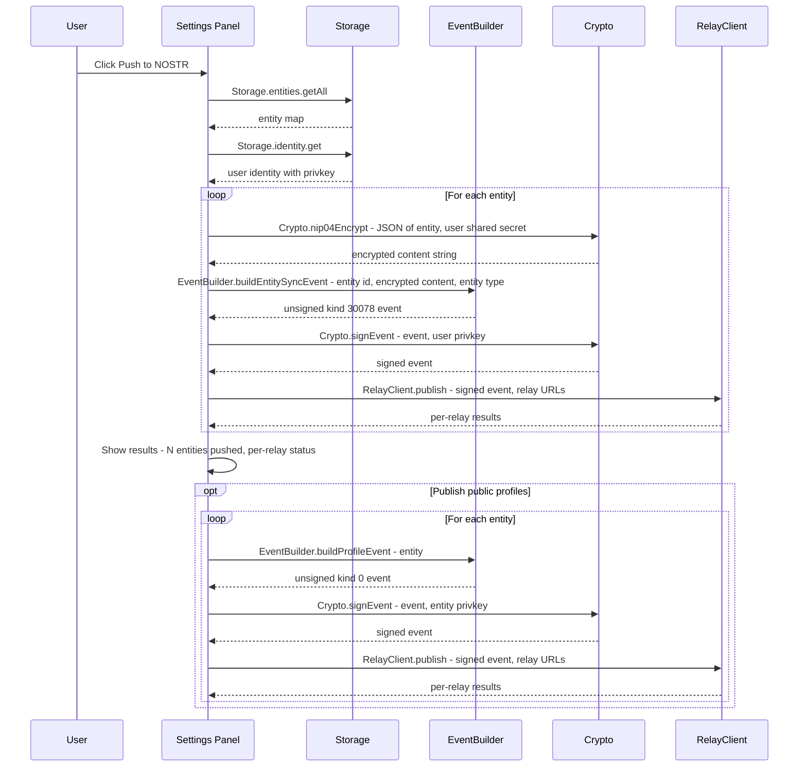
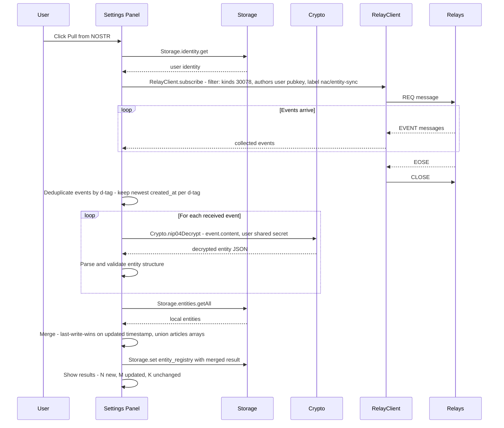
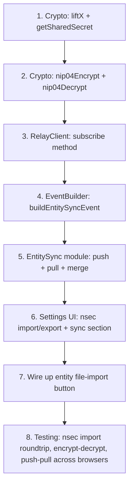

# Entity Sync Design — NOSTR Article Capture

## Overview

This document specifies how knowledge base entities (persons, organizations, places) are synchronized across browsers via NOSTR relays. The design addresses publishing encrypted entity data to relays, fetching it back on another browser, merging with local state, and optionally publishing public entity profiles.

---

## Current State Analysis

### What Exists

| Module | Relevant Capabilities |
|--------|----------------------|
| [`Crypto`](../nostr-article-capture.user.js:191) | secp256k1 key generation, BIP-340 Schnorr signing/verification, SHA-256, bech32 npub/nsec encoding/decoding |
| [`Storage.entities`](../nostr-article-capture.user.js:489) | `getAll()`, `get(id)`, `save(id, data)`, `delete(id)`, `search()`, `findByPubkey()`, `exportAll()`, `importAll()` |
| [`RelayClient`](../nostr-article-capture.user.js:1248) | WebSocket connect/disconnect, `publish(event, relayUrls)` with OK response handling |
| [`EventBuilder`](../nostr-article-capture.user.js:1355) | `buildArticleEvent()` (kind 30023), `buildProfileEvent()` (kind 0 — exists but never called) |
| [`Storage.identity`](../nostr-article-capture.user.js:469) | User keypair (pubkey/privkey/npub/nsec) stored in GM_setValue |

### What's Missing

| Gap | Impact |
|-----|--------|
| No ECDH shared secret derivation | Cannot encrypt to self per NIP-04 |
| No AES-256-CBC encrypt/decrypt | Cannot encrypt event content |
| No REQ/subscription in `RelayClient` | Cannot fetch events from relays |
| No EOSE handling | Cannot detect when relay has sent all matching events |
| Import button not wired | Settings UI has the button but no file-picker handler |

---

## Design Decisions

### 1. Event Kind Strategy — Dual Layer

Use **two complementary event kinds**:

| Layer | Kind | Purpose | Signed By | Content |
|-------|------|---------|-----------|---------|
| **Private sync** | **30078** (NIP-78) | Sync full entity data including private keys | User keypair | **Encrypted** JSON |
| **Public profile** | **0** (NIP-01) | Give entities a discoverable identity on NOSTR | Entity keypair | Public JSON (name, about) |

**Rationale:**

- **Kind 30078** (NIP-78: Application-Specific Data) is a parameterized replaceable event. Using entity ID as the `d` tag means each entity maps to exactly one event per user. Republishing overwrites the previous version on relays — perfect for sync.
- **Kind 0** is the standard profile metadata event. Publishing it from the entity's own keypair means any NOSTR client can resolve the entity's pubkey to a display name. This is already built in [`EventBuilder.buildProfileEvent()`](../nostr-article-capture.user.js:1433) but never called.
- The two layers are independent: kind 30078 handles cross-browser sync with encryption; kind 0 is optional and public.

### 2. Encryption — NIP-04 Encrypt-to-Self

Encrypt entity data using **NIP-04** (AES-256-CBC with ECDH shared secret), where the user encrypts to their own public key.

```
shared_secret = ECDH(user_privkey, user_pubkey) = point_multiply(user_privkey, user_pubkey_point).x
key = SHA-256(shared_secret)
ciphertext = AES-256-CBC(key, iv, plaintext)
content = base64(ciphertext) + "?iv=" + base64(iv)
```

**Rationale:**

- NIP-04 is simpler to implement and the script already has all secp256k1 point arithmetic needed (see [`_pointMultiply()`](../nostr-article-capture.user.js:104)).
- Encrypting to self means only the holder of the user's private key can decrypt — perfect for cross-browser sync where the same user imports their nsec on both browsers.
- NIP-44 would be preferable for inter-user messaging but is more complex (ChaCha20, padding, versioned payloads) and unnecessary for self-sync.
- The Web Crypto API provides `AES-CBC` natively — no external library needed.

**Why not strip private keys?** If we only synced public data, entities would need their keypairs regenerated on each new browser, breaking the identity continuity (different pubkeys = different NOSTR identity). Syncing the full entity including its private key preserves identity.

### 3. Sync Granularity — Per-Entity Events

Each entity is published as **one kind 30078 event** with `d` tag = entity ID.

**Rationale:**

- Parameterized replaceable events automatically deduplicate: publishing an updated entity replaces the old version on relays.
- Per-entity granularity means updating one entity doesn't re-publish all entities.
- Fetching is efficient: one REQ filter with `kinds: [30078]` and `authors: [user_pubkey]` retrieves all entities.
- Relay storage is bounded: N entities = N events maximum (replaceable semantics).

A **bulk event** alternative (all entities in one event) was rejected because: content size can exceed relay limits (typically 64KB–512KB per event), any single entity change re-publishes everything, and partial recovery is impossible if the event is corrupted.

### 4. Merge Strategy — Last-Write-Wins with Article Accumulation

```
for each entity_id in (local ∪ remote):
    if only in local  → keep local (publish later)
    if only in remote → import remote
    if in both:
        if remote.updated > local.updated → use remote
        if local.updated > remote.updated → keep local
        if equal → keep local (no-op)
    
    # Always: union the articles[] arrays (deduplicate by url)
```

**Rationale:**

- The `updated` field (Unix timestamp) already exists on every entity (set by [`Storage.entities.save()`](../nostr-article-capture.user.js:499) at line 503).
- Article references are additive — an entity tagged in an article on Browser A should retain that association even if Browser B has a newer timestamp for the entity name/metadata. So `articles[]` arrays are always merged (union by URL).
- No conflict resolution UI is needed for v1. The timestamp-based approach is deterministic and simple.

### 5. Subscription Mechanism — REQ with EOSE

Add a `subscribe()` method to [`RelayClient`](../nostr-article-capture.user.js:1248) that sends a REQ message and collects events until EOSE (End of Stored Events):

```
→ ["REQ", "<subscription_id>", { kinds: [30078], authors: ["<user_pubkey>"], "#d": [...] }]
← ["EVENT", "<subscription_id>", <event>]   // 0..N times
← ["EOSE", "<subscription_id>"]              // signals completion
→ ["CLOSE", "<subscription_id>"]             // cleanup
```

**Timeout:** 10 seconds after last received event or 15 seconds total, whichever comes first.

---

## NOSTR Event Structures

### Kind 30078 — Encrypted Entity Sync Event

```json
{
  "kind": 30078,
  "pubkey": "<user_hex_pubkey>",
  "created_at": 1707350400,
  "tags": [
    ["d", "<entity_id>"],
    ["client", "nostr-article-capture"],
    ["entity-type", "person"],
    ["L", "nac/entity-sync"],
    ["l", "v1", "nac/entity-sync"]
  ],
  "content": "<NIP-04 encrypted JSON>",
  "id": "<event_hash>",
  "sig": "<schnorr_signature>"
}
```

**Tag Descriptions:**

| Tag | Purpose |
|-----|---------|
| `d` | Entity ID — makes this a parameterized replaceable event. One event per entity per user. |
| `client` | Identifies the source application |
| `entity-type` | Unencrypted hint for filtering (person/organization/place). Not sensitive. |
| `L` / `l` | NIP-32 label namespace for app-specific categorization and versioning |

**Encrypted Content Structure (before encryption):**

```json
{
  "id": "entity_a1b2c3d4",
  "type": "person",
  "name": "Larry Summers",
  "aliases": ["Lawrence Summers", "Lawrence H. Summers"],
  "keypair": {
    "pubkey": "ab12...ef56",
    "privkey": "cd34...gh78",
    "npub": "npub1...",
    "nsec": "nsec1..."
  },
  "created_by": "<user_pubkey>",
  "created_at": 1707350400,
  "articles": [
    {
      "url": "https://example.com/article",
      "title": "Example Article",
      "context": "mentioned",
      "tagged_at": 1707350400
    }
  ],
  "metadata": {},
  "updated": 1707350500
}
```

### Kind 0 — Public Entity Profile Event

```json
{
  "kind": 0,
  "pubkey": "<entity_hex_pubkey>",
  "created_at": 1707350400,
  "tags": [],
  "content": "{\"name\":\"Larry Summers\",\"about\":\"Person entity created by nostr-article-capture\"}",
  "id": "<event_hash>",
  "sig": "<schnorr_signature>"
}
```

This is signed with the **entity's own private key**. Already implemented in [`EventBuilder.buildProfileEvent()`](../nostr-article-capture.user.js:1433).

---

## Encryption Scheme

### ECDH Shared Secret (encrypt-to-self)

```
1. user_privkey_scalar = BigInt('0x' + user_privkey_hex)
2. user_pubkey_point   = lift_x(user_pubkey_hex)  // recover (x, y) from x-only pubkey
3. shared_point        = point_multiply(user_privkey_scalar, user_pubkey_point)
4. shared_secret       = shared_point.x  // 32 bytes, hex-encoded
```

**Note:** `lift_x()` requires recovering the even-y point from an x-only pubkey. The codebase already has the modular exponentiation needed (see [`_modPow()`](../nostr-article-capture.user.js:420) used in [`Crypto.verifySignature()`](../nostr-article-capture.user.js:367) for point decompression).

### AES-256-CBC Encryption

```javascript
async function nip04Encrypt(plaintext, sharedSecretHex) {
    const key = await crypto.subtle.importKey(
        'raw',
        Crypto.hexToBytes(sharedSecretHex),
        { name: 'AES-CBC' },
        false,
        ['encrypt']
    );
    const iv = crypto.getRandomValues(new Uint8Array(16));
    const encoded = new TextEncoder().encode(plaintext);
    const ciphertext = await crypto.subtle.encrypt(
        { name: 'AES-CBC', iv },
        key,
        encoded
    );
    // NIP-04 format: base64(ciphertext) + "?iv=" + base64(iv)
    return btoa(String.fromCharCode(...new Uint8Array(ciphertext)))
        + '?iv='
        + btoa(String.fromCharCode(...iv));
}
```

### AES-256-CBC Decryption

```javascript
async function nip04Decrypt(payload, sharedSecretHex) {
    const [ciphertextB64, ivB64] = payload.split('?iv=');
    const ciphertext = Uint8Array.from(atob(ciphertextB64), c => c.charCodeAt(0));
    const iv = Uint8Array.from(atob(ivB64), c => c.charCodeAt(0));
    
    const key = await crypto.subtle.importKey(
        'raw',
        Crypto.hexToBytes(sharedSecretHex),
        { name: 'AES-CBC' },
        false,
        ['decrypt']
    );
    const decrypted = await crypto.subtle.decrypt(
        { name: 'AES-CBC', iv },
        key,
        ciphertext
    );
    return new TextDecoder().decode(decrypted);
}
```

---

## Publish Flow (Push Entities to NOSTR)



### Step-by-Step

1. User clicks **"Push to NOSTR"** in the Settings panel
2. Load all entities from `Storage.entities.getAll()`
3. Load user identity from `Storage.identity.get()` — must have `privkey`
4. Derive ECDH shared secret (user privkey × user pubkey point)
5. For each entity:
   a. Serialize entity to JSON
   b. Encrypt with NIP-04 using shared secret
   c. Build kind 30078 event with `d` tag = entity ID
   d. Sign with user's private key (BIP-340 Schnorr)
   e. Publish to all enabled write-relays
6. Collect and display results (success/failure per relay per entity)
7. Optionally publish kind 0 profile events (signed with each entity's own keypair)

---

## Fetch/Sync Flow (Pull Entities from NOSTR)



### Step-by-Step

1. User clicks **"Pull from NOSTR"** in the Settings panel
2. Load user identity — must have `privkey` for decryption
3. Construct REQ filter:
   ```json
   {
     "kinds": [30078],
     "authors": ["<user_hex_pubkey>"],
     "#L": ["nac/entity-sync"]
   }
   ```
4. Send REQ to all enabled read-relays via `RelayClient.subscribe()`
5. Collect EVENT responses until EOSE or timeout (15s)
6. Send CLOSE to clean up subscription
7. Deduplicate across relays: for same `d` tag, keep event with highest `created_at`
8. Derive ECDH shared secret
9. For each event:
   a. Decrypt content with NIP-04
   b. Parse JSON, validate entity structure (must have id, type, name, keypair)
   c. Compare with local entity (if exists) using `updated` timestamp
   d. Merge articles arrays (union by URL)
   e. Keep whichever version has higher `updated`; if remote-only, import
10. Save merged registry to `Storage.set('entity_registry', merged)`
11. Display results: N new entities imported, M updated, K unchanged

---

## Merge Strategy Detail

### Conflict Resolution Rules

```
Given: local entity L, remote entity R (same entity ID)

1. If R.updated > L.updated:
   → Use R for all scalar fields (name, aliases, type, metadata, keypair)
   → articles = deduplicate(L.articles ∪ R.articles) by url

2. If L.updated > R.updated:
   → Keep L for all scalar fields
   → articles = deduplicate(L.articles ∪ R.articles) by url

3. If L.updated === R.updated:
   → Keep L (no-op for scalar fields)
   → articles = deduplicate(L.articles ∪ R.articles) by url
```

### Article Deduplication

```javascript
function mergeArticles(localArticles, remoteArticles) {
    const byUrl = new Map();
    for (const a of [...localArticles, ...remoteArticles]) {
        const existing = byUrl.get(a.url);
        if (!existing || a.tagged_at > existing.tagged_at) {
            byUrl.set(a.url, a);
        }
    }
    return Array.from(byUrl.values());
}
```

---

## UI Design

### Prerequisite: Identity Import (nsec)

The current identity setup in [`ReaderView.showSettings()`](../nostr-article-capture.user.js:1822) only offers two paths:

1. **Connect NIP-07** — gets pubkey from browser extension, no private key exposed
2. **Generate New Keypair** — creates a fresh keypair

Neither path allows a user to bring an existing identity to a new browser. This is a **prerequisite for cross-browser sync**: the user on Browser B must have the same private key used on Browser A to decrypt entity sync events.

**Add a third option: "Import nsec"** — a text input where the user pastes their `nsec1...` string. The script decodes it using the existing [`Crypto.nsecToHex()`](../nostr-article-capture.user.js:265) to recover the private key, derives the public key via [`Crypto.getPublicKey()`](../nostr-article-capture.user.js:216), and stores the full identity.

**Identity setup UI when NO identity is configured:**

```
┌─────────────────────────────────────┐
│  User Identity                      │
│                                     │
│  [Connect NIP-07 Extension]         │
│  [Generate New Keypair]             │
│                                     │
│  ── or import existing ──           │
│  ┌────────────────────────────────┐ │
│  │ nsec1...                       │ │
│  └────────────────────────────────┘ │
│  [Import Private Key]               │
│                                     │
│  ⚠ Your nsec is stored locally in  │
│  Tampermonkey storage. It never     │
│  leaves your browser unencrypted.   │
└─────────────────────────────────────┘
```

**Import nsec flow:**

1. User pastes `nsec1...` into text input
2. Click "Import Private Key"
3. Validate: decode with [`Crypto.nsecToHex()`](../nostr-article-capture.user.js:265) — must return 64-char hex string
4. Derive pubkey: [`Crypto.getPublicKey(privkeyHex)`](../nostr-article-capture.user.js:216)
5. Store identity:
   ```javascript
   await Storage.identity.set({
       pubkey,
       privkey: privkeyHex,
       npub: Crypto.hexToNpub(pubkey),
       nsec: nsecInput,  // original bech32
       signer_type: 'local',
       created_at: Math.floor(Date.now() / 1000)
   });
   ```
6. Show success toast: "Identity imported — you can now sync entities"

**Identity display when identity IS configured with privkey — add nsec export:**

```
┌─────────────────────────────────────┐
│  User Identity                      │
│  Public Key: npub1abc...            │
│  Signer: local                      │
│  [Show nsec] [Copy nsec]            │
│  [Clear Identity]                   │
│                                     │
│  ⚠ Copy your nsec to import on     │
│  another browser for entity sync.   │
└─────────────────────────────────────┘
```

"Show nsec" reveals the `nsec1...` string (hidden by default for security). "Copy nsec" copies to clipboard. This gives users a clear path: **export nsec on Browser A → import nsec on Browser B → Pull from NOSTR**.

### Settings Panel — Full Layout with Entity Sync

Add an **"Entity Sync"** section to the existing settings panel ([`ReaderView.showSettings()`](../nostr-article-capture.user.js:1761)) between the "Entity Registry" export/import buttons and the version display:

```
┌─────────────────────────────────────────────┐
│  ⚙ Settings                            [×]  │
├─────────────────────────────────────────────┤
│                                             │
│  User Identity                              │
│  ┌─────────────────────────────────────┐    │
│  │ Public Key: npub1abc...             │    │
│  │ Signer: local                       │    │
│  │ [Show nsec] [Copy nsec]             │    │
│  │ [Clear Identity]                    │    │
│  │                                     │    │
│  │ ⚠ Copy your nsec to import on      │    │
│  │ another browser for entity sync.    │    │
│  └─────────────────────────────────────┘    │
│                                             │
│  Relays                                     │
│  ☑ wss://relay.damus.io                     │
│  ☑ wss://nos.lol                            │
│  ☑ wss://relay.nostr.band                   │
│  [Add Relay]                                │
│                                             │
│  Entity Registry                            │
│  [Export Entities]  [Import Entities]        │
│                                             │
│  ─── Entity Sync ──────────────────────     │
│  ┌─────────────────────────────────────┐    │
│  │ 🔄 Sync entities across browsers    │    │
│  │ via encrypted NOSTR events.         │    │
│  │                                     │    │
│  │ ☑ Also publish entity profiles      │    │
│  │   (kind 0 — public name only)       │    │
│  │                                     │    │
│  │ [⬆ Push to NOSTR] [⬇ Pull from NOSTR] │  │
│  │                                     │    │
│  │ ┌─ Status ────────────────────────┐ │    │
│  │ │ (status messages appear here)   │ │    │
│  │ └────────────────────────────────┘ │    │
│  └─────────────────────────────────────┘    │
│                                             │
│  Version 2.0.0                              │
└─────────────────────────────────────────────┘
```

### Status Messages During Operations

**Push flow:**
```
⏳ Encrypting 12 entities...
⏳ Publishing entity 3/12: Larry Summers...
✓ Published 12 entities to 3 relays
  ✓ wss://relay.damus.io: 12/12
  ✓ wss://nos.lol: 12/12
  ⚠ wss://relay.nostr.band: 11/12 (1 rejected)
```

**Pull flow:**
```
⏳ Fetching from 3 relays...
⏳ Received 15 events, decrypting...
✓ Sync complete:
  3 new entities imported
  5 entities updated (newer remote)
  4 entities unchanged
  3 entities kept (newer local)
```

### Error States

| Condition | UI Response |
|-----------|-------------|
| No user identity configured | Show warning: "Set up identity first" with disabled sync buttons. Show identity setup UI with Import nsec option. |
| No private key (NIP-07 only) | Show warning: "Entity sync requires a local private key. Import your nsec below or generate a new keypair." with Import nsec input field visible. |
| Invalid nsec on import | Show error: "Invalid nsec format. Must start with nsec1..." — do not store anything. |
| All relays fail on push | Show error per relay, enable retry |
| No events found on pull | Show info: "No entity sync events found on relays for this identity" |
| Decryption fails for an event | Skip that event, log warning, continue with others |
| Invalid JSON after decryption | Skip that event, log warning, continue with others |

---

## Error Handling

### Encryption Errors

- If ECDH shared secret derivation fails (invalid key), abort the entire operation and show an error.
- If AES encryption fails for a single entity, skip it, log the error, continue with remaining entities.

### Network Errors

- Relay connection failures are per-relay. If all relays fail, show aggregate error.
- Use the existing 5-second timeout per relay from [`RelayClient.publish()`](../nostr-article-capture.user.js:1311).
- For subscriptions, use 15-second total timeout with 10-second inactivity timeout (no events received).

### Data Validation on Pull

After decryption, validate each entity before merging:

```javascript
function validateEntity(entity) {
    return entity
        && typeof entity.id === 'string'
        && typeof entity.name === 'string'
        && ['person', 'organization', 'place'].includes(entity.type)
        && entity.keypair
        && typeof entity.keypair.pubkey === 'string'
        && entity.keypair.pubkey.length === 64
        && typeof entity.updated === 'number';
}
```

Invalid entities are skipped with a warning toast.

---

## Implementation Plan

### New Module: `EntitySync`

Add a new Section between [`EventBuilder`](../nostr-article-capture.user.js:1355) (Section 8) and [`ReaderView`](../nostr-article-capture.user.js:1452) (Section 9):

```
SECTION 8.5: ENTITY SYNC
```

### Changes by Module

#### 1. `Crypto` Module — Add NIP-04 Encryption

**File:** [`nostr-article-capture.user.js`](../nostr-article-capture.user.js) — Section 2 (around line 416)

Add these methods to the `Crypto` object:

| Method | Purpose |
|--------|---------|
| `Crypto.liftX(pubkeyHex)` | Recover (x, y) point from x-only pubkey (even y). Uses existing `_modPow()`. |
| `Crypto.getSharedSecret(privkeyHex, pubkeyHex)` | ECDH: multiply privkey scalar by pubkey point, return x-coordinate as hex. |
| `Crypto.nip04Encrypt(plaintext, sharedSecretHex)` | AES-256-CBC encrypt, return NIP-04 formatted string. Uses Web Crypto API. |
| `Crypto.nip04Decrypt(ciphertext, sharedSecretHex)` | AES-256-CBC decrypt from NIP-04 formatted string. Uses Web Crypto API. |

#### 2. `RelayClient` Module — Add Subscription Support

**File:** [`nostr-article-capture.user.js`](../nostr-article-capture.user.js) — Section 7 (around line 1343)

Add this method:

| Method | Purpose |
|--------|---------|
| `RelayClient.subscribe(filter, relayUrls, options)` | Send REQ, collect EVENTs, resolve on EOSE or timeout. Returns array of events. Options: `{ timeout: 15000, idleTimeout: 10000 }` |

**Implementation sketch:**

```javascript
subscribe: async (filter, relayUrls, options = {}) => {
    const timeout = options.timeout || 15000;
    const idleTimeout = options.idleTimeout || 10000;
    const events = [];
    const subId = Crypto.bytesToHex(crypto.getRandomValues(new Uint8Array(8)));
    
    for (const url of relayUrls) {
        try {
            const ws = await RelayClient.connect(url);
            ws.send(JSON.stringify(['REQ', subId, filter]));
            
            await new Promise((resolve) => {
                let idleTimer = setTimeout(resolve, idleTimeout);
                const totalTimer = setTimeout(resolve, timeout);
                
                const handler = (e) => {
                    const data = JSON.parse(e.data);
                    if (data[0] === 'EVENT' && data[1] === subId) {
                        events.push(data[2]);
                        clearTimeout(idleTimer);
                        idleTimer = setTimeout(resolve, idleTimeout);
                    } else if (data[0] === 'EOSE' && data[1] === subId) {
                        clearTimeout(idleTimer);
                        clearTimeout(totalTimer);
                        ws.removeEventListener('message', handler);
                        resolve();
                    }
                };
                ws.addEventListener('message', handler);
            });
            
            ws.send(JSON.stringify(['CLOSE', subId]));
        } catch (e) {
            console.error('[NAC RelayClient] Subscribe error:', url, e);
        }
    }
    
    return events;
}
```

#### 3. `EventBuilder` Module — Add Entity Sync Event Builder

**File:** [`nostr-article-capture.user.js`](../nostr-article-capture.user.js) — Section 8 (around line 1445)

Add this method:

| Method | Purpose |
|--------|---------|
| `EventBuilder.buildEntitySyncEvent(entityId, encryptedContent, entityType, userPubkey)` | Build kind 30078 event with appropriate tags |

#### 4. New `EntitySync` Module

**File:** [`nostr-article-capture.user.js`](../nostr-article-capture.user.js) — New Section 8.5

| Method | Purpose |
|--------|---------|
| `EntitySync.push(options)` | Encrypt and publish all entities to relays. Options: `{ publishProfiles: false, onProgress: fn }` |
| `EntitySync.pull(options)` | Fetch, decrypt, validate, and merge entities from relays. Options: `{ onProgress: fn }` |
| `EntitySync.mergeEntities(local, remote)` | Apply merge strategy: last-write-wins + article union |
| `EntitySync.validateEntity(entity)` | Validate entity structure after decryption |

#### 5. `ReaderView.showSettings()` — Add Identity Import + Sync UI

**File:** [`nostr-article-capture.user.js`](../nostr-article-capture.user.js) — Section 9 (around line 1803)

Changes:
- **Identity setup (no identity):** Add nsec text input + "Import Private Key" button alongside existing NIP-07 and Generate options
- **Identity display (has identity with privkey):** Add "Show nsec" / "Copy nsec" buttons with security hint about cross-browser usage
- **Entity Sync section:** Add sync UI with Push/Pull buttons and status area
- Wire up all event handlers

#### 6. `Storage.entities` — Add Sync Metadata

**File:** [`nostr-article-capture.user.js`](../nostr-article-capture.user.js) — Section 3 (around line 562)

Add:

| Method | Purpose |
|--------|---------|
| `Storage.entities.getLastSyncTime()` | Get timestamp of last successful sync |
| `Storage.entities.setLastSyncTime(timestamp)` | Store timestamp after successful sync |

Uses GM key `"entity_last_sync"`.

### Implementation Order



### Estimated Scope

| Change | Lines of Code |
|--------|---------------|
| `Crypto` additions (liftX, ECDH, NIP-04) | ~80 |
| `RelayClient.subscribe()` | ~50 |
| `EventBuilder.buildEntitySyncEvent()` | ~20 |
| `EntitySync` module | ~150 |
| Settings UI: nsec import/export | ~50 |
| Settings UI: entity sync section | ~80 |
| Storage sync metadata | ~15 |
| **Total** | **~445** |

The existing codebase is ~2,545 lines, so this represents a ~17% increase — well within the "no major refactoring" constraint.

---

## Security Considerations

1. **Private keys in encrypted events**: Entity private keys are NIP-04 encrypted. Only the holder of the user's private key can decrypt them. Relay operators cannot read the content.

2. **NIP-04 limitations**: NIP-04 is considered deprecated in favor of NIP-44 for new applications, but for encrypt-to-self (no inter-user messaging), the known weaknesses (no padding, CBC mode) are acceptable. The threat model is relay operator snooping, not active MITM.

3. **User private key requirement**: Entity sync requires the user's private key to be available locally. Users who only use NIP-07 (browser extension) without exposing their private key cannot use entity sync. The UI provides an "Import nsec" option so users can paste their private key from another source (e.g., their NOSTR key manager, another browser, or a backup). The nsec is stored in Tampermonkey's GM_setValue — it never leaves the browser unencrypted.

6. **nsec handling in UI**: The nsec is hidden by default in the identity display. "Show nsec" toggles visibility. "Copy nsec" copies to clipboard. Both actions are intentional user gestures to minimize accidental exposure.

4. **Kind 0 profile events are public**: Publishing entity profiles (kind 0) only exposes the entity's name and type — never private keys. This is optional and controlled by a checkbox.

5. **No relay-side access control**: Any relay can store/serve these events. Security relies entirely on the encryption, not relay trust.

---

## Future Enhancements (Out of Scope for v1)

- **NIP-44 encryption**: Upgrade to NIP-44 for stronger encryption (ChaCha20-Poly1305, padded)
- **Selective sync**: Push/pull individual entities instead of all-or-nothing
- **Auto-sync**: Periodically pull from relays on script load (configurable)
- **Multi-user sharing**: Encrypt entities to another user's pubkey for collaborative knowledge bases
- **Conflict resolution UI**: Show diff when timestamps are equal but content differs
- **Entity deletion propagation**: Publish a "tombstone" event to signal deletion across browsers
