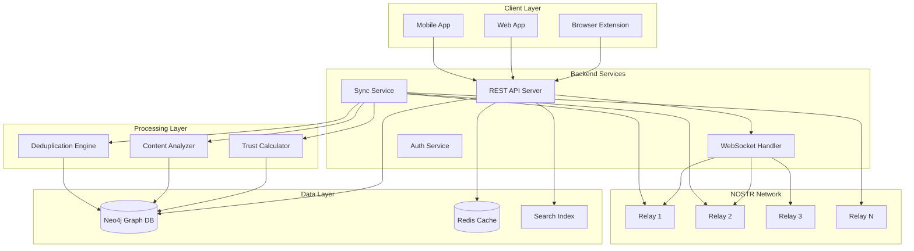
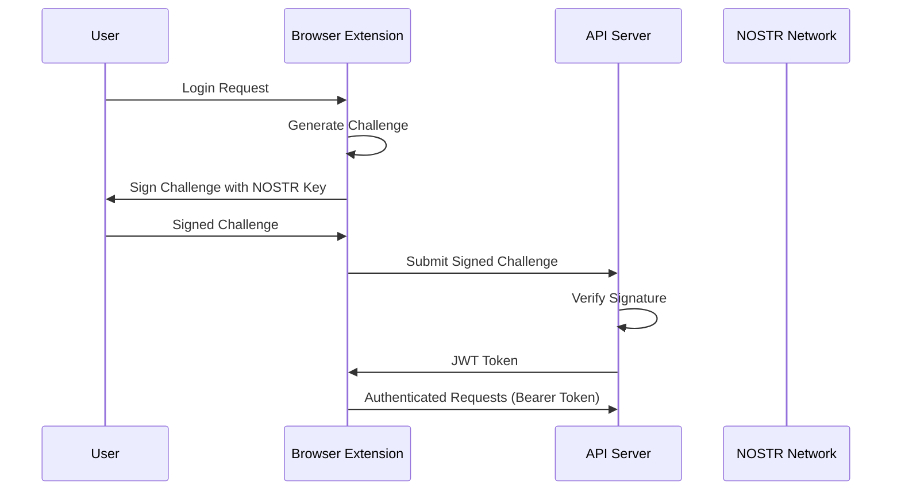
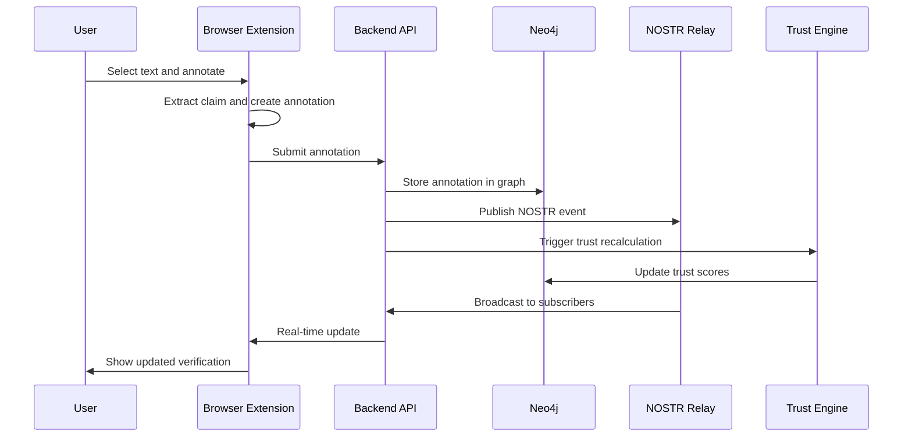

# Decentralized News Verification System - Architecture

## System Overview

This document outlines the complete technical architecture for a decentralized news verification system that leverages NOSTR for data distribution, Neo4j for graph relationships, and browser extensions for user interaction.



## Core Components

### 1. NOSTR Network Layer

#### Relay Configuration
- **Public Relays**: For general content distribution
- **Specialized Relays**: Focus on specific content types or regions
- **Private Relays**: For sensitive or paid content
- **Backup Strategy**: Multi-relay redundancy with conflict resolution

#### Event Types and Routing
```javascript
const EVENT_ROUTING = {
  10001: 'content-annotation', // Fact checks and annotations
  10002: 'entity-definition',  // Entity definitions and updates
  10003: 'relationship',       // Entity relationships
  10004: 'trust-signal',       // Trust and reputation updates
  10005: 'user-profile',       // User profiles and expertise
  10006: 'content-report'      // Content reports and flags
};
```

#### Relay Selection Strategy
- **Geographic proximity** for reduced latency
- **Content specialization** based on topics
- **Reliability scoring** based on uptime and performance
- **Load balancing** across multiple relays

### 2. Backend Architecture

#### API Gateway (`api-server/`)
**Technology**: Node.js + Express + TypeScript
**Responsibilities**:
- RESTful API endpoints for client applications
- Authentication and authorization
- Rate limiting and request validation
- Response caching and optimization

**Key Endpoints**:
```typescript
// Content verification endpoints
GET  /api/v1/content/:url/verifications
POST /api/v1/content/:url/annotate
GET  /api/v1/claims/:claimHash/status

// Trust network endpoints
GET  /api/v1/users/:pubkey/trust-score
POST /api/v1/users/endorse
GET  /api/v1/trust-network/:pubkey

// Search and discovery
GET  /api/v1/search/content
GET  /api/v1/search/entities
GET  /api/v1/trending/topics
```

#### NOSTR Synchronization Service (`sync-service/`)
**Technology**: Node.js + nostr-tools
**Responsibilities**:
- Real-time event synchronization from relays
- Event validation and deduplication
- Graph database updates
- Trust score recalculation triggers

#### Trust Calculation Engine (`trust-engine/`)
**Technology**: Python + NetworkX + NumPy
**Responsibilities**:
- Multi-dimensional trust scoring
- Reputation propagation algorithms
- Domain-specific expertise tracking
- Fraud and spam detection

#### Content Analysis Pipeline (`content-analyzer/`)
**Technology**: Python + spaCy + transformers
**Responsibilities**:
- Claim extraction from text
- Entity recognition and linking
- Sentiment and bias analysis
- Fact-checkable statement identification

### 3. Data Storage Architecture

#### Graph Database (Neo4j)
**Purpose**: Store entities, relationships, and trust networks
**Schema**:
```cypher
// Node types
(:Content {url, title, published_date, content_hash})
(:Claim {text, claim_hash, confidence_score})
(:Entity {name, type, canonical_id})
(:User {nostr_pubkey, trust_score, reputation})
(:Annotation {verdict, confidence, evidence})

// Relationship types
(:Content)-[:CONTAINS]->(:Claim)
(:User)-[:ANNOTATES {timestamp, confidence}]->(:Claim)
(:Claim)-[:SUPPORTS|CONTRADICTS {strength}]->(:Claim)
(:User)-[:ENDORSES {domain, timestamp}]->(:User)
(:Entity)-[:MENTIONED_IN]->(:Content)
```

#### Redis Cache
**Purpose**: Fast access to frequently requested data
**Structure**:
```
trust_scores:{pubkey} -> {overall: 8.5, domains: {politics: 9.1}}
claim_verifications:{claim_hash} -> {count: 15, avg_confidence: 0.83}
user_activity:{pubkey}:recent -> [list of recent annotation IDs]
content_metadata:{url_hash} -> {title, description, entities[]}
```

#### Search Index (Elasticsearch)
**Purpose**: Full-text search across content and annotations
**Indices**:
- `content_index`: News articles, posts, media
- `annotation_index`: Fact checks and annotations
- `entity_index`: People, organizations, concepts
- `user_index`: User profiles and expertise

### 4. Security Architecture

#### Authentication Flow


#### Data Integrity
- **Content Hashing**: SHA-256 hashes for tamper detection
- **Event Signatures**: NOSTR cryptographic signatures
- **Merkle Trees**: For batch verification of large datasets
- **Audit Trails**: Immutable logs of all system changes

#### Privacy Protection
- **Pseudonymous Operation**: NOSTR public keys as identities
- **Selective Disclosure**: Users control what data is shared
- **Local Processing**: Sensitive analysis done client-side
- **Encrypted Storage**: Private keys and sensitive data encrypted

### 5. Scalability Design

#### Horizontal Scaling
- **Microservices Architecture**: Independent scaling of components
- **Load Balancing**: Distribute traffic across multiple instances
- **Database Sharding**: Partition data across multiple Neo4j instances
- **CDN Integration**: Cache static content globally

#### Performance Optimization
- **Connection Pooling**: Efficient database connections
- **Query Optimization**: Indexed queries with caching
- **Batch Processing**: Group operations for efficiency
- **Lazy Loading**: Load data on demand

#### Resource Management
```yaml
# Kubernetes deployment configuration
resources:
  api-server:
    requests: {cpu: "200m", memory: "512Mi"}
    limits: {cpu: "1", memory: "2Gi"}
  sync-service:
    requests: {cpu: "100m", memory: "256Mi"}
    limits: {cpu: "500m", memory: "1Gi"}
  trust-engine:
    requests: {cpu: "500m", memory: "1Gi"}
    limits: {cpu: "2", memory: "4Gi"}
```

### 6. Development and Deployment

#### Technology Stack
- **Frontend**: TypeScript, React, WebExtensions API
- **Backend**: Node.js, Express, Python, FastAPI
- **Database**: Neo4j, Redis, Elasticsearch
- **Message Queue**: Redis Pub/Sub, Bull Queue
- **Monitoring**: Prometheus, Grafana, Sentry
- **Deployment**: Docker, Kubernetes, GitHub Actions

#### Project Structure
```
fact-check-network/
├── browser-extension/          # Browser extension code
│   ├── src/
│   │   ├── content/           # Content scripts
│   │   ├── background/        # Background/service worker
│   │   ├── popup/            # Extension popup UI
│   │   └── options/          # Settings page
│   └── manifest.json
├── backend/
│   ├── api-server/           # REST API service
│   ├── sync-service/         # NOSTR synchronization
│   ├── trust-engine/         # Trust calculation
│   └── content-analyzer/     # NLP processing
├── shared/
│   ├── types/               # TypeScript definitions
│   ├── schemas/             # Data validation schemas
│   └── utils/               # Shared utilities
├── database/
│   ├── neo4j/              # Graph database setup
│   └── migrations/         # Database migrations
└── infrastructure/
    ├── docker/             # Container definitions
    ├── kubernetes/         # K8s deployment configs
    └── monitoring/         # Observability stack
```

## Data Flow Architecture

### Annotation Creation Flow


### Trust Score Calculation
```python
def calculate_trust_score(user_pubkey, domain=None):
    """Multi-dimensional trust score calculation"""
    
    # Base metrics
    historical_accuracy = get_accuracy_score(user_pubkey, domain)
    peer_endorsements = get_endorsement_score(user_pubkey, domain)
    activity_consistency = get_consistency_score(user_pubkey, domain)
    source_diversity = get_source_diversity_score(user_pubkey, domain)
    
    # Network effects
    network_trust = calculate_network_trust(user_pubkey, domain)
    
    # Weighted combination
    trust_score = (
        historical_accuracy * 0.35 +
        peer_endorsements * 0.25 +
        network_trust * 0.20 +
        activity_consistency * 0.10 +
        source_diversity * 0.10
    )
    
    return min(max(trust_score, 0.0), 10.0)
```

## Quality Assurance

### Testing Strategy
- **Unit Tests**: Component-level testing with Jest/pytest
- **Integration Tests**: End-to-end API testing
- **Browser Tests**: Extension testing with Playwright
- **Load Tests**: Performance testing with k6
- **Security Tests**: Vulnerability scanning and penetration testing

### Monitoring and Observability
- **Application Metrics**: Response times, error rates, throughput
- **Business Metrics**: Annotation quality, trust network growth
- **Infrastructure Metrics**: Resource usage, database performance
- **Alerting**: Automated alerts for system anomalies

This architecture provides a robust, scalable foundation for building a decentralized news verification network that can grow and adapt while maintaining security and performance.