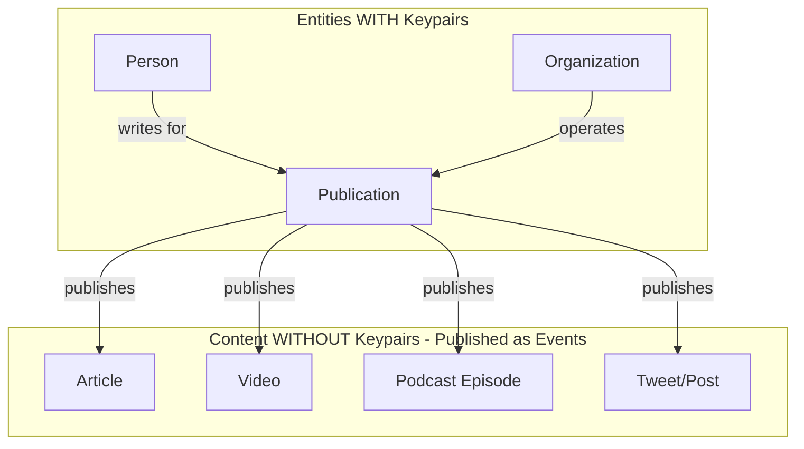
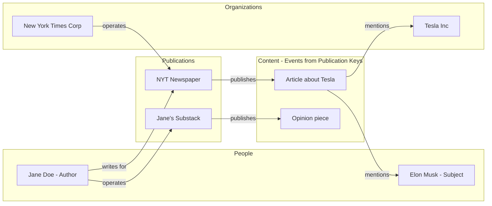
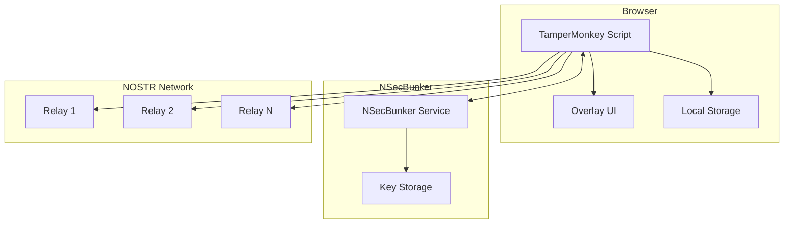
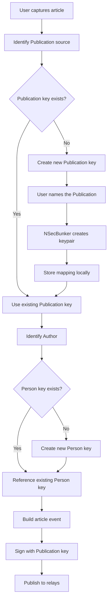
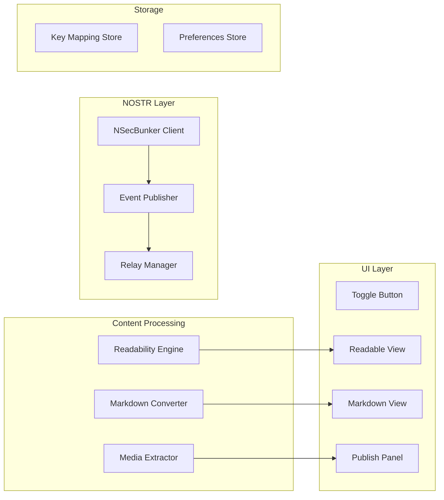

# TamperMonkey Article Capture & NOSTR Publishing Script

> **Note**: This is the original v1 planning document. The v2 implementation diverged significantly — NSecBunker was removed in favor of embedded BIP-340 Schnorr signing, the Publication entity type was folded into Organization, and the UI changed from an overlay panel to a full-page reader view. See [`plans/v2-redesign-plan.md`](../plans/v2-redesign-plan.md) for the current design. This document is retained as historical reference.

## Overview

This document outlines the architecture and implementation plan for a TamperMonkey script that enables users to:
1. Convert web articles to a clean, readable format (Readability-style)
2. Toggle between readable HTML and Markdown views
3. Capture and publish articles to NOSTR using NSecBunker for key management
4. Manage multiple NOSTR identities for different entity types

## Revised Entity Model

### Key Insight: Publications Own Content

Content (articles, posts, videos, etc.) does **not** get its own NOSTR keypair. Instead, content is published as events **from** a Publication's keypair. This mirrors how content actually works in the real world.

### Entity Types and Keypairs



### Entity Definitions

| Entity Type | Gets Keypair? | Description | Examples |
|-------------|---------------|-------------|----------|
| **Person** | ✅ Yes | An individual human | Author, journalist, subject of article |
| **Organization** | ✅ Yes | A company, institution, or group | NYT Corp, Tesla Inc, MIT |
| **Publication** | ✅ Yes | A content channel/outlet | NYT newspaper, Substack blog, Twitter account, podcast |
| **Content** | ❌ No | Individual pieces of content | Article, video, tweet, podcast episode |

### Relationships



### Publication Examples

| Publication Type | Example | Notes |
|------------------|---------|-------|
| Newspaper/Magazine | New York Times, The Atlantic | Organization-operated |
| Blog | Jane's Substack, Personal WordPress | Person-operated |
| Social Account | @elonmusk on Twitter | Person-operated |
| Podcast | The Joe Rogan Experience | Can be Person or Org |
| YouTube Channel | Veritasium | Can be Person or Org |
| Instagram | @natgeo | Organization-operated |

---

## System Architecture



## Part 1: NSecBunker Setup

### What is NSecBunker?

NSecBunker is a secure key management solution for NOSTR that keeps private keys separate from client applications. It allows you to:
- Store multiple NOSTR private keys securely
- Authorize applications to sign events without exposing keys
- Manage permissions for different applications
- Create and manage multiple identities

### Installation Options

#### Option A: Docker Installation (Recommended)

```bash
# Create a directory for nsecbunker
mkdir ~/nsecbunker && cd ~/nsecbunker

# Create docker-compose.yml
cat > docker-compose.yml << 'EOF'
version: '3.8'
services:
  nsecbunker:
    image: ghcr.io/kind-0/nsecbunker:latest
    container_name: nsecbunker
    ports:
      - "5454:5454"
    volumes:
      - ./data:/app/data
    environment:
      - NSECBUNKER_PORT=5454
    restart: unless-stopped
EOF

# Start the service
docker-compose up -d
```

#### Option B: NPM Installation

```bash
# Install globally
npm install -g nsecbunker

# Or run with npx
npx nsecbunker
```

#### Option C: Build from Source

```bash
# Clone the repository
git clone https://github.com/kind-0/nsecbunker.git
cd nsecbunker

# Install dependencies
npm install

# Build and run
npm run build
npm start
```

### Initial Configuration

1. **Start NSecBunker** on default port 5454:
   ```bash
   nsecbunker --port 5454
   ```

2. **Access the Admin Interface**: Open `http://localhost:5454` in your browser

3. **Create Master Password**: Set a strong master password for encrypting keys

4. **Add Initial Keys**: You can:
   - Generate new keys within NSecBunker
   - Import existing nsec keys

---

## Part 2: Key Creation Workflow

### When to Create Keys

| Scenario | Create Key For | Identifier Pattern |
|----------|----------------|-------------------|
| Capturing article from new publication | Publication | `pub-{domain}` or `pub-{slug}` |
| Identifying an author | Person | `person-{name-slug}` |
| Identifying a subject (person) | Person | `person-{name-slug}` |
| Identifying an organization mentioned | Organization | `org-{name-slug}` |
| New social media account encountered | Publication | `pub-twitter-{handle}` |

### Key Creation Flow



### Naming Conventions

```javascript
// Publication identifiers
const pubId = `pub-${slugify(siteName)}`;           // pub-new-york-times
const blogId = `pub-substack-${slugify(blogName)}`; // pub-substack-stratechery
const twitterId = `pub-twitter-${handle}`;          // pub-twitter-elonmusk
const podcastId = `pub-podcast-${slugify(name)}`;   // pub-podcast-joe-rogan

// Person identifiers
const personId = `person-${slugify(fullName)}`;     // person-jane-doe

// Organization identifiers
const orgId = `org-${slugify(orgName)}`;            // org-tesla-inc
```

### Content Publishing Model

When you capture an article:

1. **Publication signs the content event** (kind 30023)
2. **Event tags reference the author** (Person pubkey with "author" marker)
3. **Event tags reference mentioned entities** (People, Organizations)

```javascript
// Article event - signed by PUBLICATION key
const articleEvent = {
  kind: 30023,
  pubkey: publicationPubkey,  // Publication's key signs this
  created_at: Math.floor(Date.now() / 1000),
  tags: [
    ['d', urlHash],                                    // Unique article ID
    ['title', 'Article Title'],
    ['summary', 'Brief excerpt...'],
    ['image', 'https://...'],
    ['published_at', originalPubTimestamp],
    ['r', 'https://original-url.com/article'],         // Source URL
    
    // Author reference - points to Person's pubkey
    ['p', authorPubkey, '', 'author'],
    
    // Mentioned entities
    ['p', mentionedPersonPubkey, '', 'mention'],
    ['p', mentionedOrgPubkey, '', 'mention'],
    
    // Tags
    ['t', 'technology'],
    ['t', 'business'],
    
    // Client identifier
    ['client', 'nostr-article-capture']
  ],
  content: markdownContent
};
```

---

## Part 3: TamperMonkey Script Architecture

### Core Components



### Feature Specifications

#### 1. Readability Mode

**Trigger**: Floating action button (FAB) on supported pages

**Features**:
- Clean, distraction-free article view
- Preserves essential formatting (headings, lists, blockquotes)
- Extracts and displays:
  - Title
  - Author (if detectable)
  - Publication date
  - Main content
  - Featured image

**Implementation**: Uses Mozilla's Readability.js library

```javascript
// Readability extraction
const documentClone = document.cloneNode(true);
const reader = new Readability(documentClone);
const article = reader.parse();
// Returns: { title, byline, content, textContent, length, excerpt, siteName }
```

#### 2. Markdown Toggle

**Features**:
- Switch between rendered HTML and raw Markdown
- Syntax-highlighted Markdown view
- Copy-to-clipboard functionality
- Download as .md file option

**Implementation**: Uses Turndown.js for HTML-to-Markdown conversion

```javascript
// Markdown conversion
const turndownService = new TurndownService({
  headingStyle: 'atx',
  codeBlockStyle: 'fenced',
  emDelimiter: '*'
});

const markdown = turndownService.turndown(article.content);
```

#### 3. Media Handling

**Options**:
1. **Reference URLs** (Default): Keep original image/video URLs
2. **Embed Media**: Base64 encode images inline (for smaller images)

#### 4. NOSTR Publishing Panel

**UI Elements**:
- Publication selector dropdown (existing Publications)
- New Publication creation form
- Author selector/creator
- Entity mentions section
- Tag input for categorization
- Relay selection checkboxes
- Publish button with status feedback

---

## Part 4: UI/UX Design

### Overlay Panel Design

```
┌─────────────────────────────────────────────────────────────┐
│  ✕  NOSTR Article Capture                           [-][□] │
├─────────────────────────────────────────────────────────────┤
│                                                             │
│  ┌─────────────────────────────────────────────────────┐   │
│  │  [Readable]  [Markdown]                   [Copy]    │   │
│  └─────────────────────────────────────────────────────┘   │
│                                                             │
│  ┌─────────────────────────────────────────────────────┐   │
│  │  Article Title Here                                 │   │
│  │  ─────────────────                                  │   │
│  │  By: Author Name | Published: Date                  │   │
│  │                                                     │   │
│  │  [Scrollable content area]                          │   │
│  └─────────────────────────────────────────────────────┘   │
│                                                             │
│  ─────────────── PUBLISH TO NOSTR ───────────────          │
│                                                             │
│  PUBLICATION (signs the event):                            │
│  [Select or Create Publication              ▼]             │
│                                                             │
│  ┌─ New Publication ────────────────────────────────────┐  │
│  │ Name: [New York Times                   ]            │  │
│  │ Type: (*) News  ( ) Blog  ( ) Social  ( ) Podcast    │  │
│  │ Domain: [nytimes.com                    ]            │  │
│  │ Operated by: [Select Organization       ▼]           │  │
│  │                                      [Create]        │  │
│  └──────────────────────────────────────────────────────┘  │
│                                                             │
│  AUTHOR (referenced in event):                             │
│  [Select or Create Person                   ▼]             │
│                                                             │
│  MENTIONED ENTITIES:                                       │
│  [+ Add Person] [+ Add Organization]                       │
│  • Elon Musk (person) [x]                                  │
│  • Tesla Inc (org) [x]                                     │
│                                                             │
│  Tags: [technology] [business] [+ Add]                     │
│                                                             │
│  Media: (*) Keep URLs  ( ) Embed Images                    │
│                                                             │
│  Relays:                                                   │
│  [x] relay.damus.io                                        │
│  [x] nos.lol                                               │
│  [x] relay.nostr.band                                      │
│                                                             │
│  ┌─────────────────────────────────────────────────────┐   │
│  │              [Publish to NOSTR]                     │   │
│  └─────────────────────────────────────────────────────┘   │
│                                                             │
└─────────────────────────────────────────────────────────────┘
```

---

## Part 5: Storage Schema

### Local Storage Structure

```javascript
// GM_setValue storage structure
const storageSchema = {
  // NSecBunker connection
  'nsecbunker_url': 'ws://localhost:5454',
  
  // Publications (have keypairs, sign content events)
  'publications': {
    'pub-new-york-times': {
      pubkey: 'npub1abc...',
      name: 'The New York Times',
      type: 'news',
      domain: 'nytimes.com',
      operatedBy: 'org-nyt-corp',  // Reference to Organization
      created: 1699158000
    },
    'pub-substack-stratechery': {
      pubkey: 'npub1def...',
      name: 'Stratechery',
      type: 'blog',
      domain: 'stratechery.com',
      operatedBy: 'person-ben-thompson',  // Individual's blog
      created: 1699158000
    },
    'pub-twitter-elonmusk': {
      pubkey: 'npub1ghi...',
      name: '@elonmusk Twitter',
      type: 'social',
      platform: 'twitter',
      handle: 'elonmusk',
      operatedBy: 'person-elon-musk',
      created: 1699158000
    }
  },
  
  // People (have keypairs)
  'people': {
    'person-jane-doe': {
      pubkey: 'npub1jkl...',
      name: 'Jane Doe',
      role: 'journalist',
      writesFor: ['pub-new-york-times'],
      created: 1699158000
    },
    'person-elon-musk': {
      pubkey: 'npub1mno...',
      name: 'Elon Musk',
      role: 'subject',
      operates: ['pub-twitter-elonmusk'],
      created: 1699158000
    }
  },
  
  // Organizations (have keypairs)
  'organizations': {
    'org-nyt-corp': {
      pubkey: 'npub1pqr...',
      name: 'The New York Times Company',
      type: 'media',
      operates: ['pub-new-york-times'],
      created: 1699158000
    },
    'org-tesla': {
      pubkey: 'npub1stu...',
      name: 'Tesla, Inc.',
      type: 'company',
      created: 1699158000
    }
  },
  
  // User preferences
  'preferences': {
    default_relays: ['relay.damus.io', 'nos.lol'],
    media_handling: 'reference',
    theme: 'dark'
  },
  
  // Recent publications (for history/reference)
  'recent_publications': [
    {
      event_id: 'event123',
      title: 'Article Title',
      publication: 'pub-new-york-times',
      author: 'person-jane-doe',
      timestamp: 1699158000,
      url: 'https://...'
    }
  ]
};
```

---

## Part 6: NOSTR Event Examples

### Example 1: News Article

```javascript
// Scenario: Jane Doe writes article about Tesla for NYT
// Signed by: pub-new-york-times

const articleEvent = {
  kind: 30023,
  pubkey: 'npub_of_nyt_publication',
  created_at: 1699158000,
  tags: [
    ['d', 'nyt-2024-tesla-earnings'],
    ['title', 'Tesla Reports Record Q4 Earnings'],
    ['summary', 'Electric vehicle maker exceeds analyst expectations...'],
    ['image', 'https://nytimes.com/images/tesla-q4.jpg'],
    ['published_at', '1699150000'],
    ['r', 'https://nytimes.com/2024/01/tesla-earnings'],
    
    // Author
    ['p', 'npub_of_jane_doe', 'wss://relay.damus.io', 'author'],
    
    // Mentioned entities
    ['p', 'npub_of_elon_musk', '', 'mention'],
    ['p', 'npub_of_tesla_org', '', 'mention'],
    
    // Tags
    ['t', 'business'],
    ['t', 'technology'],
    ['t', 'tesla'],
    
    ['client', 'nostr-article-capture']
  ],
  content: '# Tesla Reports Record Q4 Earnings\n\nTesla announced...'
};
```

### Example 2: Substack Post

```javascript
// Scenario: Ben Thompson posts on his Stratechery blog
// Signed by: pub-substack-stratechery (which is operated by person-ben-thompson)

const blogPostEvent = {
  kind: 30023,
  pubkey: 'npub_of_stratechery_publication',
  created_at: 1699158000,
  tags: [
    ['d', 'stratechery-apple-vision-pro'],
    ['title', 'Apple Vision Pro: The Future of Computing'],
    ['summary', 'An analysis of Apple spatial computing strategy...'],
    ['published_at', '1699150000'],
    ['r', 'https://stratechery.com/2024/apple-vision-pro'],
    
    // Author (same person who operates the publication)
    ['p', 'npub_of_ben_thompson', '', 'author'],
    
    // Mentioned
    ['p', 'npub_of_apple_org', '', 'mention'],
    ['p', 'npub_of_tim_cook', '', 'mention'],
    
    ['t', 'technology'],
    ['t', 'apple'],
    
    ['client', 'nostr-article-capture']
  ],
  content: '# Apple Vision Pro: The Future of Computing\n\n...'
};
```

### Example 3: Tweet/Social Post

```javascript
// Scenario: Capturing a tweet from @elonmusk
// Signed by: pub-twitter-elonmusk

const tweetEvent = {
  kind: 30023,  // or kind 1 for shorter content
  pubkey: 'npub_of_elonmusk_twitter',
  created_at: 1699158000,
  tags: [
    ['d', 'tweet-1234567890'],
    ['r', 'https://twitter.com/elonmusk/status/1234567890'],
    ['published_at', '1699150000'],
    
    // The person is both operator and author
    ['p', 'npub_of_elon_musk', '', 'author'],
    
    ['t', 'tesla'],
    ['client', 'nostr-article-capture']
  ],
  content: 'Just announced: Tesla Cybertruck deliveries begin next month!'
};
```

---

## Part 7: Implementation Plan

### Phase 1: Foundation (Week 1)

| Task | Description | Priority |
|------|-------------|----------|
| Setup NSecBunker | Install and configure locally | High |
| Basic TamperMonkey scaffold | Script metadata and structure | High |
| Embed Readability.js | Article extraction library | High |
| Embed Turndown.js | Markdown converter | High |
| Basic FAB UI | Floating action button | Medium |

### Phase 2: Content Processing (Week 2)

| Task | Description | Priority |
|------|-------------|----------|
| Article extraction | Readability-based extraction | High |
| Markdown conversion | Turndown implementation | High |
| Toggle UI | Readable/markdown toggle | High |
| Media extraction | Extract images and videos | Medium |
| Copy/Download features | Clipboard and file download | Medium |

### Phase 3: NOSTR Integration (Week 3)

| Task | Description | Priority |
|------|-------------|----------|
| NSecBunker client | NIP-46 connection | High |
| Event construction | Build NIP-23 events | High |
| Relay management | Connect and publish | High |
| Entity management UI | Publication/Person/Org CRUD | High |
| Local storage | Persist all mappings | Medium |

### Phase 4: Polish and Testing (Week 4)

| Task | Description | Priority |
|------|-------------|----------|
| Error handling | Robust error messages | High |
| UI polish | Animations, feedback | Medium |
| Cross-site testing | Test various news sites | High |
| Documentation | User guide | Medium |

---

## Summary

### Key Changes from Previous Plan

1. **Content does NOT get keypairs** - Articles are events, not entities
2. **Publication is a new entity type** - Distinct from Organization
3. **Publication signs content events** - The source of content owns the key
4. **Clear hierarchy**: Person/Org → operates → Publication → publishes → Content

### Entity Keypair Summary

| Entity | Has Keypair | Signs Events |
|--------|-------------|--------------|
| Person | ✅ Yes | Profile updates, endorsements |
| Organization | ✅ Yes | Profile updates, official statements |
| Publication | ✅ Yes | **All content events** (articles, posts) |
| Content | ❌ No | N/A - is an event, not an entity |

This model properly reflects how content attribution works in the real world and creates a clean graph structure for your decentralized knowledge base.