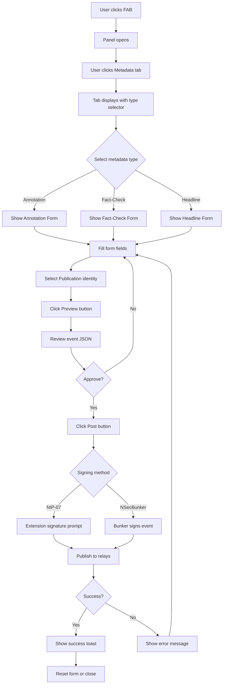

# UI Design Specification: URL Metadata Posting

**Version:** 1.0.0  
**Date:** 2026-01-27  
**Status:** Draft  
**Target Script Version:** v1.6.0+

---

## Table of Contents

1. [Overview](#1-overview)
2. [User Flow](#2-user-flow)
3. [Component Specifications](#3-component-specifications)
4. [Form Field Specifications](#4-form-field-specifications)
5. [Event Structure](#5-event-structure)
6. [Wireframes](#6-wireframes)
7. [Integration Points](#7-integration-points)
8. [Accessibility](#8-accessibility)
9. [Error Handling](#9-error-handling)

---

## 1. Overview

### 1.1 Purpose

This specification defines the UI design for a new **Metadata** tab within the NOSTR Article Capture Tampermonkey script. This tab enables users to post URL-related metadata events to NOSTR relays, complementing the existing read-only metadata querying functionality.

### 1.2 Scope

The Metadata tab will support posting three event types:

| Kind | Event Type | Description |
|------|------------|-------------|
| 32123 | URL Annotation | Add context, corrections, or related information to URLs |
| 32127 | Fact-Check Claim | Submit fact-check verdicts with evidence |
| 32129 | Headline Correction | Suggest corrections to misleading headlines |

### 1.3 Design Principles

1. **Consistency**: Reuse existing UI patterns, components, and CSS variables
2. **Progressive Disclosure**: Show relevant fields based on metadata type selection
3. **Validation-First**: Provide real-time feedback before submission
4. **Preview-Before-Post**: Allow users to review the exact event before signing
5. **Accessibility**: Full keyboard navigation and screen reader support

### 1.4 Out of Scope

- Editing previously posted metadata events
- Batch posting multiple events
- Offline queuing of events
- Kind 32124 (Content Rating) posting - future enhancement
- Kind 32130 (Dispute/Rebuttal) posting - future enhancement

---

## 2. User Flow

### 2.1 Primary Flow: Posting URL Metadata



### 2.2 State Transitions

```
┌─────────────────────────────────────────────────────────────────┐
│                        METADATA TAB STATES                       │
├─────────────────────────────────────────────────────────────────┤
│                                                                  │
│  ┌──────────┐      ┌──────────┐      ┌──────────┐              │
│  │  EMPTY   │ ──▶  │  FORM    │ ──▶  │ PREVIEW  │              │
│  │  STATE   │      │  ACTIVE  │      │  MODE    │              │
│  └──────────┘      └──────────┘      └──────────┘              │
│       │                 │                 │                     │
│       │                 │                 │                     │
│       │                 ▼                 ▼                     │
│       │           ┌──────────┐      ┌──────────┐              │
│       │           │VALIDATING│ ──▶  │ SIGNING  │              │
│       │           └──────────┘      └──────────┘              │
│       │                 │                 │                     │
│       │                 │                 ▼                     │
│       │                 │           ┌──────────┐              │
│       └─────────────────┴──────────▶│ COMPLETE │              │
│                                      └──────────┘              │
│                                                                  │
└─────────────────────────────────────────────────────────────────┘
```

### 2.3 User Scenarios

#### Scenario A: Adding Context to a News Article

1. User navigates to a news article
2. Opens NOSTR Article Capture panel
3. Clicks Metadata tab
4. Selects "Annotation" type, then "Context" subtype
5. Enters contextual information (e.g., "This article was later updated with corrections")
6. Optionally adds evidence URL
7. Sets confidence to 90%
8. Selects their publication identity
9. Previews and posts

#### Scenario B: Fact-Checking a Claim

1. User encounters article with questionable claim
2. Opens panel, navigates to Metadata tab
3. Selects "Fact-Check" type
4. Enters the specific claim text
5. Selects verdict: "Partially True"
6. Writes explanation
7. Adds multiple evidence sources with classifications
8. Reviews event structure
9. Signs and publishes

#### Scenario C: Correcting Clickbait Headline

1. User sees misleading headline
2. Opens Metadata tab
3. Selects "Headline Correction" type
4. Original headline auto-populates from page
5. Enters suggested accurate headline
6. Selects reason: "Clickbait/Exaggerated"
7. Posts correction

---

## 3. Component Specifications

### 3.1 Metadata Tab Button

**Location:** Tab bar in main panel, after existing tabs

```
┌─────────────────────────────────────────────────────────────┐
│ [Readable] [Markdown] [Capture] [Publications] [Metadata▼] │
└─────────────────────────────────────────────────────────────┘
```

**Specifications:**
- CSS Class: `.nac-tab`
- Active state: `.nac-tab.active`
- Icon: Optional emoji or SVG indicator
- Tooltip: "Post URL metadata to NOSTR"

### 3.2 Metadata Type Selector

**Purpose:** Choose which type of metadata to post

**Component Type:** Segmented button group or dropdown

```
┌─────────────────────────────────────────────────────────────┐
│ Metadata Type                                               │
│ ┌───────────────┬────────────────┬────────────────────────┐ │
│ │ 📝 Annotation │ 🔍 Fact-Check  │ ✏️ Headline Correction │ │
│ └───────────────┴────────────────┴────────────────────────┘ │
└─────────────────────────────────────────────────────────────┘
```

**Specifications:**
| Property | Value |
|----------|-------|
| Element | `<div class="nac-metadata-type-selector">` |
| Options | 3 buttons with icons |
| Default | None selected (prompt user) |
| Behavior | Only one active at a time |
| Animation | Slide transition between forms |

**CSS Classes:**
```css
.nac-metadata-type-selector { }
.nac-metadata-type-btn { }
.nac-metadata-type-btn.active { }
.nac-metadata-type-btn svg { }
```

### 3.3 URL Info Display

**Purpose:** Show the current URL being annotated

**Location:** Top of Metadata tab content area

```
┌─────────────────────────────────────────────────────────────┐
│ 🔗 Current URL                                              │
│ ┌─────────────────────────────────────────────────────────┐ │
│ │ https://example.com/article/some-news-story             │ │
│ │ Domain: example.com                                      │ │
│ │ Hash: a1b2c3d4e5f6g7h8 (d-tag)                          │ │
│ └─────────────────────────────────────────────────────────┘ │
└─────────────────────────────────────────────────────────────┘
```

**Specifications:**
| Property | Value |
|----------|-------|
| Element | `<div class="nac-url-info">` |
| URL Display | Truncated with ellipsis if > 60 chars |
| Domain | Extracted via `Utils.getDomain()` |
| Hash | First 16 chars of SHA256 normalized URL |
| Copy Button | Click to copy full URL |

### 3.4 Annotation Form (Kind 32123)

**Purpose:** Create URL annotations with context, corrections, or related info

```
┌─────────────────────────────────────────────────────────────┐
│ ANNOTATION FORM                                             │
├─────────────────────────────────────────────────────────────┤
│                                                             │
│ Annotation Type*                                            │
│ ┌─────────────────────────────────────────────────────────┐ │
│ │ ▼ Context                                               │ │
│ └─────────────────────────────────────────────────────────┘ │
│                                                             │
│ Content*                                                    │
│ ┌─────────────────────────────────────────────────────────┐ │
│ │                                                         │ │
│ │ Enter your annotation here...                          │ │
│ │                                                         │ │
│ │                                                         │ │
│ └─────────────────────────────────────────────────────────┘ │
│ 0/2000 characters                                           │
│                                                             │
│ Evidence URL (optional)                                     │
│ ┌─────────────────────────────────────────────────────────┐ │
│ │ https://                                                │ │
│ └─────────────────────────────────────────────────────────┘ │
│                                                             │
│ Confidence Level                                            │
│ ┌────────────────────────────────────────────────────┬────┐ │
│ │ ════════════════════════════════░░░░░░░░░░░░░░░░░░ │75% │ │
│ └────────────────────────────────────────────────────┴────┘ │
│ How confident are you in this annotation?                   │
│                                                             │
└─────────────────────────────────────────────────────────────┘
```

**Subcomponents:**

#### 3.4.1 Annotation Type Dropdown
| Property | Value |
|----------|-------|
| Element | `<select id="nac-annotation-type">` |
| Options | context, correction, related, update, clarification |
| Required | Yes |

#### 3.4.2 Content Textarea
| Property | Value |
|----------|-------|
| Element | `<textarea id="nac-annotation-content">` |
| Max Length | 2000 characters |
| Min Length | 10 characters |
| Rows | 5 |
| Required | Yes |
| Placeholder | "Describe the context, correction, or related information..." |

#### 3.4.3 Evidence URL Input
| Property | Value |
|----------|-------|
| Element | `<input type="url" id="nac-annotation-evidence">` |
| Required | No |
| Validation | Valid URL format |
| Placeholder | "https://example.com/source" |

#### 3.4.4 Confidence Slider
| Property | Value |
|----------|-------|
| Element | `<input type="range" id="nac-annotation-confidence">` |
| Min | 0 |
| Max | 100 |
| Step | 5 |
| Default | 75 |
| Display | Percentage label updates in real-time |

### 3.5 Fact-Check Form (Kind 32127)

**Purpose:** Submit fact-check verdicts with evidence

```
┌─────────────────────────────────────────────────────────────┐
│ FACT-CHECK FORM                                             │
├─────────────────────────────────────────────────────────────┤
│                                                             │
│ Claim Being Checked*                                        │
│ ┌─────────────────────────────────────────────────────────┐ │
│ │ Enter the specific claim you are fact-checking...       │ │
│ │                                                         │ │
│ └─────────────────────────────────────────────────────────┘ │
│                                                             │
│ Verdict*                                                    │
│ ┌──────────────────────────────────────────────────────┐   │
│ │ ○ True   ○ Partially True   ○ False   ○ Unverifiable │   │
│ └──────────────────────────────────────────────────────┘   │
│                                                             │
│ Explanation*                                                │
│ ┌─────────────────────────────────────────────────────────┐ │
│ │ Explain your verdict with supporting details...         │ │
│ │                                                         │ │
│ │                                                         │ │
│ │                                                         │ │
│ └─────────────────────────────────────────────────────────┘ │
│                                                             │
│ Evidence Sources                                            │
│ ┌─────────────────────────────────────────────────────────┐ │
│ │ Source 1                                                │ │
│ │ URL: [https://source1.com/article________________]     │ │
│ │ Type: [▼ Primary Source]                               │ │
│ │                                                [Remove] │ │
│ ├─────────────────────────────────────────────────────────┤ │
│ │ Source 2                                                │ │
│ │ URL: [https://factcheck.org/report______________]      │ │
│ │ Type: [▼ Fact-Check Organization]                      │ │
│ │                                                [Remove] │ │
│ └─────────────────────────────────────────────────────────┘ │
│ [+ Add Evidence Source]                                     │
│                                                             │
└─────────────────────────────────────────────────────────────┘
```

**Subcomponents:**

#### 3.5.1 Claim Input
| Property | Value |
|----------|-------|
| Element | `<textarea id="nac-factcheck-claim">` |
| Max Length | 500 characters |
| Min Length | 10 characters |
| Rows | 3 |
| Required | Yes |
| Placeholder | "Enter the exact claim being fact-checked" |

#### 3.5.2 Verdict Radio Group
| Property | Value |
|----------|-------|
| Element | `<div class="nac-verdict-group">` |
| Options | true, partially-true, false, unverifiable |
| Required | Yes |
| Visual | Color-coded radio buttons |

**Verdict Colors:**
| Verdict | Color Variable | Hex |
|---------|---------------|-----|
| True | `--nac-success` | #22c55e |
| Partially True | `--nac-warning` | #f59e0b |
| False | `--nac-error` | #ef4444 |
| Unverifiable | `--nac-text-muted` | #94a3b8 |

#### 3.5.3 Explanation Textarea
| Property | Value |
|----------|-------|
| Element | `<textarea id="nac-factcheck-explanation">` |
| Max Length | 3000 characters |
| Min Length | 50 characters |
| Rows | 6 |
| Required | Yes |
| Placeholder | "Provide a detailed explanation of your fact-check..." |

#### 3.5.4 Evidence Sources List
| Property | Value |
|----------|-------|
| Container | `<div id="nac-evidence-list">` |
| Item Template | See Evidence Source Item below |
| Min Items | 1 (recommended but not enforced) |
| Max Items | 10 |
| Add Button | "Add Evidence Source" |

#### 3.5.5 Evidence Source Item
```html
<div class="nac-evidence-item" data-index="0">
  <div class="nac-form-group">
    <label>URL</label>
    <input type="url" class="nac-evidence-url" required>
  </div>
  <div class="nac-form-group">
    <label>Type</label>
    <select class="nac-evidence-type">
      <option value="primary">Primary Source</option>
      <option value="secondary">Secondary Source</option>
      <option value="factcheck">Fact-Check Organization</option>
      <option value="official">Official Statement</option>
      <option value="expert">Expert Opinion</option>
      <option value="data">Data/Statistics</option>
    </select>
  </div>
  <button class="nac-evidence-remove">Remove</button>
</div>
```

### 3.6 Headline Correction Form (Kind 32129)

**Purpose:** Suggest corrections to misleading or inaccurate headlines

```
┌─────────────────────────────────────────────────────────────┐
│ HEADLINE CORRECTION FORM                                    │
├─────────────────────────────────────────────────────────────┤
│                                                             │
│ Original Headline (auto-detected)                           │
│ ┌─────────────────────────────────────────────────────────┐ │
│ │ SHOCKING: Scientists Say This Common Food Causes       │ │
│ │ Instant Death!                                          │ │
│ └─────────────────────────────────────────────────────────┘ │
│ [Edit] if detection is incorrect                            │
│                                                             │
│ Suggested Correction*                                       │
│ ┌─────────────────────────────────────────────────────────┐ │
│ │ Study finds slight correlation between food additive    │ │
│ │ and health concerns in lab mice                         │ │
│ └─────────────────────────────────────────────────────────┘ │
│                                                             │
│ Reason for Correction*                                      │
│ ┌─────────────────────────────────────────────────────────┐ │
│ │ ○ Clickbait/Exaggerated                                 │ │
│ │ ○ Factually Inaccurate                                  │ │
│ │ ○ Missing Important Context                             │ │
│ │ ○ Misleading Framing                                    │ │
│ │ ○ Outdated Information                                  │ │
│ └─────────────────────────────────────────────────────────┘ │
│                                                             │
│ Additional Notes (optional)                                 │
│ ┌─────────────────────────────────────────────────────────┐ │
│ │ The study was conducted on mice, not humans, and       │ │
│ │ showed correlation, not causation...                    │ │
│ └─────────────────────────────────────────────────────────┘ │
│                                                             │
└─────────────────────────────────────────────────────────────┘
```

**Subcomponents:**

#### 3.6.1 Original Headline Display
| Property | Value |
|----------|-------|
| Element | `<div id="nac-headline-original">` |
| Source | Auto-detected from `<h1>` or `og:title` |
| Editable | Toggle with Edit button |
| Fallback | Text input if auto-detection fails |

#### 3.6.2 Suggested Correction Input
| Property | Value |
|----------|-------|
| Element | `<textarea id="nac-headline-suggestion">` |
| Max Length | 300 characters |
| Min Length | 10 characters |
| Rows | 3 |
| Required | Yes |
| Placeholder | "Enter a more accurate headline" |

#### 3.6.3 Reason Radio Group
| Property | Value |
|----------|-------|
| Element | `<div class="nac-correction-reason-group">` |
| Options | clickbait, inaccurate, missing-context, misleading, outdated |
| Required | Yes |

#### 3.6.4 Additional Notes
| Property | Value |
|----------|-------|
| Element | `<textarea id="nac-headline-notes">` |
| Max Length | 1000 characters |
| Required | No |
| Rows | 4 |
| Placeholder | "Any additional context or explanation..." |

### 3.7 Publication Selector

**Purpose:** Select identity to sign the event (reuses existing component)

```
┌─────────────────────────────────────────────────────────────┐
│ Sign As*                                                    │
│ ┌─────────────────────────────────────────────────────────┐ │
│ │ ▼ My Fact-Checking Publication                         │ │
│ └─────────────────────────────────────────────────────────┘ │
│ Events will be signed with this publication's keypair       │
└─────────────────────────────────────────────────────────────┘
```

**Specifications:**
- Reuses existing `#nac-publication` selector
- Shows NIP-07 extension option if available
- Shows stored publications
- Option to create new publication

### 3.8 Event Preview Panel

**Purpose:** Show the exact event JSON before signing

```
┌─────────────────────────────────────────────────────────────┐
│ EVENT PREVIEW                                               │
├─────────────────────────────────────────────────────────────┤
│ ┌─────────────────────────────────────────────────────────┐ │
│ │ {                                                       │ │
│ │   "kind": 32127,                                        │ │
│ │   "pubkey": "a1b2c3d4...",                             │ │
│ │   "created_at": 1706340000,                            │ │
│ │   "tags": [                                            │ │
│ │     ["d", "a1b2c3d4e5f6g7h8"],                         │ │
│ │     ["r", "https://example.com/article"],             │ │
│ │     ["verdict", "partially-true"],                     │ │
│ │     ["claim", "The article claims that..."]            │ │
│ │   ],                                                    │ │
│ │   "content": "{...}"                                    │ │
│ │ }                                                       │ │
│ └─────────────────────────────────────────────────────────┘ │
│                                                             │
│ ┌─────────────┐ ┌───────────────────────────────────────┐  │
│ │ ← Edit      │ │ Sign and Post                    ▶    │  │
│ └─────────────┘ └───────────────────────────────────────┘  │
└─────────────────────────────────────────────────────────────┘
```

**Specifications:**
| Property | Value |
|----------|-------|
| Container | `<div class="nac-event-preview">` |
| Code Display | `<pre class="nac-event-json">` |
| Syntax Highlight | JSON formatting with colors |
| Copy Button | Copy raw JSON to clipboard |
| Edit Button | Return to form editing |
| Post Button | Proceed to signing |

### 3.9 Action Buttons

**Primary Actions:**

| Button | Label | State | Action |
|--------|-------|-------|--------|
| Preview | "Preview Event" | Form valid | Show event preview |
| Post | "Sign and Post" | Preview shown | Initiate signing |
| Edit | "← Edit" | Preview shown | Return to form |
| Reset | "Clear Form" | Any | Reset all fields |

**Button States:**
```css
.nac-btn-preview { /* Secondary style */ }
.nac-btn-post { /* Primary style, disabled until ready */ }
.nac-btn-edit { /* Ghost/link style */ }
.nac-btn-reset { /* Text button, subtle */ }
```

---

## 4. Form Field Specifications

### 4.1 Annotation Form Fields

| Field | ID | Type | Required | Validation | Default |
|-------|-----|------|----------|------------|---------|
| Annotation Type | `nac-annotation-type` | select | Yes | Must select option | - |
| Content | `nac-annotation-content` | textarea | Yes | 10-2000 chars | - |
| Evidence URL | `nac-annotation-evidence` | url | No | Valid URL if provided | - |
| Confidence | `nac-annotation-confidence` | range | Yes | 0-100 | 75 |

**Annotation Type Options:**
| Value | Label | Description |
|-------|-------|-------------|
| `context` | Context | Additional background information |
| `correction` | Correction | Fixes an error in the content |
| `related` | Related | Links to related content |
| `update` | Update | Content has been updated since |
| `clarification` | Clarification | Clarifies ambiguous content |

### 4.2 Fact-Check Form Fields

| Field | ID | Type | Required | Validation | Default |
|-------|-----|------|----------|------------|---------|
| Claim | `nac-factcheck-claim` | textarea | Yes | 10-500 chars | - |
| Verdict | `nac-factcheck-verdict` | radio | Yes | Must select one | - |
| Explanation | `nac-factcheck-explanation` | textarea | Yes | 50-3000 chars | - |
| Evidence Sources | `nac-evidence-list` | array | No | Max 10 items | [] |

**Verdict Options:**
| Value | Label | Color | Icon |
|-------|-------|-------|------|
| `true` | True | #22c55e | ✓ |
| `partially-true` | Partially True | #f59e0b | ◐ |
| `false` | False | #ef4444 | ✗ |
| `unverifiable` | Unverifiable | #94a3b8 | ? |

**Evidence Source Type Options:**
| Value | Label |
|-------|-------|
| `primary` | Primary Source |
| `secondary` | Secondary Source |
| `factcheck` | Fact-Check Organization |
| `official` | Official Statement |
| `expert` | Expert Opinion |
| `data` | Data/Statistics |

### 4.3 Headline Correction Form Fields

| Field | ID | Type | Required | Validation | Default |
|-------|-----|------|----------|------------|---------|
| Original Headline | `nac-headline-original` | text/display | Yes | Non-empty | Auto-detected |
| Suggested Correction | `nac-headline-suggestion` | textarea | Yes | 10-300 chars | - |
| Reason | `nac-correction-reason` | radio | Yes | Must select one | - |
| Notes | `nac-headline-notes` | textarea | No | Max 1000 chars | - |

**Correction Reason Options:**
| Value | Label |
|-------|-------|
| `clickbait` | Clickbait/Exaggerated |
| `inaccurate` | Factually Inaccurate |
| `missing-context` | Missing Important Context |
| `misleading` | Misleading Framing |
| `outdated` | Outdated Information |

### 4.4 Validation Rules Summary

```javascript
const VALIDATION_RULES = {
  annotation: {
    type: { required: true },
    content: { required: true, minLength: 10, maxLength: 2000 },
    evidence: { required: false, pattern: /^https?:\/\/.+/ },
    confidence: { required: true, min: 0, max: 100 }
  },
  factcheck: {
    claim: { required: true, minLength: 10, maxLength: 500 },
    verdict: { required: true, enum: ['true', 'partially-true', 'false', 'unverifiable'] },
    explanation: { required: true, minLength: 50, maxLength: 3000 },
    evidence: { required: false, maxItems: 10 }
  },
  headline: {
    original: { required: true, minLength: 5 },
    suggestion: { required: true, minLength: 10, maxLength: 300 },
    reason: { required: true, enum: ['clickbait', 'inaccurate', 'missing-context', 'misleading', 'outdated'] },
    notes: { required: false, maxLength: 1000 }
  }
};
```

---

## 5. Event Structure

### 5.1 URL Annotation (Kind 32123)

```json
{
  "kind": 32123,
  "pubkey": "<publication_pubkey>",
  "created_at": 1706340000,
  "tags": [
    ["d", "<sha256(normalized_url).substring(0,16)>"],
    ["r", "<normalized_url>"],
    ["type", "context|correction|related|update|clarification"],
    ["confidence", "75"],
    ["client", "nostr-article-capture"]
  ],
  "content": "{\"text\":\"<annotation_text>\",\"evidence\":\"<optional_url>\"}"
}
```

**Tag Definitions:**
| Tag | Required | Description |
|-----|----------|-------------|
| `d` | Yes | Unique identifier (URL hash prefix) |
| `r` | Yes | Normalized URL being annotated |
| `type` | Yes | Annotation category |
| `confidence` | Yes | Confidence percentage (0-100) |
| `client` | Yes | Client identifier |
| `e` | No | Reference to related event |
| `p` | No | Reference to related pubkey |

**Content JSON Schema:**
```json
{
  "type": "object",
  "properties": {
    "text": {
      "type": "string",
      "minLength": 10,
      "maxLength": 2000
    },
    "evidence": {
      "type": "string",
      "format": "uri"
    }
  },
  "required": ["text"]
}
```

### 5.2 Fact-Check Claim (Kind 32127)

```json
{
  "kind": 32127,
  "pubkey": "<publication_pubkey>",
  "created_at": 1706340000,
  "tags": [
    ["d", "<sha256(normalized_url).substring(0,16)>"],
    ["r", "<normalized_url>"],
    ["verdict", "true|partially-true|false|unverifiable"],
    ["claim", "<claim_text_truncated_to_100_chars>"],
    ["client", "nostr-article-capture"]
  ],
  "content": "{\"claim\":\"<full_claim>\",\"verdict\":\"<verdict>\",\"explanation\":\"<explanation>\",\"evidence\":[{\"url\":\"<url>\",\"type\":\"<type>\"}]}"
}
```

**Tag Definitions:**
| Tag | Required | Description |
|-----|----------|-------------|
| `d` | Yes | Unique identifier (URL hash prefix) |
| `r` | Yes | Normalized URL being fact-checked |
| `verdict` | Yes | Fact-check verdict |
| `claim` | Yes | Truncated claim text for filtering |
| `client` | Yes | Client identifier |
| `L` | No | Label namespace for ClaimReview |
| `l` | No | Structured labels |

**Content JSON Schema:**
```json
{
  "type": "object",
  "properties": {
    "claim": {
      "type": "string",
      "minLength": 10,
      "maxLength": 500
    },
    "verdict": {
      "type": "string",
      "enum": ["true", "partially-true", "false", "unverifiable"]
    },
    "explanation": {
      "type": "string",
      "minLength": 50,
      "maxLength": 3000
    },
    "evidence": {
      "type": "array",
      "maxItems": 10,
      "items": {
        "type": "object",
        "properties": {
          "url": { "type": "string", "format": "uri" },
          "type": { "type": "string" },
          "title": { "type": "string" }
        },
        "required": ["url", "type"]
      }
    }
  },
  "required": ["claim", "verdict", "explanation"]
}
```

### 5.3 Headline Correction (Kind 32129)

```json
{
  "kind": 32129,
  "pubkey": "<publication_pubkey>",
  "created_at": 1706340000,
  "tags": [
    ["d", "<sha256(normalized_url).substring(0,16)>"],
    ["r", "<normalized_url>"],
    ["problem", "clickbait|inaccurate|missing-context|misleading|outdated"],
    ["original", "<original_headline_truncated>"],
    ["client", "nostr-article-capture"]
  ],
  "content": "{\"original\":\"<full_original>\",\"suggested\":\"<suggested_headline>\",\"problem\":\"<problem_type>\",\"notes\":\"<optional_notes>\"}"
}
```

**Tag Definitions:**
| Tag | Required | Description |
|-----|----------|-------------|
| `d` | Yes | Unique identifier (URL hash prefix) |
| `r` | Yes | Normalized URL of article |
| `problem` | Yes | Type of headline problem |
| `original` | Yes | Original headline (truncated) |
| `client` | Yes | Client identifier |

**Content JSON Schema:**
```json
{
  "type": "object",
  "properties": {
    "original": {
      "type": "string",
      "maxLength": 500
    },
    "suggested": {
      "type": "string",
      "minLength": 10,
      "maxLength": 300
    },
    "problem": {
      "type": "string",
      "enum": ["clickbait", "inaccurate", "missing-context", "misleading", "outdated"]
    },
    "notes": {
      "type": "string",
      "maxLength": 1000
    }
  },
  "required": ["original", "suggested", "problem"]
}
```

### 5.4 Event Building Functions

```javascript
// Example: Building annotation event
const buildAnnotationEvent = async (url, data, pubkey) => {
  const normalizedUrl = Utils.normalizeUrl(url);
  const urlHash = await Utils.sha256(normalizedUrl);
  const dTag = urlHash.substring(0, 16);
  
  const event = {
    kind: 32123,
    pubkey: pubkey,
    created_at: Math.floor(Date.now() / 1000),
    tags: [
      ['d', dTag],
      ['r', normalizedUrl],
      ['type', data.type],
      ['confidence', String(data.confidence)],
      ['client', 'nostr-article-capture']
    ],
    content: JSON.stringify({
      text: data.content,
      evidence: data.evidence || undefined
    })
  };
  
  // Calculate event ID
  event.id = await NostrCrypto.getEventHash(event);
  
  return event;
};
```

---

## 6. Wireframes

### 6.1 Metadata Tab - Empty State

```
┌─────────────────────────────────────────────────────────────────┐
│ ╔═══════════════════════════════════════════════════════════╗  │
│ ║  NOSTR Article Capture                             [○][X] ║  │
│ ╠═══════════════════════════════════════════════════════════╣  │
│ ║ [Readable] [Markdown]                    [Metadata] [Copy] ║  │
│ ╠═══════════════════════════════════════════════════════════╣  │
│ ║                                                            ║  │
│ ║  🔗 Current URL                                            ║  │
│ ║  ┌──────────────────────────────────────────────────────┐  ║  │
│ ║  │ https://example.com/news/article-title-here...      │  ║  │
│ ║  │ d-tag: a1b2c3d4e5f6g7h8                              │  ║  │
│ ║  └──────────────────────────────────────────────────────┘  ║  │
│ ║                                                            ║  │
│ ║  ┌──────────────────────────────────────────────────────┐  ║  │
│ ║  │                                                      │  ║  │
│ ║  │      Select a metadata type to begin posting:       │  ║  │
│ ║  │                                                      │  ║  │
│ ║  │  ┌────────────┐ ┌────────────┐ ┌────────────────┐   │  ║  │
│ ║  │  │    📝      │ │    🔍      │ │      ✏️        │   │  ║  │
│ ║  │  │ Annotation │ │ Fact-Check │ │ Headline Fix   │   │  ║  │
│ ║  │  │            │ │            │ │                │   │  ║  │
│ ║  │  │ Add notes  │ │ Verify     │ │ Correct        │   │  ║  │
│ ║  │  │ & context  │ │ claims     │ │ misleading     │   │  ║  │
│ ║  │  └────────────┘ └────────────┘ └────────────────┘   │  ║  │
│ ║  │                                                      │  ║  │
│ ║  └──────────────────────────────────────────────────────┘  ║  │
│ ║                                                            ║  │
│ ╚═══════════════════════════════════════════════════════════╝  │
└─────────────────────────────────────────────────────────────────┘
```

### 6.2 Annotation Form Active

```
┌─────────────────────────────────────────────────────────────────┐
│ ╔═══════════════════════════════════════════════════════════╗  │
│ ║  NOSTR Article Capture                     [NIP-07 ●] [X] ║  │
│ ╠═══════════════════════════════════════════════════════════╣  │
│ ║ [Readable] [Markdown]                    [Metadata] [Copy] ║  │
│ ╠═══════════════════════════════════════════════════════════╣  │
│ ║                                                            ║  │
│ ║  [📝 Annotation] [🔍 Fact-Check] [✏️ Headline]  ← Type     ║  │
│ ║   ^^^^^^^^^^^^                                             ║  │
│ ║                                                            ║  │
│ ║  Annotation Type                                           ║  │
│ ║  ┌────────────────────────────────────────────────────▼┐  ║  │
│ ║  │ Context                                              │  ║  │
│ ║  └──────────────────────────────────────────────────────┘  ║  │
│ ║                                                            ║  │
│ ║  Content *                                                 ║  │
│ ║  ┌──────────────────────────────────────────────────────┐  ║  │
│ ║  │ This article was updated on Jan 15 to include       │  ║  │
│ ║  │ corrections to the original statistics cited.       │  ║  │
│ ║  │ The original version overstated the findings.       │  ║  │
│ ║  │                                                      │  ║  │
│ ║  └──────────────────────────────────────────────────────┘  ║  │
│ ║  156/2000 characters                                       ║  │
│ ║                                                            ║  │
│ ║  Evidence URL (optional)                                   ║  │
│ ║  ┌──────────────────────────────────────────────────────┐  ║  │
│ ║  │ https://archive.org/web/...                         │  ║  │
│ ║  └──────────────────────────────────────────────────────┘  ║  │
│ ║                                                            ║  │
│ ║  Confidence Level                                          ║  │
│ ║  ┌═══════════════════════════════════════════════┬─────┐  ║  │
│ ║  │ ████████████████████████████████░░░░░░░░░░░░░ │ 85% │  ║  │
│ ║  └═══════════════════════════════════════════════┴─────┘  ║  │
│ ║                                                            ║  │
│ ║  Sign As                                                   ║  │
│ ║  ┌────────────────────────────────────────────────────▼┐  ║  │
│ ║  │ My Fact-Checking Account                            │  ║  │
│ ║  └──────────────────────────────────────────────────────┘  ║  │
│ ║                                                            ║  │
│ ║  ┌──────────────┐              ┌────────────────────────┐  ║  │
│ ║  │  Clear Form  │              │    Preview Event   ▶   │  ║  │
│ ║  └──────────────┘              └────────────────────────┘  ║  │
│ ║                                                            ║  │
│ ╚═══════════════════════════════════════════════════════════╝  │
└─────────────────────────────────────────────────────────────────┘
```

### 6.3 Fact-Check Form Active

```
┌─────────────────────────────────────────────────────────────────┐
│ ╔═══════════════════════════════════════════════════════════╗  │
│ ║  NOSTR Article Capture                     [NIP-07 ●] [X] ║  │
│ ╠═══════════════════════════════════════════════════════════╣  │
│ ║ [Readable] [Markdown]                    [Metadata] [Copy] ║  │
│ ╠═══════════════════════════════════════════════════════════╣  │
│ ║                                                            ║  │
│ ║  [📝 Annotation] [🔍 Fact-Check] [✏️ Headline]             ║  │
│ ║                   ^^^^^^^^^^^^^^^                          ║  │
│ ║                                                            ║  │
│ ║  Claim Being Checked *                                     ║  │
│ ║  ┌──────────────────────────────────────────────────────┐  ║  │
│ ║  │ The article claims that 90% of doctors recommend    │  ║  │
│ ║  │ this treatment.                                      │  ║  │
│ ║  └──────────────────────────────────────────────────────┘  ║  │
│ ║                                                            ║  │
│ ║  Verdict *                                                 ║  │
│ ║  ┌────────────────────────────────────────────────────────┐ ║  │
│ ║  │ ○ True    ● Partially    ○ False    ○ Unverifiable   │ ║  │
│ ║  │   ✓        True ◐           ✗           ?             │ ║  │
│ ║  └────────────────────────────────────────────────────────┘ ║  │
│ ║                                                            ║  │
│ ║  Explanation *                                             ║  │
│ ║  ┌──────────────────────────────────────────────────────┐  ║  │
│ ║  │ The cited study surveyed 500 doctors, of whom 87%   │  ║  │
│ ║  │ said they would consider recommending the treatment │  ║  │
│ ║  │ under specific conditions. The "90%" figure appears │  ║  │
│ ║  │ to be rounded up, and the conditional nature of the │  ║  │
│ ║  │ recommendation was omitted from the headline...     │  ║  │
│ ║  └──────────────────────────────────────────────────────┘  ║  │
│ ║  285/3000 characters                                       ║  │
│ ║                                                            ║  │
│ ║  Evidence Sources                                          ║  │
│ ║  ┌──────────────────────────────────────────────────────┐  ║  │
│ ║  │ Source 1                                             │  ║  │
│ ║  │ URL: https://pubmed.gov/study/12345_______________  │  ║  │
│ ║  │ Type: [Primary Source        ▼]          [Remove]   │  ║  │
│ ║  ├──────────────────────────────────────────────────────┤  ║  │
│ ║  │ Source 2                                             │  ║  │
│ ║  │ URL: https://factcheck.org/article________________  │  ║  │
│ ║  │ Type: [Fact-Check Org        ▼]          [Remove]   │  ║  │
│ ║  └──────────────────────────────────────────────────────┘  ║  │
│ ║  [+ Add Evidence Source]                                   ║  │
│ ║                                                            ║  │
│ ║  ┌──────────────┐              ┌────────────────────────┐  ║  │
│ ║  │  Clear Form  │              │    Preview Event   ▶   │  ║  │
│ ║  └──────────────┘              └────────────────────────┘  ║  │
│ ╚═══════════════════════════════════════════════════════════╝  │
└─────────────────────────────────────────────────────────────────┘
```

### 6.4 Event Preview Modal

```
┌─────────────────────────────────────────────────────────────────┐
│ ╔═══════════════════════════════════════════════════════════╗  │
│ ║  EVENT PREVIEW                                        [X] ║  │
│ ╠═══════════════════════════════════════════════════════════╣  │
│ ║                                                            ║  │
│ ║  ┌──────────────────────────────────────────────────────┐  ║  │
│ ║  │ {                                                    │  ║  │
│ ║  │   "kind": 32127,                                     │  ║  │
│ ║  │   "pubkey": "3bf0c63fcb93463407af97a5e5ee64fa...",  │  ║  │
│ ║  │   "created_at": 1706340000,                          │  ║  │
│ ║  │   "tags": [                                          │  ║  │
│ ║  │     ["d", "a1b2c3d4e5f6g7h8"],                       │  ║  │
│ ║  │     ["r", "https://example.com/article"],           │  ║  │
│ ║  │     ["verdict", "partially-true"],                   │  ║  │
│ ║  │     ["claim", "The article claims that 90%..."],    │  ║  │
│ ║  │     ["client", "nostr-article-capture"]              │  ║  │
│ ║  │   ],                                                 │  ║  │
│ ║  │   "content": "{\"claim\":\"The article claims...\"  │  ║  │
│ ║  │ }                                                    │  ║  │
│ ║  └──────────────────────────────────────────────────────┘  ║  │
│ ║                                                [Copy JSON] ║  │
│ ║                                                            ║  │
│ ║  Publishing to:                                            ║  │
│ ║  ✓ relay.damus.io                                          ║  │
│ ║  ✓ nos.lol                                                 ║  │
│ ║  ✓ relay.nostr.band                                        ║  │
│ ║                                                            ║  │
│ ║  ┌──────────────┐              ┌────────────────────────┐  ║  │
│ ║  │   ← Edit     │              │  ▶ Sign and Post       │  ║  │
│ ║  └──────────────┘              └────────────────────────┘  ║  │
│ ║                                                            ║  │
│ ╚═══════════════════════════════════════════════════════════╝  │
└─────────────────────────────────────────────────────────────────┘
```

### 6.5 Headline Correction Form

```
┌─────────────────────────────────────────────────────────────────┐
│ ╔═══════════════════════════════════════════════════════════╗  │
│ ║  NOSTR Article Capture                     [NIP-07 ●] [X] ║  │
│ ╠═══════════════════════════════════════════════════════════╣  │
│ ║ [Readable] [Markdown]                    [Metadata] [Copy] ║  │
│ ╠═══════════════════════════════════════════════════════════╣  │
│ ║                                                            ║  │
│ ║  [📝 Annotation] [🔍 Fact-Check] [✏️ Headline]             ║  │
│ ║                                   ^^^^^^^^^^^^^            ║  │
│ ║                                                            ║  │
│ ║  Original Headline (auto-detected)                         ║  │
│ ║  ┌──────────────────────────────────────────────────────┐  ║  │
│ ║  │ SHOCKING: Scientists Discover This One Weird Trick  │  ║  │
│ ║  │ That Big Pharma Doesn't Want You To Know!           │  ║  │
│ ║  └──────────────────────────────────────────────────────┘  ║  │
│ ║  [Edit] if auto-detection is incorrect                     ║  │
│ ║                                                            ║  │
│ ║  Suggested Correction *                                    ║  │
│ ║  ┌──────────────────────────────────────────────────────┐  ║  │
│ ║  │ Study finds potential benefits of common vitamin    │  ║  │
│ ║  │ supplement; more research needed                     │  ║  │
│ ║  └──────────────────────────────────────────────────────┘  ║  │
│ ║  78/300 characters                                         ║  │
│ ║                                                            ║  │
│ ║  Reason for Correction *                                   ║  │
│ ║  ┌──────────────────────────────────────────────────────┐  ║  │
│ ║  │ ● Clickbait/Exaggerated                              │  ║  │
│ ║  │ ○ Factually Inaccurate                               │  ║  │
│ ║  │ ○ Missing Important Context                          │  ║  │
│ ║  │ ○ Misleading Framing                                 │  ║  │
│ ║  │ ○ Outdated Information                               │  ║  │
│ ║  └──────────────────────────────────────────────────────┘  ║  │
│ ║                                                            ║  │
│ ║  Additional Notes (optional)                               ║  │
│ ║  ┌──────────────────────────────────────────────────────┐  ║  │
│ ║  │ The original headline uses sensationalist language  │  ║  │
│ ║  │ and conspiracy framing. The actual study showed     │  ║  │
│ ║  │ modest, preliminary results...                       │  ║  │
│ ║  └──────────────────────────────────────────────────────┘  ║  │
│ ║                                                            ║  │
│ ║  ┌──────────────┐              ┌────────────────────────┐  ║  │
│ ║  │  Clear Form  │              │    Preview Event   ▶   │  ║  │
│ ║  └──────────────┘              └────────────────────────┘  ║  │
│ ╚═══════════════════════════════════════════════════════════╝  │
└─────────────────────────────────────────────────────────────────┘
```

### 6.6 Mobile/Narrow View

```
┌───────────────────────────────────┐
│ ╔═════════════════════════════╗  │
│ ║ NOSTR Article Capture   [X] ║  │
│ ╠═════════════════════════════╣  │
│ ║ [Readable][MD][Meta][Copy]  ║  │
│ ╠═════════════════════════════╣  │
│ ║                             ║  │
│ ║ 🔗 example.com/article...   ║  │
│ ║                             ║  │
│ ║ Type:                       ║  │
│ ║ ┌─────────────────────────┐ ║  │
│ ║ │ 📝 Annotation        ▼  │ ║  │
│ ║ └─────────────────────────┘ ║  │
│ ║                             ║  │
│ ║ Annotation Type:            ║  │
│ ║ ┌─────────────────────────┐ ║  │
│ ║ │ Context              ▼  │ ║  │
│ ║ └─────────────────────────┘ ║  │
│ ║                             ║  │
│ ║ Content *                   ║  │
│ ║ ┌─────────────────────────┐ ║  │
│ ║ │                         │ ║  │
│ ║ │                         │ ║  │
│ ║ │                         │ ║  │
│ ║ └─────────────────────────┘ ║  │
│ ║ 0/2000                      ║  │
│ ║                             ║  │
│ ║ Evidence URL:               ║  │
│ ║ ┌─────────────────────────┐ ║  │
│ ║ │ https://                │ ║  │
│ ║ └─────────────────────────┘ ║  │
│ ║                             ║  │
│ ║ Confidence: 75%             ║  │
│ ║ ┌═════════════════════════┐ ║  │
│ ║ │ ████████████░░░░░░░░░░░ │ ║  │
│ ║ └═════════════════════════┘ ║  │
│ ║                             ║  │
│ ║ Sign As:                    ║  │
│ ║ ┌─────────────────────────┐ ║  │
│ ║ │ My Account           ▼  │ ║  │
│ ║ └─────────────────────────┘ ║  │
│ ║                             ║  │
│ ║ ┌───────────────────────┐   ║  │
│ ║ │    Preview Event  ▶   │   ║  │
│ ║ └───────────────────────┘   ║  │
│ ║                             ║  │
│ ╚═════════════════════════════╝  │
└───────────────────────────────────┘
```

---

## 7. Integration Points

### 7.1 Existing Module Dependencies

The Metadata tab integrates with existing script modules:

| Module | Usage |
|--------|-------|
| `Utils` | URL normalization, SHA-256 hashing, HTML escaping, logging |
| `Storage` | Publications and preferences retrieval |
| `NostrCrypto` | Event ID calculation, serialization |
| `NostrClient` | Relay connections, event publishing |
| `NIP07Client` | Browser extension signing |
| `NSecBunkerClient` | External key management signing |
| `EventBuilder` | Event construction (extend with new methods) |
| `UI` | Toast notifications, form styling, tab system |

### 7.2 New EventBuilder Methods

Add these methods to the existing `EventBuilder` module:

```javascript
/**
 * Build URL Annotation event (Kind 32123)
 */
buildAnnotationEvent: async (url, data, pubkey) => {
  const normalizedUrl = Utils.normalizeUrl(url);
  const urlHash = await Utils.sha256(normalizedUrl);
  
  const event = {
    kind: 32123,
    pubkey: pubkey,
    created_at: Math.floor(Date.now() / 1000),
    tags: [
      ['d', urlHash.substring(0, 16)],
      ['r', normalizedUrl],
      ['type', data.type],
      ['confidence', String(data.confidence)],
      ['client', 'nostr-article-capture']
    ],
    content: JSON.stringify({
      text: data.content,
      evidence: data.evidence || undefined
    })
  };
  
  event.id = await NostrCrypto.getEventHash(event);
  return event;
},

/**
 * Build Fact-Check event (Kind 32127)
 */
buildFactCheckEvent: async (url, data, pubkey) => {
  const normalizedUrl = Utils.normalizeUrl(url);
  const urlHash = await Utils.sha256(normalizedUrl);
  
  const event = {
    kind: 32127,
    pubkey: pubkey,
    created_at: Math.floor(Date.now() / 1000),
    tags: [
      ['d', urlHash.substring(0, 16)],
      ['r', normalizedUrl],
      ['verdict', data.verdict],
      ['claim', data.claim.substring(0, 100)],
      ['client', 'nostr-article-capture']
    ],
    content: JSON.stringify({
      claim: data.claim,
      verdict: data.verdict,
      explanation: data.explanation,
      evidence: data.evidence || []
    })
  };
  
  event.id = await NostrCrypto.getEventHash(event);
  return event;
},

/**
 * Build Headline Correction event (Kind 32129)
 */
buildHeadlineCorrectionEvent: async (url, data, pubkey) => {
  const normalizedUrl = Utils.normalizeUrl(url);
  const urlHash = await Utils.sha256(normalizedUrl);
  
  const event = {
    kind: 32129,
    pubkey: pubkey,
    created_at: Math.floor(Date.now() / 1000),
    tags: [
      ['d', urlHash.substring(0, 16)],
      ['r', normalizedUrl],
      ['problem', data.problem],
      ['original', data.original.substring(0, 100)],
      ['client', 'nostr-article-capture']
    ],
    content: JSON.stringify({
      original: data.original,
      suggested: data.suggested,
      problem: data.problem,
      notes: data.notes || undefined
    })
  };
  
  event.id = await NostrCrypto.getEventHash(event);
  return event;
}
```

### 7.3 CSS Integration

Reuse existing CSS variables and add new classes:

**Existing Variables:**
```css
--nac-primary: #6366f1;
--nac-primary-hover: #4f46e5;
--nac-success: #22c55e;
--nac-warning: #f59e0b;
--nac-error: #ef4444;
--nac-background: #1e1e2e;
--nac-surface: #2a2a3e;
--nac-border: #3f3f5a;
--nac-text: #e2e8f0;
--nac-text-muted: #94a3b8;
```

**New CSS Classes:**
```css
.nac-metadata-type-selector { display: flex; gap: 12px; margin-bottom: 20px; }
.nac-metadata-type-btn { flex: 1; padding: 16px; border: 2px solid var(--nac-border); }
.nac-metadata-type-btn.active { border-color: var(--nac-primary); }
.nac-url-info { padding: 12px; background: var(--nac-surface); border-radius: 8px; }
.nac-verdict-group { display: flex; gap: 8px; flex-wrap: wrap; }
.nac-verdict-btn { flex: 1; min-width: 100px; padding: 12px; text-align: center; }
.nac-evidence-list { display: flex; flex-direction: column; gap: 12px; }
.nac-evidence-item { padding: 12px; border: 1px solid var(--nac-border); }
.nac-confidence-slider { display: flex; align-items: center; gap: 12px; }
.nac-event-preview { padding: 16px; background: var(--nac-background); }
.nac-event-json { font-family: monospace; font-size: 12px; overflow-x: auto; }
.nac-char-count { font-size: 11px; color: var(--nac-text-muted); text-align: right; }
```

### 7.4 Signing Flow Integration

```javascript
// Pseudocode for unified signing
async function signMetadataEvent(event) {
  // Check NIP-07 first (preferred)
  if (NIP07Client.checkAvailability()) {
    return await NIP07Client.signEvent(event);
  }
  
  // Fallback to NSecBunker
  if (NSecBunkerClient.connected) {
    return await NSecBunkerClient.signEvent(event, publicationId);
  }
  
  throw new Error('No signing method available');
}
```

---

## 8. Accessibility

### 8.1 Keyboard Navigation

| Key | Action |
|-----|--------|
| `Tab` | Move focus to next interactive element |
| `Shift+Tab` | Move focus to previous element |
| `Enter` | Activate buttons, submit forms |
| `Space` | Toggle radio buttons, checkboxes |
| `Arrow Up/Down` | Navigate radio button groups |
| `Escape` | Close preview modal, cancel operation |

### 8.2 ARIA Labels

```html
<!-- Metadata type selector -->
<div role="tablist" aria-label="Metadata type selection">
  <button role="tab" aria-selected="true" aria-controls="annotation-form">
    📝 Annotation
  </button>
</div>

<!-- Required field indicators -->
<label for="nac-annotation-content">
  Content <span aria-label="required">*</span>
</label>

<!-- Error messages -->
<div role="alert" aria-live="polite" class="nac-error-message">
  Please enter at least 10 characters
</div>

<!-- Verdict buttons as radio group -->
<div role="radiogroup" aria-label="Fact-check verdict">
  <button role="radio" aria-checked="false">True</button>
  <button role="radio" aria-checked="true">Partially True</button>
</div>

<!-- Event preview modal -->
<div role="dialog" aria-modal="true" aria-labelledby="preview-title">
  <h2 id="preview-title">Event Preview</h2>
</div>
```

### 8.3 Focus Management

- Auto-focus first form field when tab/form changes
- Trap focus within preview modal when open
- Return focus to trigger element when modal closes

### 8.4 Color Contrast

All text meets WCAG 2.1 AA standards (4.5:1 minimum ratio):

| Element | Ratio |
|---------|-------|
| Body text (#e2e8f0 on #1e1e2e) | 11.5:1 ✓ |
| Muted text (#94a3b8 on #1e1e2e) | 5.2:1 ✓ |
| Error text (#ef4444 on #1e1e2e) | 5.8:1 ✓ |
| Button text (#ffffff on #6366f1) | 4.7:1 ✓ |

### 8.5 Reduced Motion

```css
@media (prefers-reduced-motion: reduce) {
  .nac-metadata-type-btn,
  .nac-verdict-btn,
  .nac-btn {
    transition: none;
  }
}
```

---

## 9. Error Handling

### 9.1 Validation Errors

| Field | Error Condition | Message |
|-------|-----------------|---------|
| Content | Empty | "Content is required" |
| Content | < 10 chars | "Content must be at least 10 characters" |
| Content | > 2000 chars | "Content exceeds 2000 character limit" |
| Evidence URL | Invalid format | "Please enter a valid URL" |
| Claim | Empty | "Claim text is required" |
| Verdict | Not selected | "Please select a verdict" |
| Explanation | < 50 chars | "Explanation must be at least 50 characters" |
| Publication | Not selected | "Please select a publication to sign with" |

### 9.2 Signing Errors

| Error | Message | Recovery |
|-------|---------|----------|
| No signer | "No signing method available. Install a NIP-07 extension or connect NSecBunker." | Show setup instructions |
| User rejected | "Signing was cancelled." | Show "Try Again" button |
| Timeout | "Connection timed out." | Show "Retry" button |

### 9.3 Network Errors

| Error | Message | Recovery |
|-------|---------|----------|
| All relays failed | "Failed to publish to any relay." | Show "Retry" with status |
| Partial failure | "Published to 2/5 relays." | Show details toast |
| Relay rejected | "Relay rejected event: [reason]" | Show reason |

### 9.4 Visual Error States

```css
/* Error state for inputs */
.nac-form-input--error {
  border-color: var(--nac-error);
  box-shadow: 0 0 0 3px rgba(239, 68, 68, 0.2);
}

/* Error message */
.nac-error-message {
  color: var(--nac-error);
  font-size: 12px;
  margin-top: 4px;
}

.nac-error-message::before {
  content: "⚠ ";
}
```

### 9.5 Form State Preservation

- Auto-save form state to `sessionStorage` on input changes (debounced)
- Restore form state when switching tabs or on accidental close
- Clear saved state after successful post

---

## Appendix A: Glossary

| Term | Definition |
|------|------------|
| d-tag | Unique identifier tag for replaceable events |
| NIP-07 | NOSTR Implementation Possibility for browser extension signing |
| Kind | NOSTR event type identifier number |
| Normalized URL | URL with tracking params removed, lowercase hostname |

## Appendix B: Related Documentation

- [NIP-URL-METADATA.md](../NIP-URL-METADATA.md) - Protocol specification
- [nostr-event-schemas.md](../nostr-event-schemas.md) - Event schemas
- [ui-ux-design.md](../plans/ui-ux-design.md) - General UI guidelines

## Appendix C: Revision History

| Version | Date | Changes |
|---------|------|---------|
| 1.0.0 | 2026-01-27 | Initial specification |

---

*End of UI Design Specification*