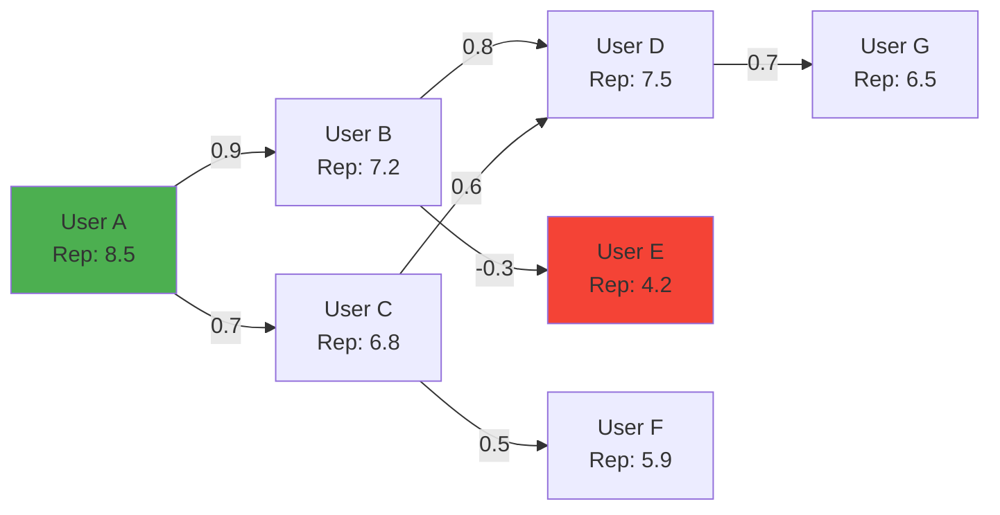
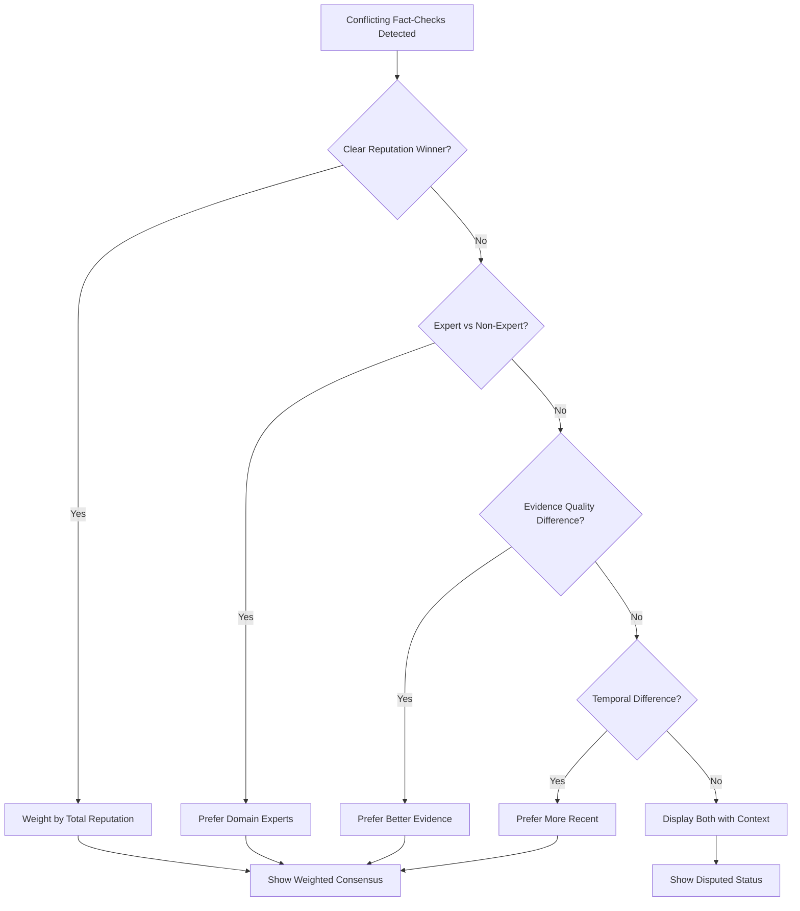
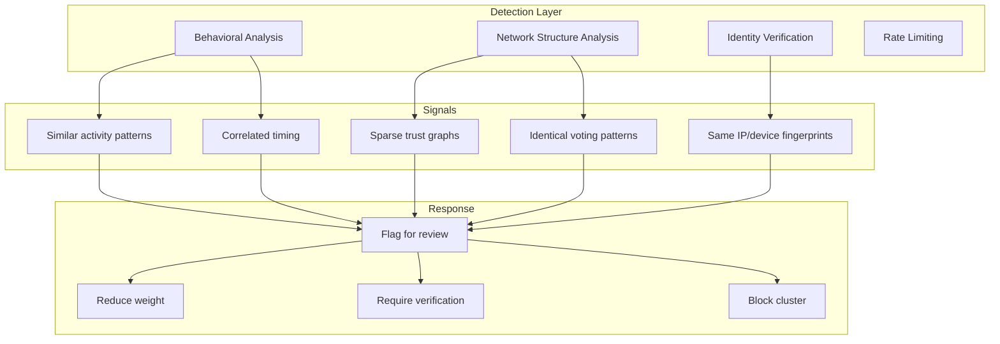
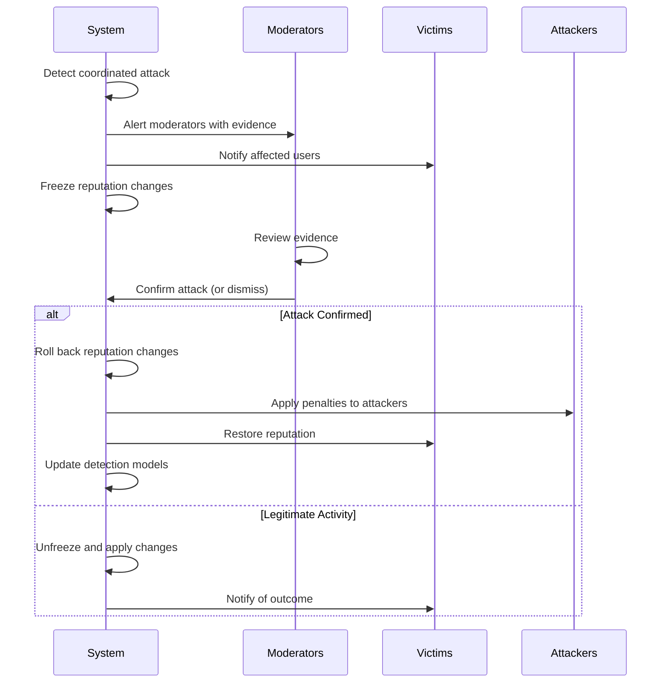

# Trust and Reputation System Design

## Overview

This document defines a comprehensive trust and reputation system for the decentralized URL metadata network. The system enables users to build reputation through accurate contributions, establish explicit trust relationships, and filter content based on personalized trust networks.

The trust system addresses the fundamental challenge: **anyone can post metadata about any URL, but not all metadata is equally reliable**. Without trust signals, the system would be vulnerable to spam, manipulation, and false information.

---

## Table of Contents

1. [Trust Model Design](#1-trust-model-design)
2. [Reputation Score Calculations](#2-reputation-score-calculations)
3. [Web of Trust Implementation](#3-web-of-trust-implementation)
4. [Weighted Content Display](#4-weighted-content-display)
5. [Anti-Abuse Mechanisms](#5-anti-abuse-mechanisms)
6. [NOSTR Event Schemas for Trust](#6-nostr-event-schemas-for-trust)
7. [Implementation Guidance](#7-implementation-guidance)
8. [Security Analysis](#8-security-analysis)

---

## 1. Trust Model Design

### 1.1 Trust Signal Types

The system supports multiple types of trust signals between users:

```
┌─────────────────────────────────────────────────────────────────────┐
│                        TRUST SIGNAL TAXONOMY                        │
├─────────────────────────────────────────────────────────────────────┤
│                                                                     │
│  EXPLICIT TRUST                    IMPLICIT TRUST                   │
│  ─────────────                    ──────────────                    │
│  • Direct endorsement             • Following behavior              │
│  • Domain-specific trust          • Upvoting/agreeing with content  │
│  • Vouching attestations          • Shared community membership     │
│  • Distrust declarations          • Co-endorsement patterns         │
│                                                                     │
│  EARNED REPUTATION                TRANSITIVE TRUST                  │
│  ─────────────────                ────────────────                  │
│  • Accuracy track record          • Trust via trusted intermediaries│
│  • Consistency over time          • Web of trust propagation        │
│  • Peer validation                • Community consensus             │
│  • Source quality citations       • Graph-based trust flow          │
│                                                                     │
└─────────────────────────────────────────────────────────────────────┘
```

### 1.2 Explicit Trust Declarations

Users can explicitly declare trust levels for other users:

#### Trust Levels
| Level | Value | Meaning |
|-------|-------|---------|
| `full-trust` | 1.0 | Complete trust - treat their content as highly reliable |
| `trust` | 0.7 | General trust - weight their contributions positively |
| `neutral` | 0.0 | No explicit position - rely on computed reputation |
| `skeptical` | -0.3 | Mild distrust - weight their contributions down |
| `distrust` | -0.7 | Strong distrust - significantly discount their content |
| `block` | -1.0 | Complete distrust - exclude from all calculations |

#### Domain-Specific Trust

Trust can be scoped to specific domains/topics:

```
User A trusts User B:
├── Overall: 0.7 (general trust)
├── Domain "science": 0.9 (high expertise trust)
├── Domain "politics": 0.3 (limited trust)
└── Domain "economics": null (no specific trust, uses overall)
```

**Standard Domain Categories:**
- `science` - Scientific claims, research interpretation
- `politics` - Political statements, policy claims
- `economics` - Economic data, market claims
- `technology` - Technical accuracy, product claims
- `health` - Medical/health information
- `history` - Historical facts and context
- `legal` - Legal interpretations and claims
- `media` - Media analysis, journalism quality
- `local-{region}` - Regional/local knowledge
- `industry-{sector}` - Industry-specific expertise

### 1.3 Trust Decay Functions

Trust signals and reputation decay over time to ensure:
- Recent behavior is weighted more heavily
- Inactive users don't maintain unearned reputation
- The system adapts to changing user behavior

#### Time-Based Decay Function

```
decay(t) = e^(-λ * t)

where:
  t = time since event (in days)
  λ = decay rate constant
```

**Decay Rate Constants by Signal Type:**

| Signal Type | λ (decay rate) | Half-life | Rationale |
|-------------|----------------|-----------|-----------|
| Explicit trust declaration | 0.001 | ~693 days | Trust relationships are stable |
| Individual rating accuracy | 0.005 | ~139 days | Recent accuracy matters more |
| Fact-check validation | 0.003 | ~231 days | Fact-checks have lasting value |
| Endorsement | 0.002 | ~347 days | Endorsements remain relevant |
| Activity signal | 0.01 | ~69 days | Activity should be recent |

#### Decay Implementation

```python
import math
from datetime import datetime, timedelta

def calculate_decayed_weight(
    original_weight: float,
    event_timestamp: int,
    current_timestamp: int,
    decay_rate: float
) -> float:
    """Calculate weight with time decay applied."""
    days_elapsed = (current_timestamp - event_timestamp) / 86400
    decay_factor = math.exp(-decay_rate * days_elapsed)
    return original_weight * decay_factor

def aggregate_with_decay(
    signals: list[dict],
    decay_rate: float,
    current_time: int
) -> float:
    """Aggregate multiple signals with time decay."""
    total_weight = 0.0
    weighted_sum = 0.0
    
    for signal in signals:
        decayed_weight = calculate_decayed_weight(
            signal['weight'],
            signal['timestamp'],
            current_time,
            decay_rate
        )
        weighted_sum += signal['value'] * decayed_weight
        total_weight += decayed_weight
    
    if total_weight == 0:
        return 0.0
    return weighted_sum / total_weight
```

### 1.4 Negative Trust (Distrust) Model

Negative trust requires careful handling to prevent abuse while enabling legitimate warnings:

#### Distrust Properties
1. **Asymmetric Impact**: Distrust should not cancel out trust from others
2. **Bounded Influence**: Single distrust declaration has limited effect
3. **Requires Justification**: Distrust events should include reasoning
4. **Auditable**: All distrust signals are public and contestable

#### Distrust Aggregation

```
effective_distrust(user) = max(
    aggregate_distrust * diminishing_factor,
    individual_distrust_cap
)

where:
  aggregate_distrust = sum of all distrust signals
  diminishing_factor = 1 / (1 + ln(1 + distrust_count))
  individual_distrust_cap = -0.5 (no single source can fully discredit)
```

This ensures:
- Multiple independent distrust signals have more impact
- Coordinated attacks have diminishing returns
- No single actor can destroy someone's reputation

---

## 2. Reputation Score Calculations

### 2.1 Multi-Dimensional Reputation Model

Reputation is calculated across multiple independent dimensions:

```
┌─────────────────────────────────────────────────────────────────────┐
│                    REPUTATION DIMENSIONS                            │
├─────────────────────────────────────────────────────────────────────┤
│                                                                     │
│   ACCURACY (weight: 0.30)                                           │
│   └── How often user's claims/ratings align with consensus          │
│                                                                     │
│   CONSISTENCY (weight: 0.15)                                        │
│   └── Stability of positions and methodology over time              │
│                                                                     │
│   EXPERTISE (weight: 0.20)                                          │
│   └── Demonstrated knowledge in specific domains                    │
│                                                                     │
│   PEER_RECOGNITION (weight: 0.20)                                   │
│   └── Endorsements and trust from other reputable users             │
│                                                                     │
│   SOURCE_QUALITY (weight: 0.10)                                     │
│   └── Quality and diversity of evidence cited                       │
│                                                                     │
│   ACTIVITY (weight: 0.05)                                           │
│   └── Engagement level and contribution frequency                   │
│                                                                     │
└─────────────────────────────────────────────────────────────────────┘
```

### 2.2 Reputation Score Formula

#### Overall Reputation Score

```
R(user) = Σ(wi * Di(user) * decay_factor_i)

where:
  R(user) = overall reputation score [0, 10]
  wi = weight for dimension i
  Di(user) = normalized score for dimension i [0, 10]
  decay_factor_i = time-based decay for dimension i
```

#### Dimension Calculations

**Accuracy Score (D_accuracy):**
```
D_accuracy = 10 * (validated_correct / total_validatable)

where:
  validated_correct = number of ratings/fact-checks that matched 
                      eventual consensus
  total_validatable = number of ratings/fact-checks that have been
                      independently validated
```

**Consistency Score (D_consistency):**
```
D_consistency = 10 * (1 - variance(position_shifts))

where:
  position_shifts = significant changes in stance on similar topics
  variance is normalized to [0, 1]
```

**Expertise Score (D_expertise):**
```
D_expertise(domain) = 10 * sigmoid(
    α * log(domain_contributions + 1) +
    β * domain_accuracy +
    γ * expert_endorsements
)

where:
  α, β, γ = tunable parameters
  sigmoid normalizes to [0, 10]
```

**Peer Recognition Score (D_peer):**
```
D_peer = 10 * Σ(endorser_reputation * endorsement_weight * decay) / max_possible

where:
  endorser_reputation = reputation of person giving endorsement
  endorsement_weight = strength of endorsement [0, 1]
  decay = time decay factor
  max_possible = theoretical maximum endorsement score
```

**Source Quality Score (D_source):**
```
D_source = 10 * (
    0.4 * primary_source_ratio +
    0.3 * source_diversity_score +
    0.3 * avg_source_reputation
)
```

**Activity Score (D_activity):**
```
D_activity = 10 * min(1.0, recent_contributions / activity_threshold)

where:
  recent_contributions = contributions in last 90 days
  activity_threshold = baseline expected activity (e.g., 10 contributions)
```

### 2.3 Domain-Specific Reputation

Each user has separate reputation scores per domain:

```python
class UserReputation:
    overall: float  # [0, 10]
    domains: dict[str, DomainReputation]
    
class DomainReputation:
    score: float  # [0, 10]
    contributions: int
    accuracy_rate: float
    last_active: int  # timestamp
    endorsements: list[Endorsement]
    expertise_level: str  # novice, intermediate, expert, authority
```

**Expertise Level Thresholds:**
| Level | Score | Contributions | Requirements |
|-------|-------|---------------|--------------|
| Novice | 0-3 | < 5 | New to domain |
| Intermediate | 3-6 | 5-20 | Consistent participation |
| Expert | 6-8 | 20-50 | High accuracy, peer recognition |
| Authority | 8-10 | 50+ | Top accuracy, multiple expert endorsements |

### 2.4 Cold Start Problem Solutions

New users face the "cold start" problem - they have no reputation history. The system addresses this through multiple mechanisms:

#### Strategy 1: Bootstrapping from NOSTR Identity

```python
def bootstrap_reputation(pubkey: str) -> float:
    """Calculate initial reputation from existing NOSTR presence."""
    
    # Check for NIP-05 verification
    nip05_bonus = 0.5 if has_nip05_verification(pubkey) else 0
    
    # Check account age
    age_days = get_account_age_days(pubkey)
    age_score = min(1.0, age_days / 365) * 0.5
    
    # Check existing social graph
    follower_count = get_follower_count(pubkey)
    social_score = min(1.0, math.log(follower_count + 1) / 10) * 0.5
    
    # Check if endorsed by known experts
    expert_endorsements = get_endorsements_from_experts(pubkey)
    endorsement_score = min(1.0, len(expert_endorsements) * 0.2) * 1.0
    
    base_reputation = 3.0  # Starting point
    bonus = nip05_bonus + age_score + social_score + endorsement_score
    
    return min(5.0, base_reputation + bonus)  # Cap at 5 for new users
```

#### Strategy 2: Provisional Trust Period

New users enter a "provisional" period:

```
Provisional Period Rules:
├── Duration: First 30 days OR first 10 contributions
├── Visibility: Content marked as "from new contributor"
├── Weight: Contributions weighted at 50% in aggregations
├── Verification: More stringent source requirements
└── Graduation: Automatic upon completing period with good standing
```

#### Strategy 3: Vouching System

Established users can vouch for new users:

```
Vouch Properties:
├── Voucher must have reputation ≥ 6.0
├── Voucher stakes portion of their reputation
├── Vouch provides immediate reputation boost (up to +2.0)
├── If new user behaves badly, voucher loses reputation
└── Maximum 3 active vouches per voucher
```

#### Strategy 4: Gradual Trust Unlocking

```
Trust Level Progression:
├── Level 0 (New): Can only react, view content
├── Level 1 (10 contributions): Can rate content
├── Level 2 (25 contributions): Can create annotations
├── Level 3 (50 contributions): Can create fact-checks
├── Level 4 (100 contributions): Can endorse others
└── Level 5 (Authority): Full system access
```

### 2.5 Reputation Change Mechanics

Reputation changes based on outcomes:

#### Positive Reputation Events

| Event | Impact | Conditions |
|-------|--------|------------|
| Rating matches consensus | +0.05 to accuracy | ≥10 other ratings agreeing |
| Fact-check validated | +0.2 to accuracy | Independent verification |
| Endorsement received | +0.1 to peer score | From user with rep ≥ 6 |
| Expert endorsement | +0.3 to domain expertise | From domain authority |
| Quality contribution | +0.05 to source score | High source quality rating |

#### Negative Reputation Events

| Event | Impact | Conditions |
|-------|--------|------------|
| Rating contradicts consensus | -0.03 to accuracy | ≥10 others disagreeing |
| Fact-check disputed (lost) | -0.15 to accuracy | Dispute resolved against |
| Content flagged as spam | -0.5 overall | Community consensus |
| Coordinated manipulation | -2.0 overall | Detected by anti-abuse |
| Distrust from trusted user | -0.1 to peer score | From user with rep ≥ 7 |

#### Reputation Bounds

```
Reputation Constraints:
├── Minimum: 0.0 (complete loss of standing)
├── Maximum: 10.0 (theoretical perfect reputation)
├── Rate limiting: Max ±1.0 change per day
├── Floor protection: Cannot drop below 2.0 from single event
└── Recovery rate: Minimum +0.01/day if actively contributing positively
```

---

## 3. Web of Trust Implementation

### 3.1 Trust Graph Model

The trust network forms a directed weighted graph:

```
G = (V, E, W)

where:
  V = set of users (NOSTR pubkeys)
  E = set of directed trust relationships (trustor → trustee)
  W: E → [-1, 1] = edge weights (trust levels)
```



### 3.2 Transitive Trust Calculation

Trust propagates through the network with diminishing strength:

#### Basic Transitive Trust

```
T(A→C via B) = T(A→B) × T(B→C) × propagation_factor

where:
  T(X→Y) = direct trust from X to Y
  propagation_factor = 0.7 (trust diminishes at each hop)
```

#### Multi-Path Trust Aggregation

When multiple paths exist between users:

```python
def calculate_transitive_trust(
    graph: TrustGraph,
    source: str,
    target: str,
    max_depth: int = 3
) -> float:
    """Calculate trust from source to target through all paths."""
    
    all_paths = find_all_paths(graph, source, target, max_depth)
    
    if not all_paths:
        return 0.0  # No trust path exists
    
    path_trusts = []
    for path in all_paths:
        path_trust = 1.0
        for i in range(len(path) - 1):
            edge_trust = graph.get_trust(path[i], path[i+1])
            hop_factor = 0.7 ** i  # Diminishing with each hop
            path_trust *= edge_trust * hop_factor
        path_trusts.append(path_trust)
    
    # Aggregate using max + bonus for multiple paths
    max_trust = max(path_trusts)
    additional_paths_bonus = sum(
        t * 0.1 for t in sorted(path_trusts, reverse=True)[1:5]
    )
    
    return min(1.0, max_trust + additional_paths_bonus)
```

### 3.3 PageRank-Inspired Trust Algorithm

The system uses a modified PageRank algorithm for global trust scoring:

#### TrustRank Algorithm

```python
def calculate_trust_rank(
    graph: TrustGraph,
    seed_users: list[str],
    damping: float = 0.85,
    iterations: int = 50
) -> dict[str, float]:
    """
    Calculate global trust scores using TrustRank algorithm.
    
    Args:
        graph: The trust relationship graph
        seed_users: Known trusted users (e.g., verified fact-checkers)
        damping: Probability of following trust links vs. random jump
        iterations: Number of iterations for convergence
    
    Returns:
        Dictionary mapping pubkeys to trust scores
    """
    n = len(graph.nodes)
    
    # Initialize with seed trust
    trust = {node: 0.0 for node in graph.nodes}
    for seed in seed_users:
        trust[seed] = 1.0 / len(seed_users)
    
    # Iterate until convergence
    for _ in range(iterations):
        new_trust = {}
        
        for node in graph.nodes:
            # Trust from incoming edges
            incoming_trust = sum(
                trust[src] * graph.get_trust(src, node) / graph.out_degree(src)
                for src in graph.get_incoming(node)
                if graph.out_degree(src) > 0
            )
            
            # Apply damping factor
            new_trust[node] = (1 - damping) / n + damping * incoming_trust
        
        trust = new_trust
    
    # Normalize to [0, 10] scale
    max_trust = max(trust.values()) or 1.0
    return {k: v * 10 / max_trust for k, v in trust.items()}
```

### 3.4 Configurable Trust Depth

Users can configure how deep transitive trust propagates:

```
Trust Depth Settings:
├── Depth 0: Only explicit trust (users I directly trust)
├── Depth 1: +Friends of friends (default)
├── Depth 2: +Extended network
├── Depth 3: +Broad community
└── Unlimited: Full web of trust (not recommended)
```

#### Depth Impact on Weight

```
weight_at_depth(d) = base_weight × (0.7)^d

Example (base_weight = 1.0):
├── Depth 0: 1.0
├── Depth 1: 0.7
├── Depth 2: 0.49
└── Depth 3: 0.343
```

### 3.5 User-Controlled Trust Policies

Users can define custom trust policies:

```json
{
  "trust_policy": {
    "name": "My Trust Policy",
    "max_depth": 2,
    "minimum_reputation": 5.0,
    "require_nip05": true,
    "domain_overrides": {
      "science": {
        "max_depth": 3,
        "minimum_reputation": 7.0,
        "require_expert_status": true
      },
      "politics": {
        "max_depth": 1,
        "minimum_reputation": 6.0
      }
    },
    "blocked_users": ["pubkey1", "pubkey2"],
    "seed_users": ["trusted_expert_pubkey1"],
    "trust_decay_rate": 0.002,
    "distrust_propagation": false
  }
}
```

#### Policy Types

| Policy | Description | Use Case |
|--------|-------------|----------|
| Conservative | Depth 1, high rep threshold | High-stakes decisions |
| Balanced | Depth 2, moderate threshold | General use (default) |
| Liberal | Depth 3, low threshold | Discovery, exploration |
| Expert-only | Depth 2, requires expertise | Domain-specific research |
| Custom | User-defined parameters | Advanced users |

---

## 4. Weighted Content Display

### 4.1 Rating Aggregation Algorithm

When multiple users rate the same URL, the system aggregates their ratings:

#### Weighted Average with Reputation

```python
def aggregate_ratings(
    ratings: list[Rating],
    viewer_pubkey: str,
    trust_graph: TrustGraph
) -> AggregatedRating:
    """
    Aggregate multiple ratings weighted by trust and reputation.
    """
    if not ratings:
        return None
    
    weights = []
    values_by_dimension = defaultdict(list)
    
    for rating in ratings:
        # Calculate weight from multiple factors
        author_rep = get_reputation(rating.author)
        trust_level = get_trust_level(viewer_pubkey, rating.author, trust_graph)
        time_decay = calculate_decay(rating.created_at)
        
        # Combine factors
        weight = (
            author_rep * 0.4 +
            max(0, trust_level) * 10 * 0.4 +  # trust_level is [-1, 1]
            time_decay * 10 * 0.2
        ) / 10
        
        # Apply minimum weight floor for untrusted but not distrusted
        if trust_level >= 0:
            weight = max(0.1, weight)
        else:
            weight = max(0.0, weight)  # Distrusted users can have 0 weight
        
        weights.append(weight)
        
        for dimension, score in rating.dimensions.items():
            values_by_dimension[dimension].append({
                'value': score,
                'weight': weight
            })
    
    # Calculate weighted averages per dimension
    aggregated = {}
    for dimension, weighted_values in values_by_dimension.items():
        total_weight = sum(wv['weight'] for wv in weighted_values)
        if total_weight > 0:
            aggregated[dimension] = sum(
                wv['value'] * wv['weight'] for wv in weighted_values
            ) / total_weight
    
    # Calculate confidence based on agreement and sample size
    confidence = calculate_confidence(ratings, weights)
    
    return AggregatedRating(
        dimensions=aggregated,
        sample_size=len(ratings),
        total_weight=sum(weights),
        confidence=confidence
    )
```

### 4.2 Weighting by Author Reputation

The weight formula for individual contributions:

```
W(contribution) = R_author × T_viewer→author × D_time × Q_content

where:
  R_author = normalized reputation score [0, 1]
  T_viewer→author = trust level (direct or transitive) [0, 1]
  D_time = time decay factor [0, 1]
  Q_content = content quality signals [0.5, 1.5]
```

#### Content Quality Multipliers

| Quality Signal | Multiplier Range |
|----------------|------------------|
| Has citations | 1.0 - 1.3 |
| Detailed reasoning | 1.0 - 1.2 |
| Primary sources | 1.1 - 1.4 |
| Peer-reviewed sources | 1.2 - 1.5 |
| No sources | 0.6 - 0.8 |
| Flagged content | 0.3 - 0.5 |

### 4.3 Handling Conflicting Fact-Checks

When multiple fact-checks conflict, the system uses sophisticated resolution:

#### Conflict Detection

```python
def detect_conflicts(fact_checks: list[FactCheck]) -> list[ConflictGroup]:
    """Group fact-checks by conflicting verdicts."""
    
    verdict_groups = defaultdict(list)
    for fc in fact_checks:
        verdict_groups[fc.verdict].append(fc)
    
    if len(verdict_groups) <= 1:
        return []  # No conflict
    
    conflicts = []
    for verdict_a, group_a in verdict_groups.items():
        for verdict_b, group_b in verdict_groups.items():
            if verdict_a < verdict_b and are_contradictory(verdict_a, verdict_b):
                conflicts.append(ConflictGroup(
                    verdict_a=verdict_a,
                    group_a=group_a,
                    verdict_b=verdict_b,
                    group_b=group_b
                ))
    
    return conflicts
```

#### Conflict Resolution Strategy



#### Resolution Scoring

```python
def resolve_conflict(conflict: ConflictGroup, viewer: str) -> ResolutionResult:
    """Resolve a conflict between fact-check groups."""
    
    def score_group(group: list[FactCheck]) -> float:
        return sum(
            get_fact_check_weight(fc, viewer)
            for fc in group
        )
    
    score_a = score_group(conflict.group_a)
    score_b = score_group(conflict.group_b)
    
    total = score_a + score_b
    if total == 0:
        return ResolutionResult(status='undetermined')
    
    ratio = max(score_a, score_b) / total
    
    if ratio > 0.75:  # Clear winner
        winner = conflict.verdict_a if score_a > score_b else conflict.verdict_b
        return ResolutionResult(
            status='resolved',
            verdict=winner,
            confidence=ratio,
            dissent_strength=1 - ratio
        )
    else:  # No clear consensus
        return ResolutionResult(
            status='disputed',
            primary_verdict=conflict.verdict_a if score_a > score_b else conflict.verdict_b,
            primary_support=ratio,
            alternative_verdict=conflict.verdict_b if score_a > score_b else conflict.verdict_a,
            alternative_support=1 - ratio
        )
```

### 4.4 Surfacing "Most Trusted" Content

The system provides multiple views of content based on trust:

#### Trust-Filtered Views

| View | Description | Algorithm |
|------|-------------|-----------|
| **Personal** | Your trust network only | Filter by trust_level > 0 |
| **Extended** | Your network + high-rep users | trust_level > 0 OR reputation > 7 |
| **Community** | Weighted community consensus | Full aggregation with weights |
| **Raw** | All content, equal weight | Unfiltered view |

#### Surfacing Algorithm

```python
def get_trusted_content_for_url(
    url: str,
    viewer: str,
    view_type: str = 'personal'
) -> TrustedContent:
    """Get content filtered and sorted by trust."""
    
    all_content = get_all_metadata_for_url(url)
    trust_graph = get_trust_graph(viewer)
    
    scored_content = []
    for item in all_content:
        # Calculate composite score
        author_rep = get_reputation(item.author)
        trust_level = get_trust_level(viewer, item.author, trust_graph)
        content_quality = assess_content_quality(item)
        engagement = get_engagement_score(item)
        
        composite_score = (
            trust_level * 0.4 +
            (author_rep / 10) * 0.3 +
            content_quality * 0.2 +
            engagement * 0.1
        )
        
        # Apply view filter
        if view_type == 'personal' and trust_level <= 0:
            continue
        if view_type == 'extended' and trust_level <= 0 and author_rep < 7:
            continue
        
        scored_content.append({
            'item': item,
            'score': composite_score,
            'trust_level': trust_level,
            'reputation': author_rep
        })
    
    # Sort by score
    scored_content.sort(key=lambda x: x['score'], reverse=True)
    
    return TrustedContent(
        items=scored_content,
        aggregated_rating=aggregate_ratings(
            [c['item'] for c in scored_content if c['item'].type == 'rating'],
            viewer,
            trust_graph
        )
    )
```

---

## 5. Anti-Abuse Mechanisms

### 5.1 Sybil Attack Resistance

Sybil attacks involve creating multiple fake identities to manipulate the system.

#### Detection Mechanisms



#### Sybil Detection Algorithm

```python
class SybilDetector:
    def analyze_cluster(self, pubkeys: list[str]) -> SybilAnalysis:
        """Analyze a set of accounts for Sybil behavior."""
        
        features = []
        
        # Timing correlation
        activity_times = [get_activity_timestamps(pk) for pk in pubkeys]
        timing_correlation = calculate_timing_correlation(activity_times)
        features.append(timing_correlation)
        
        # Voting pattern similarity
        votes = [get_voting_history(pk) for pk in pubkeys]
        vote_similarity = calculate_vote_similarity(votes)
        features.append(vote_similarity)
        
        # Trust graph isolation
        trust_isolation = calculate_trust_isolation(pubkeys, self.trust_graph)
        features.append(trust_isolation)
        
        # Account age distribution
        ages = [get_account_age(pk) for pk in pubkeys]
        age_clustering = calculate_age_clustering(ages)
        features.append(age_clustering)
        
        # Content uniqueness
        content = [get_user_content(pk) for pk in pubkeys]
        content_similarity = calculate_content_similarity(content)
        features.append(content_similarity)
        
        # Combine features into Sybil score
        sybil_score = self.model.predict(features)
        
        return SybilAnalysis(
            pubkeys=pubkeys,
            sybil_probability=sybil_score,
            suspicious_features=self.identify_suspicious_features(features),
            recommended_action=self.recommend_action(sybil_score)
        )
```

#### Mitigation Strategies

| Strategy | Implementation | Effectiveness |
|----------|---------------|---------------|
| **Proof of Work** | Require computational cost for account creation | Medium |
| **NIP-05 Verification** | Require domain-based identity | High |
| **Social Graph Analysis** | New accounts need trust from established users | High |
| **Rate Limiting** | Limit contributions per time window | Medium |
| **Stake-based Trust** | Require Lightning payment for elevated trust | Very High |
| **Vouching Cost** | Vouching for Sybils damages voucher reputation | High |

### 5.2 Reputation Bombing Prevention

Reputation bombing: coordinated negative attacks on legitimate users.

#### Detection Signals

```python
def detect_reputation_bombing(
    target: str,
    time_window: int = 86400  # 24 hours
) -> BombingAnalysis:
    """Detect potential coordinated reputation attacks."""
    
    recent_negative = get_negative_signals(target, since=now() - time_window)
    
    if len(recent_negative) < 5:
        return BombingAnalysis(detected=False)
    
    # Analyze attackers
    attackers = [signal.author for signal in recent_negative]
    
    signals = {
        # Are attackers connected to each other?
        'attacker_connectivity': calculate_attacker_connectivity(attackers),
        
        # Is this unusual for the target?
        'anomaly_score': calculate_reputation_anomaly(target, recent_negative),
        
        # Are attackers new or low-reputation?
        'attacker_credibility': average([get_reputation(a) for a in attackers]),
        
        # Timing clustering
        'timing_suspicion': calculate_timing_clustering(recent_negative),
        
        # Is target in a controversial topic?
        'controversy_context': assess_controversy_context(target, recent_negative)
    }
    
    bombing_score = weighted_combine(signals, {
        'attacker_connectivity': 0.25,
        'anomaly_score': 0.30,
        'attacker_credibility': 0.15,
        'timing_suspicion': 0.20,
        'controversy_context': 0.10
    })
    
    return BombingAnalysis(
        detected=bombing_score > 0.7,
        confidence=bombing_score,
        signals=signals,
        attackers=attackers
    )
```

#### Protection Mechanisms

```
Reputation Bombing Protections:
│
├── Detection Phase
│   ├── Monitor for unusual negative signal spikes
│   ├── Analyze attacker network relationships
│   └── Compare to baseline negative signal rate
│
├── Immediate Response
│   ├── Freeze reputation changes temporarily
│   ├── Flag attack for manual review
│   └── Notify target user
│
├── Analysis Phase
│   ├── Determine if attack is coordinated
│   ├── Identify participating accounts
│   └── Assess legitimacy of complaints
│
└── Resolution Phase
    ├── If legitimate: Apply reputation changes
    ├── If attack: Reverse changes, penalize attackers
    └── If mixed: Apply partial changes, flag for review
```

### 5.3 Spam Filtering Strategies

#### Multi-Layer Spam Detection

```python
class SpamFilter:
    def __init__(self):
        self.content_filter = ContentSpamFilter()
        self.behavior_filter = BehaviorSpamFilter()
        self.network_filter = NetworkSpamFilter()
    
    def evaluate(self, event: NostrEvent) -> SpamEvaluation:
        """Evaluate an event for spam probability."""
        
        # Content analysis
        content_score = self.content_filter.analyze(event.content)
        
        # Behavioral analysis
        author_behavior = self.behavior_filter.analyze(event.pubkey)
        
        # Network analysis
        network_score = self.network_filter.analyze(event.pubkey)
        
        # Combine scores
        spam_probability = (
            content_score * 0.4 +
            author_behavior * 0.35 +
            network_score * 0.25
        )
        
        return SpamEvaluation(
            spam_probability=spam_probability,
            content_issues=self.content_filter.get_issues(),
            behavior_issues=self.behavior_filter.get_issues(),
            network_issues=self.network_filter.get_issues(),
            action=self.determine_action(spam_probability)
        )
    
    def determine_action(self, probability: float) -> str:
        if probability > 0.9:
            return 'block'
        elif probability > 0.7:
            return 'quarantine'
        elif probability > 0.5:
            return 'flag'
        else:
            return 'allow'
```

#### Content-Based Spam Signals

| Signal | Weight | Description |
|--------|--------|-------------|
| Promotional language | 0.15 | Marketing/sales keywords |
| External links | 0.10 | Excessive outbound links |
| Repetitive content | 0.20 | Duplicate/near-duplicate text |
| Low information density | 0.15 | High filler word ratio |
| Template patterns | 0.20 | Generated or templated text |
| Keyword stuffing | 0.10 | Unnatural keyword density |
| Encoding anomalies | 0.10 | Obfuscation attempts |

### 5.4 Recovery from Coordinated Attacks

#### Attack Recovery Protocol



#### Recovery Actions

```python
class AttackRecovery:
    def recover_from_attack(self, attack: ConfirmedAttack) -> RecoveryResult:
        """Execute recovery procedures for a confirmed attack."""
        
        results = {
            'victims_restored': [],
            'attackers_penalized': [],
            'events_nullified': []
        }
        
        # 1. Restore victim reputations
        for victim in attack.victims:
            original_rep = self.get_pre_attack_reputation(victim)
            self.restore_reputation(victim, original_rep)
            results['victims_restored'].append(victim)
        
        # 2. Nullify attack events
        for event in attack.attack_events:
            self.nullify_event(event)
            results['events_nullified'].append(event.id)
        
        # 3. Penalize attackers
        for attacker in attack.attackers:
            penalty = self.calculate_penalty(attacker, attack)
            self.apply_penalty(attacker, penalty)
            results['attackers_penalized'].append({
                'pubkey': attacker,
                'penalty': penalty
            })
        
        # 4. Update detection models
        self.update_detection_models(attack)
        
        # 5. Create public record
        self.publish_attack_record(attack, results)
        
        return RecoveryResult(**results)
```

---

## 6. NOSTR Event Schemas for Trust

### 6.1 Trust Declaration Event (Kind: 30382)

**Type:** Parameterized Replaceable Event  
**Purpose:** Declare explicit trust/distrust towards another user

```json
{
  "kind": 30382,
  "pubkey": "<trustor-pubkey>",
  "created_at": "<unix-timestamp>",
  "tags": [
    ["d", "<trustee-pubkey>"],
    ["p", "<trustee-pubkey>"],
    ["trust-level", "<full-trust|trust|neutral|skeptical|distrust|block>"],
    ["trust-value", "<-1.0 to 1.0>"],
    ["domain", "<optional-domain>"],
    ["reason-category", "<expertise|accuracy|behavior|vouched|other>"],
    ["confidence", "<0-100>"],
    ["expires", "<optional-unix-timestamp>"],
    ["evidence", "<optional-url>", "<evidence-type>"],
    ["supersedes", "<optional-previous-event-id>"]
  ],
  "content": "<optional-explanation>",
  "sig": "<signature>"
}
```

#### Tag Specifications

| Tag | Required | Multiple | Description |
|-----|----------|----------|-------------|
| `d` | Yes | No | Trustee pubkey (for replaceability) |
| `p` | Yes | No | Trustee pubkey |
| `trust-level` | Yes | No | Named trust level |
| `trust-value` | Yes | No | Numeric trust value [-1, 1] |
| `domain` | No | Yes | Domain-specific trust scope |
| `reason-category` | No | No | Why trust was given |
| `confidence` | No | No | Confidence in trust assessment |
| `expires` | No | No | When trust declaration expires |
| `evidence` | No | Yes | Supporting evidence |
| `supersedes` | No | No | Previous trust event being replaced |

#### Example: Domain-Specific Trust

```json
{
  "kind": 30382,
  "pubkey": "3bf0c63fcb93463407af97a5e5ee64fa883d107ef9e558472c4eb9aaaefa459d",
  "created_at": 1699158000,
  "tags": [
    ["d", "82341f882b6eabcd2ba7f1ef90aad961cf074af15b9ef44a09f9d2a8fbfbe6a2"],
    ["p", "82341f882b6eabcd2ba7f1ef90aad961cf074af15b9ef44a09f9d2a8fbfbe6a2"],
    ["trust-level", "full-trust"],
    ["trust-value", "0.95"],
    ["domain", "science"],
    ["reason-category", "expertise"],
    ["confidence", "90"],
    ["evidence", "https://scholar.google.com/profile", "credentials"]
  ],
  "content": "PhD in molecular biology with 50+ peer-reviewed publications. Consistently accurate science communication on NOSTR.",
  "sig": "..."
}
```

### 6.2 Endorsement Event (Kind: 30383)

**Type:** Parameterized Replaceable Event  
**Purpose:** Endorse another user's expertise or credibility

```json
{
  "kind": 30383,
  "pubkey": "<endorser-pubkey>",
  "created_at": "<unix-timestamp>",
  "tags": [
    ["d", "<endorsee-pubkey:domain>"],
    ["p", "<endorsee-pubkey>"],
    ["endorsement-type", "<expertise|accuracy|methodology|character>"],
    ["domain", "<domain-category>"],
    ["strength", "<1-10>"],
    ["specific-skill", "<optional-specific-area>"],
    ["relationship", "<colleague|mentor|peer|observed|other>"],
    ["duration", "<how-long-known>"],
    ["evidence", "<supporting-url>", "<evidence-type>"],
    ["conditional", "<optional-condition>"]
  ],
  "content": "<endorsement-statement>",
  "sig": "<signature>"
}
```

#### Tag Specifications

| Tag | Required | Multiple | Description |
|-----|----------|----------|-------------|
| `d` | Yes | No | Endorsee pubkey + domain |
| `p` | Yes | No | Endorsee pubkey |
| `endorsement-type` | Yes | No | What is being endorsed |
| `domain` | Yes | No | Domain of endorsement |
| `strength` | Yes | No | Endorsement strength [1-10] |
| `specific-skill` | No | Yes | Specific skills/areas |
| `relationship` | No | No | How endorser knows endorsee |
| `duration` | No | No | How long endorser has known endorsee |
| `evidence` | No | Yes | Supporting evidence |
| `conditional` | No | No | Conditions on endorsement |

#### Example: Expertise Endorsement

```json
{
  "kind": 30383,
  "pubkey": "3bf0c63fcb93463407af97a5e5ee64fa883d107ef9e558472c4eb9aaaefa459d",
  "created_at": 1699158000,
  "tags": [
    ["d", "82341f882b6eabcd2ba7f1ef90aad961cf074af15b9ef44a09f9d2a8fbfbe6a2:economics"],
    ["p", "82341f882b6eabcd2ba7f1ef90aad961cf074af15b9ef44a09f9d2a8fbfbe6a2"],
    ["endorsement-type", "expertise"],
    ["domain", "economics"],
    ["strength", "9"],
    ["specific-skill", "monetary-policy"],
    ["specific-skill", "inflation-analysis"],
    ["relationship", "colleague"],
    ["duration", "5 years"],
    ["evidence", "https://example.com/joint-paper", "publication"]
  ],
  "content": "I have worked with this economist for 5 years. Their analysis of monetary policy is consistently rigorous and data-driven. Highly recommend for economics fact-checking.",
  "sig": "..."
}
```

### 6.3 Domain Expertise Claim (Kind: 30384)

**Type:** Parameterized Replaceable Event  
**Purpose:** Claim expertise in a specific domain

```json
{
  "kind": 30384,
  "pubkey": "<claimant-pubkey>",
  "created_at": "<unix-timestamp>",
  "tags": [
    ["d", "<domain>"],
    ["domain", "<domain-category>"],
    ["expertise-level", "<novice|intermediate|expert|authority>"],
    ["sub-domains", "<sub-domain1>", "<sub-domain2>"],
    ["credential-type", "<academic|professional|experience|self-taught>"],
    ["credential", "<credential-description>", "<verification-url>"],
    ["institution", "<institution-name>", "<institution-url>"],
    ["years-experience", "<number>"],
    ["notable-work", "<description>", "<url>"],
    ["verification-status", "<unverified|self-attested|peer-verified|institution-verified>"]
  ],
  "content": "<detailed-expertise-description>",
  "sig": "<signature>"
}
```

#### Tag Specifications

| Tag | Required | Multiple | Description |
|-----|----------|----------|-------------|
| `d` | Yes | No | Domain category (for replaceability) |
| `domain` | Yes | No | Domain category |
| `expertise-level` | Yes | No | Claimed level of expertise |
| `sub-domains` | No | Yes | Specific sub-areas |
| `credential-type` | No | No | Type of credentials |
| `credential` | No | Yes | [description, verification-url] |
| `institution` | No | Yes | [name, url] of associated institution |
| `years-experience` | No | No | Years of experience |
| `notable-work` | No | Yes | [description, url] of notable work |
| `verification-status` | No | No | Current verification status |

#### Example: Expertise Claim

```json
{
  "kind": 30384,
  "pubkey": "82341f882b6eabcd2ba7f1ef90aad961cf074af15b9ef44a09f9d2a8fbfbe6a2",
  "created_at": 1699158000,
  "tags": [
    ["d", "health"],
    ["domain", "health"],
    ["expertise-level", "expert"],
    ["sub-domains", "epidemiology", "public-health", "biostatistics"],
    ["credential-type", "academic"],
    ["credential", "PhD Epidemiology, Johns Hopkins", "https://verify.jhu.edu/123"],
    ["institution", "Johns Hopkins Bloomberg School of Public Health", "https://publichealth.jhu.edu"],
    ["years-experience", "12"],
    ["notable-work", "COVID-19 transmission modeling research", "https://doi.org/10.1234/example"],
    ["verification-status", "institution-verified"]
  ],
  "content": "I am an epidemiologist with 12 years of experience in infectious disease modeling and public health research. My work focuses on disease transmission dynamics and intervention effectiveness.",
  "sig": "..."
}
```

### 6.4 Vouch Event (Kind: 30385)

**Type:** Parameterized Replaceable Event  
**Purpose:** Vouch for a new user, staking reputation

```json
{
  "kind": 30385,
  "pubkey": "<voucher-pubkey>",
  "created_at": "<unix-timestamp>",
  "tags": [
    ["d", "<vouchee-pubkey>"],
    ["p", "<vouchee-pubkey>"],
    ["vouch-type", "<identity|competence|character>"],
    ["stake-amount", "<0.0-1.0>"],
    ["vouch-duration", "<days>"],
    ["relationship", "<personal|professional|online|other>"],
    ["real-identity", "<known|unknown>"],
    ["conditions", "<optional-conditions>"],
    ["max-liability", "<optional-max-reputation-at-risk>"]
  ],
  "content": "<vouch-statement>",
  "sig": "<signature>"
}
```

#### Example: New User Vouch

```json
{
  "kind": 30385,
  "pubkey": "3bf0c63fcb93463407af97a5e5ee64fa883d107ef9e558472c4eb9aaaefa459d",
  "created_at": 1699158000,
  "tags": [
    ["d", "a1b2c3d4e5f6g7h8i9j0k1l2m3n4o5p6q7r8s9t0u1v2w3x4y5z6a7b8c9d0e1f2"],
    ["p", "a1b2c3d4e5f6g7h8i9j0k1l2m3n4o5p6q7r8s9t0u1v2w3x4y5z6a7b8c9d0e1f2"],
    ["vouch-type", "competence"],
    ["stake-amount", "0.3"],
    ["vouch-duration", "90"],
    ["relationship", "professional"],
    ["real-identity", "known"],
    ["max-liability", "0.5"]
  ],
  "content": "I vouch for this user. We have worked together professionally for 2 years. I stake 30% of my reputation on their good behavior for the next 90 days.",
  "sig": "..."
}
```

### 6.5 Trust List (NIP-51 Extension - Kind: 30000)

**Type:** Parameterized Replaceable Event  
**Purpose:** Maintain lists of trusted/distrusted users, integrating with NIP-51

```json
{
  "kind": 30000,
  "pubkey": "<user-pubkey>",
  "created_at": "<unix-timestamp>",
  "tags": [
    ["d", "trust-<list-type>"],
    ["title", "<list-name>"],
    ["description", "<list-description>"],
    ["p", "<pubkey1>", "<relay-hint>", "<petname>"],
    ["p", "<pubkey2>", "<relay-hint>", "<petname>"],
    ["trust-level", "<default-trust-level>"],
    ["domain", "<optional-domain-scope>"],
    ["auto-update", "<true|false>"]
  ],
  "content": "<optional-encrypted-notes>",
  "sig": "<signature>"
}
```

#### Standard Trust Lists

| List Type | `d` Tag Value | Purpose |
|-----------|---------------|---------|
| Trusted Experts | `trust-experts` | Domain experts you fully trust |
| Trusted Peers | `trust-peers` | General trusted contacts |
| Blocked | `trust-blocked` | Users to completely ignore |
| Skeptical | `trust-skeptical` | Users to weight down |
| Seeds | `trust-seeds` | Seed users for TrustRank |

#### Example: Expert Trust List

```json
{
  "kind": 30000,
  "pubkey": "3bf0c63fcb93463407af97a5e5ee64fa883d107ef9e558472c4eb9aaaefa459d",
  "created_at": 1699158000,
  "tags": [
    ["d", "trust-experts-science"],
    ["title", "Trusted Science Experts"],
    ["description", "Scientists and science communicators I trust for fact-checking"],
    ["p", "82341f882b6eabcd2ba7f1ef90aad961cf074af15b9ef44a09f9d2a8fbfbe6a2", "wss://relay.example.com", "Dr. Jane Smith"],
    ["p", "a1b2c3d4e5f6a1b2c3d4e5f6a1b2c3d4e5f6a1b2c3d4e5f6a1b2c3d4e5f6a1b2", "wss://relay2.example.com", "ScienceChecker"],
    ["trust-level", "full-trust"],
    ["domain", "science"],
    ["auto-update", "false"]
  ],
  "content": "",
  "sig": "..."
}
```

### 6.6 Reputation Attestation Event (Kind: 30386)

**Type:** Parameterized Replaceable Event  
**Purpose:** Third-party attestation of reputation scores (for aggregators/services)

```json
{
  "kind": 30386,
  "pubkey": "<attestor-pubkey>",
  "created_at": "<unix-timestamp>",
  "tags": [
    ["d", "<subject-pubkey:methodology>"],
    ["p", "<subject-pubkey>"],
    ["attestor-type", "<algorithm|human|organization|consensus>"],
    ["methodology", "<methodology-identifier>"],
    ["reputation-overall", "<0-10>"],
    ["reputation-accuracy", "<0-10>"],
    ["reputation-consistency", "<0-10>"],
    ["reputation-domain", "<domain>", "<score>"],
    ["sample-size", "<number-of-data-points>"],
    ["confidence-interval", "<lower>", "<upper>", "<confidence>"],
    ["valid-until", "<unix-timestamp>"],
    ["computation-hash", "<hash-of-input-data>"],
    ["data-sources", "<source1>", "<source2>"]
  ],
  "content": "<methodology-explanation>",
  "sig": "<signature>"
}
```

#### Example: Algorithmic Reputation Attestation

```json
{
  "kind": 30386,
  "pubkey": "reputation-service-pubkey",
  "created_at": 1699158000,
  "tags": [
    ["d", "82341f882b6eabcd2ba7f1ef90aad961cf074af15b9ef44a09f9d2a8fbfbe6a2:trust-rank-v1"],
    ["p", "82341f882b6eabcd2ba7f1ef90aad961cf074af15b9ef44a09f9d2a8fbfbe6a2"],
    ["attestor-type", "algorithm"],
    ["methodology", "trust-rank-v1"],
    ["reputation-overall", "8.3"],
    ["reputation-accuracy", "8.7"],
    ["reputation-consistency", "7.9"],
    ["reputation-domain", "science", "9.1"],
    ["reputation-domain", "politics", "6.5"],
    ["sample-size", "247"],
    ["confidence-interval", "8.0", "8.6", "95"],
    ["valid-until", "1699244400"],
    ["computation-hash", "a1b2c3d4e5f6..."],
    ["data-sources", "wss://relay1.example.com", "wss://relay2.example.com"]
  ],
  "content": "# TrustRank v1 Reputation Score\n\n## Methodology\nComputed using PageRank-inspired algorithm with seed users from verified fact-checkers list.\n\n## Score Breakdown\n- Accuracy: Based on 187 validatable fact-checks\n- Consistency: Based on position stability over 12 months\n- Domain scores: Based on domain-specific contributions and peer endorsements",
  "sig": "..."
}
```

### 6.7 Event Kind Summary

| Kind | Name | Type | Purpose |
|------|------|------|---------|
| 30382 | Trust Declaration | Param. Replaceable | Explicit trust/distrust |
| 30383 | Endorsement | Param. Replaceable | Expertise endorsement |
| 30384 | Expertise Claim | Param. Replaceable | Self-declared expertise |
| 30385 | Vouch | Param. Replaceable | New user vouching |
| 30000 | Trust List | Param. Replaceable | Trust list (NIP-51) |
| 30386 | Reputation Attestation | Param. Replaceable | Third-party reputation score |

---

## 7. Implementation Guidance

### 7.1 Client-Side vs Relay-Side Computation

#### Computation Distribution

```
┌─────────────────────────────────────────────────────────────────────┐
│                    COMPUTATION DISTRIBUTION                         │
├─────────────────────────────────────────────────────────────────────┤
│                                                                     │
│  CLIENT-SIDE                         RELAY-SIDE / SERVICE           │
│  ───────────                         ────────────────────           │
│  • Personal trust graph              • Global TrustRank             │
│  • Trust policy application          • Reputation attestations      │
│  • Content filtering by trust        • Spam detection               │
│  • Local reputation weights          • Sybil detection              │
│  • UI personalization                • Aggregate computations       │
│  • Privacy-sensitive calculations    • Event indexing               │
│                                                                     │
│  HYBRID                                                             │
│  ──────                                                             │
│  • Transitive trust (cached server, applied client)                 │
│  • Rating aggregation (pre-computed, filtered client-side)          │
│  • Conflict resolution (server suggestion, client decision)         │
│                                                                     │
└─────────────────────────────────────────────────────────────────────┘
```

#### Client Implementation

```typescript
class TrustClient {
  private trustGraph: TrustGraph;
  private reputationCache: Map<string, CachedReputation>;
  private trustPolicy: TrustPolicy;
  
  async initializeTrustGraph(userPubkey: string): Promise<void> {
    // 1. Load user's explicit trust declarations
    const trustEvents = await this.relay.list([
      { kinds: [30382], authors: [userPubkey] }
    ]);
    
    // 2. Load trust lists
    const trustLists = await this.relay.list([
      { kinds: [30000], authors: [userPubkey], "#d": ["trust-*"] }
    ]);
    
    // 3. Build local trust graph
    this.trustGraph = new TrustGraph();
    for (const event of trustEvents) {
      this.trustGraph.addEdge(
        userPubkey,
        event.tags.find(t => t[0] === 'p')[1],
        parseFloat(event.tags.find(t => t[0] === 'trust-value')[1])
      );
    }
    
    // 4. Extend with transitive trust (up to configured depth)
    await this.extendTransitiveTrust(userPubkey, this.trustPolicy.maxDepth);
  }
  
  async getContentWeight(
    content: Content,
    authorPubkey: string
  ): Promise<number> {
    // 1. Get direct trust level
    const directTrust = this.trustGraph.getDirectTrust(authorPubkey);
    
    // 2. Get transitive trust if no direct relationship
    const transitiveTrust = directTrust ?? 
      this.trustGraph.getTransitiveTrust(authorPubkey);
    
    // 3. Get cached reputation
    const reputation = await this.getCachedReputation(authorPubkey);
    
    // 4. Calculate weight
    return this.calculateWeight(directTrust, transitiveTrust, reputation);
  }
}
```

#### Server-Side Services

```python
class TrustService:
    """Server-side trust computation service."""
    
    def __init__(self, db: Database, relays: list[str]):
        self.db = db
        self.relays = relays
        self.trust_rank_cache = {}
    
    async def compute_global_trust_rank(self) -> dict[str, float]:
        """Compute TrustRank for all users (periodic batch job)."""
        
        # 1. Load all trust relationships
        trust_events = await self.fetch_all_trust_events()
        
        # 2. Build global trust graph
        graph = self.build_trust_graph(trust_events)
        
        # 3. Get seed users (verified fact-checkers)
        seeds = await self.get_verified_seeds()
        
        # 4. Run TrustRank algorithm
        trust_scores = calculate_trust_rank(graph, seeds)
        
        # 5. Cache results
        self.trust_rank_cache = trust_scores
        
        # 6. Publish attestations for significant users
        await self.publish_reputation_attestations(trust_scores)
        
        return trust_scores
    
    async def detect_anomalies(self) -> list[Anomaly]:
        """Detect trust network anomalies (Sybil, bombing, etc.)."""
        
        anomalies = []
        
        # Check for Sybil clusters
        sybil_clusters = self.sybil_detector.find_suspicious_clusters()
        anomalies.extend(sybil_clusters)
        
        # Check for reputation bombing
        bombing_targets = self.bombing_detector.find_targets()
        anomalies.extend(bombing_targets)
        
        return anomalies
```

### 7.2 Caching Strategies

#### Multi-Level Cache Architecture

```
┌─────────────────────────────────────────────────────────────────────┐
│                         CACHE LAYERS                                │
├─────────────────────────────────────────────────────────────────────┤
│                                                                     │
│  L1: Browser/Client Memory                                          │
│  ├── Current session trust graph                                    │
│  ├── Recently viewed user reputations                               │
│  ├── Active trust policy                                            │
│  └── TTL: Session duration                                          │
│                                                                     │
│  L2: Client IndexedDB                                               │
│  ├── Full personal trust graph                                      │
│  ├── Reputation attestations                                        │
│  ├── Historical trust relationships                                 │
│  └── TTL: 24 hours (refreshed on changes)                          │
│                                                                     │
│  L3: Relay/Server Redis                                             │
│  ├── Global TrustRank scores                                        │
│  ├── User reputation summaries                                      │
│  ├── Aggregate ratings                                              │
│  └── TTL: 1-6 hours (depending on data type)                       │
│                                                                     │
│  L4: Relay/Server Database                                          │
│  ├── Complete event history                                         │
│  ├── Trust graph edges                                              │
│  ├── Reputation computation logs                                    │
│  └── TTL: Permanent (pruned by policy)                             │
│                                                                     │
└─────────────────────────────────────────────────────────────────────┘
```

#### Cache Invalidation Strategy

```python
class TrustCacheManager:
    def on_trust_event(self, event: NostrEvent):
        """Handle cache invalidation when trust events arrive."""
        
        trustor = event.pubkey
        trustee = event.tags.find('p')[1]
        
        # Invalidate direct trust caches
        self.invalidate(f"trust:{trustor}:{trustee}")
        self.invalidate(f"trust-graph:{trustor}")
        
        # Invalidate transitive trust (affected paths)
        affected_users = self.find_transitive_dependents(trustor, trustee)
        for user in affected_users:
            self.invalidate(f"transitive-trust:{user}:*")
        
        # Mark reputation as stale (but don't immediately invalidate)
        self.mark_stale(f"reputation:{trustee}")
    
    def on_endorsement_event(self, event: NostrEvent):
        """Handle endorsement event."""
        endorsee = event.tags.find('p')[1]
        domain = event.tags.find('domain')[1]
        
        self.invalidate(f"endorsements:{endorsee}")
        self.invalidate(f"reputation:{endorsee}:domain:{domain}")
    
    def refresh_stale_entries(self):
        """Batch refresh stale cache entries."""
        stale_entries = self.get_stale_entries()
        
        for entry in stale_entries:
            if entry.type == 'reputation':
                self.recompute_reputation(entry.key)
            elif entry.type == 'aggregate':
                self.recompute_aggregate(entry.key)
```

### 7.3 Performance Considerations

#### Optimization Strategies

| Area | Strategy | Impact |
|------|----------|--------|
| Trust Graph Loading | Lazy load, depth-limited | Reduces initial load time |
| Reputation Queries | Batch requests, cache aggressively | Reduces relay load |
| Transitive Trust | Pre-compute common paths | Faster trust resolution |
| Rating Aggregation | Incremental updates | Avoids full recomputation |
| Event Processing | Async, batched | Better throughput |

#### Performance Budgets

```
Performance Targets:
│
├── Trust Graph Initialization
│   ├── Cold start: < 2 seconds
│   └── Warm start (cached): < 200ms
│
├── Single Reputation Query
│   ├── Cached: < 10ms
│   └── Uncached: < 100ms
│
├── Content Weight Calculation
│   └── Per item: < 5ms
│
├── Rating Aggregation
│   ├── < 100 ratings: < 50ms
│   └── < 1000 ratings: < 200ms
│
└── Trust Event Processing
    └── Per event: < 20ms
```

#### Scaling Strategies

```python
class TrustScaling:
    """Strategies for scaling trust computations."""
    
    @staticmethod
    def shard_trust_graph(graph: TrustGraph, num_shards: int) -> list[TrustGraph]:
        """Shard trust graph by user pubkey prefix."""
        shards = [TrustGraph() for _ in range(num_shards)]
        
        for node in graph.nodes:
            shard_id = int(node[:2], 16) % num_shards
            shards[shard_id].add_node(node)
            
            for edge in graph.get_edges(node):
                target_shard = int(edge.target[:2], 16) % num_shards
                if target_shard == shard_id:
                    shards[shard_id].add_edge(edge)
                else:
                    # Cross-shard edge - handle separately
                    shards[shard_id].add_cross_shard_edge(edge, target_shard)
        
        return shards
    
    @staticmethod
    def incremental_trust_rank(
        previous_scores: dict[str, float],
        changed_edges: list[Edge],
        graph: TrustGraph
    ) -> dict[str, float]:
        """Incrementally update TrustRank instead of full recomputation."""
        
        # Find affected subgraph
        affected_nodes = set()
        for edge in changed_edges:
            affected_nodes.add(edge.source)
            affected_nodes.add(edge.target)
            affected_nodes.update(graph.get_downstream(edge.target, depth=3))
        
        # Recompute only affected portion
        partial_scores = calculate_partial_trust_rank(
            graph,
            affected_nodes,
            previous_scores
        )
        
        # Merge with previous scores
        return {**previous_scores, **partial_scores}
```

---

## 8. Security Analysis

### 8.1 Attack Vectors and Mitigations

#### Attack Vector Matrix

| Attack | Description | Probability | Impact | Mitigation |
|--------|-------------|-------------|--------|------------|
| **Sybil Attack** | Create many fake identities | High | High | Social graph analysis, proof of work, vouching system |
| **Reputation Bombing** | Coordinated negative ratings | Medium | High | Anomaly detection, rate limiting, appeal process |
| **Trust Injection** | Manipulate trust graph | Medium | High | Trust decay, bounded propagation, source verification |
| **Expertise Fraud** | False expertise claims | High | Medium | Peer validation, credential verification, track record |
| **Collusion Rings** | Groups artificially boosting each other | Medium | Medium | Graph analysis, independent verification requirements |
| **Timing Attacks** | Exploit decay function | Low | Low | Randomized decay factors, minimum hold periods |
| **Eclipse Attack** | Isolate user from honest network | Low | High | Multiple relay usage, diverse trust sources |

#### Detailed Attack Analysis

##### Sybil Attack

```
Attack Description:
├── Create thousands of fake NOSTR identities
├── Have them endorse each other
├── Build fake reputation through self-votes
└── Use fake reputation to manipulate content ratings

Mitigation Strategies:
├── Social Graph Analysis
│   ├── Detect densely connected clusters
│   ├── Identify accounts with no outside connections
│   └── Flag accounts with identical behavior patterns
│
├── Proof of Work/Stake
│   ├── Require computational cost for account creation
│   ├── Require Lightning payment for elevated privileges
│   └── Require NIP-05 verification for full access
│
├── Vouching System
│   ├── New users need vouching from established users
│   ├── Vouchers stake reputation
│   └── Sybil detection penalizes vouchers
│
└── Trust Bootstrapping
    ├── Start with minimal trust
    ├── Earn trust through validated contributions
    └── Weight new users' contributions lower
```

##### Reputation Bombing

```
Attack Description:
├── Identify target user
├── Coordinate many accounts to give negative ratings
├── File false disputes and distrust declarations
└── Overwhelm target's positive reputation

Mitigation Strategies:
├── Rate Limiting
│   ├── Max reputation change per day
│   ├── Max negative signals from single source
│   └── Cooling off period after large changes
│
├── Anomaly Detection
│   ├── Compare to historical negative rate
│   ├── Detect coordinated timing patterns
│   └── Identify attacker cluster patterns
│
├── Source Weighting
│   ├── Weight negative signals by source reputation
│   ├── Require justification for distrust
│   └── Diminishing returns for multiple negatives
│
└── Recovery Process
    ├── Automatic freeze on anomaly detection
    ├── Manual review process
    └── Reputation restoration if attack confirmed
```

### 8.2 Edge Cases and Failure Modes

#### Edge Case Handling

| Edge Case | Potential Issue | Handling Strategy |
|-----------|-----------------|-------------------|
| Circular trust | A trusts B trusts C trusts A | Detect cycles, prevent infinite loops |
| Trust revocation | User loses trust from key figure | Gradual decay, not instant collapse |
| Relay unavailability | Trust data inaccessible | Cache locally, graceful degradation |
| Expert domain change | Expert leaves their field | Time decay on domain expertise |
| Mass exodus | Many users leave platform | Maintain functionality with remaining users |
| Key compromise | User's NOSTR key stolen | Revocation mechanism, trust reset |

#### Failure Mode Analysis

```
┌─────────────────────────────────────────────────────────────────────┐
│                        FAILURE MODE MATRIX                          │
├─────────────────────────────────────────────────────────────────────┤
│                                                                     │
│  NETWORK FAILURES                                                   │
│  ├── All relays down → Use local cache, queue updates              │
│  ├── Partition → Maintain multiple relay connections               │
│  └── High latency → Pre-fetch, optimistic UI updates               │
│                                                                     │
│  DATA INTEGRITY FAILURES                                            │
│  ├── Corrupted events → Signature verification, reject invalid     │
│  ├── Conflicting events → Use timestamp ordering, latest wins      │
│  └── Missing events → Request from multiple relays, reconstruct    │
│                                                                     │
│  TRUST SYSTEM FAILURES                                              │
│  ├── Trust graph isolated → Fall back to global reputation         │
│  ├── No trust path exists → Use public aggregates                  │
│  └── Reputation service down → Use cached scores                   │
│                                                                     │
│  SECURITY FAILURES                                                  │
│  ├── Attack detected → Freeze affected calculations                │
│  ├── Key compromise → Support revocation events                    │
│  └── Algorithm exploit → Feature flags for algorithm versions      │
│                                                                     │
└─────────────────────────────────────────────────────────────────────┘
```

#### Recovery Procedures

```python
class TrustRecovery:
    """Recovery procedures for trust system failures."""
    
    async def recover_from_relay_failure(self):
        """Recover when relays become unavailable."""
        
        # 1. Switch to backup relays
        available_relays = await self.find_available_relays()
        self.relay_pool.update(available_relays)
        
        # 2. Use local cache
        if not available_relays:
            self.enable_offline_mode()
            return
        
        # 3. Sync queued events
        queued_events = self.get_queued_events()
        await self.batch_publish(queued_events, available_relays)
        
        # 4. Refresh stale caches
        await self.refresh_stale_caches()
    
    async def recover_from_key_compromise(self, compromised_pubkey: str):
        """Handle a compromised user key."""
        
        # 1. Check for revocation event
        revocation = await self.find_revocation_event(compromised_pubkey)
        
        if revocation:
            # 2. Mark all events from after compromise as suspect
            compromise_time = revocation.tags.find('compromise-time')[1]
            await self.mark_events_suspect(compromised_pubkey, compromise_time)
            
            # 3. Reset trust relationships
            await self.reset_trust_for_user(compromised_pubkey)
            
            # 4. Notify users who trusted compromised key
            trusting_users = await self.get_users_trusting(compromised_pubkey)
            await self.notify_compromise(trusting_users, compromised_pubkey)
    
    async def recover_from_attack(self, attack: ConfirmedAttack):
        """Recover from a confirmed attack."""
        
        # 1. Identify attack time window
        start_time = attack.first_event_time
        end_time = attack.last_event_time
        
        # 2. Rollback affected reputation changes
        for victim in attack.victims:
            await self.rollback_reputation(
                victim,
                to_time=start_time - 1
            )
        
        # 3. Nullify attack events
        for event_id in attack.event_ids:
            await self.mark_event_nullified(event_id, reason='confirmed-attack')
        
        # 4. Penalize attackers
        for attacker in attack.attackers:
            penalty = self.calculate_attack_penalty(attacker, attack)
            await self.apply_permanent_penalty(attacker, penalty)
        
        # 5. Update detection models
        await self.retrain_detection_models(attack)
```

### 8.3 Security Best Practices

#### For Users

```
User Security Guidelines:
│
├── Trust Management
│   ├── Start with conservative trust policy
│   ├── Only give high trust to users you can verify
│   ├── Regularly review your trust list
│   └── Be skeptical of new accounts asking for trust
│
├── Key Security
│   ├── Use a secure NOSTR key manager
│   ├── Never share your private key
│   ├── Consider using a hardware signer
│   └── Set up key rotation/revocation plan
│
├── Content Verification
│   ├── Don't rely solely on trust scores
│   ├── Check primary sources when possible
│   ├── Look for consensus across trusted sources
│   └── Report suspicious behavior
│
└── Privacy
    ├── Review what trust relationships you make public
    ├── Use different keys for different contexts if needed
    └── Be aware that your voting patterns are public
```

#### For Client Developers

```
Developer Security Guidelines:
│
├── Event Validation
│   ├── Always verify event signatures
│   ├── Validate all tag formats
│   ├── Sanitize user-provided content
│   └── Implement event size limits
│
├── Trust Computation
│   ├── Bound all trust values to valid ranges
│   ├── Handle edge cases explicitly
│   ├── Implement timeout for graph traversal
│   └── Cache defensively (validate cached data)
│
├── Privacy Protection
│   ├── Don't expose user's full trust graph unnecessarily
│   ├── Implement rate limiting on queries
│   ├── Allow users to control data retention
│   └── Support private trust relationships
│
└── Error Handling
    ├── Graceful degradation on service failures
    ├── Clear error messages without leaking internals
    ├── Audit logging for security events
    └── Incident response procedures
```

---

## Summary

This trust and reputation system design provides:

### Core Capabilities

1. **Explicit Trust Signals** - Users can declare trust/distrust with domain specificity
2. **Multi-Dimensional Reputation** - Scores across accuracy, consistency, expertise, and peer recognition
3. **Web of Trust** - Transitive trust with configurable depth and policies
4. **Weighted Aggregation** - Content weighted by author reputation and viewer trust
5. **Anti-Abuse Protection** - Multiple layers of Sybil, spam, and attack resistance

### NOSTR Integration

- **6 new event kinds** (30382-30386) for trust-related data
- **NIP-51 integration** for trust lists
- Queryable with standard NOSTR filters
- Compatible with existing NOSTR infrastructure

### Key Design Principles

1. **User Control** - Users configure their own trust policies
2. **Transparency** - All calculations are auditable
3. **Decentralization** - No central authority required
4. **Graceful Degradation** - Works with partial data
5. **Attack Resistance** - Multiple defensive layers

### Next Steps for Implementation

1. Implement core trust event handling
2. Build client-side trust graph management
3. Deploy server-side TrustRank computation
4. Integrate with existing content aggregation
5. Add anti-abuse detection systems
6. Build user interfaces for trust management
