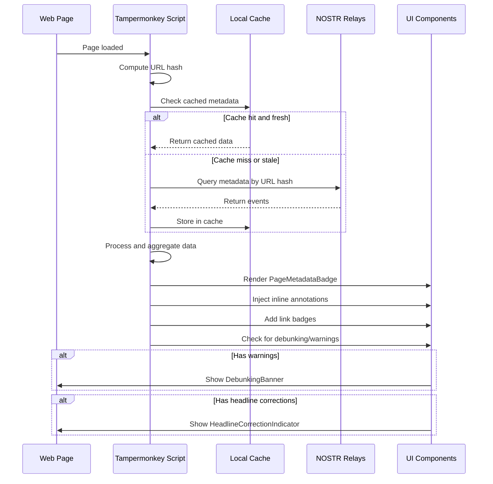
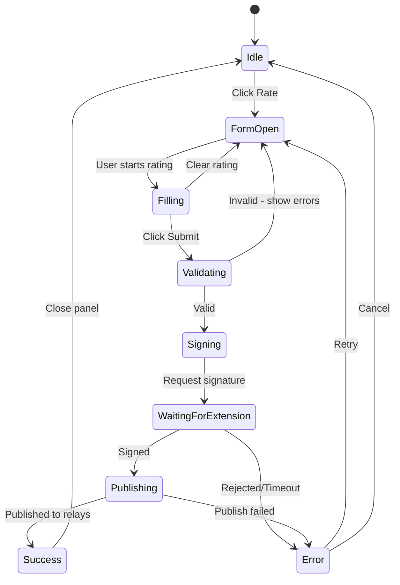
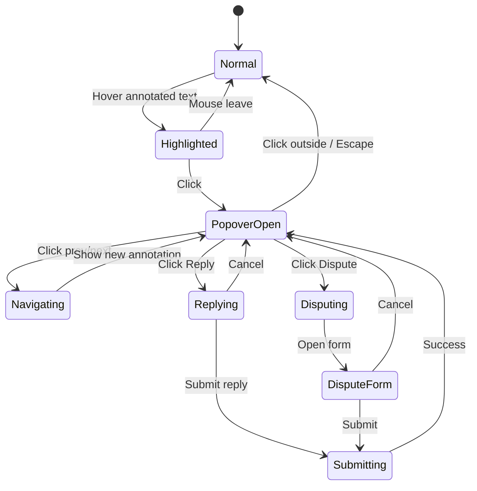
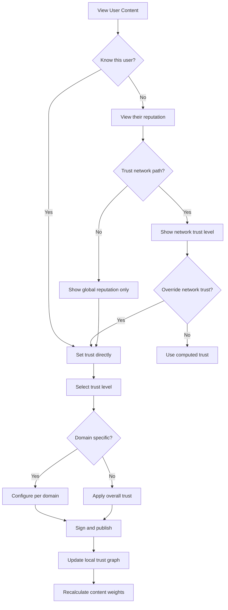
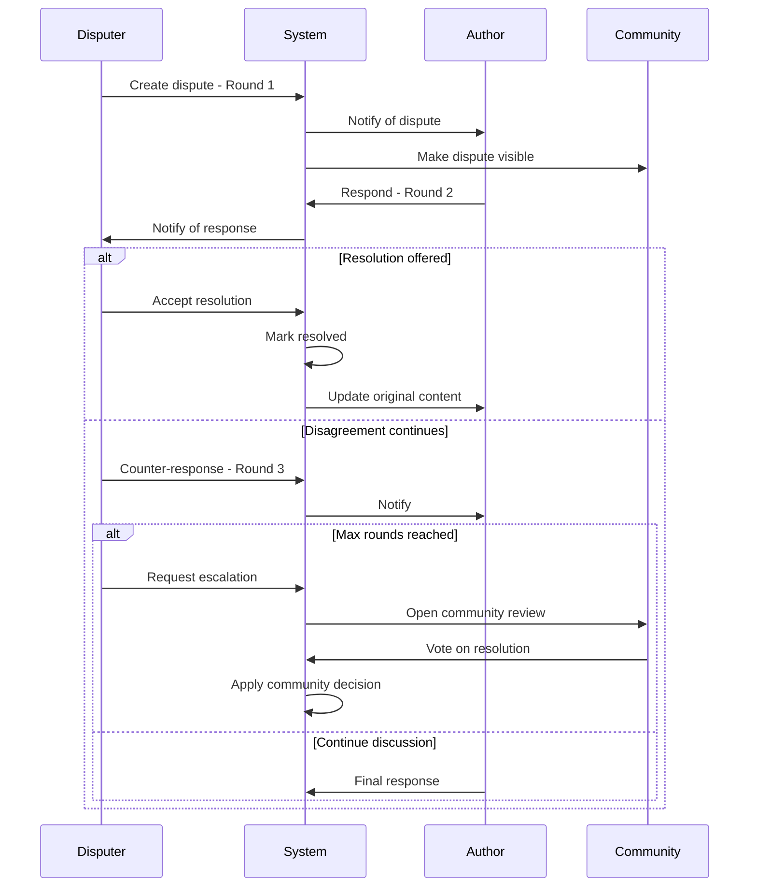

# UI/UX Design Specification for NOSTR URL Metadata Display

## Overview

This document provides comprehensive UI/UX specifications for displaying NOSTR URL metadata within web pages via a Tampermonkey script. The design extends the existing article capture script to show metadata from the NOSTR network, supporting all event types defined in [`nostr-event-schemas.md`](../nostr-event-schemas.md) and trust signals from [`trust-reputation-system.md`](trust-reputation-system.md).

### Design Principles

1. **Non-Intrusive by Default** - Don't break website layouts
2. **Progressive Disclosure** - Summary → Details on demand
3. **Accessibility** - WCAG 2.1 AA compliance
4. **Performance** - Minimal layout shifts, lazy loading
5. **Themeable** - Adapt to light/dark sites
6. **Mobile-Friendly** - Touch targets, responsive
7. **Internationalization Ready** - RTL support, translatable

---

## Table of Contents

1. [Component Library Specification](#1-component-library-specification)
2. [Interaction Flows](#2-interaction-flows)
3. [Visual Design System](#3-visual-design-system)
4. [Layout Specifications](#4-layout-specifications)
5. [Animation/Transition Specs](#5-animationtransition-specs)
6. [CSS Architecture](#6-css-architecture)

---

## 1. Component Library Specification

### 1.1 Page-Level Metadata Display

The floating badge widget shows aggregate page status at a glance.

#### Component: `PageMetadataBadge`

```
┌─────────────────────────────────────────────────────────────────────┐
│                     PAGE METADATA BADGE                              │
├─────────────────────────────────────────────────────────────────────┤
│                                                                     │
│  COLLAPSED STATE (Default)                                          │
│  ┌──────────────────┐                                               │
│  │  ◉  8.2  │ 12 📝 │   ← Trust score + annotation count           │
│  └──────────────────┘                                               │
│                                                                     │
│  EXPANDED STATE (On click/hover)                                    │
│  ┌────────────────────────────────────┐                             │
│  │  NOSTR URL Metadata                │                             │
│  ├────────────────────────────────────┤                             │
│  │  ⭐ Overall: 8.2/10  (47 ratings)  │                             │
│  │  ────────────────────────────────  │                             │
│  │  📊 Accuracy:   8.4 ████████░░     │                             │
│  │  📖 Quality:    7.9 ███████▒░░     │                             │
│  │  🔍 Sources:    8.9 █████████░     │                             │
│  │  ⚖️  Bias:       7.8 ███████▒░░     │                             │
│  │  ────────────────────────────────  │                             │
│  │  📝 12 Annotations                 │                             │
│  │  ✓  3 Fact-checks                  │                             │
│  │  ⚠️  1 Headline correction          │                             │
│  │  💬 2 Disputes                     │                             │
│  │  ────────────────────────────────  │                             │
│  │  [+ Add] [Rate] [React] [⚙️]       │                             │
│  └────────────────────────────────────┘                             │
│                                                                     │
└─────────────────────────────────────────────────────────────────────┘
```

**Props/State:**

| Prop | Type | Default | Description |
|------|------|---------|-------------|
| `aggregateRating` | `AggregatedRating` | null | Trust-weighted aggregate scores |
| `annotationCount` | `number` | 0 | Total annotations on page |
| `factCheckCount` | `number` | 0 | Number of fact-checks |
| `disputeCount` | `number` | 0 | Active disputes |
| `headlineCorrectionCount` | `number` | 0 | Headline corrections |
| `hasDebunking` | `boolean` | false | Page has debunking content |
| `position` | `Position` | bottom-right | Badge position |
| `expanded` | `boolean` | false | Current expansion state |
| `loading` | `boolean` | false | Data loading state |
| `error` | `string` | null | Error message if any |

**States:**

```
┌─────────────────────────────────────────────────────────────────────┐
│                    PAGE BADGE STATE MACHINE                         │
├─────────────────────────────────────────────────────────────────────┤
│                                                                     │
│    ┌────────┐     click      ┌──────────┐                          │
│    │  IDLE  │ ─────────────► │ EXPANDED │                          │
│    │(badge) │ ◄───────────── │ (panel)  │                          │
│    └────────┘   click/blur   └──────────┘                          │
│        │                          │                                 │
│        │ hover                    │ action                          │
│        ▼                          ▼                                 │
│    ┌────────┐              ┌───────────┐                           │
│    │ HOVER  │              │  SUBMENU  │                           │
│    │(tooltip)              │(rate/react)                           │
│    └────────┘              └───────────┘                           │
│                                                                     │
└─────────────────────────────────────────────────────────────────────┘
```

---

### 1.2 Headline Correction Display

Displays when the page has headline corrections (Kind 32129).

#### Component: `HeadlineCorrectionBanner`

```
┌─────────────────────────────────────────────────────────────────────┐
│                   HEADLINE CORRECTION BANNER                         │
├─────────────────────────────────────────────────────────────────────┤
│                                                                     │
│  INDICATOR (Appears near headline)                                  │
│  ┌─────────────────────────────────────────────────────────────┐   │
│  │ ⚠️ Headline has 2 suggested corrections                      │   │
│  │    by trusted reviewers                               [View] │   │
│  └─────────────────────────────────────────────────────────────┘   │
│                                                                     │
│  EXPANDED VIEW (On click)                                           │
│  ┌─────────────────────────────────────────────────────────────┐   │
│  │ ✏️ Headline Corrections                              [Close] │   │
│  ├─────────────────────────────────────────────────────────────┤   │
│  │                                                               │   │
│  │  ORIGINAL:                                                    │   │
│  │  ┌─────────────────────────────────────────────────────────┐ │   │
│  │  │ Scientists SHOCKED by Discovery That Changes EVERYTHING │ │   │
│  │  └─────────────────────────────────────────────────────────┘ │   │
│  │                                                               │   │
│  │  SUGGESTED (by @TrustedReviewer ⭐7.8):                       │   │
│  │  ┌─────────────────────────────────────────────────────────┐ │   │
│  │  │ Study Finds Correlation Between Sleep and Heart Health  │ │   │
│  │  └─────────────────────────────────────────────────────────┘ │   │
│  │                                                               │   │
│  │  Problems: 🏷️ clickbait  🏷️ sensationalized                   │   │
│  │  Severity: 🟠 Moderate                                        │   │
│  │                                                               │   │
│  │  [▼ Show explanation]                                         │   │
│  │  ────────────────────────────────────────────────────────    │   │
│  │                                                               │   │
│  │  👍 23 Agree  👎 2 Disagree    [I Agree] [I Disagree]        │   │
│  │                                                               │   │
│  └─────────────────────────────────────────────────────────────┘   │
│                                                                     │
└─────────────────────────────────────────────────────────────────────┘
```

**Props/State:**

| Prop | Type | Default | Description |
|------|------|---------|-------------|
| `originalHeadline` | `string` | required | The original headline |
| `corrections` | `HeadlineCorrection[]` | [] | List of corrections |
| `selectedCorrection` | `number` | 0 | Currently displayed correction |
| `expanded` | `boolean` | false | Panel expanded state |
| `showExplanation` | `boolean` | false | Show detailed explanation |

**Severity Indicators:**

| Severity | Color | Icon | Description |
|----------|-------|------|-------------|
| Minor | `--color-warning-light` | 🟡 | Slight exaggeration |
| Moderate | `--color-warning` | 🟠 | Meaningfully misleading |
| Severe | `--color-error` | 🔴 | Completely misrepresents |

---

### 1.3 Content Debunking/Retraction Display

Prominent banner for debunked or disputed content.

#### Component: `DebunkingBanner`

```
┌─────────────────────────────────────────────────────────────────────┐
│                     DEBUNKING BANNER                                 │
├─────────────────────────────────────────────────────────────────────┤
│                                                                     │
│  PROMINENT WARNING (Top of page, fixed)                             │
│  ┌─────────────────────────────────────────────────────────────┐   │
│  │ ⚠️ ━━━━━━━━━━━━━━━━━━━━━━━━━━━━━━━━━━━━━━━━━━━━━━━━━━━━━━━ │   │
│  │                                                               │   │
│  │   THIS CONTENT HAS BEEN DISPUTED                              │   │
│  │                                                               │   │
│  │   3 fact-checkers have flagged claims in this article        │   │
│  │   as FALSE or MISLEADING.                                     │   │
│  │                                                               │   │
│  │              [View Details]  [Dismiss for now]                │   │
│  │                                                               │   │
│  │ ━━━━━━━━━━━━━━━━━━━━━━━━━━━━━━━━━━━━━━━━━━━━━━━━━━━━━━━━━━━ │   │
│  └─────────────────────────────────────────────────────────────┘   │
│                                                                     │
│  DETAILS PANEL (On expand)                                          │
│  ┌─────────────────────────────────────────────────────────────┐   │
│  │ Disputed Claims                                        [×]  │   │
│  ├─────────────────────────────────────────────────────────────┤   │
│  │                                                               │   │
│  │  ❌ CLAIM 1 - Verdict: FALSE                                  │   │
│  │  ┌─────────────────────────────────────────────────────────┐ │   │
│  │  │ "The vaccine causes autism in 30% of children"          │ │   │
│  │  └─────────────────────────────────────────────────────────┘ │   │
│  │  Checked by: @FactChecker1 ⭐9.1  |  Confidence: 98%         │   │
│  │  Evidence: [CDC Study] [WHO Report] [Meta-analysis]          │   │
│  │  [▼ Full explanation]                                         │   │
│  │                                                               │   │
│  │  ────────────────────────────────────────────────────────    │   │
│  │                                                               │   │
│  │  ⚠️ CLAIM 2 - Verdict: MISLEADING                             │   │
│  │  ┌─────────────────────────────────────────────────────────┐ │   │
│  │  │ "Crime rates have doubled since 2020"                   │ │   │
│  │  └─────────────────────────────────────────────────────────┘ │   │
│  │  Checked by: @FactChecker2 ⭐8.4  |  Confidence: 85%         │   │
│  │  Missing context: Specific crime types, regional variation   │   │
│  │                                                               │   │
│  └─────────────────────────────────────────────────────────────┘   │
│                                                                     │
└─────────────────────────────────────────────────────────────────────┘
```

**Props/State:**

| Prop | Type | Default | Description |
|------|------|---------|-------------|
| `factChecks` | `FactCheck[]` | [] | Fact-checks for page claims |
| `severity` | `warning\|danger` | warning | Banner severity level |
| `dismissed` | `boolean` | false | User dismissed banner |
| `expanded` | `boolean` | false | Details panel open |
| `selectedClaim` | `number` | null | Currently focused claim |

**Verdict Badge Colors:**

| Verdict | Background | Text | Icon |
|---------|------------|------|------|
| TRUE | `--color-success-bg` | `--color-success` | ✓ |
| FALSE | `--color-error-bg` | `--color-error` | ✗ |
| MISLEADING | `--color-warning-bg` | `--color-warning` | ⚠️ |
| CONTEXT-NEEDED | `--color-info-bg` | `--color-info` | ℹ️ |
| UNVERIFIABLE | `--color-muted-bg` | `--color-muted` | ? |
| PARTIALLY-TRUE | `--color-warning-light-bg` | `--color-warning` | ◐ |

---

### 1.4 Inline Annotations

Highlights annotated text passages with hover/click details.

#### Component: `AnnotatedText`

```
┌─────────────────────────────────────────────────────────────────────┐
│                     INLINE ANNOTATIONS                               │
├─────────────────────────────────────────────────────────────────────┤
│                                                                     │
│  TEXT HIGHLIGHT (In-page)                                           │
│                                                                     │
│  "The event occurred in early ░░░░░░ which marked a turning        │
│                               │2019│                                │
│                               └──┬─┘                                │
│                                  │                                  │
│                                  ▼                                  │
│  ┌────────────────────────────────────────────┐                    │
│  │ 📝 Annotation (1 of 3)            [◀ ▶]   │                    │
│  ├────────────────────────────────────────────┤                    │
│  │                                            │                    │
│  │  Type: 🔧 Correction                       │                    │
│  │                                            │                    │
│  │  This should be 2020, not 2019.           │                    │
│  │  The event occurred in early 2020.         │                    │
│  │                                            │                    │
│  │  Source: [Timeline documentation]          │                    │
│  │                                            │                    │
│  │  ────────────────────────────────────────  │                    │
│  │  @Annotator ⭐7.2  •  2 days ago           │                    │
│  │  👍 15  👎 1  💬 3 replies                 │                    │
│  │                                            │                    │
│  │  [Reply] [Agree] [Dispute]                 │                    │
│  └────────────────────────────────────────────┘                    │
│                                                                     │
│  HIGHLIGHT STYLES BY TYPE:                                          │
│  ┌─────────────────────────────────────────────────────────────┐   │
│  │  highlight    │ Yellow background, dotted underline         │   │
│  │  correction   │ Orange background, wavy underline           │   │
│  │  fact-check   │ Blue background, solid underline            │   │
│  │  question     │ Purple background, dashed underline         │   │
│  │  comment      │ Gray background, no underline               │   │
│  └─────────────────────────────────────────────────────────────┘   │
│                                                                     │
└─────────────────────────────────────────────────────────────────────┘
```

**Props/State:**

| Prop | Type | Default | Description |
|------|------|---------|-------------|
| `text` | `string` | required | The annotated text |
| `annotations` | `Annotation[]` | [] | All annotations for this text |
| `type` | `AnnotationType` | highlight | Primary annotation type |
| `popoverOpen` | `boolean` | false | Popover visibility |
| `currentIndex` | `number` | 0 | Current annotation index |

**Annotation Types:**

| Type | Background | Border Style | Icon |
|------|------------|--------------|------|
| `highlight` | `rgba(255, 235, 59, 0.3)` | dotted | 📌 |
| `correction` | `rgba(255, 152, 0, 0.3)` | wavy | ✏️ |
| `fact-check` | `rgba(33, 150, 243, 0.3)` | solid | ✓ |
| `question` | `rgba(156, 39, 176, 0.3)` | dashed | ❓ |
| `comment` | `rgba(158, 158, 158, 0.2)` | none | 💬 |

---

### 1.5 Link Metadata Within Articles

Shows metadata badges next to links in article content.

#### Component: `LinkMetadataBadge`

```
┌─────────────────────────────────────────────────────────────────────┐
│                     LINK METADATA BADGES                             │
├─────────────────────────────────────────────────────────────────────┤
│                                                                     │
│  INLINE BADGE (Next to link)                                        │
│                                                                     │
│  "...according to this study [link]🟢 the results show..."         │
│                              └─┬──┘                                 │
│                                │                                    │
│                   ┌────────────┴────────────┐                       │
│                   │ Badges indicate:        │                       │
│                   │ 🟢 High trust (7-10)    │                       │
│                   │ 🟡 Medium trust (4-7)   │                       │
│                   │ 🔴 Low trust (0-4)      │                       │
│                   │ ⚠️ Has warnings         │                       │
│                   │ 📊 Has ratings          │                       │
│                   └─────────────────────────┘                       │
│                                                                     │
│  HOVER CARD                                                         │
│  ┌─────────────────────────────────────────────────────────────┐   │
│  │ 📄 nature.com/articles/s12345                                │   │
│  ├─────────────────────────────────────────────────────────────┤   │
│  │                                                               │   │
│  │  Trust Score: ⭐ 8.7/10  (23 ratings)                        │   │
│  │  Domain Rep:  nature.com ⭐ 9.2                               │   │
│  │                                                               │   │
│  │  ┌─────────────────────────────────────────────────────────┐ │   │
│  │  │ Satellite Observations of Antarctic Ice Sheet...        │ │   │
│  │  │ Published: Oct 28, 2024                                 │ │   │
│  │  └─────────────────────────────────────────────────────────┘ │   │
│  │                                                               │   │
│  │  🏷️ primary-source  🏷️ peer-reviewed  🏷️ science             │   │
│  │                                                               │   │
│  │  📝 2 annotations  ✓ 1 fact-check  🔗 5 related              │   │
│  │                                                               │   │
│  │                          [Open] [View Metadata]              │   │
│  └─────────────────────────────────────────────────────────────┘   │
│                                                                     │
│  WARNING INDICATOR (Low trust links)                                │
│  ┌─────────────────────────────────────────────────────────────┐   │
│  │ ⚠️ Warning: This link has low trust scores                    │   │
│  │                                                               │   │
│  │ • Accuracy: 3.2/10 (below threshold)                         │   │
│  │ • 2 fact-checks found FALSE claims                           │   │
│  │ • Domain has history of misinformation                       │   │
│  │                                                               │   │
│  │                    [View Details] [Proceed Anyway]            │   │
│  └─────────────────────────────────────────────────────────────┘   │
│                                                                     │
└─────────────────────────────────────────────────────────────────────┘
```

**Props/State:**

| Prop | Type | Default | Description |
|------|------|---------|-------------|
| `url` | `string` | required | Link URL |
| `metadata` | `LinkMetadata` | null | Fetched metadata |
| `trustScore` | `number` | null | Aggregate trust score |
| `warnings` | `Warning[]` | [] | Any warnings for link |
| `hoverCardOpen` | `boolean` | false | Hover card visibility |
| `loading` | `boolean` | false | Metadata loading |

---

### 1.6 Image Annotations

Visual indicators on flagged images with overlays.

#### Component: `ImageAnnotationOverlay`

```
┌─────────────────────────────────────────────────────────────────────┐
│                     IMAGE ANNOTATIONS                                │
├─────────────────────────────────────────────────────────────────────┤
│                                                                     │
│  IMAGE WITH INDICATOR                                               │
│  ┌─────────────────────────────────────────────────────────────┐   │
│  │                                                   ┌───────┐ │   │
│  │                                                   │ ⚠️ 1  │ │   │
│  │                   [Image Content]                 └───────┘ │   │
│  │                                                               │   │
│  │                                                               │   │
│  └─────────────────────────────────────────────────────────────┘   │
│                                                                     │
│  ANNOTATION DETAIL PANEL (On click)                                 │
│  ┌─────────────────────────────────────────────────────────────┐   │
│  │ 🖼️ Image Issue Detected                              [×]    │   │
│  ├─────────────────────────────────────────────────────────────┤   │
│  │                                                               │   │
│  │  Issue: 📍 Out of Context                                    │   │
│  │  Severity: 🔴 Severe                                         │   │
│  │                                                               │   │
│  │  ┌─────────────────────┐  ┌─────────────────────┐           │   │
│  │  │   Used in Article   │  │   Actual Source     │           │   │
│  │  │   ───────────────   │  │   ───────────────   │           │   │
│  │  │                     │  │                     │           │   │
│  │  │   [Thumbnail]       │  │   [Thumbnail]       │           │   │
│  │  │                     │  │                     │           │   │
│  │  │   Caption: "Protest │  │   Source: AP News   │           │   │
│  │  │   yesterday"        │  │   Date: June 2019   │           │   │
│  │  └─────────────────────┘  └─────────────────────┘           │   │
│  │                                                               │   │
│  │  ANALYSIS:                                                    │   │
│  │  This image is from the 2019 Hong Kong protests,             │   │
│  │  not the local protest described in this article.            │   │
│  │                                                               │   │
│  │  Evidence:                                                    │   │
│  │  • [TinEye reverse image search]                             │   │
│  │  • [Original AP News article]                                │   │
│  │                                                               │   │
│  │  ────────────────────────────────────────────────────────    │   │
│  │  Reported by: @ImageChecker ⭐8.1  •  5 hours ago            │   │
│  │                                                               │   │
│  │  [View Full Analysis] [Report Error]                         │   │
│  └─────────────────────────────────────────────────────────────┘   │
│                                                                     │
└─────────────────────────────────────────────────────────────────────┘
```

**Props/State:**

| Prop | Type | Default | Description |
|------|------|---------|-------------|
| `imageUrl` | `string` | required | URL of flagged image |
| `annotations` | `ImageAnnotation[]` | [] | Image annotations |
| `issueType` | `ImageIssueType` | null | Type of issue |
| `actualSource` | `ImageSource` | null | Original source info |
| `replacementUrl` | `string` | null | Suggested replacement |
| `overlayVisible` | `boolean` | false | Detail panel open |
| `comparisonMode` | `boolean` | false | Side-by-side view |

**Image Issue Types:**

| Type | Icon | Color | Description |
|------|------|-------|-------------|
| `misleading` | 🎭 | warning | Creates false impression |
| `out-of-context` | 📍 | error | Wrong context |
| `manipulated` | ✂️ | error | Digitally altered |
| `misattributed` | 👤 | warning | Wrong attribution |
| `ai-generated` | 🤖 | info | AI-generated |
| `stock-photo` | 📷 | info | Generic stock photo |

---

### 1.7 Reaction/Rating UI

Comprehensive reaction and rating interface.

#### Component: `ReactionRatingPanel`

```
┌─────────────────────────────────────────────────────────────────────┐
│                     REACTION/RATING UI                               │
├─────────────────────────────────────────────────────────────────────┤
│                                                                     │
│  QUICK REACTION BAR (Always visible in badge)                       │
│  ┌─────────────────────────────────────────────────────────────┐   │
│  │  👍 42  │  👎 5  │  🤔 12  │  📌 8  │  [More...]            │   │
│  └─────────────────────────────────────────────────────────────┘   │
│                                                                     │
│  EMOJI PICKER (On "More")                                           │
│  ┌─────────────────────────────────────────────────────────────┐   │
│  │  Reactions                                                    │   │
│  │  ┌───────────────────────────────────────────────────────┐   │   │
│  │  │  👍  👎  🤔  😮  😡  🎉  💡  📌  ❤️  🔥               │   │   │
│  │  └───────────────────────────────────────────────────────┘   │   │
│  │                                                               │   │
│  │  Your reaction: 👍 (click to remove)                         │   │
│  └─────────────────────────────────────────────────────────────┘   │
│                                                                     │
│  DETAILED RATING FORM                                               │
│  ┌─────────────────────────────────────────────────────────────┐   │
│  │ ⭐ Rate This Content                                  [×]   │   │
│  ├─────────────────────────────────────────────────────────────┤   │
│  │                                                               │   │
│  │  Accuracy                                                     │   │
│  │  How factually correct is the content?                       │   │
│  │  ○ ○ ○ ○ ○ ○ ○ ○ ● ○                            8/10        │   │
│  │                                                               │   │
│  │  Quality                                                      │   │
│  │  Overall production and writing quality?                     │   │
│  │  ○ ○ ○ ○ ○ ○ ● ○ ○ ○                            7/10        │   │
│  │                                                               │   │
│  │  Depth                                                        │   │
│  │  Thoroughness of analysis?                                   │   │
│  │  ○ ○ ○ ○ ○ ○ ○ ○ ○ ●                            10/10       │   │
│  │                                                               │   │
│  │  [▼ More dimensions...]                                       │   │
│  │                                                               │   │
│  │  ────────────────────────────────────────────────────────    │   │
│  │                                                               │   │
│  │  Confidence in your rating:                                  │   │
│  │  ────────────────●───────                          75%       │   │
│  │                                                               │   │
│  │  Review (optional):                                          │   │
│  │  ┌─────────────────────────────────────────────────────────┐ │   │
│  │  │ Add your comments...                                    │ │   │
│  │  │                                                         │ │   │
│  │  └─────────────────────────────────────────────────────────┘ │   │
│  │                                                               │   │
│  │                                   [Cancel] [Submit Rating]    │   │
│  └─────────────────────────────────────────────────────────────┘   │
│                                                                     │
└─────────────────────────────────────────────────────────────────────┘
```

**Props/State:**

| Prop | Type | Default | Description |
|------|------|---------|-------------|
| `urlHash` | `string` | required | URL hash for rating |
| `existingReactions` | `Reaction[]` | [] | Current reactions |
| `existingRating` | `Rating` | null | User's existing rating |
| `dimensions` | `RatingDimension[]` | default | Rating dimensions |
| `ratingFormOpen` | `boolean` | false | Form visibility |
| `emojiPickerOpen` | `boolean` | false | Picker visibility |
| `submitting` | `boolean` | false | Submission in progress |

**Standard Rating Dimensions:**

| Dimension | Description | Icon |
|-----------|-------------|------|
| `accuracy` | Factual correctness | 🎯 |
| `quality` | Production value | ✨ |
| `depth` | Thoroughness | 📚 |
| `clarity` | Communication | 💡 |
| `bias` | Objectivity (10 = unbiased) | ⚖️ |
| `sources` | Citation quality | 📖 |
| `relevance` | Topic relevance | 🎯 |
| `originality` | Novel insights | 💎 |

---

### 1.8 Profile Page Integration

Shows NOSTR identity and trust data on profile pages.

#### Component: `ProfileNostrOverlay`

```
┌─────────────────────────────────────────────────────────────────────┐
│                     PROFILE PAGE INTEGRATION                         │
├─────────────────────────────────────────────────────────────────────┤
│                                                                     │
│  PROFILE BADGE (Injected near profile name)                         │
│  ┌─────────────────────────────────────────────────────────────┐   │
│  │                                                               │   │
│  │  John Doe                                                     │   │
│  │  Software Engineer at TechCorp                               │   │
│  │  ┌───────────────────────────────────────┐                   │   │
│  │  │ 🔐 NOSTR Identity Linked              │                   │   │
│  │  │    Trust Score: ⭐ 7.8/10             │                   │   │
│  │  │    [View Details]                     │                   │   │
│  │  └───────────────────────────────────────┘                   │   │
│  │                                                               │   │
│  └─────────────────────────────────────────────────────────────┘   │
│                                                                     │
│  EXPANDED PROFILE PANEL                                             │
│  ┌─────────────────────────────────────────────────────────────┐   │
│  │ 🔐 NOSTR Identity                                     [×]   │   │
│  ├─────────────────────────────────────────────────────────────┤   │
│  │                                                               │   │
│  │  ┌─────────────────────────────────────────────────────────┐ │   │
│  │  │  npub1abc123...xyz789                      [Copy] [QR]  │ │   │
│  │  └─────────────────────────────────────────────────────────┘ │   │
│  │                                                               │   │
│  │  Verification: ✓ Self-claimed + 3 attestations              │   │
│  │  Last verified: 2 days ago                                   │   │
│  │                                                               │   │
│  │  ────────────────────────────────────────────────────────    │   │
│  │                                                               │   │
│  │  TRUST SCORES                                                 │   │
│  │  ┌─────────────────────────────────────────────────────────┐ │   │
│  │  │  Overall:     ⭐ 7.8   ████████░░                       │ │   │
│  │  │  Technology:  ⭐ 8.5   █████████░  (Expert)             │ │   │
│  │  │  Science:     ⭐ 6.2   ██████░░░░  (Intermediate)       │ │   │
│  │  │  Politics:    ⭐ 5.1   █████░░░░░  (Intermediate)       │ │   │
│  │  └─────────────────────────────────────────────────────────┘ │   │
│  │                                                               │   │
│  │  ACTIVITY                                                     │   │
│  │  • 47 content ratings                                        │   │
│  │  • 12 fact-checks (91% accurate)                             │   │
│  │  • 8 annotations                                              │   │
│  │  • Endorsed by 5 experts                                      │   │
│  │                                                               │   │
│  │  YOUR TRUST RELATIONSHIP                                      │   │
│  │  ┌─────────────────────────────────────────────────────────┐ │   │
│  │  │  You: No direct trust set                               │ │   │
│  │  │  Network: Trusted via @MutualFriend (2 hops)            │ │   │
│  │  │                                                         │ │   │
│  │  │  [Set Trust Level ▼]  [View on NOSTR]                  │ │   │
│  │  └─────────────────────────────────────────────────────────┘ │   │
│  │                                                               │   │
│  └─────────────────────────────────────────────────────────────┘   │
│                                                                     │
└─────────────────────────────────────────────────────────────────────┘
```

**Props/State:**

| Prop | Type | Default | Description |
|------|------|---------|-------------|
| `profileUrl` | `string` | required | Profile page URL |
| `nostrMapping` | `ProfileMapping` | null | NOSTR identity mapping |
| `trustScores` | `TrustScores` | null | User's trust scores |
| `domainScores` | `DomainScore[]` | [] | Domain-specific scores |
| `activity` | `ActivitySummary` | null | Activity summary |
| `panelOpen` | `boolean` | false | Detail panel open |
| `verificationStatus` | `VerificationStatus` | null | Verification info |

**Platform Detection:**

| Platform | URL Pattern | Injection Point |
|----------|-------------|-----------------|
| LinkedIn | `linkedin.com/in/*` | Near profile name |
| Twitter/X | `twitter.com/*`, `x.com/*` | Below profile bio |
| GitHub | `github.com/*` | Profile sidebar |
| YouTube | `youtube.com/@*` | Below channel name |
| Substack | `*.substack.com` | Author card |

---

### 1.9 Dispute/Comment Threads

Discussion threads for disputed content.

#### Component: `DisputeThreadPanel`

```
┌─────────────────────────────────────────────────────────────────────┐
│                     DISPUTE THREAD PANEL                             │
├─────────────────────────────────────────────────────────────────────┤
│                                                                     │
│  DISPUTE LIST (Sidebar or modal)                                    │
│  ┌─────────────────────────────────────────────────────────────┐   │
│  │ 💬 Disputes & Discussion                              [×]   │   │
│  ├─────────────────────────────────────────────────────────────┤   │
│  │                                                               │   │
│  │  Filter: [All ▼] [Open ▼] [By me ▼]                          │   │
│  │                                                               │   │
│  │  ┌─────────────────────────────────────────────────────────┐ │   │
│  │  │ 🟡 OPEN - Factual Error Dispute                         │ │   │
│  │  │ Re: Fact-check on unemployment claim                    │ │   │
│  │  │ @Disputer ⭐7.2 vs @FactChecker ⭐8.4                    │ │   │
│  │  │ Round 2 • Last activity: 3 hours ago                    │ │   │
│  │  └─────────────────────────────────────────────────────────┘ │   │
│  │                                                               │   │
│  │  ┌─────────────────────────────────────────────────────────┐ │   │
│  │  │ ✓ RESOLVED - Missing Context                            │ │   │
│  │  │ Re: Headline correction severity                        │ │   │
│  │  │ Resolution: Partially corrected                         │ │   │
│  │  │ Closed 2 days ago                                       │ │   │
│  │  └─────────────────────────────────────────────────────────┘ │   │
│  │                                                               │   │
│  │  [+ Start New Dispute]                                        │   │
│  │                                                               │   │
│  └─────────────────────────────────────────────────────────────┘   │
│                                                                     │
│  DISPUTE THREAD VIEW                                                │
│  ┌─────────────────────────────────────────────────────────────┐   │
│  │ ◀ Back to Disputes                                          │   │
│  │                                                               │   │
│  │ DISPUTE: Factual Error in Unemployment Claim                 │   │
│  │ Status: 🟡 Open (Round 2)                                    │   │
│  │                                                               │   │
│  │ ────────────────────────────────────────────────────────     │   │
│  │                                                               │   │
│  │ ROUND 1 - @Disputer ⭐7.2                          3 days ago │   │
│  │ ┌─────────────────────────────────────────────────────────┐  │   │
│  │ │ Disputed claim:                                         │  │   │
│  │ │ "The fact-check rated the claim as misleading"          │  │   │
│  │ │                                                         │  │   │
│  │ │ Counter-claim:                                          │  │   │
│  │ │ The temporal context was clear in the original speech.  │  │   │
│  │ │                                                         │  │   │
│  │ │ Evidence:                                               │  │   │
│  │ │ • [Full video with timestamp]                           │  │   │
│  │ │ • [Official transcript]                                 │  │   │
│  │ │                                                         │  │   │
│  │ │ Requested action: Correct verdict to "true"             │  │   │
│  │ └─────────────────────────────────────────────────────────┘  │   │
│  │                                                               │   │
│  │ ROUND 2 - @FactChecker ⭐8.4                       5 hours ago │   │
│  │ ┌─────────────────────────────────────────────────────────┐  │   │
│  │ │ Acknowledgment:                                         │  │   │
│  │ │ After reviewing the video, I agree the temporal         │  │   │
│  │ │ context was clearer than I initially assessed.          │  │   │
│  │ │                                                         │  │   │
│  │ │ Resolution offered: Update to "context-needed"          │  │   │
│  │ └─────────────────────────────────────────────────────────┘  │   │
│  │                                                               │   │
│  │ ────────────────────────────────────────────────────────     │   │
│  │                                                               │   │
│  │ PENDING ACTIONS                                               │   │
│  │ @Disputer must: [Accept Resolution] [Counter] [Escalate]     │   │
│  │                                                               │   │
│  └─────────────────────────────────────────────────────────────┘   │
│                                                                     │
│  EVIDENCE SUBMISSION FORM                                           │
│  ┌─────────────────────────────────────────────────────────────┐   │
│  │ Add Evidence                                                 │   │
│  │ ┌─────────────────────────────────────────────────────────┐  │   │
│  │ │ URL: [https://...]                                      │  │   │
│  │ │ Type: [Primary Source ▼]                                │  │   │
│  │ │ Description: [...]                                      │  │   │
│  │ └─────────────────────────────────────────────────────────┘  │   │
│  │                               [Cancel] [Add Evidence]        │   │
│  └─────────────────────────────────────────────────────────────┘   │
│                                                                     │
└─────────────────────────────────────────────────────────────────────┘
```

**Props/State:**

| Prop | Type | Default | Description |
|------|------|---------|-------------|
| `disputes` | `Dispute[]` | [] | All disputes for URL |
| `selectedDispute` | `string` | null | Currently viewed dispute |
| `filter` | `DisputeFilter` | all | Filter setting |
| `threadView` | `boolean` | false | Showing thread detail |
| `submitting` | `boolean` | false | Submission in progress |

**Dispute Status:**

| Status | Color | Icon | Description |
|--------|-------|------|-------------|
| `open` | `--color-warning` | 🟡 | Awaiting response |
| `acknowledged` | `--color-info` | 🔵 | Author acknowledged |
| `resolved` | `--color-success` | ✓ | Resolved |
| `rejected` | `--color-error` | ✗ | Rejected |
| `escalated` | `--color-accent` | ⬆️ | Escalated to community |

---

### 1.10 Settings/Configuration Panel

User preferences and configuration.

#### Component: `SettingsPanel`

```
┌─────────────────────────────────────────────────────────────────────┐
│                     SETTINGS PANEL                                   │
├─────────────────────────────────────────────────────────────────────┤
│                                                                     │
│  ┌─────────────────────────────────────────────────────────────┐   │
│  │ ⚙️ NOSTR Metadata Settings                            [×]   │   │
│  ├─────────────────────────────────────────────────────────────┤   │
│  │                                                               │   │
│  │  [🔐 Identity] [👥 Trust] [👁️ Display] [🔌 Relays] [⚡ Advanced]   │
│  │                                                               │   │
│  │  ════════════════════════════════════════════════════════    │   │
│  │                                                               │   │
│  │  🔐 IDENTITY                                                  │   │
│  │  ┌─────────────────────────────────────────────────────────┐ │   │
│  │  │  NOSTR Public Key:                                      │ │   │
│  │  │  npub1abc123...xyz789                        [Copy] [QR]│ │   │
│  │  │                                                         │ │   │
│  │  │  Login Method: [NIP-07 Extension ▼]                     │ │   │
│  │  │  Status: ✓ Connected via nos2x                          │ │   │
│  │  │                                                         │ │   │
│  │  │  [Change Identity] [Export Keys] [Logout]               │ │   │
│  │  └─────────────────────────────────────────────────────────┘ │   │
│  │                                                               │   │
│  │  👥 TRUST SETTINGS                                            │   │
│  │  ┌─────────────────────────────────────────────────────────┐ │   │
│  │  │                                                         │ │   │
│  │  │  Trust Depth: [●●●○○] 3 hops                            │ │   │
│  │  │  (How far trust propagates through network)             │ │   │
│  │  │                                                         │ │   │
│  │  │  Minimum Reputation: ────●───── 5.0                     │ │   │
│  │  │  (Filter out users below this score)                    │ │   │
│  │  │                                                         │ │   │
│  │  │  ☑ Require NIP-05 verification                         │ │   │
│  │  │  ☐ Show content from blocked users (collapsed)         │ │   │
│  │  │  ☑ Highlight trusted contributors                      │ │   │
│  │  │                                                         │ │   │
│  │  │  Domain-specific overrides:                             │ │   │
│  │  │  ┌─────────────────────────────────────────────────┐   │ │   │
│  │  │  │ Science:  Depth 4, Min rep 7.0, Experts only   │   │ │   │
│  │  │  │ Politics: Depth 2, Min rep 6.0                 │   │ │   │
│  │  │  │ [+ Add domain override]                         │   │ │   │
│  │  │  └─────────────────────────────────────────────────┘   │ │   │
│  │  │                                                         │ │   │
│  │  │  [Manage Trust List] [Import Seed Users]                │ │   │
│  │  └─────────────────────────────────────────────────────────┘ │   │
│  │                                                               │   │
│  │  👁️ DISPLAY PREFERENCES                                       │   │
│  │  ┌─────────────────────────────────────────────────────────┐ │   │
│  │  │                                                         │ │   │
│  │  │  Verbosity: [○ Minimal] [● Normal] [○ Detailed]         │ │   │
│  │  │                                                         │ │   │
│  │  │  Auto-show warnings:                                    │ │   │
│  │  │  ☑ Debunking banners                                   │ │   │
│  │  │  ☑ Headline corrections                                │ │   │
│  │  │  ☑ Low-trust link warnings                             │ │   │
│  │  │  ☐ Image annotations                                   │ │   │
│  │  │                                                         │ │   │
│  │  │  Theme: [○ Auto] [● Light] [○ Dark]                     │ │   │
│  │  │  Badge position: [○ Top-right] [● Bottom-right]         │ │   │
│  │  │                                                         │ │   │
│  │  │  ☑ Show annotation highlights inline                   │ │   │
│  │  │  ☐ Compact mode (smaller UI elements)                  │ │   │
│  │  └─────────────────────────────────────────────────────────┘ │   │
│  │                                                               │   │
│  │  🔌 RELAY CONFIGURATION                                       │   │
│  │  ┌─────────────────────────────────────────────────────────┐ │   │
│  │  │                                                         │ │   │
│  │  │  Connected Relays:                                      │ │   │
│  │  │  ✓ wss://relay.damus.io          [R/W] [Disconnect]    │ │   │
│  │  │  ✓ wss://relay.nostr.band        [R]   [Disconnect]    │ │   │
│  │  │  ⚠️ wss://nos.lol                 [...]  Reconnecting   │ │   │
│  │  │                                                         │ │   │
│  │  │  [+ Add Relay]                                          │ │   │
│  │  │                                                         │ │   │
│  │  │  Relay Presets: [Default ▼]                             │ │   │
│  │  └─────────────────────────────────────────────────────────┘ │   │
│  │                                                               │   │
│  │                                [Reset to Defaults] [Save]    │   │
│  └─────────────────────────────────────────────────────────────┘   │
│                                                                     │
└─────────────────────────────────────────────────────────────────────┘
```

**Props/State:**

| Prop | Type | Default | Description |
|------|------|---------|-------------|
| `activeTab` | `SettingsTab` | identity | Current tab |
| `identity` | `NostrIdentity` | null | User identity |
| `trustSettings` | `TrustSettings` | default | Trust configuration |
| `displaySettings` | `DisplaySettings` | default | Display preferences |
| `relays` | `RelayConfig[]` | [] | Relay connections |
| `unsavedChanges` | `boolean` | false | Has unsaved changes |
| `saving` | `boolean` | false | Save in progress |

---

## 2. Interaction Flows

### 2.1 Page Load Flow



### 2.2 Rating Submission Flow



### 2.3 Annotation Interaction Flow



### 2.4 Trust Setting Flow



### 2.5 Dispute Resolution Flow



---

## 3. Visual Design System

### 3.1 Color Palette

```css
:root {
  /* Primary brand colors */
  --nmd-primary: #6366f1;
  --nmd-primary-hover: #4f46e5;
  --nmd-primary-active: #4338ca;
  --nmd-primary-bg: rgba(99, 102, 241, 0.1);
  
  /* Semantic colors */
  --nmd-success: #22c55e;
  --nmd-success-bg: rgba(34, 197, 94, 0.1);
  --nmd-success-border: rgba(34, 197, 94, 0.3);
  
  --nmd-warning: #f59e0b;
  --nmd-warning-bg: rgba(245, 158, 11, 0.1);
  --nmd-warning-border: rgba(245, 158, 11, 0.3);
  --nmd-warning-light: #fbbf24;
  
  --nmd-error: #ef4444;
  --nmd-error-bg: rgba(239, 68, 68, 0.1);
  --nmd-error-border: rgba(239, 68, 68, 0.3);
  
  --nmd-info: #3b82f6;
  --nmd-info-bg: rgba(59, 130, 246, 0.1);
  --nmd-info-border: rgba(59, 130, 246, 0.3);
  
  /* Verdict colors */
  --nmd-verdict-true: #22c55e;
  --nmd-verdict-false: #ef4444;
  --nmd-verdict-misleading: #f59e0b;
  --nmd-verdict-unverifiable: #6b7280;
  --nmd-verdict-context-needed: #3b82f6;
  --nmd-verdict-partially-true: #eab308;
  
  /* Trust level colors */
  --nmd-trust-high: #22c55e;      /* 7-10 */
  --nmd-trust-medium: #eab308;    /* 4-7 */
  --nmd-trust-low: #ef4444;       /* 0-4 */
  --nmd-trust-unknown: #6b7280;   /* no data */
  
  /* Annotation highlight colors */
  --nmd-highlight-yellow: rgba(255, 235, 59, 0.35);
  --nmd-highlight-orange: rgba(255, 152, 0, 0.35);
  --nmd-highlight-blue: rgba(33, 150, 243, 0.35);
  --nmd-highlight-purple: rgba(156, 39, 176, 0.35);
  --nmd-highlight-gray: rgba(158, 158, 158, 0.25);
  
  /* Dark theme surfaces */
  --nmd-bg-dark: #1e1e2e;
  --nmd-surface-dark: #2a2a3e;
  --nmd-surface-hover-dark: #353550;
  --nmd-border-dark: #3f3f5a;
  --nmd-text-dark: #e2e8f0;
  --nmd-text-muted-dark: #94a3b8;
  
  /* Light theme surfaces */
  --nmd-bg-light: #ffffff;
  --nmd-surface-light: #f8fafc;
  --nmd-surface-hover-light: #f1f5f9;
  --nmd-border-light: #e2e8f0;
  --nmd-text-light: #1e293b;
  --nmd-text-muted-light: #64748b;
}
```

**Color Usage Matrix:**

| Context | Light Theme | Dark Theme |
|---------|-------------|------------|
| Background | `--nmd-bg-light` | `--nmd-bg-dark` |
| Card/Panel | `--nmd-surface-light` | `--nmd-surface-dark` |
| Hover state | `--nmd-surface-hover-light` | `--nmd-surface-hover-dark` |
| Border | `--nmd-border-light` | `--nmd-border-dark` |
| Primary text | `--nmd-text-light` | `--nmd-text-dark` |
| Secondary text | `--nmd-text-muted-light` | `--nmd-text-muted-dark` |

### 3.2 Typography

```css
:root {
  /* Font families */
  --nmd-font-sans: -apple-system, BlinkMacSystemFont, 'Segoe UI', Roboto, 
                   'Helvetica Neue', Arial, sans-serif;
  --nmd-font-mono: 'SF Mono', SFMono-Regular, Consolas, 'Liberation Mono', 
                   Menlo, monospace;
  
  /* Font sizes - fluid scale */
  --nmd-text-xs: 0.75rem;    /* 12px */
  --nmd-text-sm: 0.875rem;   /* 14px */
  --nmd-text-base: 1rem;     /* 16px */
  --nmd-text-lg: 1.125rem;   /* 18px */
  --nmd-text-xl: 1.25rem;    /* 20px */
  --nmd-text-2xl: 1.5rem;    /* 24px */
  
  /* Font weights */
  --nmd-font-normal: 400;
  --nmd-font-medium: 500;
  --nmd-font-semibold: 600;
  --nmd-font-bold: 700;
  
  /* Line heights */
  --nmd-leading-tight: 1.25;
  --nmd-leading-normal: 1.5;
  --nmd-leading-relaxed: 1.75;
  
  /* Letter spacing */
  --nmd-tracking-tight: -0.025em;
  --nmd-tracking-normal: 0;
  --nmd-tracking-wide: 0.025em;
}
```

**Typography Scale:**

| Element | Size | Weight | Line Height | Usage |
|---------|------|--------|-------------|-------|
| Panel Title | `--nmd-text-lg` | semibold | tight | Panel headers |
| Section Title | `--nmd-text-base` | semibold | tight | Section headers |
| Body | `--nmd-text-sm` | normal | normal | Main content |
| Caption | `--nmd-text-xs` | normal | normal | Metadata, timestamps |
| Badge | `--nmd-text-xs` | medium | tight | Badge labels |
| Button | `--nmd-text-sm` | medium | tight | Button text |
| Input | `--nmd-text-sm` | normal | normal | Form inputs |

### 3.3 Iconography

Use inline SVG icons for consistency. Icon set based on common patterns:

**Status Icons:**

| Icon | Name | Usage |
|------|------|-------|
| ✓ | check | Verified, success, true |
| ✗ | x-mark | Failed, false, error |
| ⚠️ | warning | Warning, caution |
| ℹ️ | info | Information |
| ? | question | Unknown, unverifiable |
| ◐ | half | Partial, mixed |

**Action Icons:**

| Icon | Name | Usage |
|------|------|-------|
| + | plus | Add, create |
| ✏️ | edit | Edit, modify |
| 🗑️ | trash | Delete |
| 📋 | copy | Copy |
| 🔗 | link | External link |
| ⚙️ | settings | Settings |
| ↻ | refresh | Reload |

**Content Icons:**

| Icon | Name | Usage |
|------|------|-------|
| 📝 | annotation | Annotations |
| ⭐ | star | Ratings |
| 💬 | comment | Comments, disputes |
| 📊 | chart | Statistics |
| 🔍 | search | Search, analysis |
| 🏷️ | tag | Tags, labels |

### 3.4 Spacing Tokens

```css
:root {
  /* Spacing scale - 4px base */
  --nmd-space-0: 0;
  --nmd-space-1: 0.25rem;   /* 4px */
  --nmd-space-2: 0.5rem;    /* 8px */
  --nmd-space-3: 0.75rem;   /* 12px */
  --nmd-space-4: 1rem;      /* 16px */
  --nmd-space-5: 1.25rem;   /* 20px */
  --nmd-space-6: 1.5rem;    /* 24px */
  --nmd-space-8: 2rem;      /* 32px */
  --nmd-space-10: 2.5rem;   /* 40px */
  --nmd-space-12: 3rem;     /* 48px */
  
  /* Component-specific spacing */
  --nmd-padding-panel: var(--nmd-space-4);
  --nmd-padding-card: var(--nmd-space-3);
  --nmd-padding-button: var(--nmd-space-2) var(--nmd-space-3);
  --nmd-padding-input: var(--nmd-space-2) var(--nmd-space-3);
  --nmd-padding-badge: var(--nmd-space-1) var(--nmd-space-2);
  
  --nmd-gap-items: var(--nmd-space-2);
  --nmd-gap-sections: var(--nmd-space-4);
  
  /* Border radius */
  --nmd-radius-sm: 0.25rem;  /* 4px */
  --nmd-radius-md: 0.375rem; /* 6px */
  --nmd-radius-lg: 0.5rem;   /* 8px */
  --nmd-radius-xl: 0.75rem;  /* 12px */
  --nmd-radius-full: 9999px;
}
```

---

## 4. Layout Specifications

### 4.1 Widget Positioning Strategies

```
┌─────────────────────────────────────────────────────────────────────┐
│                     POSITIONING STRATEGIES                           │
├─────────────────────────────────────────────────────────────────────┤
│                                                                     │
│  FLOATING BADGE POSITIONS                                           │
│  ┌─────────────────────────────────────────────────────────────┐   │
│  │  [TL]                                              [TR]     │   │
│  │                                                               │   │
│  │                        Page Content                           │   │
│  │                                                               │   │
│  │  [BL]                                              [BR]     │   │
│  └─────────────────────────────────────────────────────────────┘   │
│                                                                     │
│  Default: Bottom-Right (BR)                                         │
│  Alternative: Top-Right (TR) for reading apps                       │
│                                                                     │
│  CSS Position Values:                                               │
│  ┌──────────────────────────────────────────────────────────┐      │
│  │  position: fixed;                                        │      │
│  │  bottom: var(--nmd-space-6);  /* or top */              │      │
│  │  right: var(--nmd-space-6);   /* or left for RTL */     │      │
│  │  z-index: var(--nmd-z-badge);                            │      │
│  └──────────────────────────────────────────────────────────┘      │
│                                                                     │
│  PANEL POSITIONING                                                  │
│  ┌─────────────────────────────────────────────────────────────┐   │
│  │                                                               │   │
│  │    ┌─────────────────────────────────────────┐               │   │
│  │    │                                         │               │   │
│  │    │           Panel Content                 │               │   │
│  │    │                                         │               │   │
│  │    │                                         │               │   │
│  │    └─────────────────────────────────────────┘               │   │
│  │                                                               │   │
│  │  Centered modal with max-width                               │   │
│  └─────────────────────────────────────────────────────────────┘   │
│                                                                     │
│  INLINE INJECTIONS                                                  │
│  ┌─────────────────────────────────────────────────────────────┐   │
│  │                                                               │   │
│  │  Headline text here...                                       │   │
│  │  ├─ Inject banner AFTER headline element                     │   │
│  │                                                               │   │
│  │  Regular paragraph with ░░░░░░░░░ annotated text...          │   │
│  │                        └─ Wrap in span, inject popover       │   │
│  │                                                               │   │
│  │  Click [this link]🟢 for more info...                        │   │
│  │                   └─ Append badge after link element         │   │
│  └─────────────────────────────────────────────────────────────┘   │
│                                                                     │
└─────────────────────────────────────────────────────────────────────┘
```

### 4.2 Z-Index Management

```css
:root {
  /* Z-index layers - isolated within Shadow DOM */
  --nmd-z-base: 1;
  --nmd-z-dropdown: 100;
  --nmd-z-sticky: 200;
  --nmd-z-tooltip: 300;
  --nmd-z-popover: 400;
  --nmd-z-modal-backdrop: 500;
  --nmd-z-modal: 600;
  --nmd-z-toast: 700;
  --nmd-z-badge: 800;
  
  /* Global z-index for elements outside Shadow DOM */
  /* Using high values to ensure visibility over page content */
  --nmd-z-global-base: 2147483640;
  --nmd-z-global-overlay: 2147483645;
  --nmd-z-global-badge: 2147483646;
  --nmd-z-global-panel: 2147483647;
  --nmd-z-global-toast: 2147483648;
}
```

**Z-Index Layer Map:**

| Layer | Z-Index | Usage |
|-------|---------|-------|
| Base content | 1 | Inline annotations, badges |
| Dropdowns | 100 | Select menus, emoji pickers |
| Sticky elements | 200 | Floating toolbar |
| Tooltips | 300 | Hover tooltips |
| Popovers | 400 | Annotation popovers |
| Modal backdrop | 500 | Dark overlay |
| Modals | 600 | Settings panel, full panels |
| Toasts | 700 | Notifications |
| Floating badge | 800 | Page metadata badge |

### 4.3 Shadow DOM Usage

```javascript
// Shadow DOM encapsulation pattern
class NostrMetadataUI {
  constructor() {
    this.host = document.createElement('div');
    this.host.id = 'nostr-metadata-root';
    this.shadow = this.host.attachShadow({ mode: 'closed' });
    
    // Inject styles
    const styles = document.createElement('style');
    styles.textContent = COMPONENT_STYLES;
    this.shadow.appendChild(styles);
    
    // Create container
    this.container = document.createElement('div');
    this.container.className = 'nmd-container';
    this.shadow.appendChild(this.container);
    
    document.body.appendChild(this.host);
  }
  
  // Render components inside shadow DOM
  render(component) {
    this.container.appendChild(component);
  }
}
```

**Shadow DOM Benefits:**

1. **Style isolation** - Page CSS doesn't affect our components
2. **Scoped selectors** - No class name conflicts
3. **CSS variable bridge** - Can inherit custom properties from page
4. **Clean DOM** - Encapsulated from page scripts

**Style Inheritance:**

```css
/* Allow page theme detection */
:host {
  /* Inherit color scheme from page */
  color-scheme: inherit;
}

/* Detect system/page dark mode */
@media (prefers-color-scheme: dark) {
  :host {
    --nmd-bg: var(--nmd-bg-dark);
    --nmd-surface: var(--nmd-surface-dark);
    /* ... other dark theme mappings */
  }
}

/* Override for explicit light mode pages */
:host-context([data-theme="light"]) {
  --nmd-bg: var(--nmd-bg-light);
  --nmd-surface: var(--nmd-surface-light);
}
```

### 4.4 Responsive Breakpoints

```css
:root {
  --nmd-breakpoint-sm: 640px;
  --nmd-breakpoint-md: 768px;
  --nmd-breakpoint-lg: 1024px;
  --nmd-breakpoint-xl: 1280px;
}

/* Mobile-first responsive patterns */
.nmd-panel {
  width: 100%;
  max-width: 100vw;
  max-height: 100vh;
  position: fixed;
  inset: 0;
}

@media (min-width: 640px) {
  .nmd-panel {
    width: 90%;
    max-width: 500px;
    max-height: 80vh;
    position: fixed;
    top: 50%;
    left: 50%;
    transform: translate(-50%, -50%);
    border-radius: var(--nmd-radius-xl);
  }
}

@media (min-width: 1024px) {
  .nmd-panel {
    max-width: 700px;
  }
}

/* Touch-friendly tap targets */
.nmd-button,
.nmd-clickable {
  min-height: 44px;
  min-width: 44px;
}

@media (min-width: 768px) {
  .nmd-button,
  .nmd-clickable {
    min-height: 36px;
    min-width: 36px;
  }
}
```

---

## 5. Animation/Transition Specs

### 5.1 Entry/Exit Animations

```css
:root {
  /* Duration tokens */
  --nmd-duration-fast: 150ms;
  --nmd-duration-normal: 250ms;
  --nmd-duration-slow: 350ms;
  
  /* Easing functions */
  --nmd-ease-in: cubic-bezier(0.4, 0, 1, 1);
  --nmd-ease-out: cubic-bezier(0, 0, 0.2, 1);
  --nmd-ease-in-out: cubic-bezier(0.4, 0, 0.2, 1);
  --nmd-ease-bounce: cubic-bezier(0.175, 0.885, 0.32, 1.275);
}

/* Fade animations */
@keyframes nmd-fade-in {
  from { opacity: 0; }
  to { opacity: 1; }
}

@keyframes nmd-fade-out {
  from { opacity: 1; }
  to { opacity: 0; }
}

/* Scale animations */
@keyframes nmd-scale-in {
  from {
    opacity: 0;
    transform: scale(0.95);
  }
  to {
    opacity: 1;
    transform: scale(1);
  }
}

@keyframes nmd-scale-out {
  from {
    opacity: 1;
    transform: scale(1);
  }
  to {
    opacity: 0;
    transform: scale(0.95);
  }
}

/* Slide animations */
@keyframes nmd-slide-up {
  from {
    opacity: 0;
    transform: translateY(10px);
  }
  to {
    opacity: 1;
    transform: translateY(0);
  }
}

@keyframes nmd-slide-down {
  from {
    opacity: 1;
    transform: translateY(0);
  }
  to {
    opacity: 0;
    transform: translateY(10px);
  }
}

/* Badge bounce on new data */
@keyframes nmd-bounce-attention {
  0%, 100% { transform: scale(1); }
  50% { transform: scale(1.1); }
}
```

**Animation Usage:**

| Component | Entry | Exit | Trigger |
|-----------|-------|------|---------|
| Panel | `scale-in` 250ms | `scale-out` 200ms | Open/close |
| Popover | `slide-up` 200ms | `slide-down` 150ms | Show/hide |
| Toast | `slide-up` 300ms | `fade-out` 200ms | Notification |
| Badge | `fade-in` 300ms | - | Page load |
| Badge update | `bounce-attention` 400ms | - | New data |
| Tooltip | `fade-in` 150ms | `fade-out` 100ms | Hover |

### 5.2 State Transitions

```css
/* Interactive element transitions */
.nmd-button {
  transition: 
    background-color var(--nmd-duration-fast) var(--nmd-ease-out),
    border-color var(--nmd-duration-fast) var(--nmd-ease-out),
    box-shadow var(--nmd-duration-fast) var(--nmd-ease-out);
}

.nmd-card {
  transition: 
    box-shadow var(--nmd-duration-normal) var(--nmd-ease-out),
    transform var(--nmd-duration-normal) var(--nmd-ease-out);
}

.nmd-card:hover {
  box-shadow: 0 4px 12px rgba(0, 0, 0, 0.1);
  transform: translateY(-1px);
}

/* Annotation highlight transitions */
.nmd-highlight {
  transition: 
    background-color var(--nmd-duration-normal) var(--nmd-ease-in-out);
}

.nmd-highlight:hover {
  background-color: var(--nmd-highlight-active);
}

/* Expand/collapse transitions */
.nmd-collapsible {
  overflow: hidden;
  transition: 
    max-height var(--nmd-duration-normal) var(--nmd-ease-in-out),
    opacity var(--nmd-duration-normal) var(--nmd-ease-in-out);
}

.nmd-collapsible[data-collapsed="true"] {
  max-height: 0;
  opacity: 0;
}

.nmd-collapsible[data-collapsed="false"] {
  max-height: var(--nmd-max-height, 1000px);
  opacity: 1;
}
```

### 5.3 Loading States

```css
/* Skeleton loading */
@keyframes nmd-skeleton-pulse {
  0% { opacity: 1; }
  50% { opacity: 0.5; }
  100% { opacity: 1; }
}

.nmd-skeleton {
  background: linear-gradient(
    90deg,
    var(--nmd-surface) 0%,
    var(--nmd-surface-hover) 50%,
    var(--nmd-surface) 100%
  );
  background-size: 200% 100%;
  animation: nmd-skeleton-shimmer 1.5s infinite;
  border-radius: var(--nmd-radius-sm);
}

@keyframes nmd-skeleton-shimmer {
  0% { background-position: 200% 0; }
  100% { background-position: -200% 0; }
}

/* Spinner */
@keyframes nmd-spin {
  from { transform: rotate(0deg); }
  to { transform: rotate(360deg); }
}

.nmd-spinner {
  width: 20px;
  height: 20px;
  border: 2px solid var(--nmd-border);
  border-top-color: var(--nmd-primary);
  border-radius: 50%;
  animation: nmd-spin 0.8s linear infinite;
}

/* Progress bar */
@keyframes nmd-progress-indeterminate {
  0% { 
    left: -35%;
    right: 100%;
  }
  60% {
    left: 100%;
    right: -90%;
  }
  100% {
    left: 100%;
    right: -90%;
  }
}

.nmd-progress-bar {
  height: 3px;
  background: var(--nmd-surface);
  overflow: hidden;
  position: relative;
}

.nmd-progress-bar::after {
  content: '';
  position: absolute;
  background: var(--nmd-primary);
  top: 0;
  bottom: 0;
  animation: nmd-progress-indeterminate 2s infinite;
}
```

### 5.4 Reduced Motion Support

```css
/* Respect user's motion preferences */
@media (prefers-reduced-motion: reduce) {
  *,
  *::before,
  *::after {
    animation-duration: 0.01ms !important;
    animation-iteration-count: 1 !important;
    transition-duration: 0.01ms !important;
  }
  
  .nmd-skeleton {
    animation: none;
    background: var(--nmd-surface);
  }
  
  .nmd-spinner {
    animation: none;
    border: 2px solid var(--nmd-primary);
  }
}
```

---

## 6. CSS Architecture

### 6.1 Component Styles (BEM Naming)

```css
/* Block: Panel */
.nmd-panel {
  background: var(--nmd-bg);
  border: 1px solid var(--nmd-border);
  border-radius: var(--nmd-radius-xl);
  box-shadow: 0 25px 50px -12px rgba(0, 0, 0, 0.25);
  overflow: hidden;
}

.nmd-panel__header {
  display: flex;
  align-items: center;
  justify-content: space-between;
  padding: var(--nmd-padding-panel);
  border-bottom: 1px solid var(--nmd-border);
}

.nmd-panel__title {
  font-size: var(--nmd-text-lg);
  font-weight: var(--nmd-font-semibold);
  color: var(--nmd-text);
  margin: 0;
}

.nmd-panel__close {
  /* Button element styles */
}

.nmd-panel__body {
  padding: var(--nmd-padding-panel);
  overflow-y: auto;
  max-height: calc(80vh - 120px);
}

.nmd-panel__footer {
  display: flex;
  gap: var(--nmd-gap-items);
  justify-content: flex-end;
  padding: var(--nmd-padding-panel);
  border-top: 1px solid var(--nmd-border);
}

/* Block: Button */
.nmd-button {
  display: inline-flex;
  align-items: center;
  justify-content: center;
  gap: var(--nmd-space-2);
  padding: var(--nmd-padding-button);
  font-family: var(--nmd-font-sans);
  font-size: var(--nmd-text-sm);
  font-weight: var(--nmd-font-medium);
  line-height: var(--nmd-leading-tight);
  border-radius: var(--nmd-radius-md);
  cursor: pointer;
  transition: all var(--nmd-duration-fast) var(--nmd-ease-out);
}

.nmd-button--primary {
  background: var(--nmd-primary);
  color: white;
  border: 1px solid var(--nmd-primary);
}

.nmd-button--primary:hover {
  background: var(--nmd-primary-hover);
  border-color: var(--nmd-primary-hover);
}

.nmd-button--secondary {
  background: transparent;
  color: var(--nmd-text);
  border: 1px solid var(--nmd-border);
}

.nmd-button--secondary:hover {
  background: var(--nmd-surface-hover);
}

.nmd-button--ghost {
  background: transparent;
  color: var(--nmd-text-muted);
  border: none;
}

.nmd-button--ghost:hover {
  background: var(--nmd-surface-hover);
  color: var(--nmd-text);
}

.nmd-button--danger {
  background: var(--nmd-error);
  color: white;
  border: 1px solid var(--nmd-error);
}

.nmd-button:disabled {
  opacity: 0.5;
  cursor: not-allowed;
}

/* Block: Badge */
.nmd-badge {
  display: inline-flex;
  align-items: center;
  gap: var(--nmd-space-1);
  padding: var(--nmd-padding-badge);
  font-size: var(--nmd-text-xs);
  font-weight: var(--nmd-font-medium);
  border-radius: var(--nmd-radius-full);
}

.nmd-badge--success {
  background: var(--nmd-success-bg);
  color: var(--nmd-success);
}

.nmd-badge--warning {
  background: var(--nmd-warning-bg);
  color: var(--nmd-warning);
}

.nmd-badge--error {
  background: var(--nmd-error-bg);
  color: var(--nmd-error);
}

.nmd-badge--info {
  background: var(--nmd-info-bg);
  color: var(--nmd-info);
}

/* Block: Card */
.nmd-card {
  background: var(--nmd-surface);
  border: 1px solid var(--nmd-border);
  border-radius: var(--nmd-radius-lg);
  padding: var(--nmd-padding-card);
}

.nmd-card--interactive {
  cursor: pointer;
}

.nmd-card--interactive:hover {
  border-color: var(--nmd-primary);
  box-shadow: 0 0 0 1px var(--nmd-primary);
}

/* Block: Input */
.nmd-input {
  width: 100%;
  padding: var(--nmd-padding-input);
  font-family: var(--nmd-font-sans);
  font-size: var(--nmd-text-sm);
  color: var(--nmd-text);
  background: var(--nmd-bg);
  border: 1px solid var(--nmd-border);
  border-radius: var(--nmd-radius-md);
  outline: none;
  transition: border-color var(--nmd-duration-fast) var(--nmd-ease-out),
              box-shadow var(--nmd-duration-fast) var(--nmd-ease-out);
}

.nmd-input:focus {
  border-color: var(--nmd-primary);
  box-shadow: 0 0 0 3px var(--nmd-primary-bg);
}

.nmd-input--error {
  border-color: var(--nmd-error);
}

.nmd-input--error:focus {
  box-shadow: 0 0 0 3px var(--nmd-error-bg);
}

/* Block: Textarea */
.nmd-textarea {
  min-height: 100px;
  resize: vertical;
}
```

### 6.2 Theme Variables

```css
/* Light theme (default) */
:host,
.nmd-theme-light {
  --nmd-bg: var(--nmd-bg-light);
  --nmd-surface: var(--nmd-surface-light);
  --nmd-surface-hover: var(--nmd-surface-hover-light);
  --nmd-border: var(--nmd-border-light);
  --nmd-text: var(--nmd-text-light);
  --nmd-text-muted: var(--nmd-text-muted-light);
  
  /* Shadows for light theme */
  --nmd-shadow-sm: 0 1px 2px 0 rgba(0, 0, 0, 0.05);
  --nmd-shadow-md: 0 4px 6px -1px rgba(0, 0, 0, 0.1);
  --nmd-shadow-lg: 0 10px 15px -3px rgba(0, 0, 0, 0.1);
  --nmd-shadow-xl: 0 25px 50px -12px rgba(0, 0, 0, 0.25);
}

/* Dark theme */
.nmd-theme-dark {
  --nmd-bg: var(--nmd-bg-dark);
  --nmd-surface: var(--nmd-surface-dark);
  --nmd-surface-hover: var(--nmd-surface-hover-dark);
  --nmd-border: var(--nmd-border-dark);
  --nmd-text: var(--nmd-text-dark);
  --nmd-text-muted: var(--nmd-text-muted-dark);
  
  /* Shadows for dark theme - more subtle */
  --nmd-shadow-sm: 0 1px 2px 0 rgba(0, 0, 0, 0.3);
  --nmd-shadow-md: 0 4px 6px -1px rgba(0, 0, 0, 0.4);
  --nmd-shadow-lg: 0 10px 15px -3px rgba(0, 0, 0, 0.4);
  --nmd-shadow-xl: 0 25px 50px -12px rgba(0, 0, 0, 0.5);
}

/* Auto theme detection */
@media (prefers-color-scheme: dark) {
  :host:not(.nmd-theme-light) {
    --nmd-bg: var(--nmd-bg-dark);
    --nmd-surface: var(--nmd-surface-dark);
    --nmd-surface-hover: var(--nmd-surface-hover-dark);
    --nmd-border: var(--nmd-border-dark);
    --nmd-text: var(--nmd-text-dark);
    --nmd-text-muted: var(--nmd-text-muted-dark);
  }
}

/* High contrast mode */
@media (prefers-contrast: high) {
  :host {
    --nmd-border: var(--nmd-text);
    --nmd-primary: #0000ff;
    --nmd-success: #008000;
    --nmd-error: #ff0000;
    --nmd-warning: #ff8c00;
  }
}
```

### 6.3 Utility Classes

```css
/* Display utilities */
.nmd-hidden { display: none !important; }
.nmd-block { display: block; }
.nmd-inline { display: inline; }
.nmd-flex { display: flex; }
.nmd-grid { display: grid; }

/* Flexbox utilities */
.nmd-flex-row { flex-direction: row; }
.nmd-flex-col { flex-direction: column; }
.nmd-items-start { align-items: flex-start; }
.nmd-items-center { align-items: center; }
.nmd-items-end { align-items: flex-end; }
.nmd-justify-start { justify-content: flex-start; }
.nmd-justify-center { justify-content: center; }
.nmd-justify-end { justify-content: flex-end; }
.nmd-justify-between { justify-content: space-between; }
.nmd-flex-1 { flex: 1; }
.nmd-flex-wrap { flex-wrap: wrap; }

/* Gap utilities */
.nmd-gap-1 { gap: var(--nmd-space-1); }
.nmd-gap-2 { gap: var(--nmd-space-2); }
.nmd-gap-3 { gap: var(--nmd-space-3); }
.nmd-gap-4 { gap: var(--nmd-space-4); }

/* Spacing utilities */
.nmd-mt-0 { margin-top: 0; }
.nmd-mt-2 { margin-top: var(--nmd-space-2); }
.nmd-mt-4 { margin-top: var(--nmd-space-4); }
.nmd-mb-2 { margin-bottom: var(--nmd-space-2); }
.nmd-mb-4 { margin-bottom: var(--nmd-space-4); }
.nmd-p-2 { padding: var(--nmd-space-2); }
.nmd-p-4 { padding: var(--nmd-space-4); }

/* Text utilities */
.nmd-text-xs { font-size: var(--nmd-text-xs); }
.nmd-text-sm { font-size: var(--nmd-text-sm); }
.nmd-text-base { font-size: var(--nmd-text-base); }
.nmd-text-lg { font-size: var(--nmd-text-lg); }
.nmd-font-medium { font-weight: var(--nmd-font-medium); }
.nmd-font-semibold { font-weight: var(--nmd-font-semibold); }
.nmd-text-center { text-align: center; }
.nmd-text-muted { color: var(--nmd-text-muted); }
.nmd-truncate {
  overflow: hidden;
  text-overflow: ellipsis;
  white-space: nowrap;
}

/* Color utilities */
.nmd-text-success { color: var(--nmd-success); }
.nmd-text-warning { color: var(--nmd-warning); }
.nmd-text-error { color: var(--nmd-error); }
.nmd-text-info { color: var(--nmd-info); }
.nmd-bg-success { background-color: var(--nmd-success-bg); }
.nmd-bg-warning { background-color: var(--nmd-warning-bg); }
.nmd-bg-error { background-color: var(--nmd-error-bg); }
.nmd-bg-info { background-color: var(--nmd-info-bg); }

/* Border utilities */
.nmd-border { border: 1px solid var(--nmd-border); }
.nmd-border-t { border-top: 1px solid var(--nmd-border); }
.nmd-border-b { border-bottom: 1px solid var(--nmd-border); }
.nmd-rounded { border-radius: var(--nmd-radius-md); }
.nmd-rounded-lg { border-radius: var(--nmd-radius-lg); }
.nmd-rounded-full { border-radius: var(--nmd-radius-full); }

/* Width utilities */
.nmd-w-full { width: 100%; }
.nmd-max-w-sm { max-width: 24rem; }
.nmd-max-w-md { max-width: 28rem; }
.nmd-max-w-lg { max-width: 32rem; }

/* Cursor utilities */
.nmd-cursor-pointer { cursor: pointer; }
.nmd-cursor-not-allowed { cursor: not-allowed; }

/* Overflow utilities */
.nmd-overflow-auto { overflow: auto; }
.nmd-overflow-hidden { overflow: hidden; }

/* Position utilities */
.nmd-relative { position: relative; }
.nmd-absolute { position: absolute; }
.nmd-fixed { position: fixed; }

/* Accessibility utilities */
.nmd-sr-only {
  position: absolute;
  width: 1px;
  height: 1px;
  padding: 0;
  margin: -1px;
  overflow: hidden;
  clip: rect(0, 0, 0, 0);
  white-space: nowrap;
  border: 0;
}

/* Focus utilities */
.nmd-focus-ring:focus {
  outline: none;
  box-shadow: 0 0 0 3px var(--nmd-primary-bg);
}

.nmd-focus-visible:focus:not(:focus-visible) {
  box-shadow: none;
}

.nmd-focus-visible:focus-visible {
  outline: none;
  box-shadow: 0 0 0 3px var(--nmd-primary-bg);
}
```

### 6.4 RTL Support

```css
/* RTL-aware styles */
:host([dir="rtl"]),
[dir="rtl"] .nmd-container {
  direction: rtl;
  text-align: right;
}

/* Flip positioning */
[dir="rtl"] .nmd-badge-position-right {
  right: auto;
  left: var(--nmd-space-6);
}

[dir="rtl"] .nmd-panel__close {
  right: auto;
  left: var(--nmd-space-4);
}

/* Flip icons that have directional meaning */
[dir="rtl"] .nmd-icon-arrow-right {
  transform: scaleX(-1);
}

[dir="rtl"] .nmd-icon-chevron-right {
  transform: scaleX(-1);
}

/* Logical properties for automatic RTL */
.nmd-margin-inline-start {
  margin-inline-start: var(--nmd-space-2);
}

.nmd-padding-inline {
  padding-inline: var(--nmd-space-4);
}

.nmd-border-inline-end {
  border-inline-end: 1px solid var(--nmd-border);
}
```

---

## Appendix A: Accessibility Checklist

### WCAG 2.1 AA Compliance

| Requirement | Implementation |
|-------------|----------------|
| Color contrast 4.5:1 | All text colors tested against backgrounds |
| Focus indicators | Visible focus ring on all interactive elements |
| Keyboard navigation | Tab order, Enter/Space activation, Escape to close |
| Screen reader labels | `aria-label`, `aria-describedby` on all controls |
| Announce updates | `aria-live` regions for dynamic content |
| Touch targets | Minimum 44x44px on mobile |
| Motion preferences | Reduced motion media query support |
| High contrast | Tested with Windows High Contrast mode |

### ARIA Patterns

```html
<!-- Panel pattern -->
<div role="dialog" 
     aria-modal="true" 
     aria-labelledby="panel-title">
  <h2 id="panel-title">Panel Title</h2>
  <!-- content -->
</div>

<!-- Tooltip pattern -->
<button aria-describedby="tooltip-1">Info</button>
<div role="tooltip" id="tooltip-1">Helpful information</div>

<!-- Tab pattern -->
<div role="tablist">
  <button role="tab" aria-selected="true">Tab 1</button>
  <button role="tab" aria-selected="false">Tab 2</button>
</div>
<div role="tabpanel">Content</div>

<!-- Alert pattern -->
<div role="alert" aria-live="assertive">
  Important notification
</div>

<!-- Status updates -->
<div role="status" aria-live="polite">
  Loading complete. Found 12 annotations.
</div>
```

---

## Appendix B: Performance Guidelines

### Lazy Loading Strategy

1. **Initial Load**: Only load badge and minimal metadata
2. **On Demand**: Load full metadata when badge is expanded
3. **Background**: Prefetch annotations when user hovers on annotated text
4. **Defer**: Load rating form only when user clicks "Rate"

### Caching Strategy

```javascript
const CACHE_DURATION = {
  metadata: 5 * 60 * 1000,      // 5 minutes
  ratings: 15 * 60 * 1000,     // 15 minutes
  factChecks: 30 * 60 * 1000,  // 30 minutes
  userProfiles: 60 * 60 * 1000 // 1 hour
};
```

### Layout Shift Prevention

1. Reserve space for badges with `min-width`/`min-height`
2. Use `transform` instead of `width`/`height` for animations
3. Set explicit dimensions on skeleton loaders
4. Use `content-visibility: auto` for off-screen content

---

## Appendix C: i18n Considerations

### Translation Keys Structure

```javascript
const translations = {
  en: {
    badge: {
      title: "NOSTR URL Metadata",
      annotations: "{{count}} Annotations",
      factChecks: "{{count}} Fact-checks"
    },
    verdicts: {
      true: "True",
      false: "False",
      misleading: "Misleading",
      unverifiable: "Unverifiable"
    },
    actions: {
      rate: "Rate",
      react: "React",
      annotate: "Add Annotation",
      settings: "Settings"
    }
  }
};
```

### Date/Number Formatting

```javascript
// Use Intl APIs for localized formatting
const formatDate = (date, locale) => 
  new Intl.DateTimeFormat(locale, { dateStyle: 'medium' }).format(date);

const formatNumber = (num, locale) =>
  new Intl.NumberFormat(locale).format(num);

const formatRelativeTime = (date, locale) => {
  const rtf = new Intl.RelativeTimeFormat(locale, { numeric: 'auto' });
  // ... calculate relative time
};
```

---

*Document Version: 1.0*  
*Last Updated: 2026-01-25*  
*Related Documents: [`nostr-event-schemas.md`](../nostr-event-schemas.md), [`trust-reputation-system.md`](trust-reputation-system.md), [`browser-extension-design.md`](../browser-extension-design.md)*
