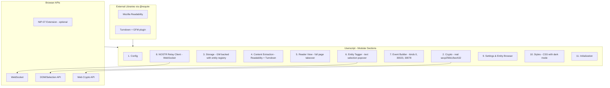
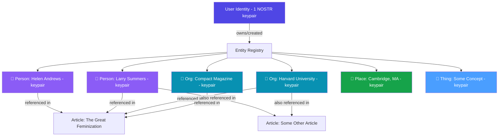
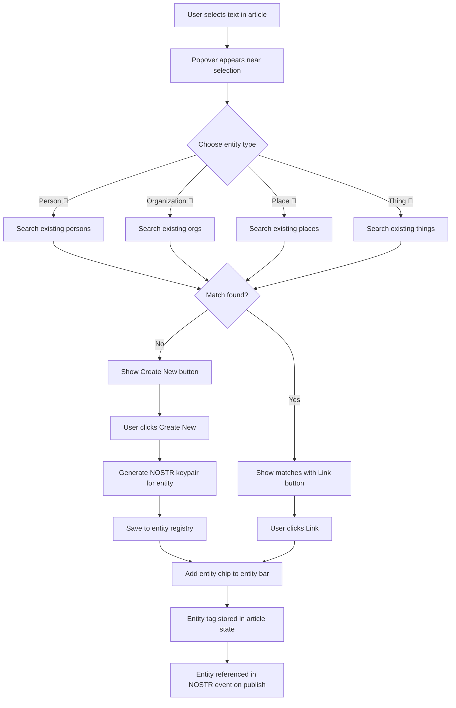

# NOSTR Article Capture v2.0.1 - Redesign Plan

> **Status**: All six implementation phases are **complete**. This document now serves as a living roadmap for future enhancements and a reference for the design decisions that shaped v2.

## Executive Summary

The v1 NOSTR Article Capture userscript had grown to 11,398 lines in a single file with 14 monolithic sections, broken crypto placeholders, competing UI paradigms, and scope creep into verification/trust territory. The v2 rewrite focused on four core capabilities done correctly: **capture, read, tag, publish**.

The redesign replaced the modal/panel/sidebar approach with a full-page reader view that takes over the browser tab (like Firefox Reader View), providing a distraction-free reading experience with inline metadata tagging and one-click NOSTR archival.

**v2 is now fully implemented** at 4,476 lines in [`nostr-article-capture.user.js`](nostr-article-capture.user.js:1) with a comprehensive crypto test suite (65 tests) in [`tests/crypto-tests.js`](tests/crypto-tests.js:1).

---

## Design Principles

1. **Content first** - Clean, readable article text. No ads, no distractions, no clutter.
2. **Edit without sacrificing readability** - Editing happens inline, not in a separate mode that destroys the reading experience.
3. **Trivially easy metadata tagging** - Select text, tag it as a person/org/place/thing. Build a knowledge base as you read.
4. **Standard metadata in standard places** - Publication, author, date, URL always visible and editable in consistent locations.
5. **Real keypair management** - Every entity gets a real NOSTR keypair. Users own their entity registry. Real crypto, no placeholders.

---

## What Changed From v1

### Removed (out of scope for v2)
- Fact-checking system (kind 32127)
- Headline corrections (kind 32129)
- Content ratings (kind 32124)
- Debunking banners
- Trust scores and reputation system
- Reaction system (kind 32132)
- URL Annotation posting (kind 32123)
- MetadataUI badge/panel/banner system
- NSecBunker client
- All verification/trust network features

### Replaced
- Modal panel UI → full-page reader view
- Placeholder crypto → real secp256k1/bech32 (BIP-340 Schnorr signatures)
- Simplified embedded Readability → full library via `@require`
- Simplified embedded Turndown → full library via `@require` (with GFM plugin)
- Dual identity model → unified model: one user identity that owns entity keypairs
- Monolithic 11K-line file → well-organized modular sections (4,476 lines)

### Kept (good foundations built upon)
- Tampermonkey userscript format
- GM_setValue/GM_getValue storage pattern
- URL normalization and canonical URL detection logic
- Date extraction logic (JSON-LD, meta tags, platform selectors)
- Content extraction approach (Readability + Turndown pipeline)
- WebSocket relay client pattern
- NIP-23 article event builder (kind 30023)
- Image base64 embedding capability

---

## Architecture Overview



---

## UI Design

### Full-Page Reader View

When the user clicks the FAB, the entire page is replaced with a clean reader view. The original page is hidden (not destroyed) so the user can return to it.

```
+------------------------------------------------------------------+
|  [← Back]   Compact Magazine    [📝] [Preview] [Edit] [Publish]  |  <- Toolbar
+------------------------------------------------------------------+
|                                                                    |
|  +--------------------------------------------------------------+ |
|  |                                                                | |
|  |  The Great Feminization                              [edit]   | |  <- Title, editable
|  |                                                                | |
|  |  By Helen Andrews  •  Compact Magazine  •  Oct 16, 2025       | |  <- Metadata (click-to-edit)
|  |  Source: compactmag.com/article/the-great-fem...  [copy]      | |  <- Source URL
|  |  Archived: Feb 7, 2026                                        | |  <- Archive date
|  |                                                                | |
|  |  ------------------------------------------------------------ | |
|  |                                                                | |
|  |  In 2019, I read an article about Larry Summers and Harvard   | |
|  |  that changed the way I look at the world. The piece argued   | |
|  |  that the most significant transformation in American         | |
|  |  institutional life over the past fifty years has been the    | |
|  |  entry of women into positions of authority...                 | |
|  |                                                                | |
|  |  [User selects "Larry Summers"]                                | |
|  |           +-------------------------------+                    | |
|  |           | Tag "Larry Summers"           |                    | |
|  |           | [👤 Person] [🏢 Org]          |                    | |  <- Selection popover
|  |           | [📍 Place]  [🔷 Thing]        |                    | |
|  |           | Search: _______________        |                    | |
|  |           | [Create New] [Existing: 0]    |                    | |
|  |           +-------------------------------+                    | |
|  |                                                                | |
|  |  ...more article content...                                   | |
|  |                                                                | |
|  +--------------------------------------------------------------+ |
|                                                                    |
|  +--------------------------------------------------------------+ |
|  | Tagged Entities                                                | |  <- Entity bar
|  | [👤 Helen Andrews] [🏢 Compact Magazine]                       | |
|  | [👤 Larry Summers] [🏢 Harvard]                                | |
|  | [+ Tag Entity]                                                 | |
|  +--------------------------------------------------------------+ |
|                                                                    |
+------------------------------------------------------------------+
```

### Key UI Regions

**1. Toolbar** (fixed top bar)
- Back button (returns to original page)
- Publication name (auto-detected, editable)
- Markdown editor toggle (📝 switches between visual and raw markdown editing)
- "Preview as Published" (HTML→MD→HTML round-trip preview)
- Edit toggle (switches content to contenteditable)
- Publish button (opens publish confirmation)
- Settings gear (keypair management, relay config, entity browser)

**2. Metadata Header** (below toolbar, inside content area)
- Article title (large, prominent, click-to-edit)
- Author name (click-to-edit, auto-detected as entity)
- Publication name (click-to-edit, auto-detected as entity)
- Published date (click-to-edit)
- Source URL (truncated, with copy button)
- Archive date (auto-set, display only)

**3. Article Content** (main reading area)
- Clean, readable typography (serif for body, ~65ch line width)
- contenteditable when Edit mode is on
- Markdown editor mode (raw textarea with live preview)
- Text selection triggers entity tagging popover
- Images preserved inline
- Blockquotes, headings, lists properly styled

**4. Entity Tagging Popover** (appears on text selection)
- Appears near the selected text (above or below)
- Four type buttons: Person (👤), Organization (🏢), Place (📍), Thing (🔷)
- Shows the selected text as the entity name (editable)
- Search existing entities with type filtering
- Option to create new entity or link to existing match
- Auto-creates NOSTR keypair for new entities
- Dismissible with Escape or clicking outside

**5. Entity Bar** (bottom of content area)
- Shows all entities tagged in this article
- Each entity shown as a chip with type icon and name
- Click chip to see entity details (pubkey, other articles)
- Remove button on each chip
- Auto-detection of author and publication entities on capture

**6. Publish Confirmation** (inline panel, not modal)
- Slides down from toolbar or expands in place
- Shows event preview (title, tags, content preview)
- Select signing method (NIP-07 or local keypair)
- Select relays
- Confirm and publish
- Shows per-relay success/failure status

### Typography and Visual Design

```css
/* Core reading experience */
--nac-font-serif: Georgia, 'Times New Roman', serif;
--nac-font-sans: -apple-system, BlinkMacSystemFont, 'Segoe UI', sans-serif;
--nac-font-mono: 'SF Mono', 'Fira Code', monospace;
--nac-line-height: 1.7;
--nac-max-width: 680px;
--nac-bg: #fafaf9;
--nac-text: #1a1a1a;
--nac-text-muted: #6b7280;
--nac-accent: #4f46e5;
--nac-entity-person: #8b5cf6;
--nac-entity-org: #0891b2;
--nac-entity-place: #16a34a;
--nac-entity-thing: #4a9eff;
```

Light background by default (optimized for reading), with full dark mode support via `prefers-color-scheme`.

---

## Data Model

### Entity Registry (stored in GM storage)

```javascript
// Storage key: 'entity_registry'
{
  "entity_<hash>": {
    id: "entity_<hash>",           // SHA-256 of type + normalized name
    type: "person",                 // person | organization | place | thing
    name: "Larry Summers",         // Display name
    aliases: ["Lawrence Summers", "Lawrence H. Summers"],
    keypair: {
      pubkey: "<real-hex-pubkey>",  // Derived from real secp256k1
      privkey: "<hex-privkey>",     // Stored locally
      npub: "npub1...",             // Real bech32 encoding
      nsec: "nsec1..."             // Real bech32 encoding
    },
    created_by: "<user-pubkey>",    // Which user created this entity
    created_at: 1707350400,         // Unix timestamp
    articles: [                     // Articles this entity appears in
      {
        url: "https://compactmag.com/article/the-great-feminization",
        title: "The Great Feminization",
        context: "quoted",           // quoted | mentioned | author | subject
        tagged_at: 1707350400
      }
    ],
    metadata: {}                    // Extensible metadata
  }
}
```

### User Identity (stored in GM storage)

```javascript
// Storage key: 'user_identity'
{
  pubkey: "<hex-pubkey>",
  npub: "npub1...",
  privkey: "<hex-privkey>",        // Only if locally generated
  nsec: "nsec1...",                // Only if locally generated
  name: "User Display Name",
  signer_type: "local",           // "local" | "nip07"
  created_at: 1707350400
}
```

### Article State (in-memory during session)

```javascript
{
  // Extracted data
  url: "https://compactmag.com/article/the-great-feminization",
  canonical_url: "https://compactmag.com/article/the-great-feminization",
  domain: "compactmag.com",
  title: "The Great Feminization",
  byline: "Helen Andrews",
  published_at: 1729036800,         // Unix timestamp
  published_at_source: "json-ld",   // How we found the date
  excerpt: "...",
  content_html: "...",              // Original extracted HTML
  content_markdown: "...",          // Converted markdown
  featured_image: "https://...",
  extracted_at: 1707350400,

  // User modifications
  title_edited: false,
  byline_edited: false,
  content_edited: false,
  published_at_edited: false,

  // Tagged entities (references to registry entries)
  entities: [
    { entity_id: "entity_abc123", context: "author" },
    { entity_id: "entity_def456", context: "subject" },
    { entity_id: "entity_ghi789", context: "mentioned" }
  ]
}
```

### Relay Configuration (stored in GM storage)

```javascript
// Storage key: 'relay_config'
{
  relays: [
    { url: "wss://nos.lol", read: true, write: true, enabled: true },
    { url: "wss://relay.primal.net", read: true, write: true, enabled: true },
    { url: "wss://relay.nostr.net", read: true, write: true, enabled: true },
    // ... (10 default relays)
  ]
}
```

---

## Keypair Ownership Model



**Key principle**: Entity keypairs are reusable across articles. When a user encounters "Larry Summers" in a second article, they can link it to the existing entity rather than creating a duplicate. Over time, the entity registry becomes a personal knowledge graph.

**Future delegation**: Users can export entity keypairs (or subsets) and share them with other users, enabling collaborative knowledge bases. This is out of scope for v2 but the data model supports it.

---

## Entity Tagging Workflow



### Popover Behavior Details

1. User selects any text in the article content area
2. After a 300ms debounce (to avoid triggering on accidental selections), if the selection is between 2-100 characters, the popover appears
3. Popover shows:
   - The selected text (editable - user can refine the entity name)
   - Four type buttons: Person (👤), Organization (🏢), Place (📍), Thing (🔷)
   - Once a type is selected, a search of existing entities of that type runs
   - If matches exist, they show as a list with "Link" buttons
   - A "Create New" button is always available
4. Creating a new entity:
   - Instantly generates a real secp256k1 keypair
   - Saves to entity registry with the user's pubkey as `created_by`
   - Adds the current article to the entity's `articles` list
   - Shows a brief confirmation (the chip appears in the entity bar)
5. Linking to an existing entity:
   - Adds the current article to the entity's `articles` list (with deduplication)
   - Shows the chip in the entity bar
6. Popover dismisses on: Escape, click outside, or after entity creation/linking

---

## NOSTR Event Structure

### Article Event (kind 30023)

When the user publishes, the script builds a NIP-23 long-form content event:

```javascript
{
  kind: 30023,
  pubkey: "<user-pubkey>",            // Signed by the user
  created_at: <unix-timestamp>,
  tags: [
    // Article identity
    ["d", "<url-hash-16-chars>"],      // Replaceable event d-tag
    ["title", "The Great Feminization"],
    ["summary", "...excerpt..."],
    ["image", "https://...featured-image..."],
    ["published_at", "1729036800"],     // Original publication date
    ["r", "https://compactmag.com/article/the-great-feminization"],

    // Author (as text + entity pubkey if tagged)
    ["author", "Helen Andrews"],
    ["p", "<helen-andrews-entity-pubkey>", "", "author"],

    // Tagged entities with real pubkeys
    ["p", "<larry-summers-entity-pubkey>", "", "mention"],
    ["p", "<harvard-entity-pubkey>", "", "mention"],
    ["p", "<compact-mag-entity-pubkey>", "", "publisher"],

    // Entity names for clients that do not resolve pubkeys
    ["person", "Larry Summers", "mention"],
    ["org", "Harvard University", "mention"],
    ["org", "Compact Magazine", "publisher"],
    ["thing", "Some Concept", "subject"],

    // Topic tags
    ["t", "article"],
    ["t", "compactmag-com"],

    // Client identifier
    ["client", "nostr-article-capture"]
  ],
  content: "<full-article-in-markdown>"
}
```

### Entity Profile Event (kind 0)

When an entity keypair is created, the script can publish a kind 0 profile event:

```javascript
{
  kind: 0,
  pubkey: "<entity-pubkey>",
  created_at: <unix-timestamp>,
  tags: [],
  content: JSON.stringify({
    name: "Larry Summers",
    about: "Person entity created by nostr-article-capture",
  })
}
// Signed with the entity's own private key
```

### Entity Sync Event (kind 30078 — NIP-78)

Entity data is synced across devices via NIP-78 application-specific events with NIP-04 encryption:

```javascript
{
  kind: 30078,
  pubkey: "<user-pubkey>",
  created_at: <unix-timestamp>,
  tags: [
    ["d", "nac-entity-<entity-id>"],
    ["L", "nostr-article-capture"],
    ["l", "<entity-type>", "nostr-article-capture"]
  ],
  content: "<NIP-04 encrypted entity JSON>"
}
// Signed with user's private key; content encrypted to user's own pubkey
```

---

## External Libraries

Tampermonkey's `@require` directive loads real libraries:

```javascript
// ==UserScript==
// @require  https://cdn.jsdelivr.net/npm/@mozilla/readability@0.5.0/Readability.js
// @require  https://cdn.jsdelivr.net/npm/turndown@7.2.0/dist/turndown.js
// @require  https://cdn.jsdelivr.net/npm/turndown-plugin-gfm@1.0.2/dist/turndown-plugin-gfm.js
// ==/UserScript==
```

### Crypto Implementation (Embedded)

Rather than relying on `@require` for crypto (ESM compatibility issues), the script embeds a self-contained BIP-340 Schnorr signature implementation using the Web Crypto API and pure JavaScript secp256k1 arithmetic.

| Operation | v1 (broken) | v2 (implemented ✅) |
|-----------|-------------|---------------------|
| Generate private key | `crypto.getRandomValues(32)` | Same (this part worked) |
| Derive public key | `SHA-256 of privkey` ❌ | Real secp256k1 point multiplication ✅ |
| Encode npub | `'npub1' + hex.substring(0,59)` ❌ | Real bech32 encoding ✅ |
| Encode nsec | `'nsec1' + hex.substring(0,59)` ❌ | Real bech32 encoding ✅ |
| Sign event | Falls back to NIP-07 | BIP-340 Schnorr `sign(hash, privkey)` ✅ |
| Verify signature | `return true` ❌ | Real Schnorr `verify(sig, hash, pubkey)` ✅ |
| NIP-04 encrypt | Not implemented | AES-256-CBC via Web Crypto ✅ |
| NIP-04 decrypt | Not implemented | AES-256-CBC via Web Crypto ✅ |

Validated with 65 tests including official BIP-340 test vectors — see [`tests/crypto-tests.js`](tests/crypto-tests.js:1).

---

## Implementation Phases — All Complete ✅

### Phase 1: Foundation ✅ DONE
- ✅ Userscript shell with `@require` directives
- ✅ Section 1: Config (minimal, focused)
- ✅ Section 2: Crypto module with real secp256k1 and bech32
  - `generatePrivateKey()`, `getPublicKey()`, `hexToNpub()`/`npubToHex()`, `hexToNsec()`/`nsecToHex()`, `signEvent()`, `getEventHash()`, `verifySignature()`
  - NIP-04 `nip04Encrypt()` / `nip04Decrypt()` for entity sync
- ✅ Section 3: Storage module (GM_getValue/GM_setValue wrapper, entity CRUD, identity CRUD, relay config CRUD, import/export)
- ✅ Crypto test suite: 65 tests including BIP-340 official vectors

### Phase 2: Content Extraction ✅ DONE
- ✅ Readability integration (full library via `@require`)
- ✅ Turndown integration (full library + GFM plugin via `@require`)
- ✅ Fallback HTML→Markdown converter (regex-based, for when Turndown unavailable)
- ✅ `markdownToHtml()` — lightweight markdown-to-HTML renderer for round-trip preview
- ✅ URL normalization, canonical URL detection
- ✅ Date extraction (JSON-LD, meta tags, platform selectors)
- ✅ Featured image extraction
- ✅ Image base64 embedding via `GM_xmlhttpRequest`

### Phase 3: Reader View UI ✅ DONE
- ✅ Full-page takeover container (replaces page content, preserves original)
- ✅ Toolbar with Back, Edit toggle, Publish button, Settings
- ✅ Metadata header (title, author, publication, date, URL, archive date)
- ✅ Article content area with clean typography
- ✅ Entity bar at bottom of content
- ✅ Markdown editor toggle (📝 visual/markdown mode switching)
- ✅ "Preview as Published" (HTML→MD→HTML round-trip preview)
- ✅ Inline metadata editing (click-to-edit author, publication, date)
- ✅ CSS: Typography system, light/dark mode, responsive layout
- ✅ FAB button that triggers reader view

### Phase 4: Entity Tagging ✅ DONE
- ✅ Text selection detection with debounce
- ✅ Popover positioning logic (viewport-aware)
- ✅ Entity type selection: Person (👤), Organization (🏢), Place (📍), Thing (🔷)
- ✅ Search existing entities (fuzzy match on name and aliases)
- ✅ Create new entity flow (with real keypair generation)
- ✅ Link existing entity flow
- ✅ Entity chip display in entity bar
- ✅ Remove entity from article
- ✅ Auto-detection of author + publication entities
- ✅ Entity article deduplication
- ✅ Entity Browse UI in settings (search, filter by type, entity cards)
- ✅ Entity Detail View (name editing, alias management, keypair display, articles list, delete)

### Phase 5: NOSTR Publishing ✅ DONE
- ✅ WebSocket relay client (connect, disconnect, publish with per-relay status)
- ✅ Event builder: kind 30023 (NIP-23 articles), kind 0 (entity profiles), kind 30078 (NIP-78 entity sync)
- ✅ Event signing with local keypair (BIP-340 Schnorr) or NIP-07
- ✅ NIP-04 encryption for entity sync data
- ✅ Publish confirmation UI (inline panel, relay selection, per-relay status)
- ✅ Relay management (add/remove/toggle relays in settings)

### Phase 6: Polish ✅ DONE
- ✅ Settings panel (identity setup, relay management, entity browser, export/import, version info)
- ✅ Auto-update mechanism (`@updateURL` / `@downloadURL`)
- ✅ XSS prevention (`Utils.escapeHtml()` used consistently throughout)
- ✅ Entity article deduplication
- ✅ Storage abstraction consistency
- ✅ Dark mode (full `prefers-color-scheme` support)
- ✅ Crypto test suite (65 tests with BIP-340 vectors)

---

## Future Work / Remaining Items

The following items are identified for post-v2 enhancement:

### Reliability & Performance
- **Connection retry logic with exponential backoff** — relay reconnection currently does not retry on failure
- **Storage quota handling** — no graceful handling when GM storage approaches limits

### Accessibility
- **Keyboard accessibility audit** — full keyboard navigation has not been systematically tested

### Security
- **NIP-44 encryption upgrade** — replace NIP-04 (AES-256-CBC) with NIP-44 (XChaCha20-Poly1305) for entity sync; NIP-04 is considered deprecated in the NOSTR ecosystem

### Architecture
- **Build system for multi-file development** — if the codebase grows significantly, consider a bundler (rollup/esbuild) to split into modules while outputting a single userscript

### Features (Designed but Not Implemented)
- **URL metadata posting (kinds 32123-32132)** — the event kind design exists in [`docs/nostr-nips-analysis.md`](docs/nostr-nips-analysis.md:1) but is not yet implemented; these would enable collaborative URL-level annotations beyond article capture

---

## Section-by-Section Specification

### Section 1: Config (~lines 33-70)

```javascript
const CONFIG = {
  version: '2.0.1',
  debug: false,
  relays_default: [ /* 10 relays */ ],
  reader: { max_width, font_size, line_height },
  extraction: { min_content_length, max_title_length },
  tagging: { selection_debounce_ms, min_selection_length, max_selection_length }
};
```

Minimal. No NSecBunker config. No complex UI positioning. Just the essentials.

### Section 2: Crypto (~lines 75-530)

Full BIP-340 Schnorr signature implementation with secp256k1 field/point arithmetic, bech32 encoding/decoding, SHA-256, NIP-04 encrypt/decrypt. Self-contained — no external crypto library dependencies beyond Web Crypto API.

### Section 3: Storage (~lines 535-680)

```javascript
const Storage = {
  get(key, defaultValue), set(key, value), delete(key),
  identity: { get(), set(), clear(), isConfigured() },
  entities: { getAll(), get(id), save(id, data), delete(id), search(query, type), exportAll(), importAll(json), validate(entity) },
  relays: { get(), set(relays), addRelay(url), removeRelay(url), toggleRelay(url) }
};
```

### Section 4: Content Extraction (~lines 685-1100)

```javascript
const ContentExtractor = {
  extractArticle(),           // Full Readability + Turndown pipeline
  extractPublishedDate(),     // JSON-LD, meta tags, platform selectors
  extractFeaturedImage(),     // og:image, twitter:image, first img
  getCanonicalUrl(),          // link[rel=canonical], og:url, etc.
  normalizeUrl(url),          // Strip tracking params, normalize
  htmlToMarkdown(html),       // Turndown (primary) + regex fallback
  markdownToHtml(markdown),   // Lightweight MD→HTML renderer
  embedImages(markdown),      // Base64 embed via GM_xmlhttpRequest
};
```

### Section 5: Reader View (~lines 1105-1200)

The main UI container — full-page overlay, extracted article rendering, edit mode, markdown editor toggle, preview-as-published, keyboard shortcuts, back-to-page navigation.

### Section 6: Entity Tagger (~lines 1205-1450)

Text selection popover, entity type selection, entity search/match/create/link, entity bar chips with auto-detection of author and publication entities.

### Section 7: Event Builder (~lines 1455-1680)

```javascript
const EventBuilder = {
  buildArticleEvent(article, entities, userPubkey),    // kind 30023
  buildProfileEvent(entity),                            // kind 0
  buildEntitySyncEvent(entityId, encrypted, type, pubkey), // kind 30078
};
```

### Section 8: NOSTR Relay Client (~lines 1685-1850)

```javascript
const RelayClient = {
  connections: Map,
  connect(url), disconnect(url), disconnectAll(),
  publish(event, relayUrls),  // Per-relay results
  subscribe(filters, relayUrls, onEvent), // For entity sync fetch
};
```

### Section 9: Settings & Entity Browser (~lines 1855-3200)

Settings panel (identity, relays, entity browser), reader view initialization, publish flow, entity browser with search/filter/cards/detail view with name editing, alias management, keypair display, articles list, and entity deletion.

### Section 10: Styles (~lines 3205-4430)

Complete CSS with light/dark mode, reader typography, entity colors, toolbar, popover, entity bar, settings panels, entity browser, animations.

### Section 11: Initialization (~lines 4435-4476)

```javascript
async function init() {
  // 1. Load storage
  // 2. Create FAB button
  // 3. Register Tampermonkey menu commands
  // 4. Check for NIP-07 availability
  // Done. Reader view created on demand when FAB clicked.
}
```

---

## File Structure

The project is a single userscript file plus supporting documentation and tests:

```
nostr-article-capture.user.js    (4,476 lines — main userscript)
tests/crypto-tests.js            (65 tests — BIP-340 + crypto validation)
plans/v2-redesign-plan.md        (this file)
docs/                            (reference documentation)
  ├── article-complete-inventory.md
  ├── article-data-collection.md
  ├── data-model.md
  ├── entity-sync-design.md
  ├── nostr-nips-analysis.md
  └── tampermonkey-article-capture-plan.md
```

> **Note**: Several documentation files from v1 (api-specifications.md, system-architecture.md, content-processing-specs.md, ui-component-specs.md, etc.) were archived/removed as they described features and architecture that no longer exist in v2. The remaining docs/ files contain reference material still relevant to the current implementation.

---

## Key Decisions and Trade-offs

### Decision 1: Single file vs. multi-file build
**Choice**: Single file with `@require` for content libraries, embedded crypto
**Reason**: Tampermonkey works best with single files. `@require` gives us Readability and Turndown without embedding. Crypto is embedded because ESM module loading via `@require` proved unreliable. Build tooling remains a future option if complexity grows.

### Decision 2: Full page takeover vs. side panel
**Choice**: Full page takeover
**Reason**: User explicitly wanted content in the main content area, not a modal. Reader view provides the best reading experience and gives full control over layout.

### Decision 3: Real keypairs per entity vs. simple tags
**Choice**: Real keypairs
**Reason**: Building a social knowledge graph requires real NOSTR identities. Entity keypairs are the building blocks for future delegation and cross-user knowledge base merging.

### Decision 4: Local signing vs. NIP-07 only
**Choice**: Both, with local as primary
**Reason**: Embedding real secp256k1 means no dependency on browser extensions. NIP-07 remains supported for users who prefer it.

### Decision 5: Drop verification features
**Choice**: Removed all fact-checking, rating, trust, and reaction features
**Reason**: Focus on getting the core right. These features can be re-added in v3 once the foundation is solid.

### Decision 6: Four entity types (not three)
**Choice**: Person, Organization, Place, Thing
**Reason**: "Thing" (🔷) was added to capture concepts, events, legislation, and other noun entities that don't fit the original three types. "Publication" was folded into Organization.

### Decision 7: Embedded crypto vs. @require
**Choice**: Embedded BIP-340 implementation
**Reason**: noble-secp256k1 and scure-bech32 use ESM exports that don't load cleanly via Tampermonkey's `@require`. A self-contained implementation using Web Crypto API + pure JS secp256k1 arithmetic proved more reliable and is validated by 65 tests.

---

## Risk Areas (Updated)

1. **~~Library loading via @require~~** — ✅ Resolved. Content libraries (Readability, Turndown) load via `@require`; crypto is embedded to avoid ESM issues.

2. **~~Secp256k1 in userscript context~~** — ✅ Resolved. Web Crypto API works correctly in Tampermonkey. The embedded implementation passes all BIP-340 test vectors.

3. **Entity registry growth** — Users who capture many articles will accumulate hundreds of entities. The entity browser search works on the current scale but may need optimization for very large registries.

4. **Content extraction quality** — The full Readability library handles most sites well but remains imperfect. Edit mode and markdown editor mitigate this — users can correct extraction issues directly.

5. **Private key storage security** — Private keys are stored in GM_setValue without encryption at rest. Acceptable for v2 with a documented security note. Future versions should add password-based encryption or NIP-49 key export.

6. **NIP-04 deprecation** — Entity sync uses NIP-04 encryption which is considered deprecated in the NOSTR ecosystem. Upgrading to NIP-44 is listed as future work.

---

## Success Criteria — Achieved ✅

| Criterion | Status |
|-----------|--------|
| User can navigate to any article, click FAB, see clean reader view | ✅ Implemented |
| Metadata auto-detected and displayed in standard locations | ✅ Implemented |
| User can edit any metadata field inline | ✅ Click-to-edit on author, publication, date, title |
| User can select text and tag as person/org/place/thing in under 3 seconds | ✅ Implemented with 4 entity types |
| Entity tagging creates real, valid NOSTR keypair | ✅ Real secp256k1 keypairs |
| Entities are reusable across articles | ✅ Entity registry with search and linking |
| User can publish to NOSTR relays from reader view | ✅ With per-relay status |
| Published events contain correct NIP-23 structure with entity references | ✅ kind 30023 with p-tags |
| All crypto produces valid, interoperable NOSTR keys and signatures | ✅ Validated by 65 tests + BIP-340 vectors |
| Script size significantly reduced from 11,398 lines | ✅ 4,476 lines (61% reduction) |
| Reader view feels like a premium reading experience | ✅ Full typography system, dark mode, clean layout |

### Bonus achievements beyond original plan:
- Markdown editor toggle for raw editing
- Preview-as-Published round-trip validation
- Entity sync across devices (NIP-78 + NIP-04)
- Entity browser with full CRUD (search, filter, detail view, aliases, delete)
- Relay management UI (add/remove/toggle)
- XSS prevention throughout
- 4th entity type (Thing) for broader knowledge capture
- `markdownToHtml()` bidirectional conversion
