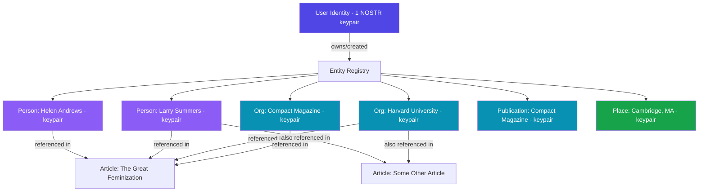
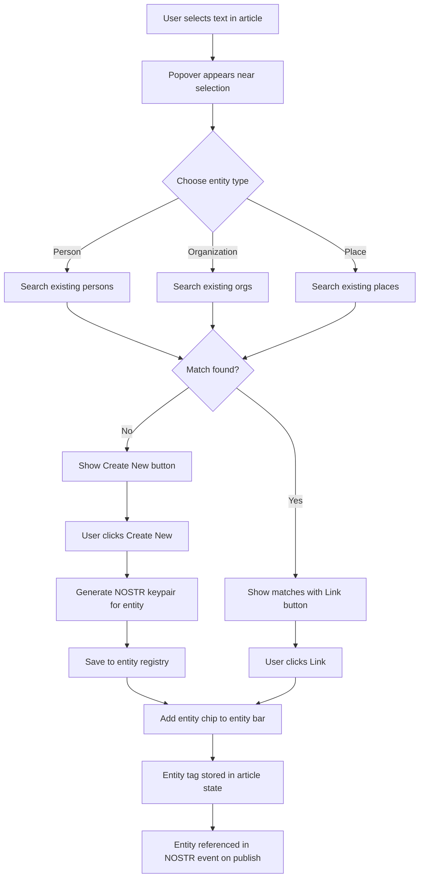

# NOSTR Article Capture v2.0 - Redesign Plan

## Executive Summary

The current NOSTR Article Capture userscript has grown to 11,398 lines in a single file with 14 monolithic sections, broken crypto placeholders, competing UI paradigms, and scope creep into verification/trust territory. This plan defines a ground-up rewrite focused on four core capabilities done perfectly: **capture, read, tag, publish**.

The redesign replaces the modal/panel/sidebar approach with a full-page reader view that takes over the browser tab (like Firefox Reader View), providing a distraction-free reading experience with inline metadata tagging and one-click NOSTR archival.

---

## Design Principles

1. **Content first** - Clean, readable article text. No ads, no distractions, no clutter.
2. **Edit without sacrificing readability** - Editing happens inline, not in a separate mode that destroys the reading experience.
3. **Trivially easy metadata tagging** - Select text, tag it as a person/org/place. Build a knowledge base as you read.
4. **Standard metadata in standard places** - Publication, author, date, URL always visible and editable in consistent locations.
5. **Real keypair management** - Every entity gets a real NOSTR keypair. Users own their entity registry. Real crypto, no placeholders.

---

## What Changes From v1

### Removed (out of scope for v2)
- Fact-checking system (kind 32127)
- Headline corrections (kind 32129)
- Content ratings (kind 32124)
- Debunking banners
- Trust scores and reputation system
- Reaction system (kind 32132)
- URL Annotation posting (kind 32123)
- MetadataUI badge/panel/banner system
- NSecBunker client
- All verification/trust network features

### Replaced
- Modal panel UI replaced with full-page reader view
- Placeholder crypto replaced with real secp256k1/bech32
- Simplified embedded Readability replaced with full library via `@require`
- Simplified embedded Turndown replaced with full library via `@require`
- Dual identity model (user vs publication) replaced with unified model: one user identity that owns entity keypairs
- Monolithic 11K-line file replaced with well-organized modular sections

### Kept (good foundations to build on)
- Tampermonkey userscript format
- GM_setValue/GM_getValue storage pattern
- URL normalization and canonical URL detection logic
- Date extraction logic (JSON-LD, meta tags, platform selectors)
- Content extraction approach (Readability + Turndown pipeline)
- WebSocket relay client pattern
- NIP-23 article event builder (kind 30023)
- Image base64 embedding capability

---

## Architecture Overview

```mermaid
flowchart TB
    subgraph UserscriptSections[Userscript - Modular Sections]
        CONFIG[1. Config]
        CRYPTO[2. Crypto - real secp256k1/bech32]
        STORAGE[3. Storage - GM backed with entity registry]
        EXTRACT[4. Content Extraction - Readability + Turndown]
        READER[5. Reader View - full page takeover]
        META[6. Metadata Editor - inline fields]
        TAGGER[7. Entity Tagger - text selection popover]
        KEYS[8. Keypair Manager - entity registry]
        RELAY[9. NOSTR Relay Client - WebSocket]
        EVENTS[10. Event Builder - kind 30023 + kind 0]
        INIT[11. Initialization]
    end

    subgraph ExternalLibs[External Libraries via @require]
        READ_LIB[Mozilla Readability]
        TURN_LIB[Turndown]
        NOBLE[noble-secp256k1]
        BECH32[scure-bech32]
    end

    subgraph BrowserAPIs[Browser APIs]
        NIP07[NIP-07 Extension - optional]
        WS[WebSocket]
        DOM[DOM/Selection API]
        WEBCRYPTO[Web Crypto API]
    end

    ExternalLibs --> UserscriptSections
    BrowserAPIs --> UserscriptSections
    RELAY --> WS
    CRYPTO --> NOBLE
    CRYPTO --> BECH32
    CRYPTO --> WEBCRYPTO
    TAGGER --> DOM
```



---

## UI Design

### Full-Page Reader View

When the user clicks the FAB, the entire page is replaced with a clean reader view. The original page is hidden (not destroyed) so the user can return to it.

```
+------------------------------------------------------------------+
|  [<- Back to Page]      Compact Magazine       [Edit] [Publish]  |  <- Toolbar
+------------------------------------------------------------------+
|                                                                    |
|  +--------------------------------------------------------------+ |
|  |                                                                | |
|  |  The Great Feminization                              [edit]   | |  <- Title, editable
|  |                                                                | |
|  |  By Helen Andrews  *  Compact Magazine  *  Oct 16, 2025       | |  <- Metadata line
|  |  Source: compactmag.com/article/the-great-fem...  [copy]      | |  <- Source URL
|  |  Archived: Feb 7, 2026                                        | |  <- Archive date
|  |                                                                | |
|  |  ------------------------------------------------------------ | |
|  |                                                                | |
|  |  In 2019, I read an article about Larry Summers and Harvard   | |
|  |  that changed the way I look at the world. The piece argued   | |
|  |  that the most significant transformation in American         | |
|  |  institutional life over the past fifty years has been the    | |
|  |  entry of women into positions of authority...                 | |
|  |                                                                | |
|  |  [User selects "Larry Summers"]                                | |
|  |           +-------------------------------+                    | |
|  |           | Tag: [Person] [Org] [Place]   |                    | |  <- Selection popover
|  |           | "Larry Summers"               |                    | |
|  |           | [Create New] [Existing: 0]    |                    | |
|  |           +-------------------------------+                    | |
|  |                                                                | |
|  |  ...more article content...                                   | |
|  |                                                                | |
|  +--------------------------------------------------------------+ |
|                                                                    |
|  +--------------------------------------------------------------+ |
|  | Tagged Entities                                                | |  <- Entity bar
|  | [Helen Andrews person] [Compact Magazine org]                  | |
|  | [Larry Summers person] [Harvard org]                           | |
|  | [+ Tag Entity]                                                 | |
|  +--------------------------------------------------------------+ |
|                                                                    |
+------------------------------------------------------------------+
```

### Key UI Regions

**1. Toolbar** (fixed top bar)
- Back button (returns to original page)
- Publication name (auto-detected, editable)
- Edit toggle (switches content to contenteditable)
- Publish button (opens publish confirmation)
- Settings gear (keypair management, relay config)

**2. Metadata Header** (below toolbar, inside content area)
- Article title (large, prominent, click-to-edit)
- Author name (click-to-edit, can tag as entity)
- Publication name (click-to-edit, can tag as entity)
- Published date (click-to-edit with date picker)
- Source URL (truncated, with copy button)
- Archive date (auto-set, display only)

**3. Article Content** (main reading area)
- Clean, readable typography (serif for body, ~65ch line width)
- contenteditable when Edit mode is on
- Text selection triggers entity tagging popover
- Images preserved inline
- Blockquotes, headings, lists properly styled

**4. Entity Tagging Popover** (appears on text selection)
- Appears near the selected text (above or below)
- Three buttons: Person, Organization, Place
- Shows the selected text as the entity name (editable)
- Option to create new entity or select existing match
- Auto-creates NOSTR keypair for new entities
- Dismissible with Escape or clicking outside

**5. Entity Bar** (bottom of content area)
- Shows all entities tagged in this article
- Each entity shown as a chip with type icon and name
- Click chip to see entity details (pubkey, other articles)
- Remove button on each chip
- "+ Tag Entity" button for manual entry (not from text selection)

**6. Publish Confirmation** (inline panel, not modal)
- Slides down from toolbar or expands in place
- Shows event preview (title, tags, content preview)
- Select signing method (NIP-07 or local keypair)
- Select relays
- Confirm and publish
- Shows per-relay success/failure status

### Typography and Visual Design

```css
/* Core reading experience */
--reader-font-body: Georgia, 'Times New Roman', serif;
--reader-font-heading: -apple-system, BlinkMacSystemFont, 'Segoe UI', sans-serif;
--reader-font-ui: -apple-system, BlinkMacSystemFont, 'Segoe UI', sans-serif;
--reader-line-height: 1.7;
--reader-max-width: 680px;
--reader-bg: #fafaf9;
--reader-text: #1a1a1a;
--reader-text-muted: #6b7280;
--reader-accent: #4f46e5;
--reader-entity-person: #8b5cf6;
--reader-entity-org: #0891b2;
--reader-entity-place: #16a34a;
```

Light background by default (optimized for reading), with dark mode support via `prefers-color-scheme`.

---

## Data Model

### Entity Registry (stored in GM storage)

```javascript
// Storage key: 'entity_registry'
{
  "entity_<hash>": {
    id: "entity_<hash>",           // SHA-256 of type + normalized name
    type: "person",                 // person | organization | place | publication
    name: "Larry Summers",         // Display name
    aliases: ["Lawrence Summers", "Lawrence H. Summers"],
    keypair: {
      pubkey: "<real-hex-pubkey>",  // Derived from real secp256k1
      privkey: "<hex-privkey>",     // Stored locally (encrypted in future)
      npub: "npub1...",             // Real bech32 encoding
      nsec: "nsec1..."             // Real bech32 encoding
    },
    created_by: "<user-pubkey>",    // Which user created this entity
    created_at: 1707350400,         // Unix timestamp
    articles: [                     // Articles this entity appears in
      {
        url: "https://compactmag.com/article/the-great-feminization",
        title: "The Great Feminization",
        context: "quoted",           // quoted | mentioned | author | subject
        tagged_at: 1707350400
      }
    ],
    metadata: {}                    // Extensible metadata
  }
}
```

### User Identity (stored in GM storage)

```javascript
// Storage key: 'user_identity'
{
  pubkey: "<hex-pubkey>",
  npub: "npub1...",
  privkey: "<hex-privkey>",        // Only if locally generated
  nsec: "nsec1...",                // Only if locally generated
  name: "User Display Name",
  signer_type: "local",           // "local" | "nip07"
  created_at: 1707350400
}
```

### Article State (in-memory during session)

```javascript
{
  // Extracted data
  url: "https://compactmag.com/article/the-great-feminization",
  canonical_url: "https://compactmag.com/article/the-great-feminization",
  domain: "compactmag.com",
  title: "The Great Feminization",
  byline: "Helen Andrews",
  published_at: 1729036800,         // Unix timestamp
  published_at_source: "json-ld",   // How we found the date
  excerpt: "...",
  content_html: "...",              // Original extracted HTML
  content_markdown: "...",          // Converted markdown
  featured_image: "https://...",
  extracted_at: 1707350400,

  // User modifications
  title_edited: false,
  byline_edited: false,
  content_edited: false,
  published_at_edited: false,

  // Tagged entities (references to registry entries)
  entities: [
    { entity_id: "entity_abc123", context: "author" },
    { entity_id: "entity_def456", context: "subject" },
    { entity_id: "entity_ghi789", context: "mentioned" }
  ]
}
```

### Relay Configuration (stored in GM storage)

```javascript
// Storage key: 'relay_config'
{
  relays: [
    { url: "wss://relay.damus.io", read: true, write: true, enabled: true },
    { url: "wss://nos.lol", read: true, write: true, enabled: true },
    { url: "wss://relay.nostr.band", read: true, write: true, enabled: true }
  ]
}
```

---

## Keypair Ownership Model



**Key principle**: Entity keypairs are reusable across articles. When a user encounters "Larry Summers" in a second article, they can link it to the existing entity rather than creating a duplicate. Over time, the entity registry becomes a personal knowledge graph.

**Future delegation**: Users can export entity keypairs (or subsets) and share them with other users, enabling collaborative knowledge bases. This is out of scope for v2 but the data model supports it.

---

## Entity Tagging Workflow



### Popover Behavior Details

1. User selects any text in the article content area
2. After a 300ms debounce (to avoid triggering on accidental selections), if the selection is between 2-100 characters, the popover appears
3. Popover shows:
   - The selected text (editable - user can refine the entity name)
   - Three type buttons: Person, Organization, Place
   - Once a type is selected, a search of existing entities of that type runs
   - If matches exist, they show as a list with "Link" buttons
   - A "Create New" button is always available
4. Creating a new entity:
   - Instantly generates a real secp256k1 keypair
   - Saves to entity registry with the user's pubkey as `created_by`
   - Adds the current article to the entity's `articles` list
   - Shows a brief confirmation (the chip appears in the entity bar)
5. Linking to an existing entity:
   - Adds the current article to the entity's `articles` list
   - Shows the chip in the entity bar
6. Popover dismisses on: Escape, click outside, or after entity creation/linking

---

## NOSTR Event Structure

### Article Event (kind 30023)

When the user publishes, the script builds a NIP-23 long-form content event:

```javascript
{
  kind: 30023,
  pubkey: "<user-pubkey>",            // Signed by the user
  created_at: <unix-timestamp>,
  tags: [
    // Article identity
    ["d", "<url-hash-16-chars>"],      // Replaceable event d-tag
    ["title", "The Great Feminization"],
    ["summary", "...excerpt..."],
    ["image", "https://...featured-image..."],
    ["published_at", "1729036800"],     // Original publication date
    ["r", "https://compactmag.com/article/the-great-feminization"],

    // Author (as text + entity pubkey if tagged)
    ["author", "Helen Andrews"],
    ["p", "<helen-andrews-entity-pubkey>", "", "author"],

    // Tagged entities with real pubkeys
    ["p", "<larry-summers-entity-pubkey>", "", "mention"],
    ["p", "<harvard-entity-pubkey>", "", "mention"],
    ["p", "<compact-mag-entity-pubkey>", "", "publisher"],

    // Entity names for clients that do not resolve pubkeys
    ["person", "Larry Summers", "mention"],
    ["org", "Harvard University", "mention"],
    ["org", "Compact Magazine", "publisher"],

    // Topic tags
    ["t", "article"],
    ["t", "compactmag-com"],

    // Client identifier
    ["client", "nostr-article-capture"]
  ],
  content: "<full-article-in-markdown>"
}
```

### Entity Profile Event (kind 0) - Optional

When an entity keypair is created, the script can optionally publish a kind 0 profile event for that entity so it has a name on the NOSTR network:

```javascript
{
  kind: 0,
  pubkey: "<entity-pubkey>",
  created_at: <unix-timestamp>,
  tags: [],
  content: JSON.stringify({
    name: "Larry Summers",
    about: "Person entity created by nostr-article-capture",
    // Future: could include wikipedia link, bio, etc.
  })
}
// Signed with the entity's own private key
```

---

## External Libraries

Instead of embedding broken simplified versions, use Tampermonkey's `@require` directive to load real libraries:

```javascript
// ==UserScript==
// @require  https://cdn.jsdelivr.net/npm/@noble/secp256k1@2.1.0/lib/esm/index.min.js
// @require  https://cdn.jsdelivr.net/npm/@scure/bech32@1.1.0/lib/esm/index.min.js
// @require  https://cdn.jsdelivr.net/npm/@mozilla/readability@0.5.0/Readability.min.js
// @require  https://cdn.jsdelivr.net/npm/turndown@7.2.0/dist/turndown.min.js
// ==/UserScript==
```

**Note**: The exact CDN URLs and compatibility with Tampermonkey's `@require` need to be validated during implementation. Some libraries may need to be bundled as IIFE format. If `@require` does not work cleanly for ESM modules, the fallback is to embed the minified library code directly (but the real, complete library - not a simplified reimplementation).

### Crypto Implementation Requirements

The following crypto operations must work correctly with real libraries:

| Operation | Current (broken) | v2 (real) |
|-----------|-----------------|-----------|
| Generate private key | `crypto.getRandomValues(32)` | Same (this part works) |
| Derive public key | `SHA-256 of privkey` (wrong!) | `secp256k1.getPublicKey(privkey)` |
| Encode npub | `'npub1' + hex.substring(0,59)` (wrong!) | `bech32.encode('npub', pubkey)` |
| Encode nsec | `'nsec1' + hex.substring(0,59)` (wrong!) | `bech32.encode('nsec', privkey)` |
| Sign event | Falls back to NIP-07 | `secp256k1.schnorr.sign(hash, privkey)` |
| Verify signature | `return true` (wrong!) | `secp256k1.schnorr.verify(sig, hash, pubkey)` |

---

## Implementation Phases

### Phase 1: Foundation
- Set up the new userscript shell with `@require` directives
- Implement Section 1: Config (minimal, focused)
- Implement Section 2: Crypto module with real secp256k1 and bech32
  - `generatePrivateKey()`
  - `getPublicKey(privkey)` -- real derivation
  - `hexToNpub(hex)` / `npubToHex(npub)` -- real bech32
  - `hexToNsec(hex)` / `nsecToHex(nsec)` -- real bech32
  - `signEvent(event, privkey)` -- real Schnorr signature
  - `getEventHash(event)` -- SHA-256 of serialized event
  - `verifySignature(event)` -- real verification
- Implement Section 3: Storage module
  - GM_getValue/GM_setValue wrapper
  - Entity registry CRUD
  - User identity CRUD
  - Relay config CRUD
  - Import/export for entity registry
- Write tests for crypto operations (console-based, can be run in browser)

### Phase 2: Content Extraction
- Implement Section 4: Content extraction pipeline
  - Readability integration (full library via `@require`)
  - Turndown integration (full library via `@require`)
  - URL normalization (port existing logic)
  - Canonical URL detection (port existing logic)
  - Date extraction (port existing comprehensive logic)
  - Featured image extraction (port existing logic)
  - Image base64 embedding (port existing GM_xmlhttpRequest approach)
- Validate extraction on 5-10 real article sites (Substack, Medium, WordPress, major news)

### Phase 3: Reader View UI
- Implement Section 5: Reader View
  - Full-page takeover container (replaces page content, preserves original)
  - Toolbar with Back, Edit toggle, Publish button, Settings
  - Metadata header (title, author, publication, date, URL, archive date)
  - Article content area with clean typography
  - Entity bar at bottom of content
  - Keyboard shortcuts (Escape to close, Ctrl+E for edit mode)
- Implement Section 6: Metadata Editor
  - Click-to-edit on title, author, publication, date
  - Date picker for publication date
  - Visual indicators for edited vs auto-detected values
  - contenteditable toggle for article body (Edit mode)
- CSS: Typography system, light/dark mode, responsive layout
- FAB button that triggers reader view

### Phase 4: Entity Tagging
- Implement Section 7: Entity Tagger
  - Text selection detection with debounce
  - Popover positioning logic (above/below selection, viewport-aware)
  - Entity type selection (Person, Org, Place)
  - Search existing entities (fuzzy match on name and aliases)
  - Create new entity flow (with real keypair generation)
  - Link existing entity flow
  - Entity chip display in entity bar
  - Remove entity from article
  - Manual entity entry (without text selection)
- Implement Section 8: Keypair Manager
  - Entity registry UI (accessible from Settings)
  - View all entities with type, name, pubkey
  - Export registry as JSON
  - Import registry from JSON
  - Delete entity (with confirmation)
  - Entity detail view (articles referenced in, aliases, keypair info)

### Phase 5: NOSTR Publishing
- Implement Section 9: NOSTR Relay Client
  - WebSocket connection management (port and clean up existing logic)
  - Connect to multiple relays
  - Publish event to relays with per-relay status tracking
  - Connection retry logic
  - Proper cleanup on disconnect
- Implement Section 10: Event Builder
  - Build kind 30023 article event with entity tags
  - Build kind 0 profile event for entities (optional)
  - Event signing with local keypair or NIP-07
  - Event preview (show the JSON before publishing)
- Implement publish confirmation UI
  - Inline panel (not modal) showing event preview
  - Relay selection
  - Signing method selection (local or NIP-07)
  - Per-relay publish status display
  - Success/error feedback

### Phase 6: Polish and Settings
- Settings panel (accessible from toolbar gear icon)
  - User identity setup (generate new or connect NIP-07)
  - Relay management (add/remove/enable/disable)
  - Entity registry access
  - Export/import all data
  - About/version info
- Auto-update mechanism (Tampermonkey native via `@updateURL`)
- Edge cases and error handling
  - No article content detected
  - No signing method available
  - Relay connection failures
  - Storage quota limits
  - Entity name collisions
- Keyboard accessibility throughout
- Final CSS polish (animations, transitions, hover states)

---

## Section-by-Section Specification

### Section 1: Config

```javascript
const CONFIG = {
  version: '2.0.0',
  debug: false,
  relays_default: [
    { url: 'wss://relay.damus.io', read: true, write: true, enabled: true },
    { url: 'wss://nos.lol', read: true, write: true, enabled: true },
    { url: 'wss://relay.nostr.band', read: true, write: true, enabled: true }
  ],
  reader: {
    max_width: '680px',
    font_size: '18px',
    line_height: '1.7'
  },
  extraction: {
    min_content_length: 200,
    max_title_length: 300
  },
  tagging: {
    selection_debounce_ms: 300,
    min_selection_length: 2,
    max_selection_length: 100
  }
};
```

Minimal. No NSecBunker config. No complex UI positioning. Just the essentials.

### Section 2: Crypto

Real implementations using noble-secp256k1 and scure-bech32. Every function produces correct, interoperable NOSTR keys and signatures.

### Section 3: Storage

```javascript
const Storage = {
  // Low-level GM wrappers
  get(key, defaultValue),
  set(key, value),
  delete(key),

  // User identity
  identity: {
    get(),
    set(data),
    clear(),
    isConfigured()
  },

  // Entity registry
  entities: {
    getAll(),
    get(id),
    save(id, data),
    delete(id),
    search(query, type),     // Fuzzy search by name
    findByPubkey(pubkey),
    exportAll(),
    importAll(json)
  },

  // Relay config
  relays: {
    get(),
    set(relays),
    addRelay(url),
    removeRelay(url)
  }
};
```

### Section 4: Content Extraction

```javascript
const ContentExtractor = {
  extractArticle(),           // Returns full article object
  extractPublishedDate(),     // Comprehensive date detection
  extractFeaturedImage(),     // og:image, twitter:image, first img
  getCanonicalUrl(),          // link[rel=canonical], og:url, etc.
  normalizeUrl(url),          // Strip tracking params, normalize
  htmlToMarkdown(html),       // Turndown conversion
  embedImages(markdown),      // Base64 embed via GM_xmlhttpRequest
};
```

### Section 5: Reader View

The main UI container. Handles:
- Creating the full-page overlay
- Rendering extracted article content
- Managing edit mode
- Keyboard shortcuts
- Back-to-page navigation

### Section 6: Metadata Editor

Handles inline editing of:
- Title (click to edit, Enter to confirm)
- Author (click to edit, can also tag as entity)
- Publication name (click to edit, can also tag as entity)
- Published date (click opens date picker)
- Article body (contenteditable in edit mode)

### Section 7: Entity Tagger

Handles:
- Listening for text selection events on the article content
- Showing/hiding the tagging popover
- Entity type selection
- Entity search and matching
- Creating new entities with real keypairs
- Managing the entity bar chips

### Section 8: Keypair Manager

Handles:
- Viewing the full entity registry
- Entity detail/edit views
- Import/export
- Keypair generation (delegated to Crypto module)

### Section 9: NOSTR Relay Client

```javascript
const RelayClient = {
  connections: Map,
  connect(url),
  disconnect(url),
  disconnectAll(),
  publish(event, relayUrls),   // Returns per-relay results
  isConnected(url)
};
```

Simplified from v1. No subscription handling needed for v2 (read operations are future work).

### Section 10: Event Builder

```javascript
const EventBuilder = {
  buildArticleEvent(article, entities, userPubkey),
  buildProfileEvent(entity),
  // Returns unsigned events - signing handled separately
};
```

### Section 11: Initialization

```javascript
async function init() {
  // 1. Load storage
  // 2. Create FAB button
  // 3. Register Tampermonkey menu commands
  // 4. Check for NIP-07 availability
  // Done. Reader view created on demand when FAB clicked.
}
```

Minimal initialization. The reader view is created lazily when the user clicks the FAB, not on every page load.

---

## File Structure

The project remains a single userscript file (required by Tampermonkey), but each section is clearly delineated and self-contained:

```
nostr-article-capture.user.js    (~3000-4000 lines target, down from 11,398)
```

The reduction comes from:
- Removing ~2500 lines of CSS for features we are dropping
- Removing ~4000 lines of UI code for modal/sidebar/metadata panels
- Removing ~500 lines of broken crypto placeholders
- Removing ~800 lines of verification/trust event builders
- Replacing ~600 lines of embedded simplified libraries with `@require`
- Adding ~800 lines of new entity tagger, reader view, real crypto

---

## Migration Path

### For existing users

1. The v2 script replaces v1 entirely (same `@name`, same `@namespace`)
2. Existing entity data in GM storage (publications, people, organizations) will be migrated:
   - Read existing `publications`, `people`, `organizations` storage keys
   - Convert to new `entity_registry` format
   - Generate real keypairs for entities that had placeholder pubkeys
   - Preserve user identity if already configured via NIP-07
3. One-time migration runs on first init of v2, sets a `migration_v2_complete` flag

### For the keypair registry

- Existing keypairs with placeholder pubkeys (SHA-256 of privkey) need to be regenerated
- The migration will detect these (pubkey length or format check) and re-derive using real secp256k1
- A backup of the old registry is stored before migration

---

## Key Decisions and Trade-offs

### Decision 1: Single file vs. multi-file build
**Choice**: Single file with `@require` for libraries
**Reason**: Tampermonkey works best with single files. `@require` gives us real libraries without embedding. Build tooling (webpack, rollup) adds complexity for a userscript.

### Decision 2: Full page takeover vs. side panel
**Choice**: Full page takeover
**Reason**: User explicitly wants content in the main content area, not a modal. Reader view provides the best reading experience and gives us full control over layout.

### Decision 3: Real keypairs per entity vs. simple tags
**Choice**: Real keypairs
**Reason**: User wants to build a social knowledge graph. Entity keypairs are the building blocks for future delegation and cross-user knowledge base merging.

### Decision 4: Local signing vs. NIP-07 only
**Choice**: Both, with local as primary
**Reason**: Embedding real secp256k1 means we do not need to depend on browser extensions. NIP-07 remains supported for users who prefer it.

### Decision 5: Drop verification features
**Choice**: Remove all fact-checking, rating, trust, and reaction features
**Reason**: User wants to get back to basics. These features can be re-added in v3 once the core is solid.

---

## Risk Areas

1. **Library loading via @require**: ESM modules may not load correctly via Tampermonkey's `@require`. Fallback: embed the minified IIFE builds directly.

2. **Secp256k1 in userscript context**: noble-secp256k1 uses Web Crypto API internally. This should work in Tampermonkey but needs validation.

3. **Entity registry growth**: Users who capture many articles will accumulate hundreds of entities. The fuzzy search in the tagging popover needs to be fast even with a large registry.

4. **Content extraction quality**: The full Readability library is better than the simplified version, but still imperfect. Some sites will produce poor extractions. The edit mode mitigates this.

5. **Private key storage security**: Storing private keys in GM_setValue is not ideal (no encryption at rest). For v2, this is acceptable with a documented security note. Future versions should add password-based encryption.

---

## Success Criteria

- User can navigate to any article, click the FAB, and immediately see a clean reader view
- Metadata (title, author, date, publication, URL) is auto-detected and displayed in standard locations
- User can edit any metadata field inline without leaving the reader view
- User can select text and tag it as a person, organization, or place in under 3 seconds
- Entity tagging creates a real, valid NOSTR keypair
- Entities are reusable across articles
- User can publish the article to NOSTR relays with one click from the reader view
- Published events contain correct NIP-23 structure with entity references
- All crypto operations produce valid, interoperable NOSTR keys and signatures
- The script is under 4,000 lines (down from 11,398)
- The reader view feels like a premium reading experience, not a debug tool
