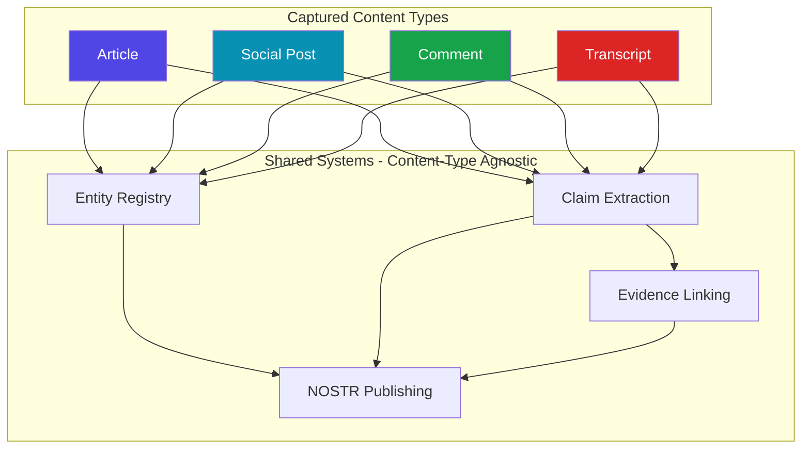
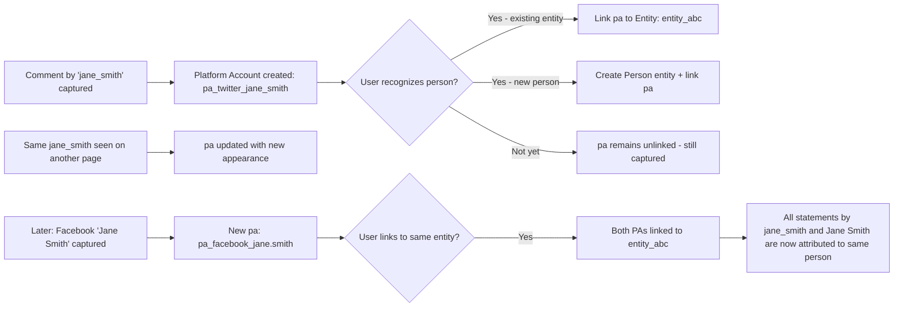
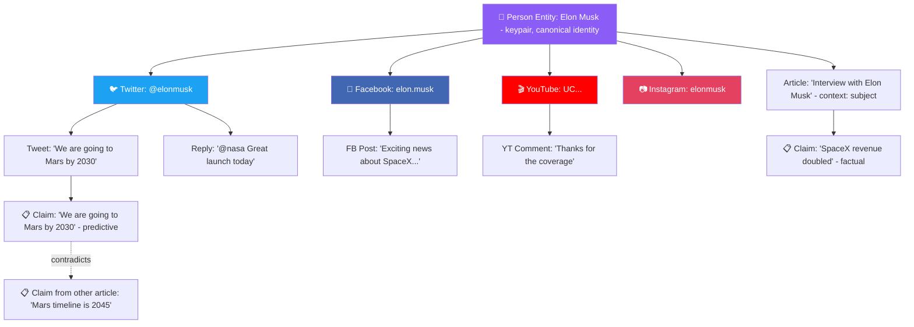

# NOSTR Content Capture v3 — Universal Content Expansion Plan

> **Status**: v3.6.0 — Phases 0–7 implemented. Phase 8 (cross-content features) is future work.
> **Based on**: v2.9.2 codebase, evolved to v3.6.0 modular architecture (~11,000 lines across 28 source files)

---

## Executive Summary

The v2 NOSTR Article Capture userscript is a mature, well-structured single-file Tampermonkey script focused on capturing web articles. The v3 expansion adds **comment capture**, **social media capture**, and **enhanced article metadata** while preserving the existing article workflow.

**Recommended architecture: Option B — Core + Platform Modules with esbuild build system.** This introduces a `src/` directory with ES modules that compile to a single `.user.js` file identical in form to the current output. The existing script continues to work as-is during migration; the build system is additive, not destructive.

---

## Table of Contents

1. [Recommended Architecture](#1-recommended-architecture)
2. [Unified Data Model](#2-unified-data-model)
3. [Content Type Detection](#3-content-type-detection)
4. [Platform-Specific Extractors](#4-platform-specific-extractors)
5. [UI Strategy](#5-ui-strategy)
6. [NOSTR Event Types](#6-nostr-event-types)
7. [Implementation Phases](#7-implementation-phases)
8. [Risk Mitigation](#8-risk-mitigation)
9. [File Structure](#9-file-structure)

---

## 1. Recommended Architecture

### Decision: Option B — Core + Platform Modules with Build System

#### Why Not the Alternatives

| Option | Verdict | Reason |
|--------|---------|--------|
| **A: Monolith** | ❌ Rejected | File is already 8,725 lines. Adding 6 platform extractors, comment capture, transcript handling, and new UI views would push it to 15,000–20,000 lines. No IDE provides good navigation in a file that large. |
| **C: Multiple Scripts** | ❌ Rejected | Code duplication is severe — crypto (600 lines), storage (400 lines), relay client (200 lines), event builder (300 lines), entity system (1,500 lines) would all need to be shared. Tampermonkey `@require` from GitHub is fragile and introduces version-sync nightmares. Users must install N scripts instead of one. |
| **D: Hybrid Single File** | ⚠️ Close second | The plugin-like internal architecture is exactly what Option B produces as OUTPUT. The question is whether you hand-write a 15,000-line file with that structure or let a build tool compose it from clean modules. Given the scope of expansion, build tooling wins. |
| **B: Build System** | ✅ Recommended | Clean separation of concerns during development; single `.user.js` output for deployment. Zero runtime overhead — esbuild concatenates everything at build time. The Tampermonkey header, `@require` directives, and `GM_*` APIs all work identically. |

#### Why esbuild Specifically

1. **Zero config** — a 15-line build script replaces a bundler config file
2. **Sub-second builds** — the entire codebase compiles in <100ms
3. **Native ESM input → IIFE output** — exactly what Tampermonkey expects
4. **Banner support** — the `// ==UserScript==` header block is injected verbatim
5. **No runtime overhead** — output is a single function scope, identical structure to current code
6. **Tree-shaking** — platform modules that the user has disabled are still included (Tampermonkey cant conditionally load), but the code is well-organized for future optimization

#### Migration Safety

The build system is **additive**. The existing [`nostr-article-capture.user.js`](../nostr-article-capture.user.js:1) continues to be the deployed artifact. The `src/` directory is a development convenience that compiles TO that same file. If the build system is ever abandoned, the last compiled output remains a valid, self-contained userscript.

---

## 2. Unified Data Model

### Design Principle: Provenance-First Knowledge Graph

**Every captured piece of content is a statement by a person, made at a time, in a place, on a platform.** The fundamental unit is not "an article" or "a comment" — it is **a statement with authorship and provenance**. Articles are authored by writers. Comments are authored by commenters. Tweets are authored by users. Transcript segments are spoken by speakers. Every one of these is a first-class record of "who said what, where, and when."

**Platform accounts are identity fragments.** A person may have a Twitter handle, a YouTube channel, a Substack, a Facebook profile, and a comment username on a news site. Each is a separate platform identity that may eventually be linked back to a single Person entity. The system captures these identity fragments as they are encountered and provides tools to unify them over time.

**The system builds a provenance graph** where:
- **Nodes** are entities (people, organizations, places, things) and statements (articles, posts, comments, transcript segments)
- **Edges** are relationships: authored, published_by, commented_on, replied_to, claims, supports, contradicts, is_alias_of, has_account
- **Every edge has provenance**: captured_at, captured_from, platform, confidence

This graph is the foundation for truth-seeking: tracing the origin of ideas, tracking narrative propagation, establishing consensus through citation and evidence. Different contexts may apply different evidentiary standards (courtroom rules, peer review, simplistic votes), but the underlying data must capture ALL signals that humans use to assess truth — who said it, their credentials, when they said it, where they said it, who agrees/disagrees, and what evidence supports or contradicts it.

All captured content shares a common base, with content-type-specific extensions. The existing entity, claim, and evidence systems operate on ANY content type — they are content-type-agnostic by design.

### 2.1 Content Types



### 2.2 Base Content Object

Every piece of captured content shares this structure:

```javascript
// Base content object — shared across all content types
{
  // Identity
  content_type: 'article',          // article | social_post | comment | transcript
  platform: 'web',                  // web | youtube | twitter | facebook | instagram | tiktok | substack
  id: 'content_<hash>',            // SHA-256 of content_type + platform + source_url

  // Source
  source_url: 'https://...',       // Canonical URL of the page
  source_domain: 'example.com',    // Domain for grouping/filtering

  // Content
  title: 'Article Title',          // Title, post text preview, or null
  body_html: '<p>...</p>',         // Full HTML content
  body_text: '...',                // Plain text version
  body_markdown: '...',            // Markdown conversion (for publishing)

  // Creator
  author_name: 'John Doe',         // Display name of content creator
  author_entity_id: 'entity_abc',  // Linked entity from registry (if tagged)
  author_platform_id: '@johndoe',  // Platform-specific identifier

  // Timestamps
  published_at: 1707350400,        // When the content was originally published (unix seconds)
  published_at_source: 'json-ld',  // How we found the date
  captured_at: 1707350500,         // When we captured it (unix seconds)

  // Media
  featured_image: 'https://...',   // Primary image (og:image, thumbnail, etc.)
  media_attachments: [],           // Array of {type, url, alt} for images/videos

  // Metadata
  metadata: {},                    // Content-type-specific extension object

  // User modifications
  edited_fields: [],               // Which fields the user has manually edited

  // Entity references (populated during tagging)
  entities: [
    { entity_id: 'entity_abc', context: 'author' }
  ]
}
```

### 2.3 Article Extension (Current — Enhanced)

```javascript
// metadata object for content_type: 'article'
{
  // Current fields (preserved from v2)
  byline: 'Helen Andrews',
  site_name: 'Compact Magazine',
  excerpt: '...',
  publication_icon: 'https://.../favicon.ico',

  // NEW: Enhanced metadata signals
  word_count: 2450,
  reading_time_minutes: 10,
  language: 'en',                  // Detected from html[lang] or meta tags
  section: 'Opinion',              // Article section/category from meta tags
  tags: ['politics', 'culture'],   // Article tags from meta keywords, JSON-LD, etc.

  // NEW: Structured data extraction
  json_ld: { /* raw JSON-LD data */ },
  open_graph: {                    // All og: meta tags
    type: 'article',
    locale: 'en_US',
    site_name: 'Compact Magazine'
  },

  // NEW: Source credibility signals
  has_byline: true,
  has_date: true,
  has_canonical_url: true,
  is_paywalled: false,             // Detected from meta tags or paywall elements
  content_source: 'readability',   // readability | simple | manual

  // NEW: Outbound references
  outbound_links: [
    {
      url: 'https://...',
      anchor_text: 'article',
      context: 'In 2019, I read an article about...',
      type: 'citation'            // citation | reference | related | external
    }
  ],

  // NEW: Inline media catalog
  inline_images: [
    { src: 'https://...', alt: 'Chart showing...', caption: '...' }
  ],

  // NEW: Comment summary (if comments were also captured)
  comment_count: 47,
  comments_captured: true,
  comments_content_id: 'content_<hash>'  // Reference to the captured comments
}
```

### 2.4 Comment Data Structure

```javascript
// metadata object for content_type: 'comment'
{
  // Thread identity
  parent_content_id: 'content_<hash>',    // The article/post these comments belong to
  parent_url: 'https://...',              // URL of the parent content
  parent_title: 'Article Title',          // Title of the parent content

  // Thread metadata
  total_comments: 47,
  captured_comments: 47,
  comment_system: 'native',               // native | disqus | facebook | utterances | giscus

  // Individual comments array
  comments: [
    {
      comment_id: 'cmt_<hash>',           // Platform-specific or generated ID
      author_name: 'Jane Smith',
      author_platform_id: '@janesmith',   // Platform handle/URL
      author_entity_id: null,             // Linked entity (if tagged)
      author_avatar_url: 'https://...',

      text: 'I disagree because...',
      html: '<p>I disagree because...</p>',
      timestamp: 1707350600,
      
      // Thread structure
      parent_comment_id: null,            // null = top-level; 'cmt_xyz' = reply
      depth: 0,                           // 0 = top-level, 1 = reply, 2 = nested reply
      reply_count: 3,

      // Engagement (where available)
      likes: 12,
      dislikes: 0,

      // Capture metadata
      is_highlighted: false,              // User marked this comment as important
      is_author_reply: false,             // Comment author is the article author
      extracted_claims: []                // Claim IDs extracted from this comment
    }
  ]
}
```

### 2.5 Social Post Data Structure

```javascript
// metadata object for content_type: 'social_post'
{
  // Platform identity
  post_id: 'platform_specific_id',
  post_type: 'tweet',                    // tweet | thread | post | reel | story | video | short
  
  // Author (richer than base, platform-specific)
  author_handle: '@elonmusk',
  author_display_name: 'Elon Musk',
  author_verified: true,
  author_follower_count: 150000000,
  author_profile_url: 'https://x.com/elonmusk',
  author_avatar_url: 'https://...',

  // Engagement metrics
  likes: 50000,
  reposts: 12000,                        // retweet, share, etc.
  replies: 8000,
  views: 5000000,
  bookmarks: 3000,

  // Thread context (for Twitter/X threads, reply chains)
  is_thread: false,
  thread_position: 0,                    // 0 = standalone or first in thread
  thread_length: 1,
  in_reply_to_post_id: null,
  in_reply_to_author: null,
  quoted_post: null,                     // { post_id, author, text, url }

  // Media
  has_media: true,
  media_type: 'image',                   // image | video | gif | poll | link_preview
  media_urls: ['https://...'],
  video_duration: null,                  // seconds, for video posts

  // Platform-specific
  hashtags: ['AI', 'tech'],
  mentions: ['@openai'],
  urls_in_text: ['https://...'],

  // Comments captured from this post
  comment_count: 8000,
  comments_captured: false,
  comments_content_id: null
}
```

### 2.6 Transcript Data Structure

```javascript
// metadata object for content_type: 'transcript'
{
  // Source media
  media_url: 'https://youtube.com/watch?v=...',
  media_type: 'video',                   // video | audio | livestream
  media_title: 'Interview with...',
  media_duration: 3600,                  // seconds
  channel_name: 'Channel Name',
  channel_url: 'https://...',

  // Transcript source
  transcript_source: 'youtube_auto',     // youtube_auto | youtube_manual | user_edited | whisper
  transcript_language: 'en',
  
  // Segments (timestamped text blocks)
  segments: [
    {
      segment_id: 'seg_001',
      start_time: 0.0,                   // seconds from beginning
      end_time: 5.2,
      text: 'Welcome to todays episode...',
      speaker: null,                      // Speaker name or entity ID (if identified)
      speaker_entity_id: null,
      confidence: 0.95,                   // ASR confidence (if available)
      extracted_claims: []                // Claim IDs from this segment
    }
  ],

  // Speaker identification
  speakers: [
    {
      label: 'Speaker 1',
      name: 'Joe Rogan',                 // User-assigned or auto-detected
      entity_id: 'entity_xyz',           // Linked entity
      segment_count: 45
    }
  ],

  // Live chat (for livestreams)
  has_live_chat: false,
  live_chat_messages: []                  // Same structure as comments array
}
```

### 2.7 Platform Accounts — Identity Fragments

A **Platform Account** is a new entity-adjacent data type that represents a person's identity on a specific platform. Platform accounts are NOT entities themselves — they are identity fragments that can be linked to a Person entity when the user identifies the connection.

```javascript
// Storage key: 'platform_accounts'
{
  "pa_<hash>": {
    id: "pa_<hash>",                     // SHA-256 of platform + platform_id
    platform: "twitter",                  // twitter | youtube | facebook | instagram | tiktok | substack | web
    platform_id: "@elonmusk",            // Platform-specific unique identifier
    display_name: "Elon Musk",           // Display name as shown on platform
    profile_url: "https://x.com/elonmusk",
    avatar_url: "https://...",
    
    // Platform-specific metadata (captured as-is for evidentiary value)
    verified: true,                       // Platform verification status at capture time
    follower_count: 150000000,           // At capture time
    bio: "...",                           // Profile bio at capture time
    
    // Entity linkage (null until user links it)
    entity_id: null,                      // "entity_abc" when linked to a Person entity
    
    // Provenance
    first_seen_at: 1707350400,           // When we first captured this account
    first_seen_url: "https://x.com/elonmusk/status/123",
    last_seen_at: 1707350400,
    
    // Appearance tracking
    appearances: [                        // Every place this account appeared
      {
        content_type: "social_post",      // article | social_post | comment | transcript
        url: "https://x.com/...",
        role: "author",                   // author | commenter | speaker | mentioned
        captured_at: 1707350400
      }
    ]
  }
}
```

**Lifecycle of a Platform Account:**



### 2.8 Entity Enhancements

The existing entity structure from [`docs/data-model.md`](../docs/data-model.md:1) is preserved and extended:

```javascript
// Extended entity fields (backward compatible)
{
  // ... all existing fields preserved ...

  // NEW: Linked platform accounts
  platform_account_ids: [               // IDs of linked platform accounts
    "pa_twitter_elonmusk",
    "pa_youtube_UC...",
    "pa_facebook_elon.musk"
  ],

  // NEW: Content appearances (extends existing articles array)
  // The existing 'articles' array is renamed conceptually to 'appearances'
  // but the field name stays 'articles' for backward compatibility
  articles: [
    {
      url: 'https://...',
      title: '...',
      context: 'author',                 // existing contexts preserved
      content_type: 'article',           // NEW: what type of content
      tagged_at: 1707350400
    }
  ]
}
```

**Entity relationship to Platform Accounts:**



### 2.9 Comments as First-Class Statements

Each individual comment is a **statement by a person** with full provenance. Comments are not merely metadata on an article — they are evidence of what someone said, when, and where.

The comment data structure in Section 2.4 captures the raw data. But the key architectural decision is how comments connect to the entity and claim systems:

1. **Every commenter gets a Platform Account** — When comments are captured, each unique commenter creates (or updates) a Platform Account. This happens automatically during extraction.

2. **Platform Accounts can be promoted to Entities** — The user can link a commenter's Platform Account to a Person entity. Once linked, ALL statements by that account are attributed to the entity.

3. **Comments are individually claimable** — A comment can be selected and extracted as a claim, with the commenter as the claimant (via their Platform Account → Entity link if available).

4. **Comments are published as individual NOSTR events** — Each comment is published under the commenter's entity keypair (if linked) or the user's keypair (with commenter attribution tags). This means every comment is a citable, addressable piece of evidence on the NOSTR network.

### 2.10 Claims Across Content Types

The existing claim structure from [`docs/data-model.md`](../docs/data-model.md:65) requires minimal changes:

```javascript
// Extended claim fields (backward compatible)
{
  // ... all existing fields preserved ...
  
  // NEW: Source content type (defaults to 'article' for backward compatibility)
  source_content_type: 'article',        // article | social_post | comment | transcript
  
  // NEW: Source provenance for non-article claims
  source_platform: 'twitter',            // Platform where the statement was made
  source_platform_account_id: 'pa_xyz',  // Platform account of the claimant
  
  // NEW: For transcript claims, link to specific segment
  source_segment_id: null,               // 'seg_001' for transcript-sourced claims
  source_timestamp: null                 // seconds into media, for transcript claims
}
```

### 2.11 Evidentiary Standards Framework

The data model is designed to support **multiple evidentiary standards** applied to the same underlying data. The captured signals include:

| Signal | What It Establishes | Courtroom Analog |
|--------|-------------------|------------------|
| Author identity (entity + platform accounts) | Who made the statement | Witness identification |
| Timestamp (published_at, captured_at) | When the statement was made | Timeline of events |
| Platform and URL | Where the statement was made | Venue/jurisdiction |
| Verbatim text | What exactly was said | Testimony/deposition |
| Engagement metrics | Social proof/consensus signal | Weight of public opinion |
| Thread/reply structure | Conversational context | Cross-examination record |
| Edit history (if captured) | Statement evolution | Amended testimony |
| Claims extracted | Structured assertions | Stipulated facts |
| Evidence links | Corroboration/contradiction | Exhibit references |
| Entity relationships | Network of participants | Witness relationships |

Different consensus protocols can weight these signals differently:

- **Courtroom mode**: Emphasizes verbatim text, timestamps, authorship, corroboration. Ignores popularity signals.
- **Peer review mode**: Emphasizes credentials of claimant, evidence links, claim type (factual vs. evaluative).
- **Democratic mode**: Emphasizes engagement, number of corroborating claims, breadth of sources.
- **Investigative mode**: Emphasizes timeline, entity relationships, narrative propagation patterns.

The capture system does not implement these protocols — it captures the **raw signals** that any protocol can consume. The NOSTR event structure preserves all signals as queryable tags.

---

## 3. Content Type Detection

### 3.1 Detection Strategy

Content type detection runs at initialization (before the FAB click) to determine the page context and FAB appearance.

```mermaid
flowchart TD
    A[Page Loads] --> B{URL Pattern Match?}
    B -->|youtube.com/watch| C[YouTube Video]
    B -->|x.com or twitter.com| D[Twitter/X Post]
    B -->|facebook.com| E[Facebook Post]
    B -->|instagram.com/p or /reel| F[Instagram Post]
    B -->|tiktok.com/@/video| G[TikTok Video]
    B -->|*.substack.com| H[Substack Article]
    B -->|No match| I{DOM Analysis}
    
    I -->|Has article element + substantial text| J[Generic Article]
    I -->|Has comment section| K[Article + Comments]
    I -->|Insufficient content| L[Unknown - Show FAB Anyway]

    C --> M[Set FAB Icon: 🎬]
    D --> N[Set FAB Icon: 🐦]
    E --> O[Set FAB Icon: 📘]
    F --> P[Set FAB Icon: 📷]
    G --> Q[Set FAB Icon: 🎵]
    H --> R[Set FAB Icon: 📰]
    J --> S[Set FAB Icon: 📰]
    K --> S
    L --> S
```

### 3.2 Platform Detection Module

```javascript
const PlatformDetector = {
  // Returns { platform, content_type, capabilities }
  detect: () => {
    const url = window.location.href;
    const hostname = window.location.hostname;

    // YouTube
    if (hostname.includes('youtube.com') || hostname.includes('youtu.be')) {
      if (url.includes('/watch') || url.includes('/shorts/')) {
        return {
          platform: 'youtube',
          content_type: 'social_post',
          capabilities: ['video', 'transcript', 'comments', 'live_chat'],
          fab_icon: '🎬',
          fab_label: 'Capture Video'
        };
      }
    }

    // Twitter/X
    if (hostname.includes('twitter.com') || hostname.includes('x.com')) {
      if (url.match(/\/status\/\d+/)) {
        return {
          platform: 'twitter',
          content_type: 'social_post',
          capabilities: ['post', 'thread', 'comments'],
          fab_icon: '🐦',
          fab_label: 'Capture Tweet'
        };
      }
    }

    // Facebook
    if (hostname.includes('facebook.com')) {
      return {
        platform: 'facebook',
        content_type: 'social_post',
        capabilities: ['post', 'comments'],
        fab_icon: '📘',
        fab_label: 'Capture Post'
      };
    }

    // Instagram
    if (hostname.includes('instagram.com')) {
      if (url.match(/\/(p|reel)\//)) {
        return {
          platform: 'instagram',
          content_type: 'social_post',
          capabilities: ['post', 'comments'],
          fab_icon: '📷',
          fab_label: 'Capture Post'
        };
      }
    }

    // TikTok
    if (hostname.includes('tiktok.com')) {
      if (url.includes('/video/')) {
        return {
          platform: 'tiktok',
          content_type: 'social_post',
          capabilities: ['video', 'comments', 'transcript'],
          fab_icon: '🎵',
          fab_label: 'Capture Video'
        };
      }
    }

    // Substack (enhanced article handling)
    if (hostname.includes('substack.com')) {
      return {
        platform: 'substack',
        content_type: 'article',
        capabilities: ['article', 'comments'],
        fab_icon: '📰',
        fab_label: 'Capture Article'
      };
    }

    // Default: generic web article
    return {
      platform: 'web',
      content_type: 'article',
      capabilities: ['article', 'comments'],
      fab_icon: '📰',
      fab_label: 'Capture Article'
    };
  },

  // Check if page has capturable comments
  hasComments: () => {
    const selectors = [
      '#comments', '.comments', '.comment-section',
      '[data-testid="comments"]', '.disqus_thread',
      '#disqus_thread', '.utterances', '.giscus',
      'section.comments', '.post-comments'
    ];
    return selectors.some(s => document.querySelector(s) !== null);
  }
};
```

### 3.3 FAB Behavior Changes

The FAB adapts based on detected platform:

- **Icon changes** — 📰 for articles, 🎬 for videos, 🐦 for tweets, etc.
- **Click action** — Opens the appropriate capture view for the content type
- **Long-press / context menu** — Shows capture options (e.g., "Capture Article", "Capture Comments", "Capture Both")
- **Badge indicator** — Small dot on FAB when comments are detected (user can capture them separately)

---

## 4. Platform-Specific Extractors

### 4.1 Extractor Architecture

Each platform extractor is a module that conforms to a common interface:

```javascript
// Common extractor interface
const PlatformExtractor = {
  // Can this extractor handle the current page?
  canHandle: () => boolean,

  // Extract the primary content
  extractContent: () => ContentObject,

  // Extract comments (if supported)
  extractComments: () => CommentObject | null,

  // Extract transcript (if supported)  
  extractTranscript: () => TranscriptObject | null,

  // Platform-specific metadata enrichment
  enrichMetadata: (content) => content
};
```

### 4.2 Enhanced Article Extractor

Extends the current [`ContentExtractor`](../nostr-article-capture.user.js:1075) with additional metadata signals:

**New metadata to capture:**

| Signal | Source | Purpose |
|--------|--------|---------|
| `word_count` | Readability `textContent.split()` | Article length indicator |
| `reading_time_minutes` | `word_count / 238` | Reading time estimate |
| `language` | `html[lang]`, `Content-Language` header, `og:locale` | Language detection |
| `section` | `meta[property=article:section]`, JSON-LD | Content categorization |
| `tags` | `meta[name=keywords]`, JSON-LD `keywords`, article tags | Topic classification |
| `json_ld` | `script[type=application/ld+json]` | Full structured data |
| `open_graph` | All `meta[property^=og:]` | Social metadata |
| `is_paywalled` | `meta[name=paid]`, `.paywall`, `isAccessibleForFree` in JSON-LD | Access indicator |
| `outbound_links` | All `<a>` tags in article body | Citation graph |
| `inline_images` | All `` in article with `alt` and context | Visual evidence catalog |

**New extraction methods:**

```javascript
// Added to ContentExtractor (or new EnhancedArticleExtractor)
extractStructuredData: () => { /* JSON-LD + OpenGraph + meta tags */ },
extractOutboundLinks: (articleEl) => { /* catalog all links with context */ },
extractInlineMedia: (articleEl) => { /* catalog images, embeds */ },
detectPaywall: () => { /* check paywall indicators */ },
detectLanguage: () => { /* html[lang], og:locale, etc. */ }
```

### 4.3 Generic Comment Extractor

Captures comments from any website with recognizable comment sections:

```javascript
const CommentExtractor = {
  // Detect comment system type
  detectSystem: () => {
    if (document.querySelector('#disqus_thread')) return 'disqus';
    if (document.querySelector('.utterances')) return 'utterances';
    if (document.querySelector('.giscus')) return 'giscus';
    // ... platform-specific checks ...
    return 'native';
  },

  // Extract comments using system-specific selectors
  extract: (system) => {
    switch (system) {
      case 'disqus': return CommentExtractor.extractDisqus();
      case 'native': return CommentExtractor.extractNative();
      // ...
    }
  },

  // Generic native comment extraction
  // Uses heuristics: .comment, .comment-body, .reply, etc.
  extractNative: () => {
    const commentSelectors = [
      '.comment', '.comments-list > li', '.comment-item',
      '[data-testid="comment"]', '.post-comment'
    ];
    // Walk DOM, extract author/text/timestamp/thread structure
  }
};
```

### 4.4 YouTube Extractor

| Capability | Method | Notes |
|-----------|--------|-------|
| Video metadata | DOM + `ytInitialPlayerResponse` | Title, description, channel, duration, views, likes |
| Transcript | Click "Show transcript" → scrape `ytd-transcript-segment-renderer` | Falls back to `timedtext` API endpoint |
| Comments | DOM scraping of `ytd-comment-thread-renderer` | Requires scroll-to-load; capture visible + progressive loading |
| Live chat | `ytd-live-chat-frame` iframe or replay | Chat messages with author, timestamp, text |

```javascript
const YouTubeExtractor = {
  canHandle: () => location.hostname.includes('youtube.com'),
  
  extractContent: () => {
    // Video title: #title h1 yt-formatted-string
    // Channel: #channel-name a
    // Description: #description-inner
    // Views/likes: #info-strings, ytd-menu-renderer
    // Published date: #info-strings yt-formatted-string
    // Thumbnail: og:image meta tag
  },

  extractTranscript: async () => {
    // Method 1: YouTube transcript panel
    //   - Click "...More" then "Show transcript"
    //   - Scrape ytd-transcript-segment-renderer elements
    //   - Each has timestamp + text
    // Method 2: timedtext API
    //   - Extract videoId from URL
    //   - Fetch https://www.youtube.com/api/timedtext?v={id}&lang=en
    //   - Parse XML response into segments
  },

  extractComments: () => {
    // ytd-comment-thread-renderer elements
    // Each contains: author, text, timestamp, likes, reply count
    // Replies in ytd-comment-replies-renderer
    // Challenge: comments lazy-load on scroll
    // Strategy: capture what is visible + offer "Load More" button
  }
};
```

### 4.5 Twitter/X Extractor

| Capability | Method | Notes |
|-----------|--------|-------|
| Tweet content | DOM `[data-testid="tweetText"]` | Text, media, links |
| Author | `[data-testid="User-Name"]` | Name, handle, verified status |
| Thread | Walk `article` elements in timeline | Detect thread vs. standalone |
| Replies | DOM `article` elements after main tweet | Commenter, text, engagement |
| Engagement | `[data-testid="like"]`, etc. | Likes, retweets, views, bookmarks |

```javascript
const TwitterExtractor = {
  canHandle: () => {
    const h = location.hostname;
    return (h.includes('twitter.com') || h.includes('x.com')) 
      && location.pathname.match(/\/status\/\d+/);
  },
  
  extractContent: () => {
    // Main tweet: article[data-testid="tweet"] (first one)
    // Text: [data-testid="tweetText"]
    // Author: [data-testid="User-Name"] a elements
    // Time: time element with datetime attribute
    // Media: img/video within tweet
    // Engagement: aria-label on group buttons
    // Quoted tweet: nested article with [data-testid="tweet"]
  },

  extractComments: () => {
    // All article elements after the main tweet are replies
    // Each reply has same structure as a tweet
    // Thread detection: same author consecutive tweets
  }
};
```

### 4.6 Facebook Extractor

| Capability | Method | Notes |
|-----------|--------|-------|
| Post content | DOM role="article" | Text, media, links |
| Author | Link within post header | Name, profile URL |
| Comments | `.x1y1aw1k` and similar dynamic class selectors | Facebooks DOM is heavily obfuscated |
| Engagement | Reaction count, comment count, share count | From post footer |

**Important caveat:** Facebook aggressively obfuscates its DOM with random class names that change frequently. The extractor must use structural patterns (ARIA roles, data attributes, nesting depth) rather than class names. This is the most fragile extractor and should be treated as best-effort.

### 4.7 Instagram Extractor

| Capability | Method | Notes |
|-----------|--------|-------|
| Post content | `meta[property="og:description"]` + DOM | Caption text, media |
| Author | `meta[property="og:title"]` | Username |
| Comments | DOM scraping of comment section | Limited by Instagrams lazy loading |
| Media | `meta[property="og:image"]`, video elements | Image/video URL |

### 4.8 TikTok Extractor

| Capability | Method | Notes |
|-----------|--------|-------|
| Video metadata | `__NEXT_DATA__` JSON in page source | Title, author, duration, stats |
| Author | Embedded in page data | Username, display name, followers |
| Comments | DOM scraping | Comment text, author, likes |
| Transcript | Auto-generated captions if available | Similar approach to YouTube |

### 4.9 Substack Extractor (Enhanced)

Substack is already partially handled by Readability. The enhanced extractor adds:

| Capability | Method | Notes |
|-----------|--------|-------|
| Article | Readability (existing) | Enhanced with Substack-specific metadata |
| Author bio | `.post-header .profile-hover-card-target` | Rich author info |
| Comments | `.comment-list .comment` | Native Substack comments |
| Subscriber info | Meta tags | Free vs. paid indicator |
| Publication metadata | JSON-LD, Substack-specific meta | Newsletter name, description |

---

## 5. UI Strategy

### 5.1 Design Principle: Adaptive Reader View

The existing reader view is the foundation. Rather than building entirely separate UIs for each content type, the reader view **adapts** its layout based on content type while preserving the shared chrome (toolbar, entity bar, claims bar).

```
+------------------------------------------------------------------+
|  [← Back]   Platform Name    [⚙️] [📋 Claims] [📤 Publish]      |  <- Shared toolbar
+------------------------------------------------------------------+
|                                                                    |
|  +--------------------------------------------------------------+ |
|  |                                                                | |
|  |  [ CONTENT-TYPE-SPECIFIC VIEW AREA ]                          | |
|  |                                                                | |
|  |  - Article view (current)                                      | |
|  |  - Social post view (new)                                      | |
|  |  - Comment thread view (new)                                   | |
|  |  - Transcript view (new)                                       | |
|  |                                                                | |
|  +--------------------------------------------------------------+ |
|                                                                    |
|  +--------------------------------------------------------------+ |
|  | Tagged Entities   [shared across all content types]            | |
|  | [👤 Person] [🏢 Org] [+ Tag Entity]                           | |
|  +--------------------------------------------------------------+ |
|                                                                    |
|  +--------------------------------------------------------------+ |
|  | Claims   [shared across all content types]                     | |
|  | [📋 Claim chips...]                                            | |
|  +--------------------------------------------------------------+ |
+------------------------------------------------------------------+
```

### 5.2 Article View (Current — Preserved)

No changes to the existing article reader view. The current UI in [`ReaderView.show()`](../nostr-article-capture.user.js:4002) is preserved exactly as-is.

**Enhancement:** A "📝 Comments" tab/section appears below the article when comments have been captured, showing a collapsible comment thread.

### 5.3 Social Post View (New)

```
+--------------------------------------------------------------+
|  📘 Facebook Post                                              |
|  ┌──────────────────────────────────────────────────────┐     |
|  │  [Avatar]  John Doe  @johndoe                        │     |
|  │  Posted: March 15, 2026 · 🌐 Public                  │     |
|  │                                                       │     |
|  │  This is the post text. It can be quite long and      │     |
|  │  include multiple paragraphs...                       │     |
|  │                                                       │     |
|  │  [Embedded image/video]                               │     |
|  │                                                       │     |
|  │  ❤️ 1.2K   💬 340   🔄 89   👁️ 45K                   │     |
|  └──────────────────────────────────────────────────────┘     |
|                                                                |
|  ┌── Comments (47 captured) ──────────────────────────────┐   |
|  │  [Avatar] Jane Smith · 2h ago                          │   |
|  │  I completely disagree with this...                    │   |
|  │  ❤️ 12                                                 │   |
|  │    ┌─ [Avatar] John Doe (Author) · 1h ago              │   |
|  │    │  Thanks for the feedback, but...                  │   |
|  │    └─ ❤️ 5                                              │   |
|  │  [Avatar] Bob Wilson · 1h ago                          │   |
|  │  Great point! Evidence here: [link]                    │   |
|  │  ❤️ 8                                                  │   |
|  └────────────────────────────────────────────────────────┘   |
+--------------------------------------------------------------+
```

Key features:
- Post content displayed in a card format matching the platform aesthetic (but clean, distraction-free)
- Author identity prominently displayed with platform handle
- Engagement metrics preserved as metadata (but not emphasized — truth over popularity)
- Comments displayed in threaded format below
- Text selection on any content (post text or comment) triggers entity tagging popover
- Claim extraction works on post text and individual comments

### 5.4 Comment Thread View (New)

When comments are captured separately from an article:

```
+--------------------------------------------------------------+
|  💬 Comments on: "The Great Feminization"                      |
|  Source: compactmag.com · 47 comments captured                 |
|  ┌────────────────────────────────────────────────────────┐   |
|  │  Sort: [Newest] [Oldest] [Most Liked]   Filter: [All]  │   |
|  └────────────────────────────────────────────────────────┘   |
|                                                                |
|  [Avatar] Jane Smith · Mar 15, 2026                            |
|  The authors thesis about feminization ignores the             |
|  structural factors that drove these changes...                 |
|  ❤️ 45 · 💬 3 replies                                          |
|  [Tag Entity] [📋 Claim]                                       |
|                                                                |
|    ┌─ [Avatar] Robert James · Mar 15, 2026                     |
|    │  @Jane exactly. The data on law schools doesnt            |
|    │  account for the expansion of law programs...              |
|    │  ❤️ 12                                                     |
|    │  [Tag Entity] [📋 Claim]                                   |
|    └                                                            |
+--------------------------------------------------------------+
```

Key features:
- Each comment is individually taggable and claimable
- Commenter names auto-suggest as Person entities
- Reply structure preserved
- Author replies highlighted
- Sort/filter controls

### 5.5 Transcript View (New)

```
+--------------------------------------------------------------+
|  🎬 Transcript: "Joe Rogan #2100 - Elon Musk"                 |
|  YouTube · 3:24:15 · Published Dec 1, 2025                    |
|  Channel: PowerfulJRE · 15M views                              |
|                                                                |
|  Speakers: [👤 Joe Rogan] [👤 Elon Musk]                      |
|                                                                |
|  ┌── Transcript ──────────────────────────────────────────┐   |
|  │  [00:00:15] JOE ROGAN                                  │   |
|  │  Welcome back to the show. Today we have Elon Musk      │   |
|  │  here to talk about SpaceX, Tesla, and the future...    │   |
|  │                                                          │   |
|  │  [00:00:32] ELON MUSK                                   │   |
|  │  Thanks Joe. Yeah, so weve been working on Starship     │   |
|  │  and the latest test was actually quite successful...    │   |
|  │  [📋 Claim: Starship test was successful]               │   |
|  │                                                          │   |
|  │  [00:01:15] JOE ROGAN                                   │   |
|  │  Tell me about the landing. I saw the video...          │   |
|  └────────────────────────────────────────────────────────┘   |
+--------------------------------------------------------------+
```

Key features:
- Timestamped segments with speaker labels
- Speaker labels are clickable — link to entity
- Text selection triggers entity tagging and claim extraction
- Claims capture the timestamp for precise evidence citing
- Speakers identified at top as entity chips

### 5.6 Mobile Responsiveness

All new views follow the existing mobile patterns from the current CSS:

```css
@media (max-width: 768px) {
  /* Reader view already responsive — same patterns apply */
  .nac-social-post-card { padding: 12px; }
  .nac-comment-thread { margin-left: 8px; }  /* reduced indent */
  .nac-transcript-timestamp { display: block; } /* stack timestamp above text */
  .nac-engagement-metrics { font-size: 12px; }
}
```

The existing mobile FAB positioning (bottom: 80px on mobile) and touch-friendly sizes already established in the current styles section are inherited by all new views.

### 5.7 Capture Options Menu

When the FAB is clicked on a page with multiple capturable content types, a brief options menu appears:

```
+---------------------------+
|  What to capture?          |
|  [📰 Article]              |
|  [💬 Comments (47)]        |
|  [📰+💬 Article + Comments]|
+---------------------------+
```

This only appears when multiple options are available. On a pure article page with no comments, the FAB proceeds directly to article capture (current behavior preserved).

---

## 6. NOSTR Event Types

### 6.1 Event Kind Strategy — Statements as First-Class Events

The fundamental architectural principle: **every captured statement is its own addressable NOSTR event**, signed by the capturing user but attributing authorship to the original speaker/writer. This means individual comments are NOT bundled into a single JSON blob — each one is a separate event that can be referenced, linked to claims, and queried independently.

| Kind | Name | Usage | Status |
|------|------|-------|--------|
| **0** | Profile Metadata | Entity profiles | ✅ Existing |
| **30023** | Long-form Content | Articles, social posts, transcripts | ✅ Existing (extended) |
| **30040** | Claim Event | Claims from any content type | ✅ Existing (extended) |
| **30041** | Captured Statement | Individual comment, reply, or chat message | 🆕 New |
| **30042** | Statement Thread | Thread metadata linking statements together | 🆕 New |
| **30043** | Evidence Link | Cross-content evidence | ✅ Existing |
| **30078** | Application Data | Entity sync, platform account sync | ✅ Existing (extended) |
| **32125** | Entity Relationship | Entity-content links | ✅ Existing (extended) |
| **32126** | Platform Account | Published platform identity fragment | 🆕 New |

### 6.2 Extended Kind 30023 — Captured Content

For social posts and transcripts, kind 30023 is extended with a `content-type` tag:

```javascript
// Social post captured as kind 30023
{
  kind: 30023,
  tags: [
    ['d', '<hash>'],
    ['title', 'Tweet by @elonmusk'],
    ['content-type', 'social_post'],        // NEW: differentiates from articles
    ['platform', 'twitter'],                 // NEW: source platform
    ['r', 'https://x.com/elonmusk/status/123456'],
    ['published_at', '1707350400'],
    ['captured_at', '1707350500'],          // NEW: when we captured it
    ['author', 'Elon Musk'],
    ['p', '<entity-pubkey>', '', 'author'],
    ['platform-account', 'twitter', '@elonmusk'],  // NEW: platform identity fragment
    
    // Platform-specific metadata as tags (evidentiary signals)
    ['engagement', 'likes', '50000'],        // NEW
    ['engagement', 'reposts', '12000'],      // NEW
    ['engagement', 'views', '5000000'],      // NEW
    
    ['client', 'nostr-article-capture']
  ],
  content: 'Full post text in markdown...'
}
```

```javascript
// Transcript captured as kind 30023
{
  kind: 30023,
  tags: [
    ['d', '<hash>'],
    ['title', 'Transcript: Joe Rogan #2100 - Elon Musk'],
    ['content-type', 'transcript'],          // NEW
    ['platform', 'youtube'],                  // NEW
    ['r', 'https://youtube.com/watch?v=...'],
    ['published_at', '1707350400'],
    ['captured_at', '1707350500'],
    ['media-duration', '12255'],             // NEW: seconds
    ['transcript-source', 'youtube_auto'],   // NEW
    
    // Speaker tags — each speaker is an entity with platform account linkage
    ['p', '<joe-rogan-pubkey>', '', 'speaker'],
    ['p', '<elon-musk-pubkey>', '', 'speaker'],
    ['speaker', 'Joe Rogan'],
    ['speaker', 'Elon Musk'],
    ['platform-account', 'youtube', 'PowerfulJRE'],
    
    ['client', 'nostr-article-capture']
  ],
  content: 'Timestamped transcript in markdown format...'
}
```

**Backward compatibility:** Existing kind 30023 article events do not have a `content-type` tag. Clients that do not understand `content-type` will display them as regular long-form content, which is correct behavior.

### 6.3 New Kind 30041 — Captured Statement (Individual Comment/Reply)

**Every comment is its own event.** This is the key architectural decision that enables comments to be individually citable, linkable to claims, and attributable to entities.

```javascript
// Individual comment published as kind 30041
{
  kind: 30041,
  pubkey: '<capturing-user-pubkey>',        // Signed by the user who captured it
  tags: [
    ['d', 'stmt_<hash-of-platform+id+text>'],
    
    // What this statement is responding to
    ['r', 'https://example.com/article'],             // Parent content URL
    ['parent-title', 'The Great Feminization'],
    ['parent-content-type', 'article'],
    
    // Thread structure
    ['reply-to', 'stmt_<parent-comment-hash>'],       // null/absent for top-level comments
    ['thread-root', 'stmt_<root-hash>'],              // Thread root (may equal d-tag for top-level)
    ['thread-position', '0'],                          // Position in thread (0 = top-level)
    
    // WHO said it — platform account identity
    ['statement-author', 'Jane Smith'],                // Display name as shown
    ['platform', 'web'],
    ['platform-account', 'web', 'jane_smith_42'],     // Platform + identifier
    ['platform-account-url', 'https://example.com/user/jane_smith_42'],
    
    // WHO said it — entity linkage (if user has linked the platform account to an entity)
    ['p', '<jane-smith-entity-pubkey>', '', 'statement-author'],
    
    // WHEN they said it
    ['published_at', '1707350600'],                   // Original comment timestamp
    ['captured_at', '1707350700'],                    // When we captured it
    
    // Evidentiary signals
    ['engagement', 'likes', '12'],
    ['is-author-reply', 'false'],                     // Whether commenter is the article author
    
    ['client', 'nostr-article-capture']
  ],
  content: 'I disagree because the data on law schools does not account for...'
}
```

**Why individual events instead of a JSON blob?**

1. **Citability** — A claim can reference a specific comment by its event `d` tag. "Jane Smith said X" has a precise NOSTR-addressable source.
2. **Queryability** — Relays can be queried for all statements by a specific platform account or entity, across all articles. "Show me everything @jane_smith_42 has said across all captured content."
3. **Evidence linking** — A comment can be linked as evidence (supports/contradicts) to any claim from any content type, using the existing kind 30043 evidence link mechanism.
4. **Entity graph** — Each statement creates a relationship edge between the commenter entity and the parent content, queryable via kind 32125 entity relationships.
5. **Narrative tracking** — By making each statement individually addressable, you can trace how ideas propagate: Person A says X in an article → Person B responds with Y in a comment → Person C quotes both in a tweet → Person D extracts a claim from the tweet.

### 6.4 New Kind 30042 — Statement Thread Metadata

Groups individual statements into their thread context:

```javascript
{
  kind: 30042,
  tags: [
    ['d', 'thread_<hash-of-parent-url>'],
    ['r', 'https://example.com/article'],
    ['parent-title', 'The Great Feminization'],
    ['parent-content-type', 'article'],
    ['platform', 'web'],
    ['comment-system', 'native'],                     // native | disqus | facebook | etc.
    ['statement-count', '47'],                        // Total statements captured
    ['captured_at', '1707350700'],
    
    // All statement event d-tags in this thread (for efficient retrieval)
    ['e', '<event-id-of-statement-1>'],
    ['e', '<event-id-of-statement-2>'],
    // ... (can be large for big threads)
    
    // All unique platform accounts in this thread
    ['platform-account', 'web', 'jane_smith_42'],
    ['platform-account', 'web', 'bob_wilson'],
    
    // All linked entities in this thread
    ['p', '<entity-pubkey-1>', '', 'commenter'],
    ['p', '<entity-pubkey-2>', '', 'commenter'],
    
    ['client', 'nostr-article-capture']
  ],
  content: ''                                          // Metadata only
}
```

### 6.5 New Kind 32126 — Platform Account

Published platform identity fragments, so other users of the system can discover and merge identities:

```javascript
{
  kind: 32126,
  tags: [
    ['d', 'pa_<hash>'],
    ['platform', 'twitter'],
    ['platform-id', '@elonmusk'],
    ['display-name', 'Elon Musk'],
    ['profile-url', 'https://x.com/elonmusk'],
    ['verified', 'true'],
    ['follower-count', '150000000'],
    ['first-seen', '1707350400'],
    
    // Entity linkage (if linked)
    ['p', '<elon-musk-entity-pubkey>', '', 'identity'],
    ['entity-name', 'Elon Musk'],
    ['entity-type', 'person'],
    
    ['client', 'nostr-article-capture']
  ],
  content: ''
}
```

### 6.6 Extended Kind 30040 — Claims from Any Content

Claims gain source-type awareness and platform provenance:

```javascript
{
  kind: 30040,
  tags: [
    // ... all existing claim tags preserved ...
    ['source-content-type', 'comment'],       // NEW: what kind of content the claim came from
    ['source-platform', 'twitter'],            // NEW: platform where the statement was made
    ['source-statement', 'stmt_<hash>'],       // NEW: reference to the specific statement event
    ['source-timestamp', '1234.5'],            // NEW: for transcript claims, seconds into media
    ['source-segment', 'seg_042'],             // NEW: transcript segment reference
    ['platform-account', 'twitter', '@jane'],  // NEW: platform identity of the claimant
  ]
}
```

### 6.7 Extended Kind 32125 — Entity Relationships

New relationship types for new content types:

| Relationship | Context |
|-------------|---------|
| `author` | ✅ Existing — article author |
| `mentioned` | ✅ Existing — mentioned in content |
| `claimant` | ✅ Existing — made a claim |
| `subject` | ✅ Existing — subject of a claim |
| `commenter` | 🆕 New — made a comment/reply |
| `speaker` | 🆕 New — speaker in transcript |
| `creator` | 🆕 New — social post creator |
| `has_account` | 🆕 New — entity has this platform account |

---

## 7. Implementation Phases

### Phase 0: Build System Migration ✅ COMPLETE

**Goal:** Introduce esbuild without changing any functionality.

**Implementation:** [`build.js`](../build.js) uses esbuild to bundle all ES modules from `src/` into a single IIFE output at `dist/nostr-article-capture.user.js`. The Tampermonkey header is read from [`src/header.js`](../src/header.js) and injected as a banner. `npm run build` and `npm run watch` are configured in [`package.json`](../package.json).

- [x] Set up `package.json` with esbuild dependency
- [x] Create `src/header.js` with the `// ==UserScript==` block
- [x] Create `build.js` esbuild script
- [x] Split current monolith into `src/` modules along existing section boundaries (28 files)
- [x] Verify compiled output produces identical behavior to current script
- [x] Set up `npm run build` and `npm run watch` commands
- [x] Update `.gitignore` for `node_modules/` and build artifacts
- [x] Document build process in README

### Phase 1: Enhanced Article Metadata ✅ COMPLETE

**Goal:** Capture more metadata signals from articles.

**Implementation:** [`ContentExtractor`](../src/content-extractor.js) enhanced with structured data extraction (JSON-LD + OpenGraph), language detection, paywall detection, word count, reading time, section/category, and keyword extraction. Enhanced metadata tags added to kind 30023 events in [`EventBuilder`](../src/event-builder.js:110).

- [x] Add `extractStructuredData()` — JSON-LD and OpenGraph extraction
- [x] Add `extractOutboundLinks()` — catalog all links in article body with context
- [x] Add `extractInlineMedia()` — catalog images with alt text and captions
- [x] Add `detectLanguage()` — from `html[lang]`, `og:locale`, `Content-Language`
- [x] Add `detectPaywall()` — from meta tags, JSON-LD `isAccessibleForFree`, DOM indicators
- [x] Add word count and reading time calculation
- [x] Add section/category extraction from meta tags
- [x] Add tag/keyword extraction from meta tags and JSON-LD
- [x] Store enhanced metadata in article object
- [x] Display enhanced metadata in reader view
- [x] Include enhanced metadata as tags in kind 30023 events

### Phase 2: Content Type Detection + Platform Infrastructure ✅ COMPLETE

**Goal:** Build the detection and routing infrastructure that all platform extractors use.

**Implementation:** [`ContentDetector`](../src/content-detector.js) detects YouTube, Twitter/X, Facebook, Instagram, TikTok, Substack, and generic articles via URL pattern matching and DOM analysis. [`PlatformHandler`](../src/platform-handler.js) provides a registry for platform-specific extractors. FAB icon adapts to detected platform. [`init.js`](../src/init.js) creates the FAB in a Shadow DOM container.

- [x] Implement `ContentDetector.detect()` with URL pattern matching
- [x] Add DOM-based fallback detection for comment sections
- [x] Create the common `PlatformHandler` interface (register/get/has)
- [x] Adapt FAB icon and label based on detected platform
- [x] Create capture options menu (for pages with multiple content types)
- [x] Build base content object constructor from detection results
- [x] Add `content_type` field to storage and article state
- [x] Ensure all existing article flows pass through detection without behavior change

### Phase 3: Generic Comment Capture ✅ COMPLETE

**Goal:** Capture comments on any article page with recognizable comment sections.

**Implementation:** [`CommentExtractor`](../src/comment-extractor.js) extracts comments using heuristic DOM walking with selectors for native comments, Disqus, WordPress, and other common formats. [`PlatformAccount`](../src/platform-account.js) creates identity fragments for each unique commenter. Kind 30041 event builder implemented in [`EventBuilder.buildCommentEvent()`](../src/event-builder.js:293).

- [x] Implement comment system detection (native, Disqus, etc.)
- [x] Build generic native comment extractor (heuristic DOM walking)
- [x] Build Disqus comment extractor
- [x] Build comment thread structure reconstruction (parent/reply relationships)
- [x] Create commenter-to-entity auto-linking via Platform Accounts
- [x] Build comment thread UI view in reader
- [x] Enable claim extraction on individual comments
- [x] Add "💬 Comments" section to article reader view
- [x] Implement kind 30041 event builder for comment events
- [x] Add comment capture option when comments detected
- [x] Mobile responsive comment thread view

### Phase 4: Substack Enhanced Capture ✅ COMPLETE

**Goal:** Substack comment capture and enhanced metadata.

**Implementation:** [`SubstackHandler`](../src/platforms/substack.js) extends the base Readability extraction with Substack-specific comment extraction (`.comment-list-item`, `.thread-comment`), publication metadata, subscriber info, engagement metrics, and free/paid detection.

- [x] Build Substack-specific comment extractor
- [x] Extract Substack author bio and subscriber info
- [x] Detect free vs. paid posts
- [x] Extract Substack-specific metadata (newsletter name, about, etc.)
- [x] Test with various Substack publications

### Phase 5: YouTube Capture ✅ COMPLETE

**Goal:** Capture YouTube video metadata, transcripts, and comments.

**Implementation:** [`YouTubeHandler`](../src/platforms/youtube.js) extracts video metadata from DOM and `ytInitialPlayerResponse`, transcripts from the transcript panel and timedtext API endpoint, comments from `ytd-comment-thread-renderer` elements, and engagement metrics. Transcripts are appended to kind 30023 content with video-specific tags.

- [x] Build YouTube video metadata extractor (title, channel, description, stats)
- [x] Build YouTube transcript extractor (transcript panel scraping + timedtext API fallback)
- [x] Build transcript parser
- [x] Build YouTube comment extractor (visible comments)
- [x] Create video content view in reader
- [x] Enable claim extraction from transcript text
- [x] Implement transcript-aware kind 30023 event building (video_id, duration, channel, transcript tags)
- [x] Mobile responsive video views

### Phase 6: Twitter/X Capture ✅ COMPLETE

**Goal:** Capture tweets, threads, and replies.

**Implementation:** [`TwitterHandler`](../src/platforms/twitter.js) extracts tweet content from `article[data-testid="tweet"]` elements, detects and captures multi-tweet threads by the same author, extracts replies as comments, captures quoted tweets, and extracts engagement metrics. Tweet-specific tags (tweet_id, author_handle, thread) added to kind 30023 events.

- [x] Build Twitter/X post extractor (tweet text, media, author, engagement)
- [x] Build Twitter/X thread detector and extractor
- [x] Build Twitter/X reply/comment extractor
- [x] Build quoted tweet extraction
- [x] Create social post view for tweets
- [x] Handle Twitter/X dynamic loading
- [x] Test with tweets, threads, quote tweets, media tweets

### Phase 7: Additional Platforms ✅ COMPLETE

**Goal:** Add Facebook, Instagram, and TikTok support.

**Implementation:** [`FacebookHandler`](../src/platforms/facebook.js) uses ARIA roles and structural patterns (best-effort given DOM obfuscation). [`InstagramHandler`](../src/platforms/instagram.js) extracts posts/reels and comments. [`TikTokHandler`](../src/platforms/tiktok.js) extracts video metadata from `__NEXT_DATA__` JSON and DOM elements.

- [x] Build Facebook post extractor (best-effort given DOM obfuscation)
- [x] Build Facebook comment extractor
- [x] Build Instagram post/reel extractor
- [x] Build Instagram comment extractor
- [x] Build TikTok video metadata extractor (`__NEXT_DATA__`)
- [x] Build TikTok comment extractor
- [x] Build TikTok transcript extractor (if auto-captions available)
- [x] Test all platforms

### Phase 8: Cross-Content Features ⏳ FUTURE

**Goal:** Features that work across all content types. Not yet implemented.

- [ ] Cross-content claim linking (link a transcript claim to an article claim)
- [ ] Entity appearance timeline (see all content where an entity appears, across types)
- [ ] Content type filtering in entity browser ("Show only YouTube appearances")
- [ ] Batch comment entity tagging (tag multiple commenters at once)
- [ ] Export captured content as structured data (JSON archive)

---

## 8. Risk Mitigation

### 8.1 Protecting Existing Functionality

| Risk | Mitigation |
|------|-----------|
| Build system breaks existing script | Phase 0 produces functionally identical output; existing `.user.js` remains the deployable artifact throughout |
| New features bloat script size | esbuild tree-shaking + platform extractors are lightweight (DOM selectors, not heavy logic). Estimated: ~500–800 lines per platform. |
| Platform DOM changes break extractors | Each extractor has graceful failure — returns `null` if extraction fails, falls back to generic article capture. Extractors use multiple selector strategies. |
| Storage quota exceeded | See [Section 8.4](#84-storage-strategy-for-new-content-types) below for detailed storage analysis and mitigation |
| Mobile performance degradation | Platform detection is cheap (URL check + 1-2 DOM queries). Extractors only run when FAB is clicked. Comment/transcript views use virtual scrolling for large datasets. |
| Social media login walls | Extractors work with whatever is visible in the DOM. If content is behind a login, the extractor captures what is rendered (user must be logged in). No API authentication attempted. |

### 8.2 Platform Fragility Matrix

| Platform | DOM Stability | Risk Level | Mitigation |
|----------|--------------|------------|------------|
| Generic Web | High | Low | Readability is battle-tested |
| Substack | High | Low | Clean semantic HTML, stable selectors |
| YouTube | Medium | Medium | Multiple extraction strategies (DOM + API endpoints) |
| Twitter/X | Medium | Medium | `data-testid` attributes are relatively stable |
| Facebook | Low | High | Heavily obfuscated DOM; treat as best-effort |
| Instagram | Low | High | Similar to Facebook; limited scraping capability |
| TikTok | Medium | Medium | `__NEXT_DATA__` approach is fragile to framework changes |

### 8.3 Conservative Rollout Strategy

1. **Feature flags** — Each platform extractor can be enabled/disabled in settings
2. **Graceful degradation** — If a platform extractor fails, fall back to generic article extraction
3. **Version gating** — New content types are opt-in until stable
4. **Existing behavior preservation** — On any page that was previously capturable as an article, the article capture path remains the default unless the user explicitly chooses otherwise

### 8.4 Storage Strategy for New Content Types

#### The Problem

The current storage architecture uses [`GM_setValue`](../nostr-article-capture.user.js:720) to write entire JSON objects as single blobs. The [`entity_registry`](../nostr-article-capture.user.js:789) and [`article_claims`](../nostr-article-capture.user.js:804) are each one GM key containing ALL entities or ALL claims as a JSON string. The storage monitor at [line 5300](../nostr-article-capture.user.js:5300) already warns at 1 MB (orange) and 5 MB (red), and [`_compressForSave()`](../nostr-article-capture.user.js:788) strips optional fields when writes fail.

Comments are **dramatically more data-dense** than any existing storage type:

| Content Type | Typical Size per Item | Items per Capture | Total per Capture |
|-------------|----------------------|-------------------|-------------------|
| Entity | ~500 bytes | 5–15 per article | ~5 KB |
| Claim | ~400 bytes | 3–10 per article | ~3 KB |
| Evidence link | ~200 bytes | 1–5 per article | ~0.5 KB |
| **Comment** | **~300–800 bytes** | **50–500 per article** | **15–200 KB** |
| **YouTube comments** | **~400 bytes** | **100–5,000 per video** | **40 KB – 2 MB** |
| **Transcript segment** | **~150 bytes** | **500–3,000 per video** | **75–450 KB** |

A user who captures 10 YouTube videos with comments and transcripts could generate **5–25 MB** of comment/transcript data alone — easily exceeding Tampermonkey's practical storage limits.

#### The Solution: Tiered Storage Architecture

**Tier 1: GM Storage (persistent, small) — Metadata only**

GM storage continues to hold what it holds today, plus lightweight indexes:

```javascript
// GM key: 'captured_content_index'
// A compact index of all captured content (no body text, no comments)
{
  "content_abc123": {
    id: "content_abc123",
    content_type: "article",
    platform: "web",
    source_url: "https://example.com/article",
    title: "Article Title",
    author_name: "Jane Doe",
    captured_at: 1707350500,
    has_comments: true,
    comment_count: 47,
    has_transcript: false
    // NO body text, NO comment array, NO transcript segments
  }
}
```

Estimated overhead: ~200 bytes per captured content. 1,000 captures = ~200 KB. Well within GM limits.

**Tier 2: IndexedDB (persistent, large) — Full content bodies**

Full comment arrays, transcript segments, and article HTML are stored in IndexedDB, which has a practical limit of **50–500 MB** depending on browser (with user permission, effectively unlimited):

```javascript
// IndexedDB database: 'nac_content_store'
// Object store: 'content_bodies'
// Key: content ID
{
  id: "content_abc123",
  body_html: "<p>Full article...</p>",
  body_markdown: "Full article...",
  comments: [ /* full comment array */ ],
  transcript_segments: [ /* full transcript */ ],
  stored_at: 1707350500
}
```

**Tier 3: NOSTR relays (remote, permanent) — Published events**

Once content is published to NOSTR (kind 30023, 30041, etc.), the relay copy serves as the permanent archive. Local storage can be pruned after successful publication.

#### Implementation Details

```javascript
const ContentStore = {
  // Lightweight index in GM storage (always available)
  index: {
    getAll: () => Storage.get('captured_content_index', {}),
    add: (id, summary) => { /* update GM index */ },
    remove: (id) => { /* remove from GM index */ }
  },

  // Full content in IndexedDB (large data)
  bodies: {
    _db: null,
    open: async () => {
      // Open IndexedDB 'nac_content_store' database
      // Create 'content_bodies' object store if needed
    },
    get: async (id) => { /* read from IndexedDB */ },
    put: async (id, body) => { /* write to IndexedDB */ },
    delete: async (id) => { /* remove from IndexedDB */ }
  },

  // High-level API
  save: async (content) => {
    // 1. Store summary in GM index (Tier 1)
    await ContentStore.index.add(content.id, extractSummary(content));
    // 2. Store full body in IndexedDB (Tier 2)
    await ContentStore.bodies.put(content.id, extractBody(content));
  },

  load: async (id) => {
    // 1. Get summary from GM index
    const summary = await ContentStore.index.get(id);
    // 2. Get full body from IndexedDB
    const body = await ContentStore.bodies.get(id);
    // 3. Merge and return
    return { ...summary, ...body };
  }
};
```

#### Why Not Store Everything in IndexedDB?

The existing data types (entities, claims, evidence links, identity, relays) **stay in GM storage** because:

1. **They are small** — the entity registry rarely exceeds 500 KB even with hundreds of entities
2. **They use the existing compression fallback** — [`_compressForSave()`](../nostr-article-capture.user.js:788) already handles edge cases
3. **They sync via NOSTR** — entity sync uses kind 30078 events which read from GM storage
4. **Migration risk** — moving existing data to IndexedDB could break entity sync, claim persistence, and identity management

Only NEW data types (comment bodies, transcript segments, full content HTML) go into IndexedDB. The existing storage paths are completely untouched.

#### Storage Quota Monitoring (Enhanced)

The existing storage monitor in settings at [line 5318](../nostr-article-capture.user.js:5318) is extended to show both tiers:

```
Storage: ~450 KB (GM) + ~12.3 MB (Content)
  GM: Entities: 280 KB, Claims: 95 KB, Evidence: 12 KB, Identity: 1 KB, Relays: 2 KB
  Content: 8 articles, 3 videos, 47 comment threads, 2 transcripts
```

#### Automatic Cleanup Policy

- **Unpublished content older than 30 days** — prompt user to publish or discard
- **Published content** — IndexedDB body can be pruned (recoverable from NOSTR relays)
- **Comment text limit** — cap at 500 comments per capture by default (configurable); show "captured 500 of 2,340 comments"
- **Transcript segment limit** — full transcripts can be large but are compressible; store as single string with timestamp markers rather than individual segment objects when over size threshold

#### Backward Compatibility

IndexedDB is available in all modern browsers that support Tampermonkey. The `ContentStore` wrapper detects IndexedDB availability and falls back to GM storage with aggressive compression if needed (mobile Safari edge cases). Existing GM data is never migrated or touched.

---

## 9. File Structure

### 9.1 Source Directory Layout

```
nostr-article-capture/
├── src/
│   ├── index.js                          # Entry point: init(), FAB creation
│   │
│   ├── core/
│   │   ├── config.js                     # CONFIG object (Section 1)
│   │   ├── crypto.js                     # secp256k1, bech32, BIP-340, NIP-04, NIP-44 (Section 2)
│   │   ├── storage.js                    # GM_setValue wrapper, entity/claim CRUD (Section 3)
│   │   ├── utils.js                      # escapeHtml, showToast, log, makeKeyboardAccessible (Section 5)
│   │   ├── relay-client.js               # WebSocket relay client (Section 7)
│   │   └── event-builder.js              # Kind 0/30023/30040/30041/30043/30078/32125 (Section 8)
│   │
│   ├── extractors/
│   │   ├── platform-detect.js            # PlatformDetector — URL + DOM analysis
│   │   ├── article.js                    # ContentExtractor (Section 4) — enhanced
│   │   ├── comments.js                   # Generic comment extraction
│   │   └── transcript.js                 # Generic transcript parsing
│   │
│   ├── platforms/
│   │   ├── youtube.js                    # YouTubeExtractor
│   │   ├── twitter.js                    # TwitterExtractor
│   │   ├── facebook.js                   # FacebookExtractor
│   │   ├── instagram.js                  # InstagramExtractor
│   │   ├── tiktok.js                     # TikTokExtractor
│   │   └── substack.js                   # SubstackExtractor (enhanced)
│   │
│   ├── entities/
│   │   ├── tagger.js                     # EntityTagger — text selection popover (Section 6)
│   │   ├── auto-suggest.js               # EntityAutoSuggest (Section 6B)
│   │   ├── browser.js                    # EntityBrowser UI (Section 9B)
│   │   ├── platform-accounts.js          # Platform Account CRUD, linking to entities (NEW)
│   │   ├── sync.js                       # EntitySync — push/pull (Section 8.5)
│   │   └── migration.js                  # EntityMigration — alias migration (Section 10B)
│   │
│   ├── claims/
│   │   ├── extractor.js                  # ClaimExtractor (Section 6C)
│   │   └── evidence-linker.js            # EvidenceLinker (Section 6D)
│   │
│   ├── ui/
│   │   ├── reader-view.js               # ReaderView — full-page takeover (Section 9)
│   │   ├── article-view.js              # Article-specific rendering (extracted from reader-view)
│   │   ├── social-view.js               # Social post view (new)
│   │   ├── comment-view.js              # Comment thread view (new)
│   │   ├── transcript-view.js           # Transcript view (new)
│   │   ├── capture-menu.js              # FAB capture options menu (new)
│   │   └── styles.js                    # All CSS as template literal export (Section 10)
│   │
│   └── shared/
│       └── content-base.js              # Base content object constructor
│
├── build/
│   ├── header.js                         # UserScript metadata block as string
│   └── build.js                          # esbuild build script
│
├── nostr-article-capture.user.js         # COMPILED OUTPUT (committed to repo)
├── package.json                          # esbuild dependency + build scripts
│
├── tests/
│   ├── crypto-tests.js                   # Existing 65 crypto tests
│   └── nip44-test.js                     # Existing 5 NIP-44 tests
│
├── docs/                                 # Existing documentation
├── plans/                                # This file and v2 plan
└── README.md                             # Updated with build instructions
```

### 9.2 Build Script

```javascript
// build/build.js
import { build } from 'esbuild';
import { readFileSync } from 'fs';

const header = readFileSync('build/header.js', 'utf-8');

build({
  entryPoints: ['src/index.js'],
  bundle: true,
  format: 'iife',
  outfile: 'nostr-article-capture.user.js',
  banner: { js: header },
  target: 'es2020',
  minify: false,           // Keep readable for Tampermonkey inspection
  sourcemap: false,        // Not useful in Tampermonkey context
  legalComments: 'none',
}).then(() => {
  console.log('Build complete: nostr-article-capture.user.js');
});
```

### 9.3 Package Configuration

```json
{
  "name": "nostr-article-capture",
  "version": "3.0.0",
  "private": true,
  "type": "module",
  "scripts": {
    "build": "node build/build.js",
    "watch": "node build/build.js --watch",
    "test": "node tests/crypto-tests.js && node tests/nip44-test.js"
  },
  "devDependencies": {
    "esbuild": "^0.24.0"
  }
}
```

### 9.4 Section-to-Module Mapping

| Current Section | Lines | Target Module |
|----------------|-------|---------------|
| Section 1: Configuration | 33–63 | `src/core/config.js` |
| Section 2: Crypto | 68–668 | `src/core/crypto.js` |
| Section 3: Storage | 669–1073 | `src/core/storage.js` |
| Section 4: Content Extraction | 1074–1735 | `src/extractors/article.js` |
| Section 5: Utilities | 1736–1786 | `src/core/utils.js` |
| Section 6: Entity Tagger | 1787–2012 | `src/entities/tagger.js` |
| Section 6C: Claim Extractor | 2013–2817 | `src/claims/extractor.js` |
| Section 6D: Evidence Linker | 2818–3048 | `src/claims/evidence-linker.js` |
| Section 6B: Entity Auto-Suggest | 3049–3311 | `src/entities/auto-suggest.js` |
| Section 7: Relay Client | 3312–3503 | `src/core/relay-client.js` |
| Section 8: Event Builder | 3504–3775 | `src/core/event-builder.js` |
| Section 8.5: Entity Sync | 3776–4001 | `src/entities/sync.js` |
| Section 9: Reader View | 4002–5408 | `src/ui/reader-view.js` |
| Section 9B: Entity Browser | 5409–6001 | `src/entities/browser.js` |
| Section 10: Styles | 6002–8503 | `src/ui/styles.js` |
| Section 10B: Entity Migration | 8504–8583 | `src/entities/migration.js` |
| Section 11: Initialization | 8584–8725 | `src/index.js` |

---

## Appendix A: Content Type × Feature Matrix

| Feature | Article | Social Post | Comment | Transcript |
|---------|---------|-------------|---------|------------|
| Entity tagging | ✅ | ✅ | ✅ | ✅ |
| Claim extraction | ✅ | ✅ | ✅ | ✅ |
| Evidence linking | ✅ | ✅ | ✅ | ✅ |
| Edit mode | ✅ | ✅ | ❌ | ✅ |
| Markdown editor | ✅ | ✅ | ❌ | ❌ |
| Preview as published | ✅ | ✅ | ❌ | ✅ |
| Entity auto-suggest | ✅ | ✅ | ✅ | ✅ |
| NOSTR publish | ✅ | ✅ | ✅ | ✅ |
| Comments sub-section | ✅ (new) | ✅ (inline) | N/A | ❌ |
| Timestamp navigation | ❌ | ❌ | ❌ | ✅ |
| Speaker identification | ❌ | ❌ | ❌ | ✅ |

## Appendix B: Estimated Size Impact

| Component | Estimated Lines | Notes |
|-----------|----------------|-------|
| Current codebase | 8,725 | Preserved entirely |
| Platform detection | ~200 | URL patterns + DOM checks |
| Enhanced article metadata | ~300 | New extraction methods |
| Generic comment extractor | ~400 | DOM walking + thread reconstruction |
| YouTube extractor | ~500 | Video + transcript + comments |
| Twitter/X extractor | ~400 | Tweet + thread + replies |
| Facebook extractor | ~350 | Best-effort DOM scraping |
| Instagram extractor | ~250 | Post + comments |
| TikTok extractor | ~300 | Video + comments |
| Substack extractor | ~200 | Enhanced article + comments |
| Social post view UI | ~300 | Post card + engagement display |
| Comment thread view UI | ~350 | Threaded display + controls |
| Transcript view UI | ~400 | Timestamped segments + speakers |
| Capture menu UI | ~150 | Options popup |
| New event builders | ~200 | Kind 30041 + extensions |
| **Total estimated** | **~13,025** | ~50% growth from current |

With the build system, the 13K lines are spread across ~30 files averaging ~400 lines each — highly manageable compared to a single 13K-line monolith.
